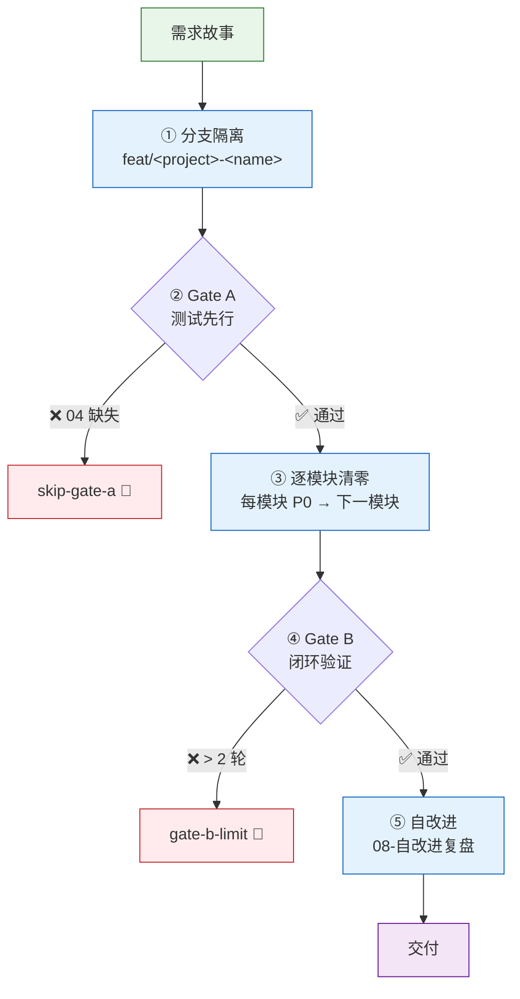
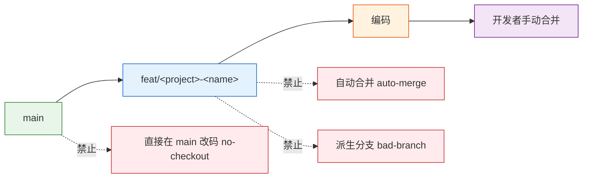
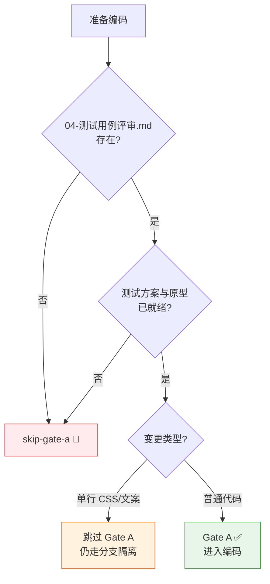
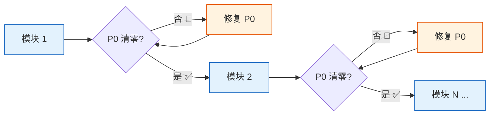
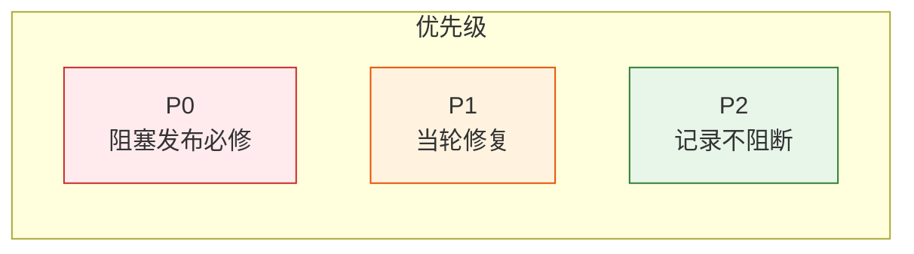
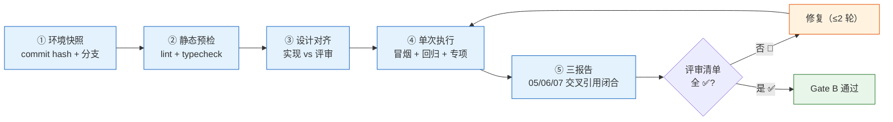
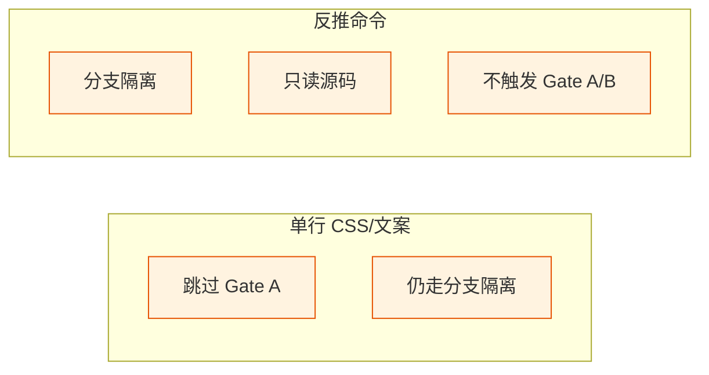
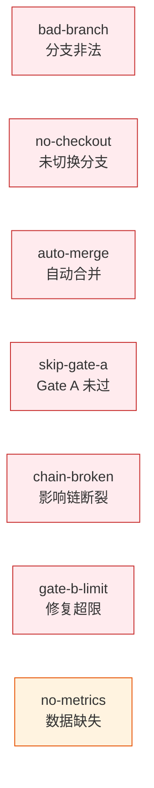
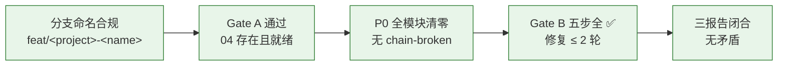

---
paths:
  - "**/*.{js,ts,jsx,tsx,vue,py,go,rs,java,rb,php}"
---

# code-pipeline

> 源码改动只走 `/rui code`，分支独立、测试在前、逐模块清零、Gate B 收口。
>
> **Iron Law — 违反字母即是违反精神：**
> - P0 不清零不进下一模块
> - Gate A 未通过不编码
> - Gate B 修复 ≤ 2 轮。3+ 轮 = 架构问题，质疑模式

## Red Flags — 暂停并回到 Iron Law

- "这个模块改动太小，跳过自审查"
- "影响链看起来闭合了，不用 grep 了"
- "修复 3 轮了但这次肯定对"
- "单行 CSS/文案也算 Gate A 例外吧"
- "分支创建应该是自动的，我手动改就行"
- "04 测试文档是空的但参考设计文档就够了"
- "实现完成再补分支隔离"

**以上任何一个 = 停止。** 对于 3+ 修复失败的，见下方 [支撑技术](#①-根因追溯) 根因追溯模式。

## 管线全景



| 阶段 | 核心动作 | 阻断标识 | 例外 |
|------|---------|---------|------|
| ① 分支隔离 | 从 main 创建功能分支，切换后改码 | `bad-branch` / `no-checkout` / `auto-merge` | 反推命令只读不写 |
| ② Gate A | 04-测试用例评审.md 存在且就绪 | `skip-gate-a` | 单行 CSS/文案 |
| ③ 逐模块清零 | 每模块 P0 清零后进下一模块 | `chain-broken` | — |
| ④ Gate B | 5 步验证 + 三报告闭合，修复 ≤ 2 轮 | `gate-b-limit` | — |
| ⑤ 自改进 | 产出 08-自改进复盘 | `no-metrics`（降级不阻断） | 数据采集失败时降级 |

## ① 分支隔离



| # | 规则 | 违反标识 |
|---|------|---------|
| 1 | 功能分支必须从 `main` 创建，命名 `feat/<project>-<name>` | `bad-branch` |
| 2 | 改动源码前必须已切到该分支 | `no-checkout` |
| 3 | 功能分支禁止自动合并到主干，git 操作由开发者手动执行 | `auto-merge` |
| 4 | 源码修改唯一入口是 `/rui code` 管线，反推命令只读不写 | — |

## ② Gate A — 测先行



| # | 规则 | 说明 |
|---|------|------|
| 5 | `04-测试用例评审.md` 不存在，不得编码 | 阻断标识 `skip-gate-a` |
| 6 | 单行 CSS/文案变更可跳过 Gate A | 仍走分支隔离 |
| 7 | 测试方案与原型未就绪视为未通过 | tester 补充后方可继续 |

## ③ 逐模块清零





| # | 规则 | 违反标识 |
|---|------|---------|
| 8 | 逐模块编码：每模块完成后审查，P0 不清零不进下一模块 | — |
| 9 | 影响链未闭合不声称闭合 | `chain-broken` |
| 10 | 不创建设计文档外的文件；fix 模式预检仅查目标文件存在 | — |
| 11 | P0 = 阻塞发布必修；P1 = 当轮修复；P2 = 记录不阻断 | — |

## ④ Gate B — 闭环验证



| # | 规则 | 违反标识 |
|---|------|---------|
| 12 | 五步验证：环境快照 → 静态预检 → 设计对齐 → 单次执行 → 三报告 | — |
| 13 | 三报告交叉引用闭合，评审清单全 ✅ 方过 | — |
| 14 | 修复 ≤ 2 轮，超过阻断 | `gate-b-limit` |
| 15 | 自改进必须产出 08-自改进复盘 | `no-metrics`（降级） |

## 产出收口

```
故事任务面板/<Project>/<Story>/
├── 01-需求与故事.md
├── 02-后端技术评审.md          ← 后端故事
├── 03-前端技术评审.md          ← 前端故事
├── 04-测试用例评审.md
├── 05-后端实施报告.md          ← coder 产出
├── 06-前端实施报告.md          ← coder 产出
├── 07-测试报告.md              ← reporter 产出
└── 08-自改进复盘.md           ← self-improve 产出
```

| # | 规则 |
|---|------|
| 16 | 关键产出限定在故事目录或对应参考文档目录，目录命名见 doc-generation.md |

## 例外



| 场景 | 跳过 | 保留 |
|------|------|------|
| 单行 CSS/文案变更 | Gate A | 分支隔离 |
| 反推命令（`--from-code` / `--from-doc`） | Gate A / Gate B | 分支隔离 + 只读 |

## 阻断标识汇总



| 标识 | 触发条件 | 阻断? |
|------|---------|-------|
| `bad-branch` | 分支非从 main 创建或混入非本故事代码 | ✅ 阻断 |
| `no-checkout` | 未切换故事分支即改源码 | ✅ 阻断 |
| `auto-merge` | 功能分支被自动合并到 main | ✅ 阻断 |
| `skip-gate-a` | Gate A 未通过即编码 | ✅ 阻断 |
| `chain-broken` | 影响链未闭合 | ✅ 阻断 |
| `gate-b-limit` | Gate B 修复 > 2 轮 | ✅ 阻断 |
| `no-metrics` | self-improve 数据采集失败 | ⚠️ 降级不阻断 |

## 生效标志



| 标志 | 未达标的处置 |
|------|------------|
| 分支命名合规 | 重建分支，从 main 重新拉出 |
| Gate A 通过（04 存在且就绪） | 退回 tester 补充测试用例评审 |
| P0 全模块清零，无 `chain-broken` | 退回 coder 修复 P0 |
| Gate B 五步全 ✅，修复 ≤ 2 轮 | 退回 coder 修复，超 2 轮阻断 |
| 三报告闭合无矛盾 | 以测试报告为仲裁修正 |

## 支撑技术

> 贯穿管线各阶段的实战技术模式。每项对应一条 Iron Law。

### ① 根因追溯

**Iron Law: NO FIX WITHOUT ROOT CAUSE FIRST**

Bug 常深埋在调用栈中。修复错误出现的位置是治症状。必须向后追溯调用链直到找到原始触发点，然后在源头修复。

| 步骤 | 动作 |
|------|------|
| 1. 观察症状 | 记录错误信息、堆栈、行号 |
| 2. 找直接原因 | 精确定位哪行代码直接导致错误 |
| 3. 追溯调用链 | 逐层问"谁调用了这个？传了什么值？" |
| 4. 找到源头 | 确认原始触发点 |
| 5. 源头修复 | 在源头修，再往下每层加防御 |

### ② 纵深防御

**Iron Law: VALIDATE AT EVERY LAYER, NOT JUST ONE**

修复了由无效数据导致的 bug 后，单处校验不够——那层可被不同代码路径、mock 或重构绕过。在数据通过的每一层都加校验，让 bug 在结构上不可能复现。

| 层 | 用途 | 示例 |
|----|------|------|
| L1 入口校验 | API 边界拒绝明显无效输入 | 空值/类型校验 |
| L2 业务逻辑 | 确保数据对操作有意义 | 格式合法、范围有效 |
| L3 环境守卫 | 阻止特定上下文的危险操作 | 测试环境禁止在非 temp 目录操作 |
| L4 诊断检测 | 捕获上下文用于取证 | 堆栈日志、参数快照 |

全部四层都必要。不在一层校验后停止。

### ③ 条件等待

**Iron Law: WAIT FOR CONDITIONS, NOT FOR GUESSES**

用 `waitFor(() => condition)` 替代 `setTimeout(50)`。等待真正关心的条件，而非猜测需要多久。Flaky 测试常用任意延时猜测时机——这在快机器通过，CI 或负载下失败。

| 场景 | 模式 |
|------|------|
| 等待事件 | `waitFor(() => events.find(e => e.type === 'DONE'))` |
| 等待状态 | `waitFor(() => machine.state === 'ready')` |
| 等待计数 | `waitFor(() => items.length >= 5)` |
| 等待文件 | `waitFor(() => fs.existsSync(path))` |

### ④ 验证门禁

**Iron Law: NO COMPLETION CLAIMS WITHOUT FRESH VERIFICATION EVIDENCE**

声称完成前：IDENTIFY（什么命令证明）→ RUN（执行完整命令）→ READ（读完整输出）→ VERIFY（输出确认声称？）→ ONLY THEN 声称。跳过任一步 = 不是验证。

| 声称 | 需要 | 不充分 |
|------|------|--------|
| 测试通过 | 测试命令输出：0 失败 | "上次运行"、"应该通过" |
| Bug 修复 | 测原始症状：通过 | 代码改了、假定修好了 |
| 回归测试有效 | Red-Green 周期验证 | 测试通过一次 |

### ⑤ 反馈回路

**Iron Law: NO DIAGNOSIS WITHOUT A FEEDBACK LOOP FIRST**

修复 bug 前先构建快速、确定、可自动运行的通过/失败信号。有回路 = bug 90% 已定位。无回路 = 猜。

构建顺序：失败测试 → curl/HTTP → CLI+fixture → headless 浏览器 → 回放 trace → harness → fuzz → 二分 → 差分 → HITL。迭代回路：更快？信号更清晰？更确定？2 秒回路是调试超能力。

### ⑥ 深度模块

**Iron Law: NO ABSTRACTION WITHOUT A SECOND CALLER**

| 概念 | 定义 | 测试 |
|------|------|------|
| 深模块 | 小接口藏大量行为 = 高杠杆 | 删除测试：删除它，复杂度回到 N 个调用方 |
| 浅模块 | 接口几乎和实现一样复杂 | 删除测试：删除它，复杂度消失——透传 |
| 接缝 | 不改原地就能改行为的地方 | 一个适配器 = 假设接缝。两个 = 真接缝 |

### ⑦ 垂直切片

**Iron Law: ONE TEST → ONE IMPLEMENTATION PER CYCLE**

```
❌ 水平：RED(test1,test2,test3) → GREEN(impl1,impl2,impl3)
✅ 垂直：RED(test1) → GREEN(impl1), RED(test2) → GREEN(impl2), ...
```

一次一个测试 → 一次一个实现。每个 cycle 利用上一个 cycle 学到的东西。刚写完代码，清楚什么行为重要。

### 技术集成

| 技术 | 适用阶段 |
|------|---------|
| 根因追溯 | P0 修复 · Gate B 验证 |
| 纵深防御 | P0 修复 · 安全约束 |
| 条件等待 | 测试编写 · Gate A |
| 验证门禁 | Gate A · Gate B · 交付 |
| 反馈回路 | 诊断 · 调试 |
| 深度模块 | 架构设计 · 逐模块实现 |
| 垂直切片 | Gate A · TDD |
