---
paths:
  - "**/*.{js,ts,jsx,tsx,vue,py,go,rs,java,rb,php}"
---

# code-pipeline

> 源码改动只走 `/rui code`，分支独立、实现逐模块清零、验证闭环。
>
> **Iron Law — 违反字母即是违反精神：**
> - P0 不清零不进下一模块
> - 修复 ≤ 2 轮。3+ 轮 = 架构问题，质疑模式

[管线全景](#管线全景) · [① 分支隔离](#①-分支隔离--强制门禁) · [② 实现](#②-实现--逐模块清零) · [③ 验证](#③-验证--闭环) · [产出收口](#产出收口) · [例外](#例外) · [阻断标识汇总](#阻断标识汇总) · [生效标志](#生效标志) · [支撑技术](#支撑技术)

## Red Flags — 暂停并回到 Iron Law

- "这个模块改动太小，跳过自审查"
- "影响链看起来闭合了，不用 grep 了"
- "修复 3 轮了但这次肯定对"
- "分支创建应该是自动的，我手动改就行"
- "实现完成再补分支隔离"
- "这次改动很小，直接在 main 改就行"
- "先改代码再切分支，反正还没 commit"
- "当前在 main 上，但只改一行不需要切分支"
- "doc 阶段只写文档不改源码，不需要切分支"
- "文档写入不是'源码改动'，分支隔离管不着文档"
- "先写文档再切分支，doc 不涉及编译不会出错"
- "用本地缓存/记忆文件存状态，跨分支共享绕过隔离"
- "catch 块留空就行，错误不重要"
- "日志打了就行，不用管级别和上下文"
- "给个默认值兜底，不用处理错误"
- "审查发现太多怕影响进度，降级几个"
- "找不到确切行号但模式看起来有问题"
- "零发现显得没干活，找几个小问题凑数"

**以上任何一个 = 停止。** 对于 3+ 修复失败的，见下方 [支撑技术](#根因追溯) 根因追溯模式。静默失败相关见 [支撑技术 §9](#⑨-静默失败猎杀)。审查噪声相关见 [支撑技术 §10](#⑩-置信度过滤)。

## 管线全景

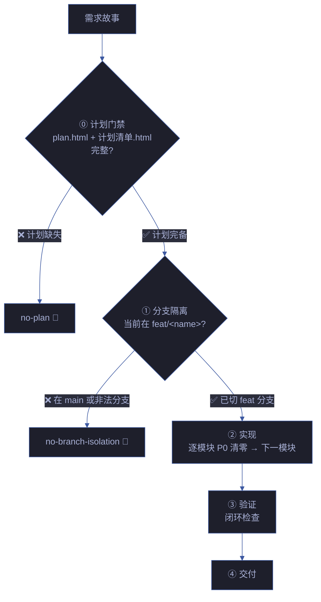

| 阶段 | 核心动作 | 阻断标识 | 例外 |
|------|---------|---------|------|
| ⓪ 计划门禁 | plan.html + 计划清单.html 完整，六项自审查通过 | `no-plan` / `plan-p0` / `plan-placeholder` | `/rui init` 基线建立 |
| ① 分支隔离 | **强制门禁**：改码前必须已切到 `feat/<name>`，否则阻断 | `bad-branch` / `no-checkout` / `auto-merge` / `no-branch-isolation` | 反推命令只读不写 |
| ② 实现 | 每模块 P0 清零后进下一模块 | `chain-broken` | — |
| ③ 验证 | 闭环验证，修复 ≤ 2 轮 | — | — |
| ④ 交付 | 文档同步 + 通知，见 delivery-gate | — | — |

## ⓪ 计划门禁 — 无计划不实现

> **进入 code 阶段前，故事级 plan.html 和全部场景的 计划清单.html 必须完整。零占位符，六项自审查通过。**
>
> 计划由 planner agent 在 doc 阶段完成后生成。详情见 [plan-execution.md](./plan-execution.md)。

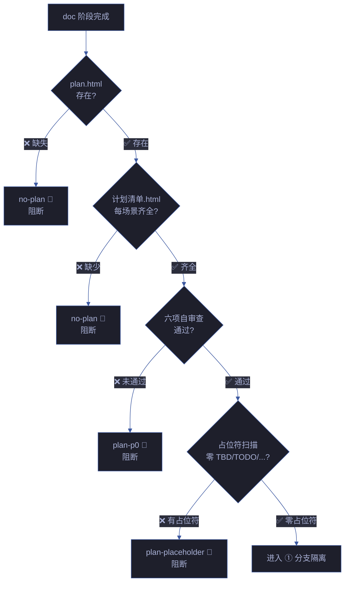

| # | 规则 | 违反标识 |
|---|------|---------|
| P1 | code 阶段前 plan.html 必须存在 | `no-plan` |
| P2 | 每场景必须有 计划清单.html | `no-plan` |
| P3 | 六项自审查清单全部通过 | `plan-p0` |
| P4 | 计划中零占位符（TBD / TODO / ... / implement later） | `plan-placeholder` |

## ① 分支隔离 — 强制门禁

> **任何 rui 管线写入操作（doc 写文档、code 改源码、update 增删文件），必须先验证当前分支为 `feat/<name>`。未通过此门禁，禁止任何 Edit/Write 操作。**
>
> 唯一例外：`/rui init` 写入 CLAUDE.md / README.md 等项目级基线文件，不走故事分支。
>
> **确定性执行**: `node skills/rui/branch-check.mjs --story=<name> --mode=write` — feat 分支不存在则从 main 创建，不在则切换，祖先校验。Agent 手动检查为兜底。

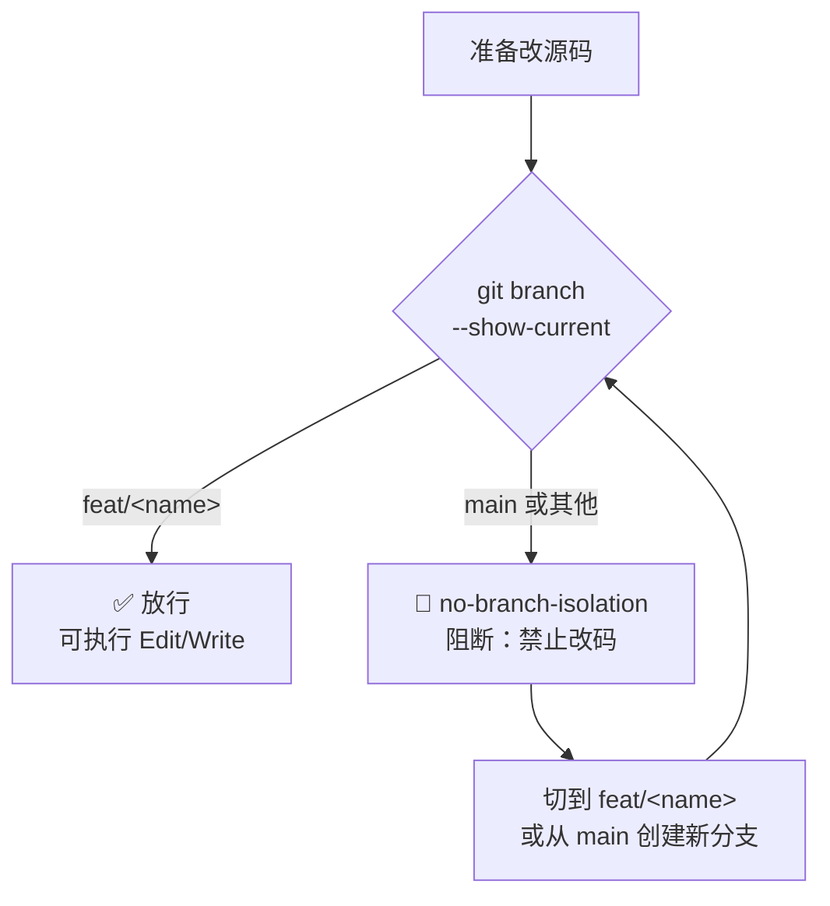

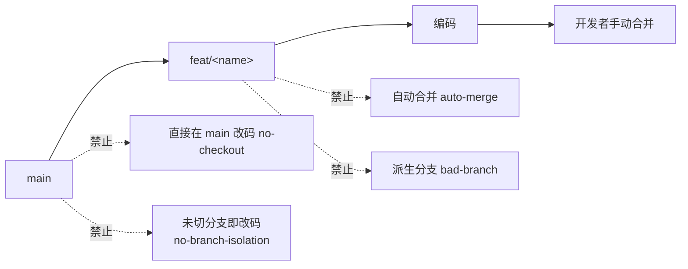

| # | 规则 | 违反标识 |
|---|------|---------|
| 1 | 功能分支必须从 `main` 创建，命名 `feat/<name>` | `bad-branch` |
| 2 | 改动源码前必须已切到该分支 | `no-checkout` |
| 3 | 功能分支禁止自动合并到主干，git 操作由开发者手动执行 | `auto-merge` |
| 4 | 源码修改唯一入口是 `/rui code` 管线，反推命令只读不写 | — |
| 5 | **任何 Edit/Write 操作源码前，必须先验证 `git branch --show-current` 输出为 `feat/<name>`** | `no-branch-isolation` |
| 6 | 在 `main` 或非 `feat/` 前缀分支上执行 Edit/Write → 立即阻断 | `no-branch-isolation` |
| 7 | 记忆/缓存系统（`.memory/`、本地状态文件等）禁止跨分支共享管线状态，不得用于绕过或削弱分支隔离 | `cache-leak` |

**门禁执行者**：coder Agent、任何执行源码修改的 Agent。  
**验证命令**：`git branch --show-current`  
**阻断恢复**：创建/切换到 `feat/<name>` 分支后重新执行。

## ② 实现 — 逐模块清零

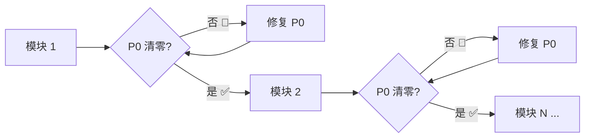

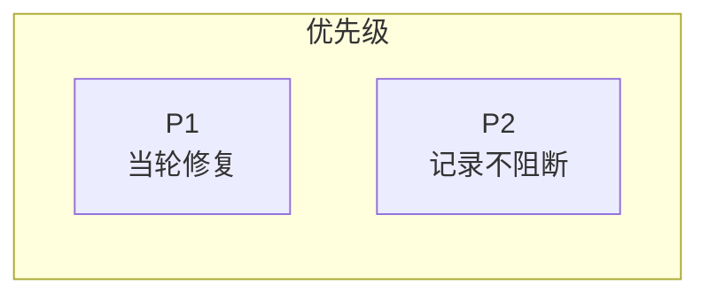

| # | 规则 | 违反标识 |
|---|------|---------|
| 8 | 逐模块编码：每模块完成后审查，P0 不清零不进下一模块 | — |
| 9 | 影响链未闭合不声称闭合 | `chain-broken` |
| 10 | 不创建设计文档外的文件；fix 模式预检仅查目标文件存在 | — |
| 11 | P0 = 阻塞发布必修；P1 = 当轮修复；P2 = 记录不阻断 | — |

## ③ 验证 — 闭环

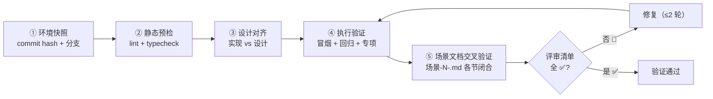

| # | 规则 | 违反标识 |
|---|------|---------|
| 12 | 五步验证：环境快照 → 静态预检 → 设计对齐 → 执行验证 → 场景文档交叉验证 | — |
| 13 | 场景文档各节交叉引用闭合，评审清单全 ✅ 方过 | — |
| 14 | 修复 ≤ 2 轮，超过阻断 | — |

## 产出收口

```
templates/故事任务/                   ← 模板（参考）
故事任务面板/<Story>/                  ← 实例
├── 故事任务.md                       ← §1 Story · §2 范围边界 · §3 AC · §4 风险与假设
├── plan.html                         ← 故事级计划总览（自包含 HTML+SVG，含任务依赖图）
├── 场景-1-<slug>.md                  ← §0 技术评审 · §1 测试设计 · §2 实施报告 · §3 测试报告 · §4 自改进
├── 场景-1-<slug>.html                ← 架构图（自包含深色主题 HTML+SVG）
├── 场景-1-<slug>/
│   └── 计划清单.html                  ← 场景级任务清单（自包含 HTML+SVG，含可勾选步骤）
├── 场景-2-<slug>.md
├── 场景-2-<slug>.html
├── 场景-2-<slug>/
│   └── 计划清单.html
├── 知识图谱.json                      ← 结构化知识表示（v2.0.0 schema）
└── 知识图谱.html                      ← 知识图谱可视化（cytoscape.js 交互式图表）
```

> 模板参考：`templates/故事任务/`。场景文档按 场景-N-<slug>.md 命名（N 从 1 开始），架构图同名 .html。

| # | 规则 |
|---|------|
| 16 | 关键产出限定在故事目录或对应参考文档目录，目录命名见 doc-generation.md |

## 例外

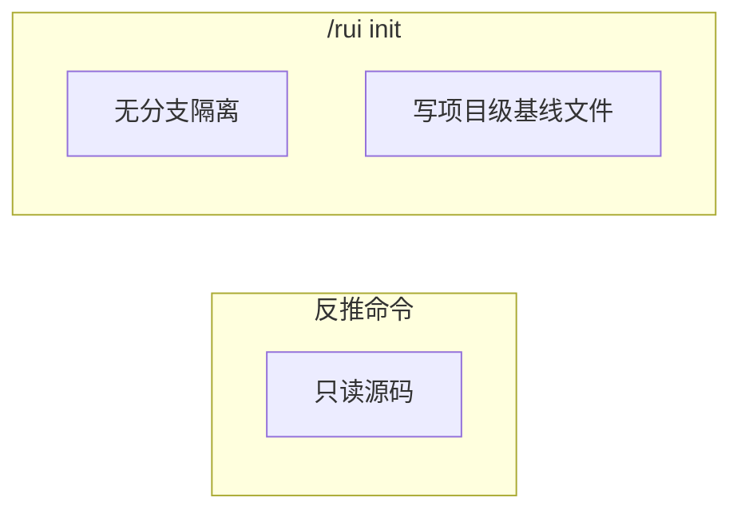

| 场景 | 跳过 | 保留 |
|------|------|------|
| 反推命令（`--from-code` / `--from-doc`） | 验证 | 分支隔离 + 只读 |
| `/rui init` | 分支隔离 | 验证 + 触发 |

## 阻断标识汇总

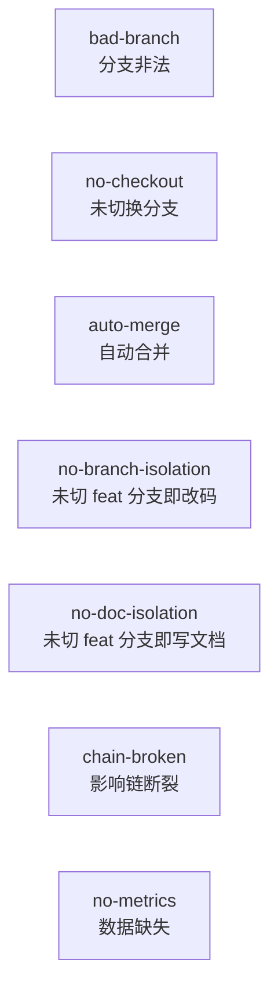

| 标识 | 触发条件 | 阻断? |
|------|---------|-------|
| `no-plan` | code 阶段前 plan.html 或任一 计划清单.html 不存在 | ✅ 阻断 |
| `plan-p0` | 计划六项自审查未通过 | ✅ 阻断 |
| `plan-placeholder` | 计划中含 TBD / TODO / ... / implement later | ✅ 阻断 |
| `bad-branch` | 分支非从 main 创建或混入非本故事代码 | ✅ 阻断 |
| `no-checkout` | 未切换故事分支即写入/改码 | ✅ 阻断 |
| `auto-merge` | 功能分支被自动合并到 main | ✅ 阻断 |
| `no-branch-isolation` | `git branch --show-current` 非 `feat/<name>` 时执行 Edit/Write | ✅ 阻断 |
| `no-doc-isolation` | doc/update 阶段在非 `feat/<name>` 分支写入故事文档 | ✅ 阻断 |
| `chain-broken` | 影响链未闭合 | ✅ 阻断 |
| `no-metrics` | self-improve 数据采集失败 | ⚠️ 降级不阻断 |

## 生效标志


| 标志 | 未达标的处置 |
|------|------------|
| 当前分支为 `feat/<name>`（`no-branch-isolation`） | 创建/切换到 `feat/<name>` 分支，禁止在 main 上改码 |
| 分支命名合规 | 重建分支，从 main 重新拉出 |
| P0 全模块清零，无 `chain-broken` | 退回 coder 修复 P0 |
| 验证五步全 ✅，修复 ≤ 2 轮 | 退回 coder 修复，超 2 轮阻断 |
| 场景文档闭合无矛盾 | 交叉验证修正 |

## 支撑技术

> 贯穿管线各阶段的实战技术模式。每项对应一条 Iron Law。

### ① 根因追溯

**Iron Law: NO FIX WITHOUT ROOT CAUSE FIRST**

Bug 常深埋在调用栈中。修复错误出现的位置是治症状。必须向后追溯调用链直到找到原始触发点，然后在源头修复。

| 步骤 | 动作 |
|------|------|
| 1. 观察症状 | 记录错误信息、堆栈、行号 |
| 2. 找直接原因 | 精确定位哪行代码直接导致错误 |
| 3. 追溯调用链 | 逐层问"谁调用了这个？传了什么值？" |
| 4. 找到源头 | 确认原始触发点 |
| 5. 源头修复 | 在源头修，再往下每层加防御 |

**五层回溯流程（实战扩展）**：

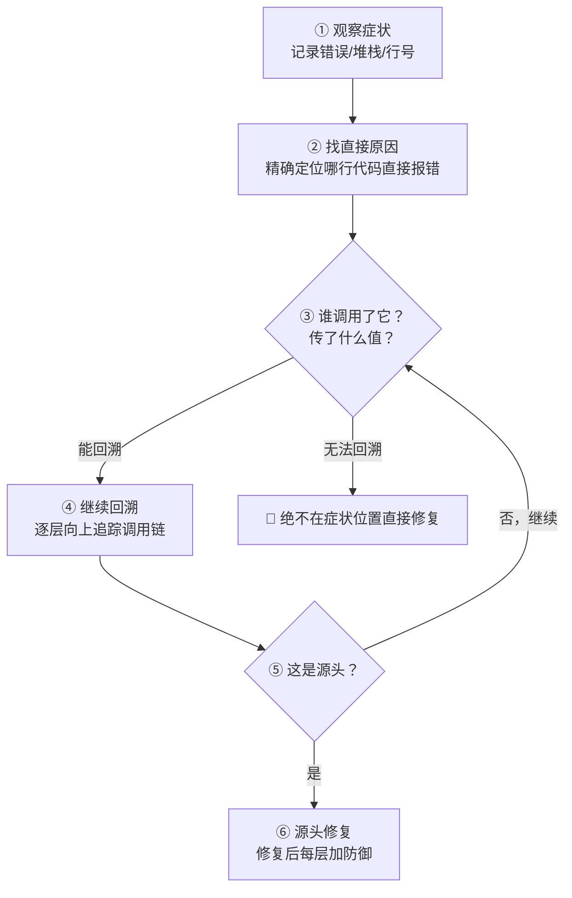

| 回溯层 | 关键问题 | 插桩方法 |
|--------|---------|---------|
| L0 症状 | 什么错误？在哪出现？ | 日志/堆栈 |
| L1 直接因 | 哪行代码直接导致？传入了什么值？ | Read 源码 |
| L2 调用者 | 谁调用了它？参数来源？ | `new Error().stack` |
| L3 数据源 | 参数在哪创建/修改？ | Grep 搜索赋值点 |
| L4 初始化 | 初始值从哪来？何时设置？ | 构造函数/工厂方法 |
| L5 触发点 | 哪个测试/入口触发整条链？ | 二分定位（见下） |

**诊断插桩模式**：

在无法手动追溯时，用 `new Error().stack` 在关键节点打印调用栈：

```typescript
// 关键节点插桩 — 捕获完整调用上下文
async function suspectFunction(directory: string) {
  const stack = new Error().stack;
  console.error('DEBUG suspectFunction:', {
    directory,
    cwd: process.cwd(),
    env: process.env.NODE_ENV,
    stack,  // 完整调用链
  });
  // ... 原有逻辑
}
```

- **测试中用 `console.error()`** — logger 可能在测试中被抑制
- **操作前插桩** — 在危险操作前记录，而非失败后
- **捕获上下文** — 目录、cwd、环境变量、时间戳
- **提取并分析**：`npm test 2>&1 | grep 'DEBUG suspectFunction'`

**二分定位污染源**：

当不确定哪个测试造成了异常状态（如某处出现了不该存在的 `.git` 目录）：

```bash
./find-polluter.sh '.git' 'src/**/*.test.ts'
```

逐个运行测试文件，在第一个污染源处停止。详见 `superpowers/skills/systematic-debugging/find-polluter.sh`。

**实战示例**：5 层回溯定位 `git init` 错误目录

| 层 | 发现 | 结论 |
|----|------|------|
| L0 症状 | `.git` 出现在源码目录 `packages/core/` | 异常 |
| L1 直接因 | `git init` 在 `process.cwd()` 中运行 | `cwd` 参数为空 |
| L2 调用者 | `WorktreeManager` 收到空 `projectDir` | 参数传递链路 |
| L3 调用者 | `Session.create()` 传入空字符串 | 上游未校验 |
| L4 根因 | 测试在 `beforeEach` 之前访问 `context.tempDir` | 顶级变量初始化为空 |
| L5 修复 | `tempDir` 改为 getter，提前访问即抛错 | 源头修复 + 4 层防御 |

> **关键原则**：绝不在症状位置直接修复。追溯调用链直到找到原始触发点。

### ② 纵深防御

**Iron Law: VALIDATE AT EVERY LAYER, NOT JUST ONE**

修复了由无效数据导致的 bug 后，单处校验不够——那层可被不同代码路径、mock 或重构绕过。在数据通过的每一层都加校验，让 bug 在结构上不可能复现。


| 层 | 用途 | 可被绕过的场景 | 防御代码示例 |
|----|------|-------------|------------|
| L1 入口校验 | API 边界拒绝明显无效输入 | 不同入口路径、内部调用 | `if (!dir \|\| dir.trim()==='') throw Error('dir empty')` |
| L2 业务逻辑 | 确保数据对操作有意义 | mock 绕过、测试直接调用 | `if (!existsSync(dir)) throw Error('dir not exist: '+dir)` |
| L3 环境守卫 | 阻止特定上下文的危险操作 | 环境变量差异、CI vs 本地 | `if (NODE_ENV==='test' && !dir.startsWith(tmpdir())) throw Error('refuse outside tmp')` |
| L4 诊断检测 | 捕获上下文用于取证 | 日志级别被抑制 | `console.error('DEBUG',{dir,cwd,stack:new Error().stack})` |

全部四层都必要。不同层捕获不同绕过路径：
- L1 捕获大多数错误输入，但内部调用可能跳过入口校验
- L2 捕获业务规则违规，但 mock 和测试直接调用可能跳过
- L3 捕获环境特定危险，不同平台/CI/本地各有边界条件
- L4 在前三层都被绕过时提供取证线索

**不在单层校验后停止。** "单点校验够了"是合理化——不同代码路径、mock、重构都可能绕过那一层。

### ③ 条件等待

**Iron Law: WAIT FOR CONDITIONS, NOT FOR GUESSES**

用 `waitFor(() => condition)` 替代 `setTimeout(50)`。等待真正关心的条件，而非猜测需要多久。Flaky 测试常用任意延时猜测时机——这在快机器通过，CI 或负载下失败。

| 场景 | 模式 |
|------|------|
| 等待事件 | `waitFor(() => events.find(e => e.type === 'DONE'))` |
| 等待状态 | `waitFor(() => machine.state === 'ready')` |
| 等待计数 | `waitFor(() => items.length >= 5)` |
| 等待文件 | `waitFor(() => fs.existsSync(path))` |

**条件等待反模式表**：

| 反模式 | 为什么错 | 正确做法 |
|--------|---------|---------|
| `setTimeout(check, 1)` | 空耗 CPU | 轮询间隔 10ms |
| 无超时的循环等待 | 条件永不满足 = 永久阻塞 | 必须有超时 + 清晰错误消息 |
| 循环前缓存 getter 值 | 循环内用的总是旧值 | getter 放循环内每次取最新 |
| `setTimeout(50)` 猜测时机 | 快机器侥幸通过，CI 失败 | `waitFor(() => condition)` |
| `sleep(500)` "确保异步完成" | 不知道真实完成了没 | 等待具体的完成信号 |

**任意超时的正确用法**（罕见，需要文档化）：

```typescript
// ✅ 正确：先等待触发条件，再基于已知时序等待
await waitForEvent(manager, 'TOOL_STARTED'); // 等待触发条件
await new Promise(r => setTimeout(r, 200));   // 基于已知时序：2 tick × 100ms
// 注释解释 WHY 需要这个时间——基于什么已知行为
```

要求：① 先等待触发条件 ② 基于已知时序（非猜测）③ 注释解释 WHY。不能满足全部三条 = 不用任意超时。

### ④ 验证门禁

**Iron Law: NO COMPLETION CLAIMS WITHOUT FRESH VERIFICATION EVIDENCE**

声称完成前：IDENTIFY（什么命令证明）→ RUN（执行完整命令）→ READ（读完整输出）→ VERIFY（输出确认声称？）→ ONLY THEN 声称。跳过任一步 = 不是验证。

| 声称 | 需要 | 不充分 |
|------|------|--------|
| 测试通过 | 测试命令输出：0 失败 | "上次运行"、"应该通过" |
| Bug 修复 | 测原始症状：通过 | 代码改了、假定修好了 |
| 回归测试有效 | Red-Green 周期验证 | 测试通过一次 |

**审查报告前门禁（四问）**：

适用于任何声称"发现了一个问题"或"这里需要修改"的场景。报告前必须四问全过：

| # | 问题 | 答"否"或"不确定"的处置 |
|---|------|----------------------|
| 1 | **能引用确切行号？** 模糊描述（"某处"、"auth 层附近"）不可操作 | 降级或丢弃 |
| 2 | **能描述具体失败模式？** 指名输入、状态、坏结果 | 你在模式匹配，不在审查 |
| 3 | **读过周围上下文？** 检查了调用者、imports、测试？很多问题是上游已处理的 | 补读上下文后重判 |
| 4 | **严重级别可辩护？** 缺失 JSDoc 永不是 CRITICAL。test fixture 中的 `any` 永不是 CRITICAL | 降级到匹配级别 |

**CRITICAL/HIGH 额外要求**：必须提供 ① 确切代码片段 + 行号 ② 具体失败场景：输入→状态→结果 ③ 解释为什么现有守卫（类型/校验/框架默认值）没有捕获它。三项缺一即降级。

**零发现是可接受且被期望的结果。** 干净的审查是有效的审查。不要为了证明审查的存在而制造发现。如果 diff 小、类型安全、有测试、符合项目模式，正确输出是零行发现 + `APPROVE`。制造发现、填充挑剔、推测性"考虑使用 X"、无触发条件的假想边界情况是 LLM 审查的主要失败模式。

**常见误报（跳过，除非有本代码库具体证据）**：

| 误报模式 | 为什么跳过 |
|---------|-----------|
| "考虑加错误处理" 但调用者/框架已有处理 | Express 错误中间件、React 错误边界、顶层 try/catch |
| "缺少输入校验" 但函数是内部的、调用者已校验 | 至少追踪一个调用者再标记 |
| "魔法数字" 用于公知常量 | `200`、`404`、`1000`ms、`60`、`24`、`1024`、HTTP 状态码 |
| "函数太长" 用于穷举 switch/配置对象/测试表/生成代码 | 长度≠复杂度 |
| "缺少 JSDoc" 在自描述的单用途内部 helper 上 | 名称和签名已经说明了全部 |
| "可能空指针" 前一行的类型缩窄或 `if` 守卫已在作用域内 | 追踪类型流，不要匹配 `?.` 符号 |
| "N+1 查询" 在固定基数的循环上（如 4 元素枚举）| 或已使用 DataLoader/batching 的路径 |
| "应该用 TypeScript" 在纯 JS 文件中 | 匹配项目现有语言 |
| "硬编码值" 在测试 fixture/示例代码/文档片段中 | 测试必须用硬编码期望值 |
| 安全剧场：在非密码场景标记 `Math.random()`（动画/jitter/采样）| 询问"资深工程师真的会在审查中改这个吗？" |

> **审查者的首要失败模式是制造噪声，而非遗漏发现。**

### ⑤ 反馈回路

**Iron Law: NO DIAGNOSIS WITHOUT A FEEDBACK LOOP FIRST**

修复 bug 前先构建快速、确定、可自动运行的通过/失败信号。有回路 = bug 90% 已定位。无回路 = 猜。

构建顺序：失败测试 → curl/HTTP → CLI+fixture → headless 浏览器 → 回放 trace → harness → fuzz → 二分 → 差分 → HITL。迭代回路：更快？信号更清晰？更确定？2 秒回路是调试超能力。

**假设-测试-验证循环**（系统调试 Phase 3）：

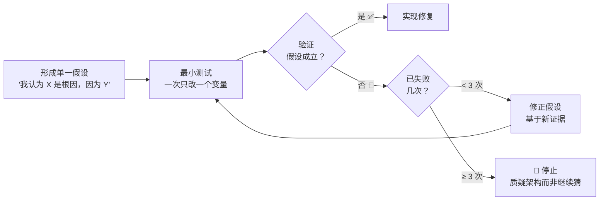

| 规则 | 说明 |
|------|------|
| 单一假设 | "我认为 X 是根因，因为 Y"——不含糊、不"可能是 A 也可能是 B" |
| 最小测试 | 一次只改一个变量。多变量同时改 = 不知道哪个变量产生了效果 |
| 3 次失败 | 修复失败 ≥ 3 次 → 停止。质疑架构而非继续猜。可能：模块边界错了、抽象层次不对、需要深模块重构 |
| 验证后继续 | 假设验证通过才写正式修复代码。验证失败则修正假设重新测试 |

> **3 次修复失败 = 架构问题，非调试问题。** 修复 ≤ 2 轮，超标即阻断。

### ⑥ 深度模块

**Iron Law: NO ABSTRACTION WITHOUT A SECOND CALLER**

> 好模块 = 接口小 + 实现深 = 高杠杆。

| 概念 | 定义 | 信号 |
|------|------|------|
| **模块** | 有接口与实现的任何东西（函数/类/包/切片） | — |
| **接口** | 调用者需知的一切：签名、类型、不变式、错误模式、顺序 | 不止类型签名 |
| **深度** | 接口后面的行为量 / 接口复杂度 | 杠杆 |
| **浅模块** | 接口几乎和实现一样复杂 | 透传、多余的 getter、拆分太细的纯函数 |
| **删除测试** | 删除模块——复杂度消失（透传）还是回到 N 个调用方（值这个价） | 透传 = 该删 |
| **接缝** | 不改原地就能改行为的地方 | 测试的天然切入点 |

优先做深模块。加一个抽象却没有第二个调用方，是浅模块。提取纯函数只为测试，但真正的 bug 在调用方式里——也是浅模块。

### ⑦ 垂直切片

**Iron Law: ONE TEST → ONE IMPLEMENTATION PER CYCLE**

```
❌ 水平：RED(test1,test2,test3) → GREEN(impl1,impl2,impl3)
✅ 垂直：RED(test1) → GREEN(impl1), RED(test2) → GREEN(impl2), ...
```

一次一个测试 → 一次一个实现。每个 cycle 利用上一个 cycle 学到的东西。刚写完代码，清楚什么行为重要。

### 技术集成

| 技术 | 适用阶段 |
|------|---------|
| 根因追溯 | P0 修复 · 验证 |
| 纵深防御 | P0 修复 · 安全约束 |
| 条件等待 | 测试编写 |
| 验证门禁 | 实现 · 验证 · 交付 |
| 反馈回路 | 诊断 · 调试 |
| 深度模块 | 架构设计 · 逐模块实现 |
| 垂直切片 | 测试 · TDD |
| 研究优先 | 影响分析 · 架构设计 |
| 静默失败猎杀 | 验证 · 代码审查 · 安全审计 |
| 置信度过滤 | 代码审查 · 验证清单 |

| 技术 | 服务 Iron Law |
|------|-------------|
| 根因追溯 | #2 NO FIX WITHOUT ROOT CAUSE FIRST |
| 纵深防御 | #2 每层校验让 bug 结构上不可复现 |
| 条件等待 | #1 等待条件而非猜测 = 验证信号 |
| 验证门禁 | #1 NO COMPLETION CLAIMS WITHOUT FRESH EVIDENCE |
| 反馈回路 | #2 有回路 = 定位，无回路 = 猜 |
| 深度模块 | #3 深模块让 P0 更容易清零 |
| 垂直切片 | #3 一次一个实现 = 每次 P0 清零 |
| 研究优先 | #2 猜 = 浪费上下文，查 = 建立事实基线 |
| 静默失败猎杀 | #1 不被注意的错误仍在产生错误结果 |
| 置信度过滤 | #3 噪声淹没信号，精确的报告才帮助 P0 清零 |

### ⑧ 研究优先开发

**Iron Law: NO ACTION WITHOUT FACTS FIRST**

> 涉及不熟悉模块、外部依赖、或 API 变更时：先 Read/Grep/Glob 建立事实基线，再行动。猜 = 浪费上下文。

| 步骤 | 动作 | 工具 |
|------|------|------|
| 1. 定位 | 确定需要理解的范围 | 项目结构 + 模块边界 |
| 2. 阅读 | 通读相关源码/配置/规约 | Read |
| 3. 搜索 | 全项目搜索关键符号/引用 | Grep |
| 4. 映射 | 画出模块关系图 | mermaid |
| 5. 行动 | 基于事实基线执行变更 | — |

适用触发：影响分析 · 架构设计 · 不熟悉模块的 P0 修复 · 第三方 API 集成。

### ⑨ 静默失败猎杀

**Iron Law: NO COMPLETION CLAIMS WITHOUT FRESH VERIFICATION EVIDENCE**

> 静默失败 = 不抛错、不打日志、悄悄产生错误结果的代码路径。这类 bug 最难发现因为没有任何信号。必须主动猎杀。

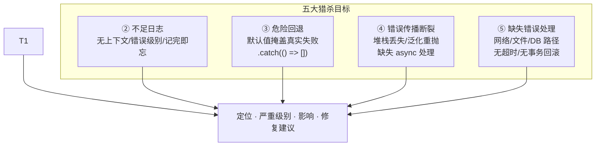

| 猎杀目标 | 识别模式 | 修复方向 |
|---------|---------|---------|
| ① 空 catch | `catch {}` / `catch(e) {}` / 错误被转为 `null` 或 `[]` 无上下文 | 至少记录错误上下文；判断是否应向上传播 |
| ② 不足日志 | 日志无足够上下文、级别错误、记完即忘（log-and-forget） | 添加：操作名、参数摘要、时间戳、调用栈 |
| ③ 危险回退 | `.catch(() => [])` / 默认值让下游 bug 更难排查 | 区分"预期可恢复"和"应暴露的错误" |
| ④ 传播断裂 | 丢失原始堆栈、`throw new Error('failed')` 泛化、缺失 `await` | 保留原始错误链（`cause`）、异步路径加超时 |
| ⑤ 缺失处理 | 网络/文件/DB 操作无超时、无事务回滚、无重试策略 | 加超时（含清晰错误消息）、事务性操作加回滚 |

**猎杀命令**（按语言调整）：

```bash
# 空 catch 块
grep -rn "catch\s*{" --include="*.ts" --include="*.js" --include="*.py" --include="*.go"

# 危险回退模式
grep -rn "\.catch.*\[\]" --include="*.ts" --include="*.js"

# 无超时 fetch/axios
grep -rn "fetch(" --include="*.ts" --include="*.js" | grep -v "timeout\|signal"
```

**反模式对照**：

| 代码 | 问题 | 为什么是静默失败 |
|------|------|----------------|
| `catch {}` | 空 catch | 错误被完全吞没，无任何记录 |
| `.catch(() => [])` | 危险回退 | 网络/解析错误被转为空数组，调用者不知情 |
| `try { await fetch(url) } catch { return null }` | 空 catch + 转 null | 网络故障/超时/DNS 错误全部消失 |
| `console.log('error:', e)` 后继续执行 | 不足日志 | 日志可能在输出中被淹没，无堆栈上下文 |
| `throw new Error('failed')` 丢失原始 `cause` | 传播断裂 | 根因和调用栈信息永久丢失 |

### ⑩ 置信度过滤

**Iron Law: NO P0 LEFT UNCLEARED BEFORE NEXT MODULE**

> 审查发现不是越多越好。噪声淹没信号，信任被侵蚀。只报告你确信的问题。

```mermaid
flowchart TD
    FIND["发现候选问题"]:::src --> CONF{"置信度<br/>> 80%?"}
    CONF -->|"否"| DROP["丢弃<br/>不确定的不报"]:::warn
    CONF -->|"是"| GATE{"四问门禁<br/>全过?"}
    GATE -->|"否"| DOWN["降级或丢弃"]:::warn
    GATE -->|"是"| SEV{"严重级别<br/>可辩护?"}
    SEV -->|"否"| ADJUST["调整级别"]:::fix
    SEV -->|"是"| REPORT["报告发现"]:::pass

```

| 过滤器 | 规则 |
|--------|------|
| **置信度阈值** | > 80% 确信是真实问题才报告。不确定的不报 |
| **跳过风格偏好** | 除非违反项目明确约定的规范 |
| **跳过未改代码** | 除非是 CRITICAL 安全问题 |
| **合并相似问题** | "5 个函数缺失错误处理" = 1 条发现，不是 5 条 |
| **优先真正危害** | 可导致 bug/安全漏洞/数据丢失的排最前 |
| **零发现 = 有效审查** | 不要为了证明审查存在而制造发现 |

**制造发现的 6 种形式（识别并拒绝）**：

| 制造形式 | 示例 |
|---------|------|
| 填充挑剔 | "变量名可以更好"（但当前名称已自描述） |
| 推测建议 | "考虑使用 X 模式"（无具体问题驱动） |
| 假想边界 | "极端情况可能出问题"（举不出触发输入） |
| 安全剧场 | `Math.random()` 用于动画被标记为安全风险 |
| 模糊发现 | "auth 层某处可能..."（说不出确切文件和行号） |
| 凑数发现 | 审查不找出点什么显得没干活 |

> **审查者的首要失败模式是制造噪声，而非遗漏发现。** 信任来自精确，不来自数量。
