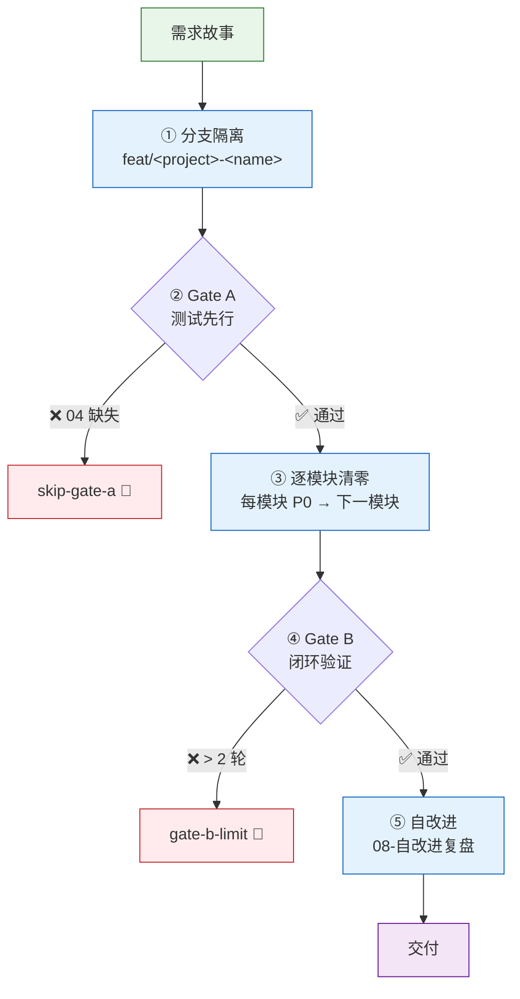
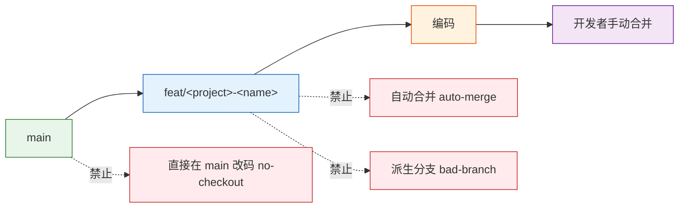
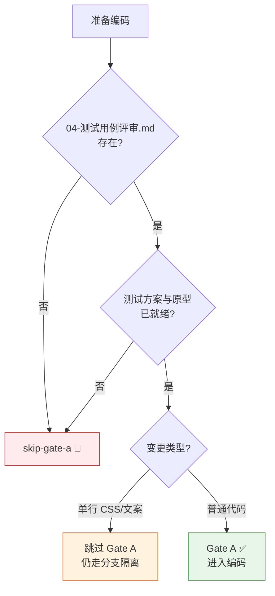
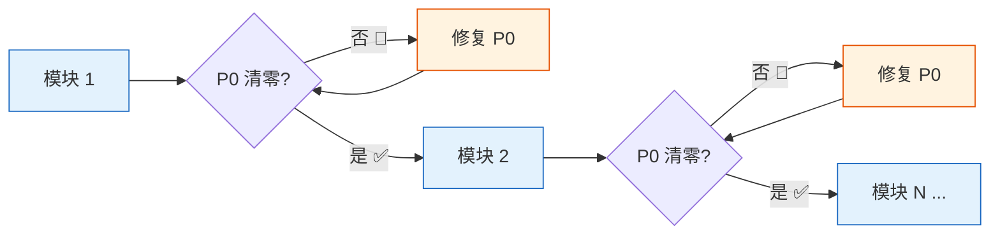
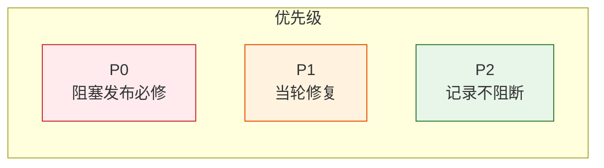
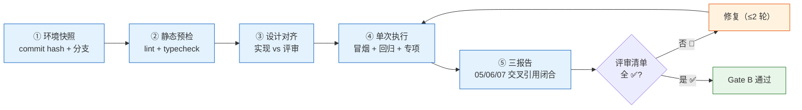
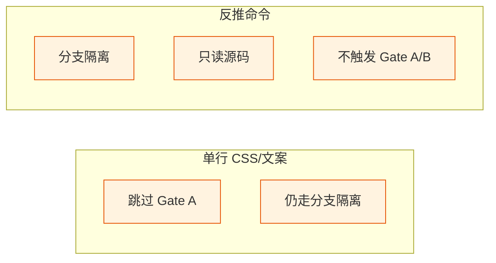
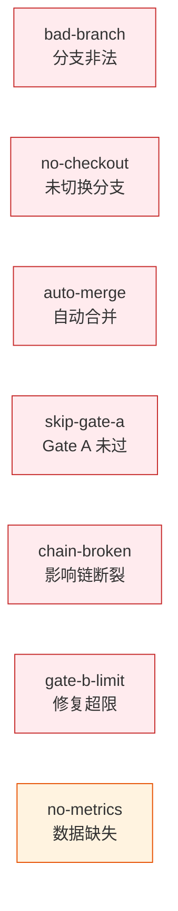

---
paths:
  - "**/*.{js,ts,jsx,tsx,vue,py,go,rs,java,rb,php}"
---

# code-pipeline

> 源码改动只走 `/rui code`，分支独立、测试在前、逐模块清零、Gate B 收口。

## 管线全景



| 阶段 | 核心动作 | 阻断标识 | 例外 |
|------|---------|---------|------|
| ① 分支隔离 | 从 main 创建功能分支，切换后改码 | `bad-branch` / `no-checkout` / `auto-merge` | 反推命令只读不写 |
| ② Gate A | 04-测试用例评审.md 存在且就绪 | `skip-gate-a` | 单行 CSS/文案 |
| ③ 逐模块清零 | 每模块 P0 清零后进下一模块 | `chain-broken` | — |
| ④ Gate B | 5 步验证 + 三报告闭合，修复 ≤ 2 轮 | `gate-b-limit` | — |
| ⑤ 自改进 | 产出 08-自改进复盘 | `no-metrics`（降级不阻断） | 数据采集失败时降级 |

## ① 分支隔离



| # | 规则 | 违反标识 |
|---|------|---------|
| 1 | 功能分支必须从 `main` 创建，命名 `feat/<project>-<name>` | `bad-branch` |
| 2 | 改动源码前必须已切到该分支 | `no-checkout` |
| 3 | 功能分支禁止自动合并到主干，git 操作由开发者手动执行 | `auto-merge` |
| 4 | 源码修改唯一入口是 `/rui code` 管线，反推命令只读不写 | — |

## ② Gate A — 测先行



| # | 规则 | 说明 |
|---|------|------|
| 5 | `04-测试用例评审.md` 不存在，不得编码 | 阻断标识 `skip-gate-a` |
| 6 | 单行 CSS/文案变更可跳过 Gate A | 仍走分支隔离 |
| 7 | 测试方案与原型未就绪视为未通过 | tester 补充后方可继续 |

## ③ 逐模块清零





| # | 规则 | 违反标识 |
|---|------|---------|
| 8 | 逐模块编码：每模块完成后审查，P0 不清零不进下一模块 | — |
| 9 | 影响链未闭合不声称闭合 | `chain-broken` |
| 10 | 不创建设计文档外的文件；fix 模式预检仅查目标文件存在 | — |
| 11 | P0 = 阻塞发布必修；P1 = 当轮修复；P2 = 记录不阻断 | — |

## ④ Gate B — 闭环验证



| # | 规则 | 违反标识 |
|---|------|---------|
| 12 | 五步验证：环境快照 → 静态预检 → 设计对齐 → 单次执行 → 三报告 | — |
| 13 | 三报告交叉引用闭合，评审清单全 ✅ 方过 | — |
| 14 | 修复 ≤ 2 轮，超过阻断 | `gate-b-limit` |
| 15 | 自改进必须产出 08-自改进复盘 | `no-metrics`（降级） |

## 产出收口

```
故事任务面板/<Project>/<Story>/
├── 01-需求与故事.md
├── 02-后端技术评审.md          ← 后端故事
├── 03-前端技术评审.md          ← 前端故事
├── 04-测试用例评审.md
├── 05-后端实施报告.md          ← coder 产出
├── 06-前端实施报告.md          ← coder 产出
├── 07-测试报告.md              ← reporter 产出
└── 08-自改进复盘.md           ← self-improve 产出
```

| # | 规则 |
|---|------|
| 16 | 关键产出限定在故事目录或对应参考文档目录，目录命名见 doc-generation.md |

## 例外



| 场景 | 跳过 | 保留 |
|------|------|------|
| 单行 CSS/文案变更 | Gate A | 分支隔离 |
| 反推命令（`--from-code` / `--from-doc`） | Gate A / Gate B | 分支隔离 + 只读 |

## 阻断标识汇总



| 标识 | 触发条件 | 阻断? |
|------|---------|-------|
| `bad-branch` | 分支非从 main 创建或混入非本故事代码 | ✅ 阻断 |
| `no-checkout` | 未切换故事分支即改源码 | ✅ 阻断 |
| `auto-merge` | 功能分支被自动合并到 main | ✅ 阻断 |
| `skip-gate-a` | Gate A 未通过即编码 | ✅ 阻断 |
| `chain-broken` | 影响链未闭合 | ✅ 阻断 |
| `gate-b-limit` | Gate B 修复 > 2 轮 | ✅ 阻断 |
| `no-metrics` | self-improve 数据采集失败 | ⚠️ 降级不阻断 |

## 生效标志


| 标志 | 未达标的处置 |
|------|------------|
| 分支命名合规 | 重建分支，从 main 重新拉出 |
| Gate A 通过（04 存在且就绪） | 退回 tester 补充测试用例评审 |
| P0 全模块清零，无 `chain-broken` | 退回 coder 修复 P0 |
| Gate B 五步全 ✅，修复 ≤ 2 轮 | 退回 coder 修复，超 2 轮阻断 |
| 三报告闭合无矛盾 | 以测试报告为仲裁修正 |
