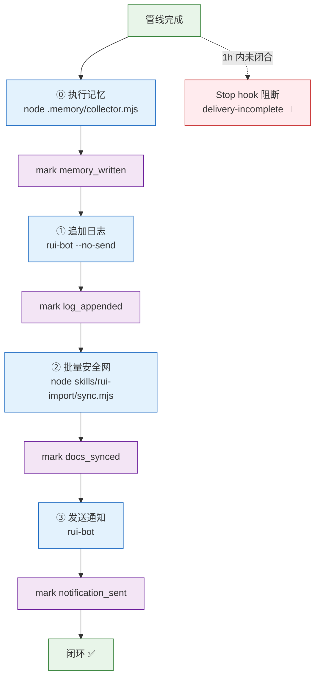
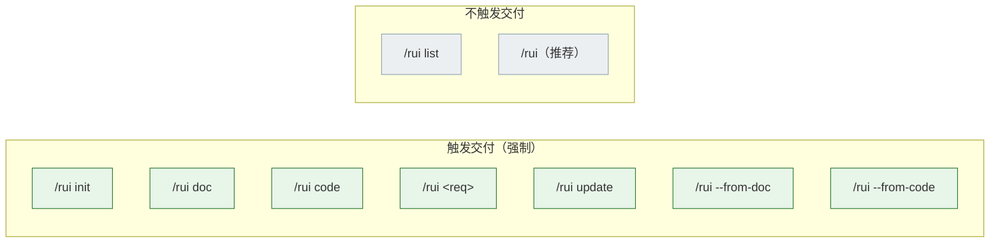
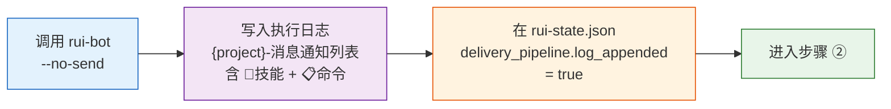
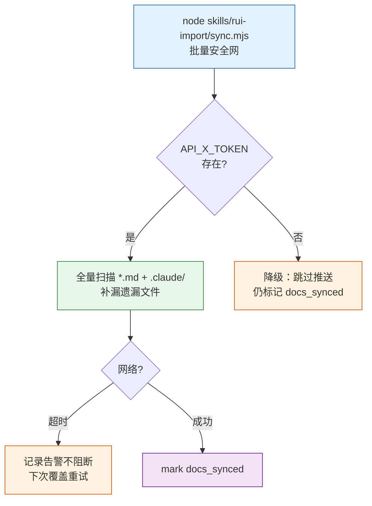
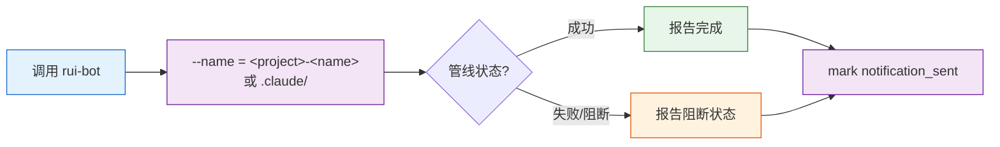
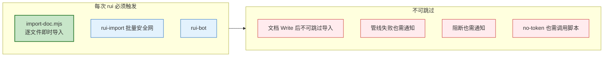
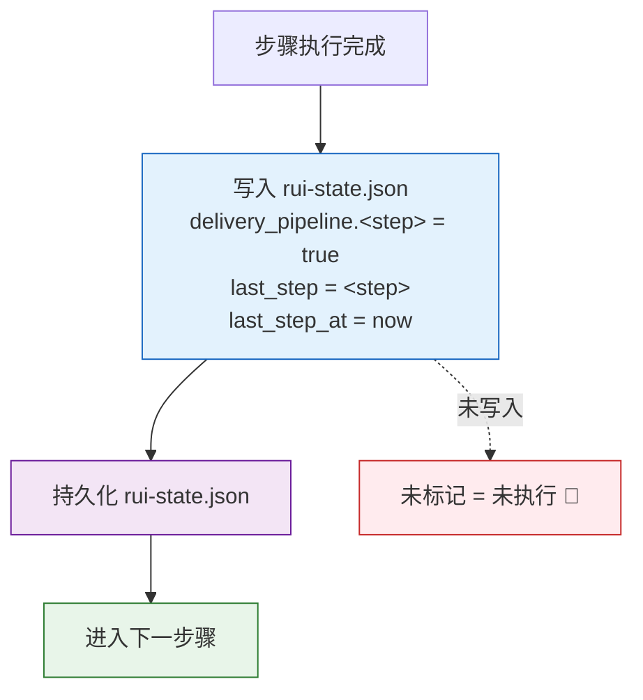
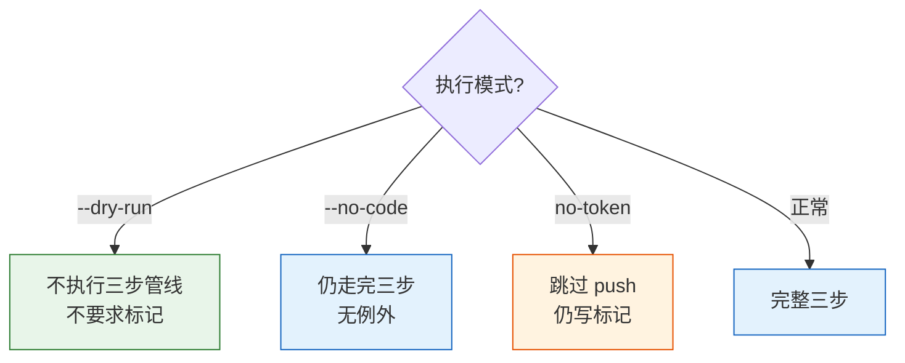
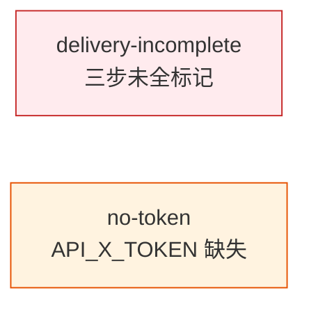
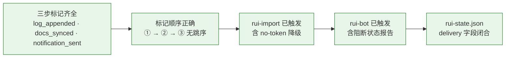

---
paths:
  - "docs/故事任务面板/**/.memory/rui-state.json"
  - "docs/故事任务面板/**/*.md"
---

# delivery-gate

> 每个 `/rui` 末端三步交付按序执行，每步必标记。未标记 = 未执行。rui-import 和 rui-bot 是 rui 管线的强制组成部分，不可省略。
>
> **Iron Law — 违反字母即是违反精神：**
> - 未标记 = 未执行。"调用过"不等于"已验证标记"。
> - 三步必须按序。跳序 = 未闭合。
> - 阻断状态也必须触发通知。

[交付全景](#交付全景) · [适用](#适用) · [① 追加日志](#①-追加日志) · [② 文档同步](#②-文档同步) · [③ 发送通知](#③-发送通知) · [核心约束](#核心约束) · [标记规则](#标记规则) · [例外](#例外) · [阻断标识](#阻断标识) · [生效标志](#生效标志)

## Red Flags — 暂停并回到 Iron Law

- "改动很小，跳过通知"
- "文档同步这次就算了"
- "标记后补写就行，先继续下一步"
- "no-token 降级就跳过整个步骤"
- "三步一次性执行，不用逐步标记"
- "通知模板很长，这次不填完整"

**以上任何一个 = 停止。管线未闭合 = delivery-incomplete 阻断。**

## 交付全景



| 步骤 | 操作 | 标记 | 降级条件 |
|------|------|------|---------|
| ⓪ 执行记忆 | `node .memory/collector.mjs --story=<name> --command=<cmd>` 追加记录 | `memory_written` | — |
| ① 追加日志 | `rui-bot --no-send` 写入日志 | `log_appended` | — |
| ② 批量安全网 | `node skills/rui-import/sync.mjs` 兜底补漏 | `docs_synced` | `no-token`（缺 API_X_TOKEN） |
| ③ 发送通知 | `rui-bot` 推送企微 | `notification_sent` | — |

## 适用

每个 `/rui` 命令的末端（含 `init` / `doc` / `code` / `update` / `--from-doc` / `--from-code` / 端到端）。**唯一的例外是 `list` 和推荐（纯只读）。**



## ① 追加日志



| 规则 | 描述 |
|------|------|
| 技能标识 | 每条日志必须含 `🤖 技能` 字段（rui / rui-story / rui-claude / rui-bot / rui-import） |
| 命令记录 | 每条日志必须含 `📋 命令` 字段（用户执行的具体命令，含参数） |
| 时间戳 | 每条日志以 `【YYYY-MM-DD HH:mm:ss】` 分隔行开头 |

## ② 批量安全网（兜底）

> 逐文件即时导入（`import-doc.mjs`）已在 doc/code 阶段完成，此步骤为兜底补漏。



```
同步范围:
  ✅ 全部 *.md
  ✅ .claude/ 目录
  ❌ .git
  ❌ node_modules

凭据约束:
  ✅ API_X_TOKEN 仅从环境变量读取
  ❌ 禁止写入任何文件
```

| # | 规则 |
|---|------|
| 5 | 逐文件导入为主路径（`node skills/rui/import-doc.mjs <file>`），批量安全网仅兜底 |
| 6 | 同步范围：全部 `*.md` + `.claude/` 目录，排除 `.git` 和 `node_modules` |
| 7 | `API_X_TOKEN` 仅从环境变量读取，禁止写入任何文件 |
| 8 | 缺 `API_X_TOKEN` → `no-token` 降级，跳过推送但仍需标记 `docs_synced` |
| 9 | 网络超时记录告警不阻断，下次覆盖重试 |

## ③ 发送通知



| # | 规则 |
|---|------|
| 10 | 通知名（`--name`）= `<name>` 或 `.claude/`，由 rui-bot 决定通道 |

## 核心约束



| # | 规则 | 反例 |
|---|------|------|
| — | 这是管线完整性的硬性要求，不是建议 | "本次改动很小，跳过通知" |
| — | 即使管线中途失败/阻断，仍需触发通知（报告阻断状态） | 阻断后直接退出，未调 rui-bot |
| — | `no-token` 降级时：调用脚本 + 标记，跳过实际网络请求 | 因缺 token 跳过整个步骤 |
| — | 跳过触发 = 违反核心约束 = 管线未闭合 | `--dry-run` 外跳步 |

## 标记规则



| # | 规则 | 反例 |
|---|------|------|
| 1 | 标记即证据：未标记视为未执行 | "看起来调用了"不等于"已标记" |
| 2 | 顺序强制：三步严格按序，跳序即视为未闭合 | 先发通知再补日志 |
| 3 | Stop hook：1 小时内有 rui 活动且管线未闭合 → 阻断停止 | 执行完 3 小时后才标记 |
| 4 | 恢复：按提示执行缺失步骤并标记，闭合后自动放行 | — |

## 例外



| 场景 | 三步管线 | 标记要求 |
|------|---------|---------|
| `--dry-run` | 不执行 | 不要求 |
| 仅文档变更（`--no-code`） | 完整执行 | 必须标记 |
| `no-token`（API_X_TOKEN 缺失） | 跳过推送，其余完整 | 必须标记（含 `docs_synced`） |

## 阻断标识



| 标识 | 触发条件 | 阻断? | 恢复方式 |
|------|---------|-------|---------|
| `delivery-incomplete` | 三步未全部标记，距上次 rui 活动 < 1h | ✅ 阻断 | 补执行缺失步骤并标记 |
| `no-token` | `API_X_TOKEN` 环境变量缺失 | ⚠️ 降级不阻断 | 设置环境变量后恢复推送 |

## 生效标志



| 标志 | 未达标的处置 |
|------|------------|
| 三步标记齐全 | 补执行缺失步骤，写入标记 |
| 标记顺序正确（① → ② → ③） | 清除错序标记，从断点重新执行 |
| rui-import 已触发 | 调用 `node skills/rui-import/sync.mjs` 并标记 |
| rui-bot 已触发 | 调用 rui-bot 并标记 |
| rui-state.json delivery 字段闭合 | 核对标记字段，补全后 closure 锁定 |
