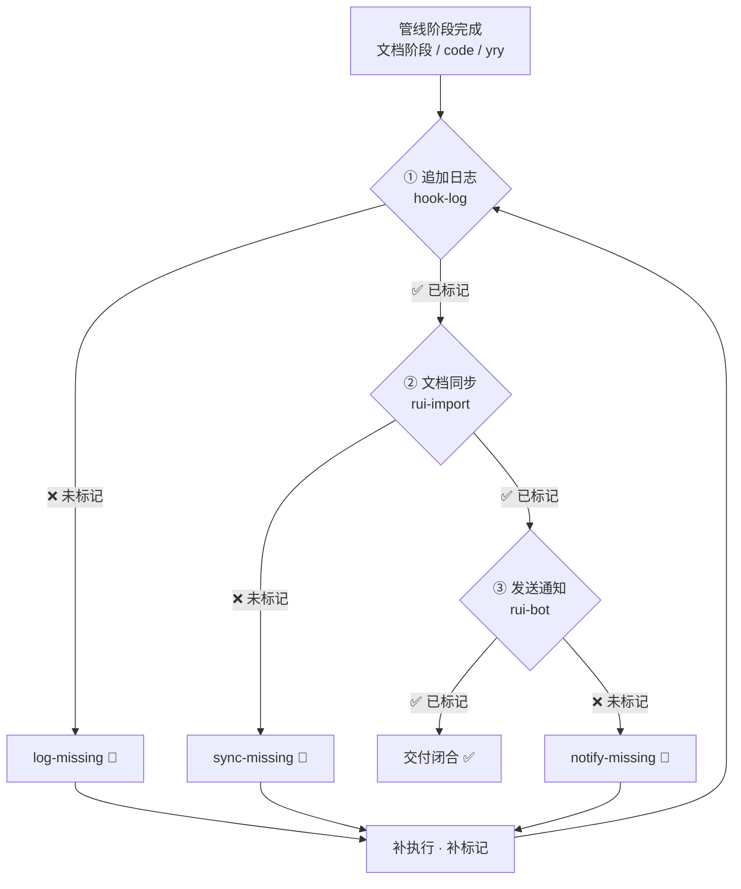
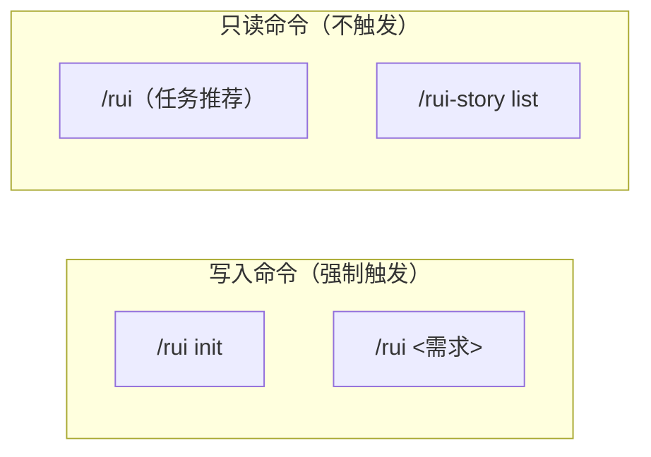
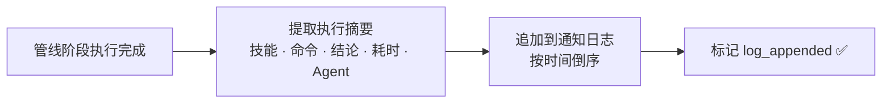
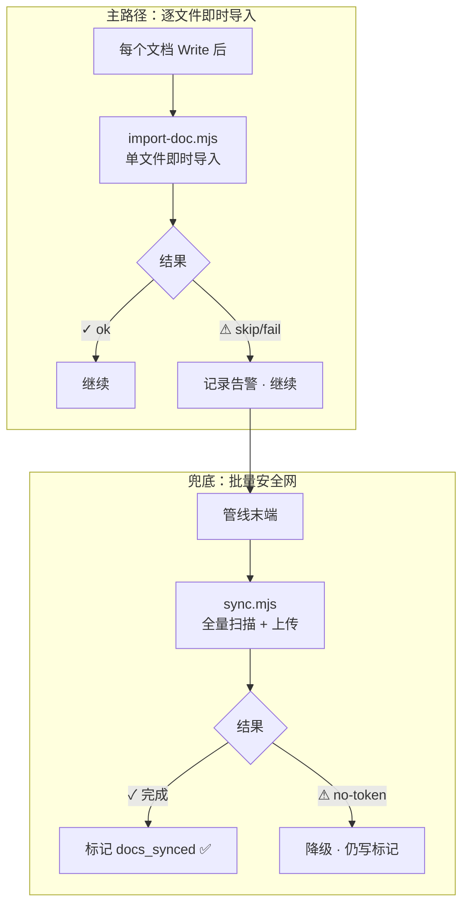
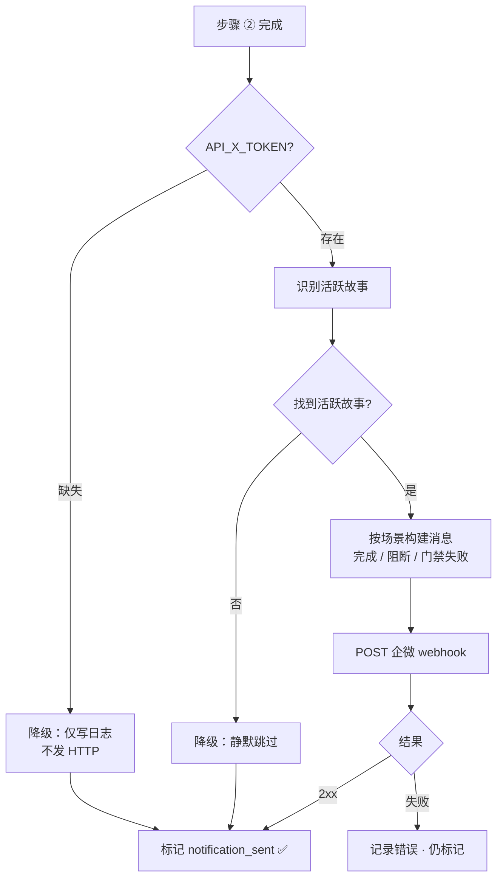
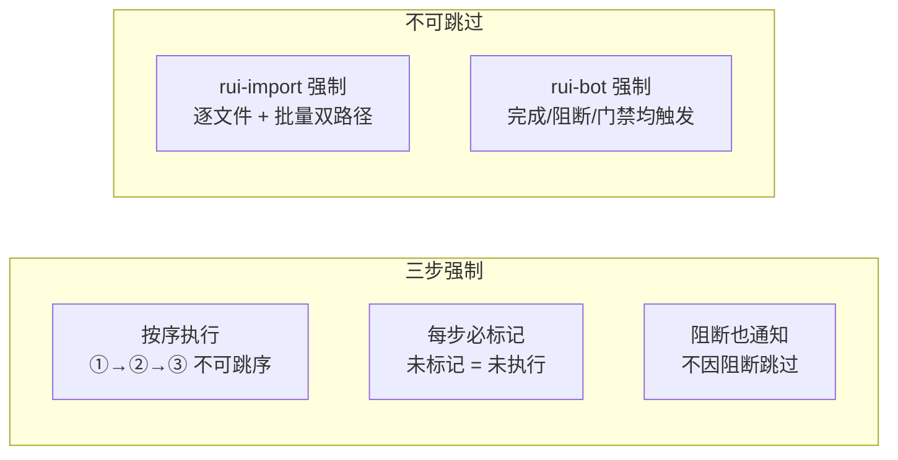
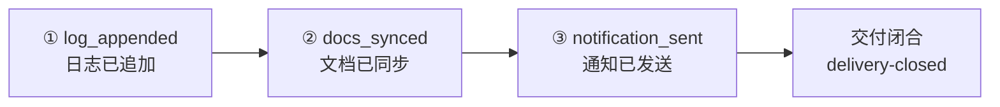
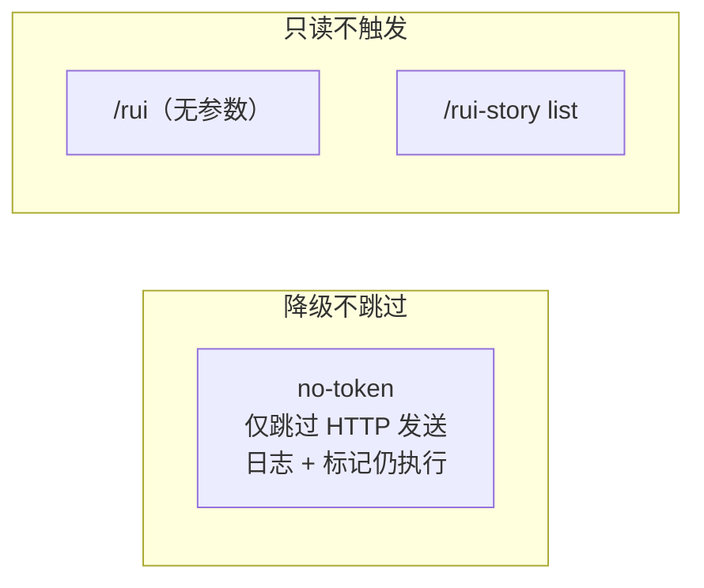
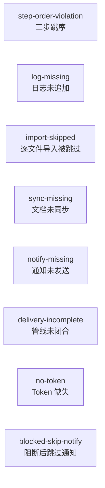
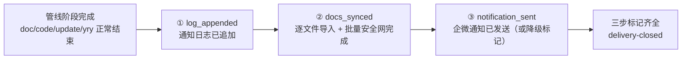

---
paths:
  - "docs/故事任务面板/**/*.md"
---

# delivery-gate

> 每个 `/rui` 管线末端三步交付按序执行，每步必标记。未标记 = 未执行。rui-import 和 rui-bot 是 rui 管线的强制组成部分，不可省略。
>
> **Iron Law — 违反字母即是违反精神：**
> - 未标记 = 未执行。"调用过"不等于"已验证标记"。
> - 三步必须按序。跳序 = 未闭合。
> - 阻断状态也必须触发通知。

[交付全景](#交付全景) · [适用](#适用) · [① 追加日志](#①-追加日志) · [② 文档同步](#②-文档同步) · [③ 发送通知](#③-发送通知) · [核心约束](#核心约束) · [标记规则](#标记规则) · [例外](#例外) · [阻断标识](#阻断标识) · [生效标志](#生效标志)

## Red Flags — 暂停并回到 Iron Law

- "改动很小，跳过通知"
- "文档同步这次就算了"
- "标记后补写就行，先继续下一步"
- "no-token 降级就跳过整个步骤"
- "三步一次性执行，不用逐步标记"
- "通知模板很长，这次不填完整"

**以上任何一个 = 停止。管线未闭合 = delivery-incomplete 阻断。**

## 交付全景



| 步骤 | 动作 | 可执行入口 | 降级策略 |
|------|------|-----------|---------|
| ① 追加日志 | 将本次管线执行摘要写入故事通知日志 | `node skills/rui-bot/send.mjs --no-send` | — |
| ② 文档同步 | 逐文件即时导入 + 批量安全网兜底 | `node skills/rui/import-doc.mjs` + `node skills/rui-import/sync.mjs` | `no-token` 降级，仍写标记 |
| ③ 发送通知 | 通过企微机器人推送完成/阻断/门禁消息 | `node skills/rui-bot/send.mjs` | `no-token` 降级，仅写日志不发 HTTP |

## 适用

> 以下命令末端强制触发交付三步。未触发 = 管线未闭合。



| 命令 | 触发交付? | 说明 |
|------|:---:|------|
| `/rui init` | ✅ | 项目基线建立后全量同步 + 通知 |
| `/rui <需求>` | ✅ | 统一入口：全部模式完成后触发（含新建/增量/反推/补齐/实现/自改进/端到端） |
| `/rui`（无参数） | ❌ | 只读任务推荐，无写入 |
| `/rui-story list` | ❌ | 只读进度查询 |

## ① 追加日志

> 将本次管线执行摘要追加写入故事通知日志。日志持久化到 `docs/故事任务面板/通知日志.md`，按时间倒序排列。



| # | 规则 | 说明 |
|---|------|------|
| 1 | 每次 rui 写入命令末端必须追加日志 | 不因完成/阻断/降级而跳过 |
| 2 | 日志含时间戳 + 技能名 + 命令 + 结论 + 参与 Agent | 见 [rui-bot SKILL.md § 消息格式](../skills/rui-bot/SKILL.md#消息格式) |
| 3 | 通知日志位于 `docs/故事任务面板/通知日志.md` | 统一入口，按时间倒序 |
| 4 | 日志追加后用 `log_appended` 标记确认 | 未标记 = 未执行 |

**日志条目格式**：

```
## YYYY-MM-DD HH:MM

【项目名】
🤖 技能: <name>
📋 命令: <full-command>
🎯 结论: <完成/阻断/门禁失败> <story> <stage>
⏱️ 会话: <date> <duration> | <N> agents 参与
```

## ② 文档同步

> 两层同步机制：逐文件即时导入（主路径）+ 批量安全网（兜底）。详见 [rui-import SKILL.md](../skills/rui-import/SKILL.md)。



| # | 规则 | 说明 |
|---|------|------|
| 1 | 每个文档 Write 后**必须**立即执行 `node skills/rui/import-doc.mjs <file-path>` | 主路径，不可跳过或推迟 |
| 2 | 管线末端执行 `node skills/rui-import/sync.mjs` 全量扫描 | 兜底安全网，不可替代逐文件导入 |
| 3 | `API_X_TOKEN` 缺失时降级跳过，仍写 `docs_synced` 标记 | `no-token` 降级不阻断 |
| 4 | 单文件导入失败不阻断，记录告警后继续 | 网络波动容错 |
| 5 | 同步完成后用 `docs_synced` 标记确认 | 未标记 = 未执行 |
| 6 | 远端路径 = 项目根相对路径，与本地目录结构一一对应 | 路径映射不可跳段、不可前置、不可重命名 |

**检查点时序**：

| 检查点 | 时机 | 执行方式 | 范围 |
|--------|------|---------|------|
| 逐文件导入 | 每个文档生成/修改后 | `import-doc.mjs <file>` | 当前文件 |
| 批量安全网 | 管线末端步骤 ② | `sync.mjs` | 全项目 .md + .claude/ 全部 |

## ③ 发送通知

> 通过企微机器人推送管线执行结果。完成/阻断/门禁失败三种场景各有必含字段。详见 [rui-bot SKILL.md](../skills/rui-bot/SKILL.md)。



| # | 规则 | 说明 |
|---|------|------|
| 1 | 无论管线完成/阻断/门禁失败，均须触发通知 | 阻断状态也必须有通知 |
| 2 | `API_X_TOKEN` 缺失时降级：仅写日志，不发 HTTP | `no-token` 降级不阻断 |
| 3 | 消息格式遵循 emoji 字段规范，纯文本，≤ 2000 字 | 见 [rui-bot § 消息格式](../skills/rui-bot/SKILL.md#消息格式) |
| 4 | 消息首行自动追加 `【项目名】` | 项目名从 `basename(项目根)` 提取 |
| 5 | 发送完成后用 `notification_sent` 标记确认 | 未标记 = 未执行 |

**三种场景的消息字段**：

| 场景 | 必含字段 | 特有字段 |
|------|---------|---------|
| 完成 | 🤖技能 📋命令 🎯结论 📝描述 📌范围 👉下一步 🌐影响 📎证据 ⏱️会话 | — |
| 阻断 | 🤖技能 📋命令 🎯结论 📝描述 📌范围 ❌原因 🧭恢复点 🌐影响 📎证据 ⏱️会话 | ❌原因 🧭恢复点 |
| 门禁失败 | 🤖技能 📋命令 🎯结论 📝描述 📌范围 🔍门禁 📊结果 🌐影响 📎证据 ⏱️会话 | 🔍门禁 📊结果 |

## 核心约束



| # | 约束 | 违反标识 |
|---|------|---------|
| 1 | 三步按 ①→②→③ 顺序执行，不可并行或跳序 | `step-order-violation` |
| 2 | 每步执行后必须立即标记，未标记 = 未执行 | `log-missing` / `sync-missing` / `notify-missing` |
| 3 | 阻断状态也必须走完三步，不可因阻断跳过通知 | `blocked-skip-notify` |
| 4 | 逐文件即时导入不可跳过，不可推迟到批量安全网 | `import-skipped` |
| 5 | 三步全部标记完成方视为管线闭合 | `delivery-incomplete` |
| 6 | `no-token` 降级仅跳过 HTTP 发送，日志追加和标记仍执行 | — |
| 7 | 自主测试（self-test）在通知后执行，不纳入三步标记范围 | — |

## 标记规则

> 每步执行后产出显式标记。标记是交付闭合的唯一证据。



| 步骤 | 标记 | 标记方式 | 验证命令 |
|------|------|---------|---------|
| ① 追加日志 | `log_appended` | 写入通知日志条目 + 声明标记 | `grep` 通知日志最新条目时间戳 |
| ② 文档同步 | `docs_synced` | sync.mjs 正常退出 + 声明标记 | `grep` sync.mjs 输出 created/overwritten/failed |
| ③ 发送通知 | `notification_sent` | send.mjs 正常退出（或降级跳过）+ 声明标记 | `grep` send.mjs 输出 |

| 规则 | 说明 |
|------|------|
| 标记必须紧接步骤执行后产生 | "稍后补标记"视为未标记 |
| 标记不可预写 | 先执行再标记，不可先标记再执行 |
| 三步标记齐全 = 交付闭合 | 缺任一标记 = `delivery-incomplete` |
| 降级场景也须标记 | `no-token` 时步骤 ②③ 降级执行，标记仍写入 |

## 例外



| 场景 | 跳过 | 保留 |
|------|------|------|
| `API_X_TOKEN` 缺失（no-token） | 步骤 ③ HTTP 发送 | 日志追加 · 文档同步 · 全部标记 |
| 只读命令（`/rui`、`/rui-story list`） | 三步全跳过 | — |
| 网络超时 / 远端不可达 | 单次 HTTP 请求 | 日志追加 · 其余步骤 · 全部标记 |

> **不存在跳过整个步骤的例外。** `no-token` 降级仅跳过 HTTP 发送，日志追加和标记仍必须执行。不存在"改动太小跳过通知"或"文档同步这次就算了"的合法例外。

## 阻断标识



| 标识 | 触发条件 | 阻断? |
|------|---------|-------|
| `step-order-violation` | 三步未按 ①→②→③ 顺序执行 | ✅ 阻断 |
| `log-missing` | 步骤 ① 未执行或未标记 | ✅ 阻断 |
| `import-skipped` | 逐文件即时导入被跳过，仅执行批量安全网 | ✅ 阻断 |
| `sync-missing` | 步骤 ② 未执行或未标记 | ✅ 阻断 |
| `notify-missing` | 步骤 ③ 未执行或未标记（含降级标记） | ✅ 阻断 |
| `delivery-incomplete` | 三步标记任一缺失 | ✅ 阻断 |
| `blocked-skip-notify` | 管线阻断后跳过通知步骤 | ✅ 阻断 |
| `no-token` | `API_X_TOKEN` 环境变量缺失 | ⚠️ 降级不阻断 |

## 生效标志



| 标志 | 未达标的处置 |
|------|------------|
| `log_appended` — 通知日志已追加当前执行条目 | 补充日志条目 + 标记 |
| `docs_synced` — 逐文件导入全部执行 + 批量 sync.mjs 完成 | 补执行 `import-doc.mjs` + `sync.mjs` |
| `notification_sent` — 通知已发送或降级标记已写入 | 补执行 `send.mjs` 或写降级标记 |
| 三步标记齐全 — 交付闭合 | 从缺失步骤起按序补执行 |
