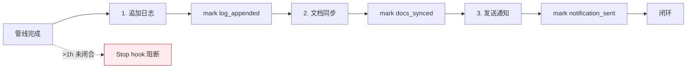

---
paths:
  - "docs/故事任务面板/**/.memory/rui-state.json"
  - "docs/故事任务面板/**/*.md"
---

# delivery-gate

> **口诀：标记即证据，用 rui 必触发。** 每个 `/rui` 末端三步交付按序执行，每步必标记。未标记 = 未执行。import-docs 和 wework-bot 是 rui 管线的强制组成部分，不可省略。

## 适用

每个 `/rui` 命令的末端，包含 `/rui doc` / `/rui code` / `/rui <req>` / `/rui-claude <req>`。`/rui list` / `/rui` 推荐不触发交付。

## 规则

### 三步管线（按序，必须标记）

| # | 操作 | 标记 |
|---|------|------|
| 1 | `wework-bot --no-send` 追加日志 | `log_appended` |
| 2 | `import-docs --workspace` 同步 | `docs_synced` |
| 3 | `wework-bot` 发送通知 | `notification_sent` |

每步完成后必须调用 `delivery-gate.js mark --step <step>` 写入 `rui-state.json`。

1. **标记即证据**：未标记视为未执行，"看起来调用了"不等于"已标记"
2. **顺序强制**：三步严格按序，跳序即视为未闭合
3. **Stop hook**：1 小时内有 rui 活动且管线未闭合 → 阻断停止
4. **恢复**：按提示执行缺失步骤并标记，闭合后自动放行

### 文档同步（步骤 2 细则）

5. 同步范围：全部 `*.md` + `.claude/` 目录，排除 `.git` 和 `node_modules`
6. `API_X_TOKEN` 仅从环境变量读取，**禁止写入任何文件**
7. 缺 `API_X_TOKEN` → `no-token` 降级，跳过推送但仍需标记 `docs_synced`（降级完成）
8. 网络超时记录告警不阻断，下次覆盖重试

### 通知（步骤 3 细则）

9. 通知名（`--name`）= `<project>-<name>` 或 `.claude/`，由 wework-bot 决定通道

## 例外

- `--dry-run`：不执行三步管线，不要求标记
- 仅文档变更（`--no-code`）：仍走完三步
- `no-token`：仅 `API_X_TOKEN` 缺失合法跳过 push，标记仍写

## 阻断标识

| 标识 | 触发 | 降级 |
|------|------|------|
| `delivery-incomplete` | 三步未全部标记，距上次活动 < 1h | 否 |
| `no-token` | `API_X_TOKEN` 缺失 | 是 |

## 强制约束

> **每次使用 rui 技能都必须触发 import-docs 和 wework-bot，无例外。**

- 这是管线完整性的硬性要求，不是建议
- 即使管线中途失败/阻断，仍需触发通知（报告阻断状态）
- `no-token` 降级时：调用脚本 + 标记，跳过实际网络请求
- 跳过触发 = 违反核心约束 #11 = 管线未闭合
