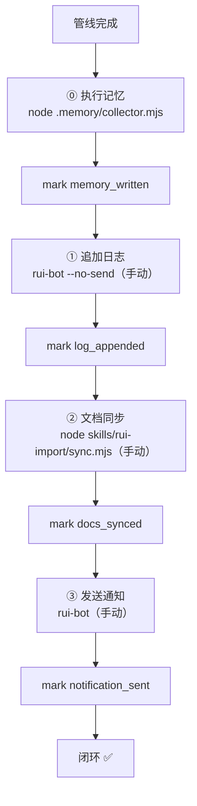
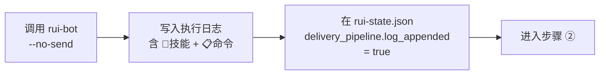
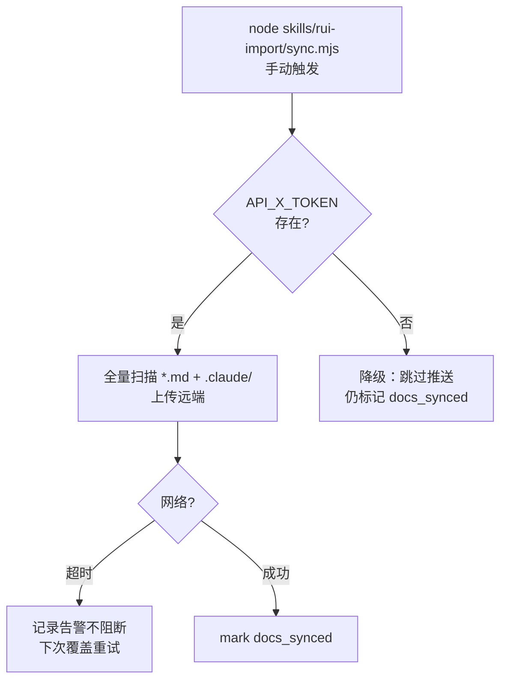
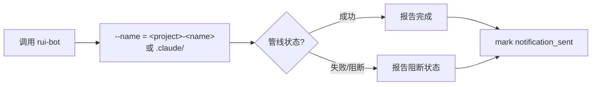
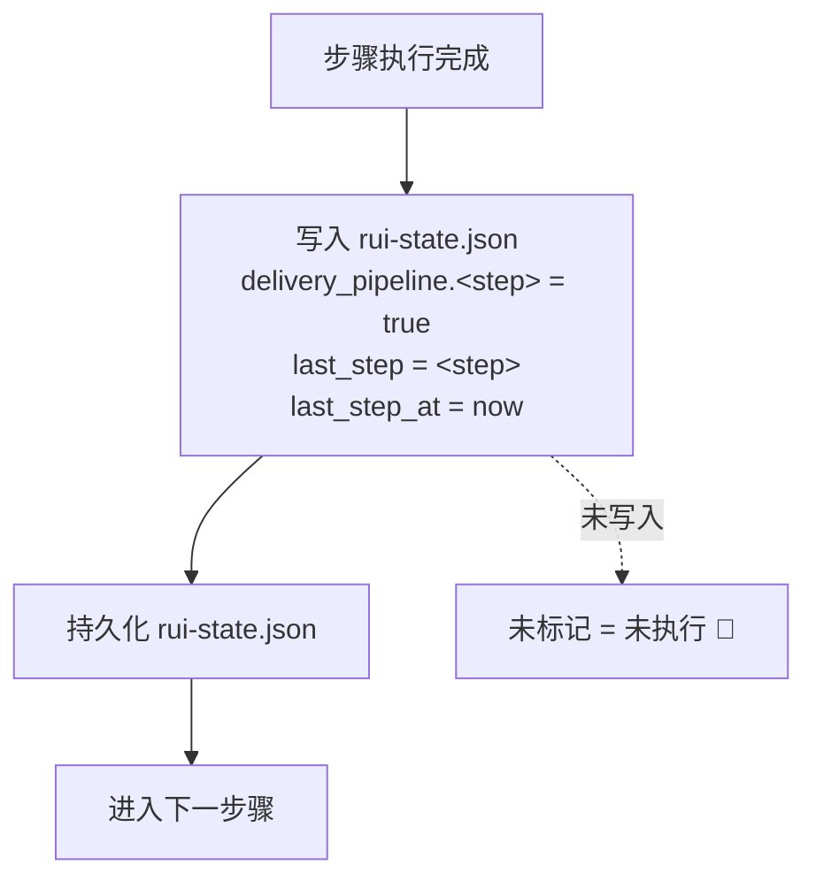
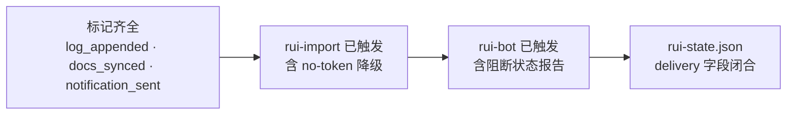

---
paths:
  - "docs/故事任务面板/**/.memory/rui-state.json"
  - "docs/故事任务面板/**/*.md"
---

# delivery-gate

> rui-import 和 rui-bot 均为手动触发。管线完成后按需调用，不可省略。
>
> **Iron Law — 违反字母即是违反精神：**
> - 未标记 = 未执行。"调用过"不等于"已验证标记"。
> - 阻断状态也应触发通知。

[交付全景](#交付全景) · [适用](#适用) · [① 追加日志](#①-追加日志) · [② 文档同步](#②-文档同步) · [③ 发送通知](#③-发送通知) · [标记规则](#标记规则) · [例外](#例外) · [阻断标识](#阻断标识) · [生效标志](#生效标志)

## Red Flags — 暂停并回到 Iron Law

- "改动很小，跳过通知"
- "文档同步这次就算了"
- "no-token 降级就跳过整个步骤"
- "通知模板很长，这次不填完整"
- "测试应该没问题，先交付再验证"
- "上次交付前跑过测试了，这次不用"
- "只改了文档，不影响功能，跳过测试"

**以上任何一个 = 停止。管线未闭合 = delivery-incomplete 阻断。**

### 交付前测试验证（强制）

> 任何交付选项呈现前，必须先验证测试通过。测试未通过 = 停止交付。

```
交付前强制步骤：
1. 运行完整测试套件
2. 读取完整输出
3. 确认 0 失败
4. 确认无 regression（之前通过的测试仍然通过）
5. 仅测试通过后才呈现交付选项

测试失败 → 停止 → 退回 coder 修复 → 验证重跑
"应该能通过" → 停止 → 运行测试 → 读输出
```

### 验证完整性 — 合理化预防表

| 借口 | 现实 |
|------|------|
| "测试上次运行通过了" | 未基于当前 commit 运行 = 未验证。验现实。 |
| "改动很小，测试肯定没问题" | 小改动和大改动的回归风险相同。运行测试。 |
| "只改了文档" | 文档变更不影响功能，但仍需验证基线完整性。 |
| "部分检查就够了" | 截断输出 = 可能错过关键失败。读完整输出。 |
| "应该没问题" | "应该"不是验证证据。运行命令 → 读输出 → 确认。 |
| "我确信能通过" | 确信不是验证。命令输出是唯一证据。 |

## 交付全景



| 步骤 | 操作 | 标记 | 降级条件 |
|------|------|------|---------|
| ① 追加日志 | `rui-bot --no-send` 写入日志 | `log_appended` | — |
| ② 文档同步 | `node skills/rui-import/sync.mjs` 全量同步 | `docs_synced` | `no-token`（缺 API_X_TOKEN） |
| ③ 发送通知 | `rui-bot` 推送企微 | `notification_sent` | — |
| ④ 自主测试 | 每次故事任务变更后执行自检：基线完整性 · 文档一致性 · 分支隔离 · 安全合规 | `self_test_passed` | `no-self-test`（缺 self-test 故事目录时跳过） |

## 适用

交付收口适用于所有 `/rui` 写入命令（含 `init` / `doc` / `code` / `update` / `--from-doc` / `--from-code` / 端到端）。`list` 和推荐（纯只读）不需要执行交付收口。

## ① 追加日志



| 规则 | 描述 |
|------|------|
| 技能标识 | 每条日志必须含 `🤖 技能` 字段（rui / rui-story / rui-claude / rui-bot / rui-import） |
| 命令记录 | 每条日志必须含 `📋 命令` 字段（用户执行的具体命令，含参数） |
| 时间戳 | 每条日志以 `【YYYY-MM-DD HH:mm:ss】` 分隔行开头 |

## ② 文档同步

> `node skills/rui-import/sync.mjs workspace=true` 全量扫描并上传。



```
同步范围:
  ✅ 全部 *.md
  ✅ .claude/ 目录
  ❌ .git
  ❌ node_modules

凭据约束:
  ✅ API_X_TOKEN 仅从环境变量读取
  ❌ 禁止写入任何文件
```

| # | 规则 |
|---|------|
| 5 | 同步范围：全部 `*.md` + `.claude/` 目录，排除 `.git` 和 `node_modules` |
| 6 | `API_X_TOKEN` 仅从环境变量读取，禁止写入任何文件 |
| 7 | 缺 `API_X_TOKEN` → `no-token` 降级，跳过推送但仍需标记 `docs_synced` |
| 8 | 网络超时记录告警不阻断，下次覆盖重试 |

## ③ 发送通知



| # | 规则 |
|---|------|
| 10 | 通知名（`--name`）= `<name>` 或 `.claude/`，由 rui-bot 决定通道 |

## 标记规则



| # | 规则 | 反例 |
|---|------|------|
| 1 | 标记即证据：未标记视为未执行 | "看起来调用了"不等于"已标记" |
| 2 | 阻断后退出，需手动调用 rui-bot 通知 | 阻断后直接退出，未调 rui-bot |
| 3 | `no-token` 降级时：调用脚本 + 标记，跳过实际网络请求 | 因缺 token 跳过整个步骤 |

## 例外

| 场景 | 交付收口 | 标记要求 |
|------|---------|---------|
| `no-token`（API_X_TOKEN 缺失） | 跳过推送，其余完整 | 必须标记（含 `docs_synced`） |

## 阻断标识

| 标识 | 触发条件 | 阻断? | 恢复方式 |
|------|---------|-------|---------|
| `no-token` | `API_X_TOKEN` 环境变量缺失 | ⚠️ 降级不阻断 | 设置环境变量后恢复推送 |

## 生效标志



| 标志 | 未达标的处置 |
|------|------------|
| 标记齐全 | 补执行缺失步骤，写入标记 |
| rui-import 已触发 | 调用 `node skills/rui-import/sync.mjs` 并标记 |
| rui-bot 已触发 | 调用 rui-bot 并标记 |
| rui-state.json delivery 字段闭合 | 核对标记字段，补全后 closure 锁定 |
