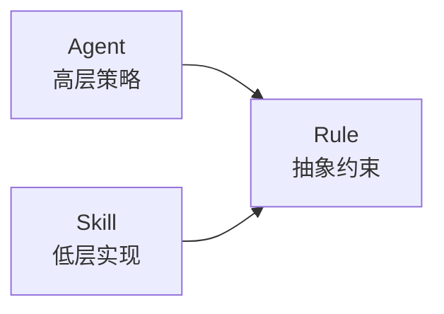

# design-principles — 设计原则

> 每一条设计决策的默认起点。YrY 的模块（Agent \ Skill \ Rule \ Lib）均以此九条为审查基准。

[SRP](#srp-单一职责) · [高内聚](#高内聚) · [低耦合](#低耦合) · [DIP](#dip-依赖倒置) · [OCP](#ocp-开闭原则) · [ISP](#isp-接口隔离) · [DRY](#dry) · [YAGNI](#yagni) · [组合优于继承](#组合优于继承)

---

## SRP 单一职责

> 每个模块只做一件事，并把它做好。

| 模块类型 | 职责粒度 | 验证标准 |
|---------|---------|---------|
| Agent | 一个角色，一种决策视角 | 能用一句话描述 Agent 职责，不含"和/与/也" |
| Skill | 一个可执行能力 | SKILL.md 只描述一个核心能力的输入→输出 |
| Rule | 一条行为约束 | 规则文件只定义一个门禁/规范 |
| Lib 模块 | 一个可复用函数族 | 文件内所有函数服务于同一抽象层 |

**反例**：
- Agent 既是产品决策者又生成知识图谱（pm 的 KG 生成应归属 coder/reporter）
- Skill 既发消息又做健康检查又管失败队列（rui-bot 三合一，应拆为 rui-bot + rui-health）
- 一个函数既获取数据又渲染 HTML（应分层：data → render）

---

## 高内聚

> 相关的放在一起。修改一个功能只需改一个地方。

| 维度 | 内聚方式 |
|------|---------|
| 物理内聚 | Skill 的 SKILL.md + 脚本 + 测试在同一目录 |
| 概念内聚 | 同一关注点的规则放在同一个 rules/ 文件 |
| 时序内聚 | 管线步骤按执行顺序编排（doc → plan → code → test） |

**验证标准**：修改一个业务需求时，变更只涉及 1 个 Skill 目录 + 至多 1 个 lib/ 文件。

---

## 低耦合

> 模块间通过规约接口通信，不依赖对方内部实现。

| 耦合层级 | 允许 | 禁止 |
|---------|------|------|
| Agent ↔ Agent | 交接信号（§ 文档） | 直接调用对方方法 |
| Agent ↔ Skill | 委托（Agent 描述意图，Skill 执行） | Agent 文件 import Skill 的内部实现路径 |
| Skill ↔ Skill | 通过 rui 编排器路由 | Skill A 硬编码调用 Skill B 的脚本 |
| Skill ↔ Lib | `import { fn } from '../../lib/xxx.mjs'` | copy-paste lib 代码到 Skill 内 |

**验证标准**：替换任意一个 Skill，不修改任何其他 Skill 或 Agent 文件。

---

## DIP 依赖倒置

> 高层策略不依赖低层实现，两者都依赖抽象（Rule）。

- Agent 定义「做什么」（What），Skill 实现「怎么做」（How），Rule 约束「不可做什么」（Won't）
- Agent 的 SKILL.md 引用 Rule，不引用 Skill 的实现细节
- 新增 Skill 只需实现 Rule 定义的接口，Agent 无需修改

---

## OCP 开闭原则

> 对扩展开放，对修改关闭。

| 场景 | 扩展方式 | 不修改的部分 |
|------|---------|------------|
| 新增 Skill | 在 skills/ 下新建目录 + 注册 plugin.json | rui 编排器 SKILL.md |
| 新增 Agent | 在 agents/ 下新建 .md + 更新 AGENT.md 拓扑 | 其他 Agent 文件 |
| 新增 Rule | 在 rules/ 下新建 .md | 现有 Rule 文件 |
| 新增通知类型 | notify-panel.js 新增 render 分支 | panel-hub.js |

---

## ISP 接口隔离

> 不强迫模块依赖它不需要的接口。

**Agent 工具集最小化**：

| Agent | 允许的工具 | 禁止 |
|-------|----------|------|
| coder | Read, Grep, Glob, Edit, Write, Bash | — |
| tester | Read, Grep, Glob, Bash | Edit, Write |
| code-reviewer | Read, Grep, Glob, Bash | Edit, Write |
| architect | Read, Grep, Glob | Edit, Write, Bash |
| pm | Read, Grep, Glob, Bash | Edit, Write |

**Skill 暴露最小化**：每个 Skill 只暴露一个入口命令（如 `/rui-code`），内部实现细节不对外可见。

---

## DRY

> 每个知识点在系统内有唯一、明确、权威的表示。

| 知识类型 | 权威来源 | 消费者 |
|---------|---------|--------|
| 版本号 | plugin.json | CLAUDE.md, README.md, package.json, marketplace.json |
| 健康维度权重 | `lib/constants.mjs` → `HEALTH_DIM_WEIGHTS` | send.mjs, health-report.mjs |
| 设计令牌（颜色） | `rules/mermaid-theme.md` | 所有 Mermaid 图 |
| 数据源路径 | `docs/js/panel-hub.js` → `PATHS` | 所有面板 JS |
| Agent 工具权限 | agent .md 的 `tools:` frontmatter | audit.mjs |

**验证标准**：任何常量/配置/规则出现 2+ 次 → 提取到 lib/constants.mjs 或对应的 rules/ 文件。

---

## YAGNI

> 不提前设计。当前需求不需要的功能不加。

- 每个抽象（helper / class / 中间层）必须有 ≥2 个实际调用方
- 禁止"为未来扩展"而预留参数、接口、抽象层
- 单调用方的 wrapper 函数 → 展开（inline）

**反例**：
- "这个函数目前只被 X 调用，但以后 Y 也会用"→ 等 Y 出现再提取
- "定义一个通用接口，方便以后替换实现"→ 只有一个实现时不定义接口

---

## 组合优于继承

> 通过组合小模块构建复杂行为，而非通过继承层次。

- Skill 之间通过编排器（rui）组合，不存在继承关系
- Agent 之间通过交接信号协作，不存在父子继承
- 共享逻辑通过 `lib/` 导入（组合），而非定义基类让 Skill 继承

**验证标准**：项目中不存在 `extends` 关键词，不存在超过 1 层的抽象层次。

---

## 设计审查清单

代码审查时对照此清单：

| # | 检查项 | 通过条件 |
|---|--------|---------|
| 1 | SRP | 模块可用一句话描述，不含"和/与/也" |
| 2 | 高内聚 | 修改一个功能只需改一个目录 |
| 3 | 低耦合 | 替换一个模块不修改其他文件 |
| 4 | DIP | Agent 文件不 import Skill 内部路径 |
| 5 | OCP | 新增功能不改现有编排器 |
| 6 | ISP | Agent 的工具集 ≤ 其职责所需 |
| 7 | DRY | 无重复常量/配置/逻辑（≥2 处 = 提取） |
| 8 | YAGNI | 每个抽象有 ≥2 个调用方 |
| 9 | 组合 | 无 extends / 继承层次 |
