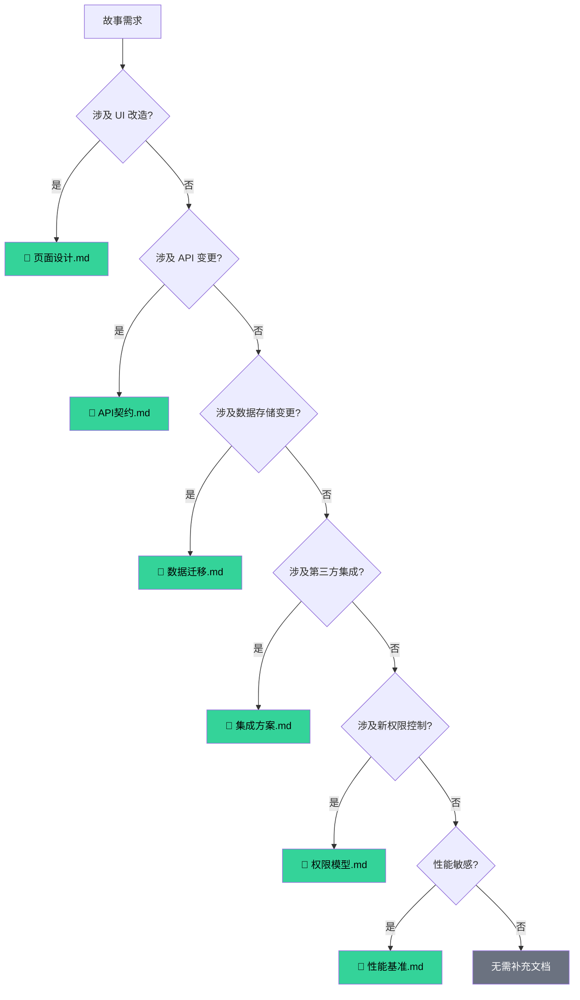
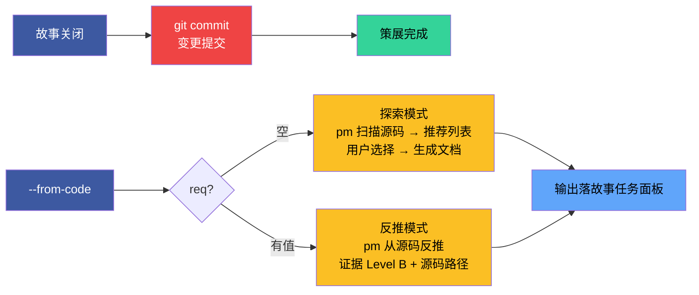

# doc-generation-lifecycle

> 补充文档触发 · 策展 · 例外 · 生效标志。主文档：[doc-generation.md](doc-generation.md)

[补充文档](#supplementary) · [策展](#curation) · [例外](#exceptions) · [生效标志](#effectiveness)

## 补充文档

| 触发条件 | 生成文档 | 主导 |
|---------|---------|------|
| UI 改造 | 页面设计.md | pm |
| API 变更 | API契约.md | pm |
| 数据存储变更 | 数据迁移.md | pm |
| 第三方集成 | 集成方案.md | pm |
| 新权限控制 | 权限模型.md | pm |
| 性能敏感 | 性能基准.md | pm |

## 策展

| # | 规则 | 说明 |
|---|------|------|
| 10 | 策展阶段必须 git commit | 故事关闭但变更未提交 → 违规 |
| 11a | `--from-code` req 空：探索模式，pm 扫描源码推荐列表 | 用户选择后生成文档 |
| 11b | `--from-code` req 有值：反推模式，证据 Level B | 标注源码路径，缺口标 `> 待补充` |

## 例外

| 场景 | 处理 |
|------|------|
| T1 级变更 | 跳过影响分析与架构设计 |
| 反推命令 | 只读源码，不触发验证阶段（见 code-pipeline.md） |

## 生效标志

| 标志 | 未达标的处置 |
|------|------------|
| 版头齐：版本行 + F.toc + 导航块，字段可验证，链接可闭合 | 补 F.meta / F.toc / F.nav，修正不一致字段，补失效链接 |
| 表达优先：图 → 结构化文本 → 表，架构/流程/关系有 mermaid | 文字改图，列表改表，补齐缺失的 mermaid |
| 目录清：`<name>/` 合规 | 移动文件到正确目录 |
| 证据足：无 Level D 内容 | 删 D 级内容，补 C 标注或查证升级 |
| 产出聚：文件按阶段创建，不提前 | 删除提前创建的文件 |
| 策展完成：git commit 已提交 | 执行 git commit |
| 基线溯源：技术评审～自改进复盘 均有 §0 基线溯源且链接有效 | 补基线溯源表 |
| 无魔数：代码中裸数值已提取为命名常量，文档中硬编码量级/阈值已语义化 | 代码提取常量，文档改写语义描述 |
| 效果证：§0 技术评审有效果示意，§2 实施报告有截图+可操作验证步骤 | 补效果图，补 curl/操作步骤 |
| 单源生：场景 7 类 HTML 内容可溯源至对应 `index.md`，无独立创作内容；`index.md` 变更后 HTML 已 `--force` 重生 | 删除 HTML 中 index.md 之外的事实断言；跑 `/rui-html <story> --force` 覆盖 |
