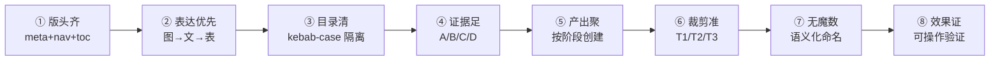
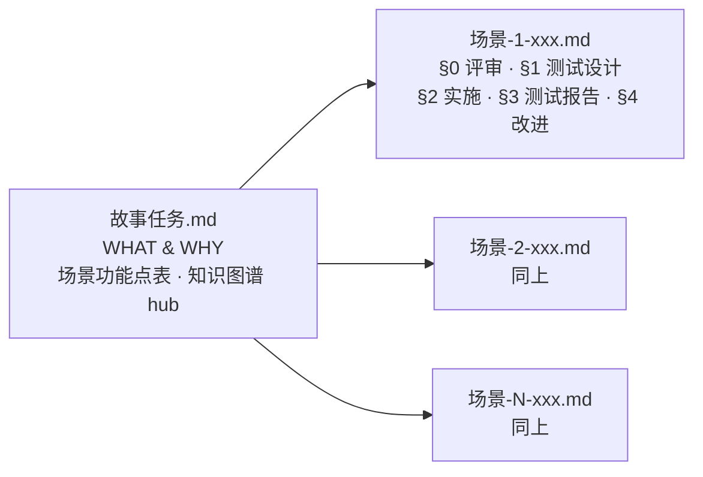

---
paths:
  - "docs/**/*.md"
---

# doc-generation

> 文档生成的强制约束。表达优先：图 → 结构化文本 → 表。故事任务为基线（自身不含 §0），场景-N-<slug>.md §0–§4 全阶段统一。
> 模板见 [templates/aicr-story/](../templates/aicr-story/)。

[铁律](#铁律) · [八约束](#八约束) · [基线](#基线) · [故事目录](#故事目录) · [文档公式](#文档公式) · [补充文档](#补充文档) · [生效标志](#生效标志)

## 铁律

文档生成受 [CLAUDE.md](../CLAUDE.md#铁律) 四条铁律约束：

| 铁律 | 源于 | 文档约束 | 违反信号 |
|------|------|---------|---------|
| **表达优先** | 惜注意 | 图 → 结构化文本 → 表，不可降级 | 无图文档、架构用大段文字描述 |
| **无魔数** | 惜注意 | 代码裸数值→命名常量，文档硬编码量级→语义描述 | `Math.max(2, 28)`、`setTimeout(fn, 3000)` |
| **验先于称** | 验现实 | 声称文档完成前必须运行验证命令 | "上次通过了"、"应该没问题" |
| **溯先于修** | 验现实 | 文档偏差修复前先定位根因 | "先改文档看看" |

## 八约束



| # | 约束 | 一句话 | 违反示例 |
|---|------|--------|---------|
| ① | **版头齐** | 每文档必含版本行 + 导航 + 目录 | 无版本行 / 导航链接指向不存在文件 |
| ② | **表达优先** | 图 → 结构化文本 → 表，架构优先 mermaid | 大段文字描述架构无图 |
| ③ | **目录清** | `<name>/` 独立子目录，kebab-case | 文档散落根目录 |
| ④ | **证据足** | Level A/B 写入，C 标待补充，D 禁止 | "应该有个 UserService" |
| ⑤ | **产出聚** | 按阶段创建，不可提前 | 编码前写好实施报告 |
| ⑥ | **裁剪准** | T1/T2/T3 增量分级 | T1 措辞修正跑完整管线 |
| ⑦ | **无魔数** | 硬编码→命名常量/语义描述 | `Math.max(2, 28)` |
| ⑧ | **效果证** | 技术评审有效果示意，实施/测试报告有可操作验证 | 实施报告只有文字 |

### ① 版头齐

每文档三组件，位序不可变：

```
# 文档标题

> | v{版本} | {日期} | {作者} | 🌿 feat/{name} | 📎 [CLAUDE.md](../../../CLAUDE.md) |
> **导航**: [← 前驱](./prev.md) · [后继 →](./next.md)

[§1](#sec1) · [§2](#sec2) · ...

<a id="sec1"></a>
## §1 标题
```

| 组件 | 位置 | 约束 |
|------|------|------|
| F.meta | 标题后首行 | `v{版本} \| {日期} \| {作者} \| 🌿 feat/{name} \| 📎 [CLAUDE.md](...)`，占位符留空=偏差 |
| F.nav | F.meta 后，F.toc 前 | 单行 `> **导航**: [← 前驱](./prev.md) · [后继 →](./next.md)`，链接必须存在 |
| F.toc | F.nav 后 | 单行 `·` 分隔，覆盖全部 `##` 标题；每目标标题放置 `<a id="secN">` 锚点 |

### ② 表达优先

图 → 结构化文本 → 表，不可降级。架构/流程/关系优先 mermaid，文字仅补图中无法容纳的细节。

### ③ 目录清

故事文档全部在 `docs/故事任务面板/<name>/` 下，`<name>` = 纯 kebab-case，不加项目名前缀。

### ④ 证据足

| Level | 含义 | 写入规则 |
|-------|------|---------|
| A | 已验证（附路径） | 直接写入 |
| B | 可推导 | 标注推导链 |
| C | 未验证 | `> 待补充` |
| D | 禁止 | 视为幻觉 |

### ⑤ 产出聚

| 阶段 | 创建/填充 | 条件 |
|------|---------|------|
| 文档生成 | 故事任务 + 场景-N-xxx（§0 §1） | 故事任务必创建 |
| 实现 | 场景-N-xxx（§2 实施报告） | 逐场景填充 |
| 验证 | 场景-N-xxx（§3 测试报告） | 对应场景实现完成 |
| 自改进 | 场景-N-xxx（§4 自改进） | 必填充 |

### ⑥ 裁剪准

| 级别 | 范围 | 影响分析 | 文档刷新 |
|------|------|:---:|------|
| T1 | 措辞/格式修正 | 跳过 | 仅变更章节 |
| T2 | 增删/接口变更 | 裁剪 | 目标 + 下游 |
| T3 | 边界变化/跨故事 | 完整 | 全级联刷新 |

### ⑦ 无魔数

代码裸数值→命名常量，文档硬编码量级/阈值→语义描述。仅 `0`、`1`、`-1`（循环/索引/初始化惯用值）可豁免。

### ⑧ 效果证

| 文档类型 | 效果示意 | 最低 | 验证格式 |
|---------|--------|:---:|------|
| 技术评审（前端） | 布局线框 mermaid/ASCII | ≥1/场景 | 标注组件位置与交互区域 |
| 技术评审（后端） | curl 命令 | ≥1/接口 | `bash` fenced 块，`${BASE_URL}` 占位，含预期响应 |
| 实施报告（后端） | 终端截图（含 curl） | 1/场景 | `${BASE_URL}` fenced bash |
| 实施报告（前端） | UI 截图（正常+关键态） | 1/场景 | 编号操作步骤，可独立复现 |
| 测试报告 | 测试执行输出 | 1/场景 | fenced bash 块 |

**前端必含布局线框** — §0 技术评审中，前端/全栈项目每场景必须包含页面布局线框（mermaid 或 ASCII），标注组件位置与交互区域。
**API 必含 curl** — 后端/全栈项目每接口提供完整 curl 命令（method、headers、body、预期响应摘要）。

---

## 基线



故事任务是基线文档——**自身即基线，禁止含 §0 基线声明/基线溯源节**。所有下游场景文档必须显式溯源至故事任务。使用场景融入场景-N-<slug>.md，不作为独立文档。

| 基线 | 创建者 | 约束 | 禁止项 |
|------|:---:|------|------|
| 故事任务.md | pm | 自身即基线，不溯源 | 技术栈名 · API 路由 · 组件名 · 文件路径 · §0 节 · 语义标签（stage:doc/type:task 等） |

**导航链**：故事任务 → 场景-1-xxx → 场景-2-xxx → ... → 场景-N-xxx

---

## 故事目录

```
docs/故事任务面板/
├── story-deps.json          ← 跨故事依赖图（nodes + edges）
├── 通知日志.md               ← 管线执行日志（时间倒序）
└── <name>/                  ← 一个故事一个目录，kebab-case
    ├── 故事任务.md            ← pm · 基线（场景功能点表 · 知识图谱 hub）
    ├── 场景代码映射.json      ← 场景→代码映射（U-A 知识图谱）
    ├── 场景-1-<slug>.md      ← §0 技术评审 · §1 测试设计 · §2 实施报告 · §3 测试报告 · §4 自改进
    └── ...
```

| 文件 | 创建者 | 阶段 | 说明 |
|------|:---:|------|------|
| 故事任务.md | pm | 文档生成 | 场景功能点表 + Story + AC + 使用场景。自身即基线，不含 §0 |
| 场景-N-<slug>.md | coder/tester/si | 全阶段 | 统一场景文档，§0–§4 按阶段逐节填充，含该场景的用户角色、操作流 |
| 场景代码映射.json | coder | 实现 | 知识图谱数据：scenes + graph (nodes/edges) |
| story-deps.json | pm | 规划 | 跨故事依赖：nodes + edges (blocks/informs/integrates) |

---

## 文档公式

> 模板见 [templates/aicr-story/](../templates/aicr-story/)。以下定义每文档核心节与约束；模板为填入起点，公式为合规底线。

### 故事任务 · pm

**自身即基线** — 不含 §0 节，不含技术栈名/API 路由/组件名/文件路径。使用场景融入 Story 中描述。

| 节 | 内容 | 约束 |
|----|------|------|
| 概述 | ≤3 句说清：做什么/给谁/为什么 | 附主要价值（≥4 条 emoji 前缀行） |
| §1 Story | 用户故事 + 使用场景(mermaid) + 功能点与约束表 + 成功标准 + User Operations | 每 Story 含角色/目标 + 场景流程图（≥4 节点）+ FP 表（类别/描述/输入约束/输出校验/错误/优先级）+ SC 表（度量/目标） |
| §2 范围边界 | 范围内（附 FP# + 决策依据）+ 范围外（附排除原因 + 决策） | — |
| §3 AC | Given/When/Then 表 | 可独立验证 |
| §4 风险与假设 | 风险表（可能性/影响/缓解）+ 假设表 | — |
| 回溯链 | 导航至场景-1-<slug>.md | — |

### 场景-N-<slug> · coder + tester + self-improve

**统一场景文档** — 每个场景是自包含追踪单元，§0–§4 按阶段逐节填充。读者无需跳转即可完整理解该场景的技术方案、测试、实现和验证。

```
# 场景 N: <场景名>

> | v{版本} | {日期} | {作者} | 🌿 feat/{name} | 📎 [CLAUDE.md](../../../CLAUDE.md) |
> **导航**: [← 故事任务](./故事任务.md) | [下一场景 →](./场景-{N+1}-xxx.md)

[§0 技术评审](#sec0) · [§1 测试设计](#sec1) · [§2 实施报告](#sec2) · [§3 测试报告](#sec3) · [§4 自改进](#sec4)

## 概述
**角色**: <角色> · **目标**: <目标> · **优先级**: <P0/P1/P2>

<a id="sec0"></a>
## §0 技术评审
<a id="sec1"></a>
## §1 测试设计
<a id="sec2"></a>
## §2 实施报告
<a id="sec3"></a>
## §3 测试报告
<a id="sec4"></a>
## §4 自改进
```

| 节 | 填充阶段 | 创建者 | 核心内容 | 关键约束 |
|----|---------|:---:|------|------|
| §0 技术评审 | 文档生成 | coder | 布局线框 / 数据流全景(mermaid) / 序列图 / 涉及模块 / API 端点 / 测试用例(Given/When/Then) | 前端必含布局线框；后端每 API 必含 curl |
| §1 测试设计 | 文档生成 | tester | 正常路径用例 + 边界/异常用例 + Gate A 交接判定 | 每 FP ≥3 类用例；Gate A 未通过不编码 |
| §2 实施报告 | 实现 | coder | 操作步骤记录(时间序) / 开发源码清单 / 测试源码清单 / 依赖图(mermaid) / P0 审查表 / 效果验证 | 步骤不可合并跳步；P0 未清零不进下一模块；效果验证可独立复现 |
| §3 测试报告 | 验证 | tester | 操作步骤记录 / 执行摘要 / 用例详情(源文件:行号) / 失败分析与修复(前后对比) | 失败用例含根因定位；修复 ≤ 2 轮 |
| §4 自改进 | 自改进 | self-improve | D0–D7 诊断决策表 / 六维评估 / 改进清单 / 评审清单 | 8 项评审全 ✅ 方闭合 |

**§2 实施报告补充约束**：
- 操作步骤按时间顺序记录每一步实际操作，不可合并、跳步或事后补写
- 开发源码清单：节点 ID（`type:path:name`）+ 文件路径 + 类型 + 行数 + 关键导出 + 逻辑摘要
- 测试源码清单：节点 ID + 文件路径 + 框架 + 覆盖节点 + 用例数
- 依赖图标注文件变更类型（🆕 新增 / ✏️ 修改 / 外部未改）

**§3 测试报告补充约束**：
- 操作步骤按时间顺序记录每一步测试操作
- 用例详情含覆盖源文件:行号
- 失败分析含修复前后代码对比，修复后重新执行确认

---

## 补充文档

| 触发条件 | 文档 | 主导 |
|---------|------|:---:|
| UI 改造 | 页面设计.md | pm |
| API 变更 | API契约.md | pm |
| 数据存储变更 | 数据迁移.md | pm |
| 第三方集成 | 集成方案.md | pm |
| 新权限控制 | 权限模型.md | pm |
| 性能敏感 | 性能基准.md | pm |
| 消息通道引入 | 消息通道.md | pm |
| 共享模块导出 | 模块接口.md | pm |

补充文档骨架：meta + nav + 触发与范围 + 主体（表格）+ 评审清单。

---

## 生效标志


| 标志 | 未达标处置 |
|------|-----------|
| 版头齐：F.meta + F.nav + F.toc 齐备 | 补缺失组件 |
| 表达优先：图→文→表，架构有 mermaid | 文字改图 |
| 目录清：`<name>/` 合规 | 移动文件 |
| 证据足：无 Level D | 删 D 补 C |
| 产出聚：按阶段创建，不提前 | 删提前创建的文件 |
| 策展完成：git commit | 执行提交 |
| 无魔数：命名常量 + 语义描述 | 提取常量/改写描述 |
| 效果证：§0 有效果示意，§2 §3 有可操作验证 | 补图补命令 |
| 主要价值：每文档 ≥4 条 emoji 前缀 | 补价值主张 |
| 基线：故事任务不含 §0 | 移除非法的 §0 节 |
