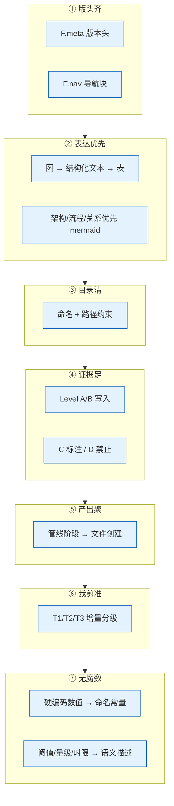
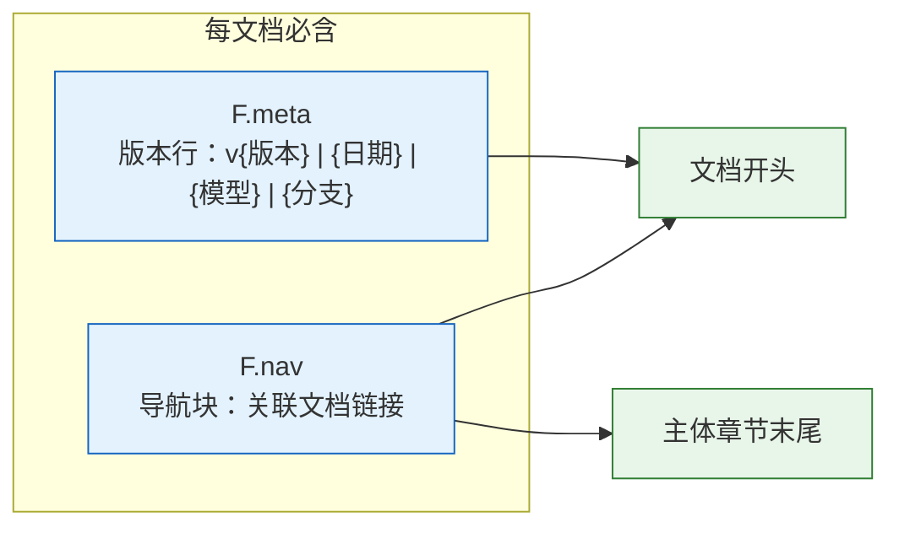
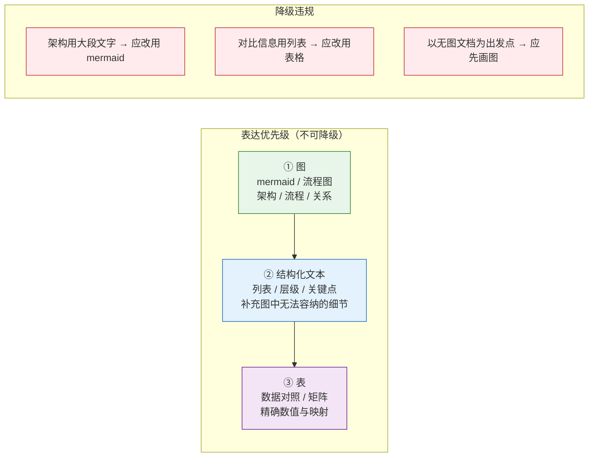
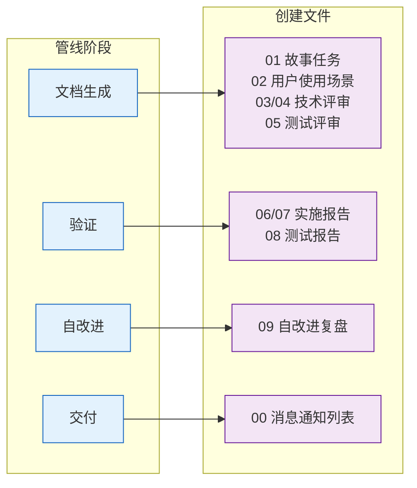
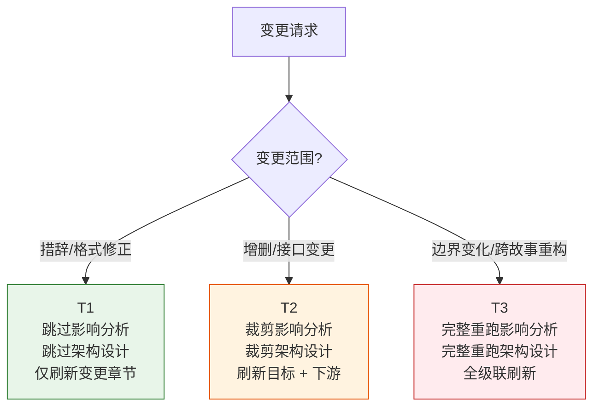
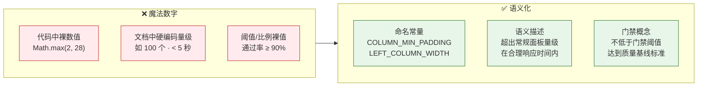
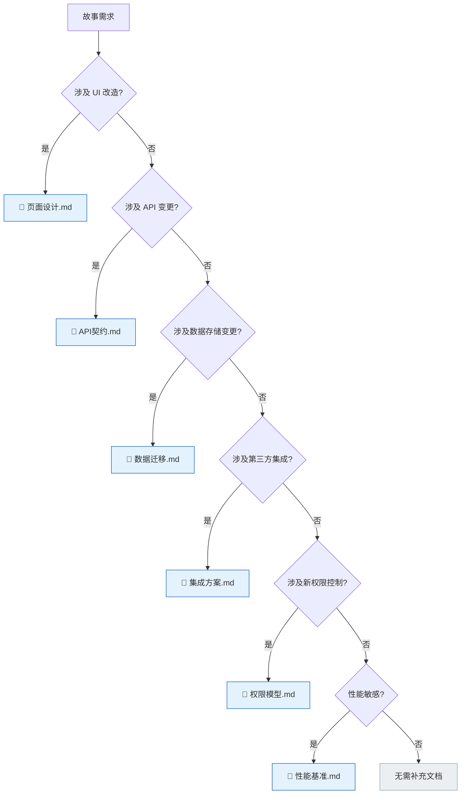
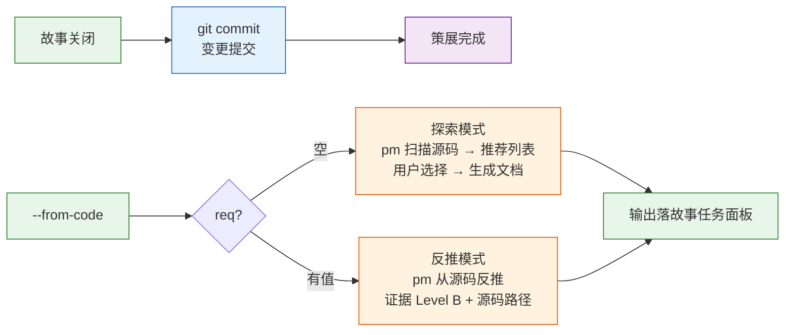

---
paths:
  - "docs/**/*.md"
  - ".claude/formulas.md"
---

# doc-generation

> 文档生成的七条强制约束。表达优先：图 → 结构化文本 → 表。编号即顺序；不可提前创建。

故事文档公式见 [formulas.md](../skills/rui/formulas.md)；目录与数据契约见 [coder.md](../skills/rui/coder.md)。

## 七约束全景

| 约束 | 一句话 | 违反示例 |
|------|--------|---------|
| ① 版头齐 | 每文档必含版本行 + 导航块 | 无 F.meta 版本头直接开写 |
| ② 表达优先 | 图 → 结构化文本 → 表，架构/流程/关系优先 mermaid | 大段文字描述架构，无图 |
| ③ 目录清 | 故事文档按 `<name>/` 独立子目录 | 文档散落在项目根目录 |
| ④ 证据足 | Level A/B 写入，C 标注待补充，D 禁止出现 | "应该有个 UserService" |
| ⑤ 产出聚 | 文件按管线阶段创建，不可提前 | 编码前已写好实施报告 |
| ⑥ 裁剪准 | 增量更新按 T1/T2/T3 自动裁剪管线 | T1 措辞修正跑完整管线 |
| ⑦ 无魔数 | 硬编码数值必须语义化：代码用命名常量，文档用语义描述 | `Math.max(2, 28)` / "最近 5 个故事" |

## 适用

`docs/故事任务面板/` 下的故事文档产出。参考文档公式（F.ref.\*）不受此约束。

目录的创建、删除、重命名由 `/rui-story` 管理，详见 [rui-story SKILL.md](../skills/rui-story/SKILL.md)。文档内容生成由 `/rui doc` 负责。

## ① 版头齐

| # | 规则 | 反例 |
|---|------|------|
| 1 | 版本行必填，占位符 `{...}` 留空即偏差 | `v{版本} \| {日期}` — 未替换占位符 |
| 2 | 主体章节首尾含导航块（F.nav），索引文件除外 | 文章末尾无关联文档链接 |

## ② 表达优先

| # | 规则 | 反例 |
|---|------|------|
| 3 | **图优先** — 架构、流程、组件关系、数据流必须先以 mermaid 图呈现，文字仅补充图中无法容纳的细节 | 一份技术评审无任何 mermaid 图 |
| 4 | **表优于列表** — 需要对照、比较、映射的信息优先用表格，纯枚举或步骤用列表 | 接口参数用文字列表逐行描述而非表格 |
| 5 | **禁止文替图** — 能用图表达的信息，不得仅用文字。文档以图为骨架，文字为血肉 | "系统由 A、B、C 三个模块组成，A 调用 B，B 调用 C…" — 无图 |
| 6 | **图先于文** — 每个章节的 mermaid 图位于该章节文字之前，读者先看结构再读细节 | 先写三段背景，末尾附一个小图 |

## ③ 目录清

| 文档类 | 路径模式 | 编号规则 | 用途 |
|--------|---------|---------|------|
| 故事 | `docs/故事任务面板/<name>/` | 编号前缀 + 补充 | 执行 |

| 约束 | 规则 |
|------|------|
| `<name>` | kebab-case |
| CLI 输入 | `<name>` |
| 03/04/06/07 文件名 | 如 `{project}-03-后端技术评审.md` |

## ④ 证据足

证据等级定义见 [agents/AGENT.md](../agents/AGENT.md#证据等级)（A 已验证 · B 可推导 · C 待补充 · D 禁止）。文档生成阶段遵循同等级规则。

| # | 规则 | 反例 |
|---|------|------|
| 7 | Level A/B 可直接写入；C 标注 `> 待补充`；D 禁止出现 | 无来源断言"系统性能提升 30%" |
| 8 | 不编造未验证的模块名/接口/路径/文件名 | "新增 `/api/v2/users` 接口" — 无源码证据 |
| 9 | 跨文档引用先指向索引文件，再按需深入章节 | 直接链到某个章节，跳过索引 |

## ⑤ 产出聚

| 阶段 | 创建文件 | 条件 |
|------|---------|------|
| 文档生成 | 01 + 02 + 03/04 + 05 + 补充 | 01/用户场景 必创建；03/04 按项目类型 |
| 验证 | 06/07/08 | 有对应技术评审时 |
| 自改进 | 09 | 必创建 |
| 交付 | 00 | 自动追加 |

## ⑥ 裁剪准

| 级别 | 范围 | 影响分析 | 架构设计 | 文档刷新 |
|------|------|---------|---------|---------|
| **T1** | 措辞/格式修正 | 跳过 | 跳过 | 仅变更章节 |
| **T2** | 增删/接口变更 | 裁剪 | 裁剪 | 目标 + 下游 |
| **T3** | 边界变化/跨故事重构 | 完整重跑 | 完整重跑 | 全级联刷新 |

## ⑦ 无魔数

| # | 规则 | 反例 |
|---|------|------|
| 12 | **代码无魔数** — 所有硬编码数值（超时/宽度/数量/阈值）提取为命名常量，常量名语义化 | `Math.max(2, 28 - left.length)` — 2 和 28 无名称 |
| 13 | **文档无魔数** — 配置值（展示条数/量级阈值/时限）用语义描述替代裸数字，或引用命名常量 | "最近修改的 5 个故事" — 5 写死在文档中 |
| 14 | **阈值命名** — 质量门禁通过率、性能时限等阈值定义为门禁概念，不直接写百分比/秒数 | "P1 通过率 ≥ 90%" → 应改为 "P1 通过率不低于门禁阈值" |

### 代码与文档的分工

| 场景 | 代码 | 文档 |
|------|------|------|
| 最近活动展示条数 | `const RECENT_COUNT = 5` | "最近修改的故事列表"（不写死数量） |
| 列格式化宽度 | `const LEFT_COLUMN_WIDTH = 28` | 无需在文档中体现 |
| 边界测试量级 | 测试数据工厂参数 | "超出常规面板量级"（描述场景，不硬编码个数） |
| 响应时限 | `const RESPONSE_TIMEOUT_MS = 5000` | "在合理响应时间内完成" |
| 质量门禁阈值 | `const P1_PASS_RATE = 0.9` | "P1 通过率不低于门禁阈值" |

### 适用范围

- `skills/` 下的帮助脚本（`.mjs`/`.js`/`.ts`）
- `docs/故事任务面板/` 下的故事文档（01–10）
- `rules/` 下的规则文档
- `agents/` 下的 Agent 定义

## 补充文档

| 触发条件 | 生成文档 | 主导 |
|---------|---------|------|
| UI 改造 | 页面设计.md | pm |
| API 变更 | API契约.md | pm |
| 数据存储变更 | 数据迁移.md | pm |
| 第三方集成 | 集成方案.md | pm |
| 新权限控制 | 权限模型.md | pm |
| 性能敏感 | 性能基准.md | pm |

## 策展

| # | 规则 | 说明 |
|---|------|------|
| 10 | 策展阶段必须 git commit | 故事关闭但变更未提交 → 违规 |
| 11a | `--from-code` req 空：探索模式，pm 扫描源码推荐列表 | 用户选择后生成文档 |
| 11b | `--from-code` req 有值：反推模式，证据 Level B | 标注源码路径，缺口标 `> 待补充` |

## 例外

| 场景 | 处理 |
|------|------|
| T1 级变更 | 跳过影响分析与架构设计 |
| 反推命令 | 只读源码，不触发 Gate A/B（见 code-pipeline.md） |

## 生效标志

| 标志 | 未达标的处置 |
|------|------------|
| 版头齐：版本行 + 导航块 | 补 F.meta / F.nav |
| 表达优先：图 → 结构化文本 → 表，架构/流程/关系有 mermaid | 文字改图，列表改表，补齐缺失的 mermaid |
| 目录清：`<name>/` 合规 | 移动文件到正确目录 |
| 证据足：无 Level D 内容 | 删 D 级内容，补 C 标注或查证升级 |
| 产出聚：文件按阶段创建，不提前 | 删除提前创建的文件 |
| 策展完成：git commit 已提交 | 执行 git commit |
| 基线溯源：03-09 均有 §0 基线溯源且链接有效 | 补基线溯源表 |
| 基线声明：01+02 均有 §0 基线声明且无禁止内容 | 补基线声明或移除禁止内容 |
| 无魔数：代码中裸数值已提取为命名常量，文档中硬编码量级/阈值已语义化 | 代码提取常量，文档改写语义描述 |
