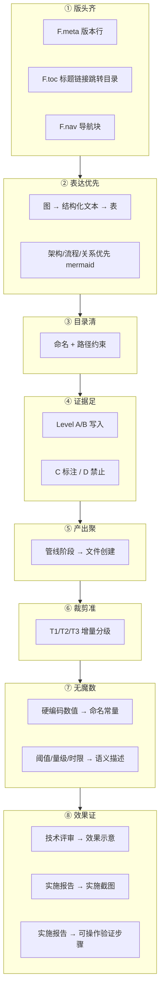
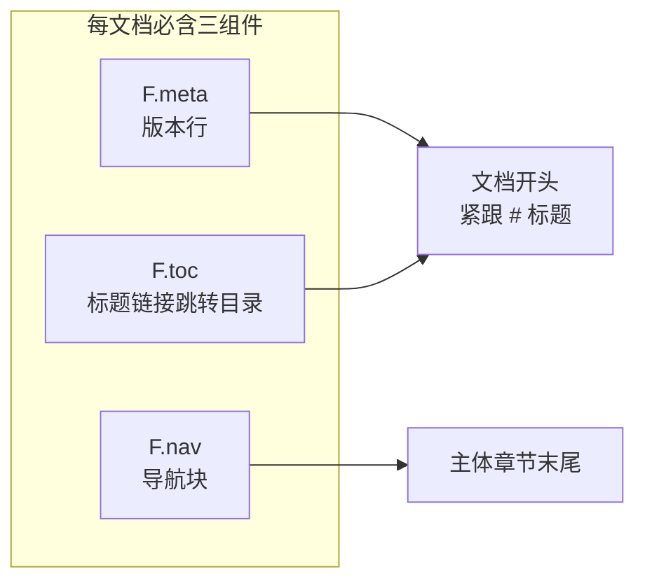
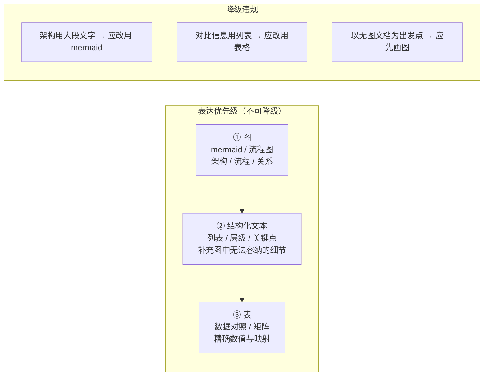
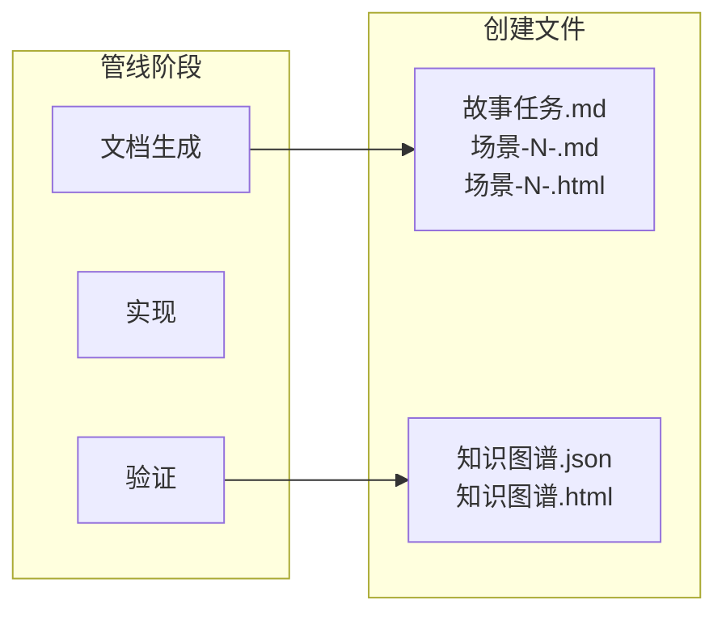
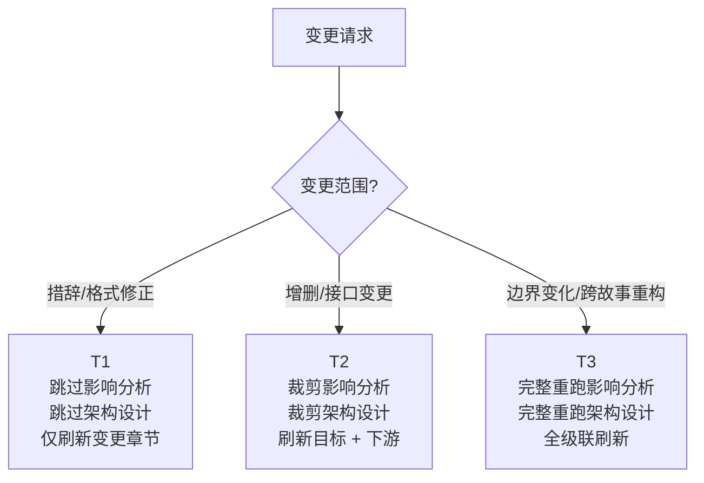
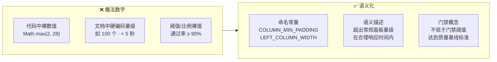
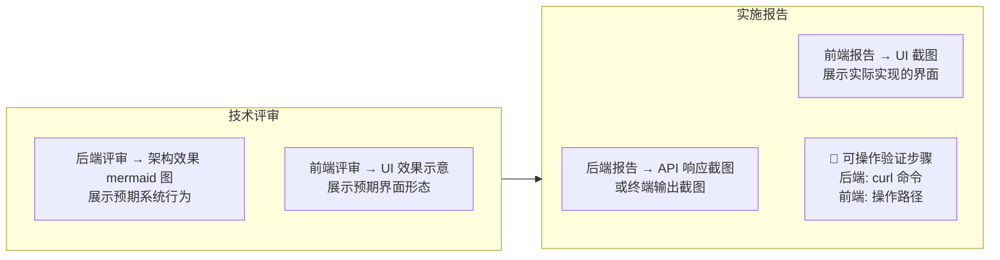
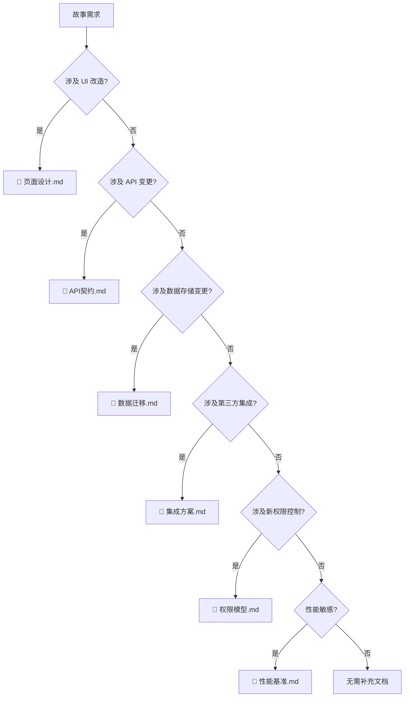
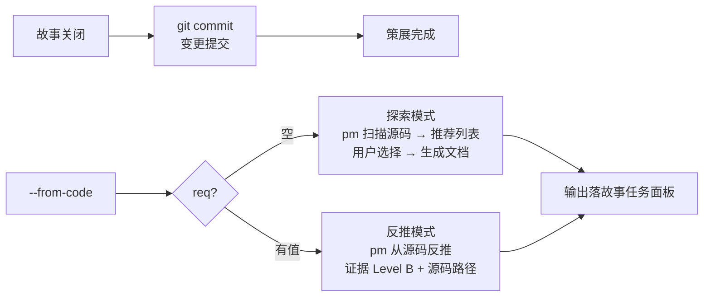

---
paths:
  - "docs/**/*.md"
  - ".claude/formulas.md"
---

# doc-generation

> 文档生成的八条强制约束。表达优先：图 → 结构化文本 → 表。编号即顺序；不可提前创建。


[铁律](#iron-law) · [八约束全景](#eight-constraints) · [适用](#scope) · [① 版头齐](#meta-nav) · [② 表达优先](#diagram-first) · [③ 目录清](#dir-clean) · [④ 证据足](#evidence) · [⑤ 产出聚](#output-cohesion) · [⑥ 裁剪准](#precision-cut) · [⑦ 无魔数](#no-magic) · [⑧ 效果证](#proof) · [补充文档](#supplementary) · [策展](#curation) · [例外](#exceptions) · [生效标志](#effectiveness)

<a id="iron-law"></a>
## 铁律

```
NO MAGIC NUMBERS — EVERY NUMERIC LITERAL MUST BE SEMANTICALLY NAMED
```

魔法数字是最基本的反模式之一。代码中裸数值必须提取为命名常量，文档中硬编码量级/阈值/时限必须改写为语义描述。此约束不可妥协，违反即 P0。

| 铁律 | 源于 | 含义 | 违反信号 |
|------|------|------|---------|
| **无魔数** | 惜注意 | 代码裸数值→命名常量，文档硬编码量级→语义描述 | `Math.max(2, 28)`、文档写"最近 5 个"、"通过率 ≥ 90%" |

故事文档公式见 [formulas.md](../skills/rui/formulas.md)；目录与数据契约见 [coder.md](../skills/rui/coder.md)。

<a id="eight-constraints"></a>
## 八约束全景



| 约束 | 一句话 | 违反示例 |
|------|--------|---------|
| ① 版头齐 | 每文档必含版本行 + 标题链接跳转目录 + 导航块，字段可验证，链接可闭合 | 无 F.meta 版本行 / 无 F.toc 目录 / 导航块链接指向不存在文件 |
| ② 表达优先 | 图 → 结构化文本 → 表，架构/流程/关系优先 mermaid | 大段文字描述架构，无图 |
| ③ 目录清 | 故事文档按 `<name>/` 独立子目录 | 文档散落在项目根目录 |
| ④ 证据足 | Level A/B 写入，C 标注待补充，D 禁止出现 | "应该有个 UserService" |
| ⑤ 产出聚 | 文件按管线阶段创建，不可提前 | 编码前已写好实施报告 |
| ⑥ 裁剪准 | 增量更新按 T1/T2/T3 自动裁剪管线 | T1 措辞修正跑完整管线 |
| ⑦ 无魔数 | 硬编码数值必须语义化：代码用命名常量，文档用语义描述 | `Math.max(2, 28)` / "最近 5 个故事" |
| ⑧ 效果证 | 技术评审必含效果示意，实施报告必含截图+可操作验证步骤（后端 curl，前端操作路径） | 实施报告只有文字无截图无验证命令 |

<a id="scope"></a>
## 适用

`docs/故事任务面板/` 下的故事文档产出。`rules/` `agents/` 规则与角色定义不受此约束。

目录的创建、删除、重命名由 `/rui-story` 管理，详见 [rui-story SKILL.md](../skills/rui-story/SKILL.md)。文档内容生成由 `/rui doc` 负责。

<a id="meta-nav"></a>
## ① 版头齐



三组件位序不可变：

```
# 文档标题
> F.meta — 版本行            ← 文档开头，紧跟标题
  F.toc — 标题链接跳转目录    ← 文档开头，紧跟 F.meta，无前缀无标签

... 正文 ...

> F.nav — 导航块             ← 主体章节末尾（生效标志之前）
```

### F.meta 版本行

置于文档标题（`#`）之后、F.toc 之前。格式：

```markdown
> v{版本} | {YYYY-MM-DD} | {模型名} | feat/{name}
```

| 字段 | 说明 | 示例 | 必填 |
|------|------|------|:---:|
| `v{版本}` | 项目当前版本号 | `v1.6.6` | ✓ |
| `{日期}` | 文档生成/更新日期，ISO 8601 | `2026-05-21` | ✓ |
| `{模型}` | 生成该文档的模型名 | `Claude Opus 4.7` | ✓ |
| `{分支}` | 当前 git 分支名 | `feat/user-login` | ✓ |

**约束**：
- 占位符 `{...}` 留空即偏差（`#1`）
- 版本号必须与 `plugin.json` / `CLAUDE.md` 一致
- 分支名必须与实际 git 分支一致，不可凭记忆填写

### F.toc 标题链接跳转目录

置于 F.meta 之后、正文第一个 `##` 之前。列出文档内所有 `##` 级标题链接，以 `·` 分隔单行排布，无前缀无标签。格式：

```markdown
[§1 概述](#sec1) · [§2 设计](#sec2) · [§3 测试](#sec3) · [§4 附录](#sec4)
```

| 规则 | 说明 |
|------|------|
| 定位 | F.meta 之后，正文首个 `##` 之前，独占一行 |
| 覆盖 | 文档内全部 `##` 级标题，不遗漏 |
| 锚点 | 统一使用 `<a id="..."></a>` 显式锚点（纯 ASCII kebab-case），置于目标 `##` 标题上方 |
| 格式 | 单行，纯 `[标题](#id)` · `[标题](#id)` ...，无前缀无标签 |
| 排列 | 按标题在文档中的出现顺序 |
| 豁免 | `README.md` / `CLAUDE.md` 等索引文件不要求 F.toc |

### F.nav 导航块

置于主体章节末尾（生效标志之前）。格式：

```markdown
---

> 关联文档：[上一篇](../<prev>/) · [下一篇](../<next>/) · [文档索引](../)
> 上游基线：[故事任务.md](./故事任务.md) · [场景-1-<slug>.md](./场景-1-<slug>.md)
> 生成模型：{模型名} | 生成日期：{YYYY-MM-DD}
```

| 字段 | 说明 | 必填 |
|------|------|:---:|
| 关联文档 | 上一篇/下一篇故事文档链接或索引链接 | ✓ |
| 上游基线 | 本文档所依赖的上游文档（如故事任务.md → 场景-N-<slug>.md 的依赖链） | ✓ |
| 生成模型 | 生成该文档的模型名（与 F.meta 一致） | ✓ |
| 生成日期 | ISO 8601 日期（与 F.meta 一致） | ✓ |

**约束**：
- 索引文件（README.md / CLAUDE.md）不要求导航块（`#2`）
- 基线文档（故事任务.md）的导航块侧重下游链接到场景文档
- 场景文档（场景-N-<slug>.md）的导航块侧重上游溯源到基线
- 链接目标必须存在，不可指向不存在的文件

| # | 规则 | 反例 |
|---|------|------|
| 1 | 版本行必填，占位符 `{...}` 留空即偏差 | `v{版本} \| {日期}` — 未替换占位符 |
| 2 | 主体章节首尾含导航块（F.nav），索引文件除外 | 文章末尾无关联文档链接 |
| 3 | 版本行字段必须可验证：版本号对 `plugin.json`、分支对 `git branch` | 分支写 `feat/user-login` 但实际在 `main` |
| 4 | 导航块上游基线链必须闭合：每个链接指向已存在的文档 | 指向 `./使用场景.md` 但该文件不存在（已迁移至 场景-N-<slug>.md） |
| 5 | F.toc 必须覆盖文档内全部 `##` 级标题，无一遗漏 | 文档有 8 个 `##` 但 F.toc 只列出 5 个 |
| 6 | F.toc 锚点必须为纯 ASCII kebab-case，使用 `<a id>` 显式标记 | 锚点含中文或 Unicode 符号导致跳转失效 |

<a id="diagram-first"></a>
## ② 表达优先



| # | 规则 | 反例 |
|---|------|------|
| 3 | **图优先** — 架构、流程、组件关系、数据流必须先以 mermaid 图呈现，文字仅补充图中无法容纳的细节 | 一份技术评审无任何 mermaid 图 |
| 4 | **表优于列表** — 需要对照、比较、映射的信息优先用表格，纯枚举或步骤用列表 | 接口参数用文字列表逐行描述而非表格 |
| 5 | **禁止文替图** — 能用图表达的信息，不得仅用文字。文档以图为骨架，文字为血肉 | "系统由 A、B、C 三个模块组成，A 调用 B，B 调用 C…" — 无图 |
| 6 | **图先于文** — 每个章节的 mermaid 图位于该章节文字之前，读者先看结构再读细节 | 先写三段背景，末尾附一个小图 |

### Mermaid 编写规范

> mermaid 语法错误是文档退化的重要来源。以下规则确保图在任何 mermaid 版本下可正常渲染。

| # | 规则 | 错误 | 正确 |
|---|------|------|------|
| M1 | **节点标签必须引号包裹** — 含空格、特殊字符、中文的标签必须 `[""]` | `A[用户输入]` | `A["用户输入"]` |
| M2 | **避免裸 `&`** — `&` 在 mermaid 中可能被解释为 HTML 实体边界，含 `&` 的标签必须引号包裹 | `A[D0 & D7]` | `A["D0 & D7"]` |
| M3 | **避免 `()` 在节点标签中** — 圆括号是 mermaid 形状语法，含 `()` 的文本必须引号包裹 | `A[init()]` | `A["init()"]` |
| M4 | **direction 必须在 subgraph 内声明** — `direction LR/TB` 仅对当前 subgraph 生效 | 在顶层声明 `direction LR` 期望影响 subgraph | 在每个 subgraph 内独立声明 |
| M5 | **style 目标 ID 必须精确匹配** — 节点 ID 不含引号和特殊字符 | `style A["xx"] ...` | `style A ...`（只写 ID 部分）|
| M6 | **禁止 HTML 标签** — `<br/>`、`<name>` 等即使引号包裹也可能被 mermaid 解析器误判 | `A["用户<br/>输入"]` | `A["用户 输入"]` 或拆分节点 |
| M7 | **简短的箭头标签** — 箭头上的标签（`-->|text|`）应简短（≤ 20 字符），避免换行和特殊字符 | `-->|"用户点击提交按钮后触发"|` | `-->|"点击提交"|` |
| M8 | **使用 htmlLabels: true** — mermaid 初始化时必须设置 `htmlLabels: true` 以支持富文本节点 | 未设置 htmlLabels | `mermaid.initialize({htmlLabels: true})` |

**验证规则**：任何包含 mermaid 图的文件在提交前必须通过以下检查：
- 浏览器控制台无 mermaid 语法错误
- 所有 `flowchart`/`graph` 图中引用的节点 ID 均在图中定义
- subgraph 内的 `direction` 声明语法正确（`direction LR` 或 `direction TB`）

<a id="dir-clean"></a>
## ③ 目录清


| 文档类 | 路径模式 | 命名规则 | 用途 |
|--------|---------|---------|------|
| 故事 | `docs/故事任务面板/<name>/` | 文件含项目名前缀 | 执行 |

| 约束 | 规则 |
|------|------|
| `<name>` | 纯语义 kebab-case（如 `user-login`），不加项目名前缀 |
| CLI 输入 | `<name>` |
| 场景文档文件名 | 如 `场景-1-<slug>.md`（含 §0-§4 全部生命周期节） |

<a id="evidence"></a>
## ④ 证据足

证据等级定义见 [agents/AGENT.md](../agents/AGENT.md#证据等级)（A 已验证 · B 可推导 · C 待补充 · D 禁止）。文档生成阶段遵循同等级规则。

| # | 规则 | 反例 |
|---|------|------|
| 7 | Level A/B 可直接写入；C 标注 `> 待补充`；D 禁止出现 | 无来源断言"系统性能提升 30%" |
| 8 | 不编造未验证的模块名/接口/路径/文件名 | "新增 `/api/v2/users` 接口" — 无源码证据 |
| 9 | 跨文档引用先指向索引文件，再按需深入章节 | 直接链到某个章节，跳过索引 |

<a id="output-cohesion"></a>
## ⑤ 产出聚



| 阶段 | 创建文件 | 条件 |
|------|---------|------|
| 文档生成 | 故事任务.md + 场景-N-<slug>.md（§0 技术评审 · §1 测试设计） + 场景-N-<slug>.html（架构图） | 故事任务.md 必创建 |
| 实现 | 场景-N-<slug>.md（§2 实施报告） | 由 coder 按模块逐次写入 |
| 验证 | 场景-N-<slug>.md（§3 测试报告 · §4 自改进） + 知识图谱.json + 知识图谱.html | 由 tester 写入 |
| 交付 | 交付收口（见 delivery-gate.md） | — |

<a id="precision-cut"></a>
## ⑥ 裁剪准



| 级别 | 范围 | 影响分析 | 架构设计 | 文档刷新 |
|------|------|---------|---------|---------|
| **T1** | 措辞/格式修正 | 跳过 | 跳过 | 仅变更章节 |
| **T2** | 增删/接口变更 | 裁剪 | 裁剪 | 目标 + 下游 |
| **T3** | 边界变化/跨故事重构 | 完整重跑 | 完整重跑 | 全级联刷新 |

<a id="no-magic"></a>
## ⑦ 无魔数



| # | 规则 | 反例 |
|---|------|------|
| 12 | **代码无魔数** — 所有硬编码数值（超时/宽度/数量/阈值）提取为命名常量，常量名语义化 | `Math.max(2, 28 - left.length)` — 2 和 28 无名称 |
| 13 | **文档无魔数** — 配置值（展示条数/量级阈值/时限）用语义描述替代裸数字，或引用命名常量 | "最近修改的 5 个故事" — 5 写死在文档中 |
| 14 | **阈值命名** — 质量门禁通过率、性能时限等阈值定义为门禁概念，不直接写百分比/秒数 | "P1 通过率 ≥ 90%" → 应改为 "P1 通过率不低于门禁阈值" |

### 代码与文档的分工

| 场景 | 代码 | 文档 |
|------|------|------|
| 最近活动展示条数 | `const RECENT_COUNT = 5` | "最近修改的故事列表"（不写死数量） |
| 列格式化宽度 | `const LEFT_COLUMN_WIDTH = 28` | 无需在文档中体现 |
| 边界测试量级 | 测试数据工厂参数 | "超出常规面板量级"（描述场景，不硬编码个数） |
| 响应时限 | `const RESPONSE_TIMEOUT_MS = 5000` | "在合理响应时间内完成" |
| 质量门禁阈值 | `const P1_PASS_RATE = 0.9` | "P1 通过率不低于门禁阈值" |

### 适用范围

- `skills/` 下的帮助脚本（`.mjs`/`.js`/`.ts`）
- `docs/故事任务面板/` 下的故事文档（01–10）
- `rules/` 下的规则文档
- `agents/` 下的 Agent 定义

<a id="proof"></a>
## ⑧ 效果证



| # | 规则 | 反例 |
|---|------|------|
| 15 | **评审有效果** — 技术评审必须包含效果示意 mermaid 图，展示实现后的预期系统行为与数据流（后端）或预期界面形态（前端） | 技术评审只有接口列表和组件树，无效果总览图 |
| 16 | **报告有截图** — 实施报告必须包含实际 API 响应截图或终端运行输出截图（后端）或实际 UI 截图（前端）。截图需附简要说明 | 实施报告无任何截图，仅文字描述"已完成" |
| 17 | **报告可操作** — 实施报告必须包含每个接口的 curl 验证命令（含完整 URL、请求体、预期响应）（后端）或从入口到目标页面的操作路径（含点击序列与预期显示）（前端） | "API 已通过测试" — 无 curl 命令可供复现；"页面正常显示" — 无操作路径可供验证 |

### 效果图类型指南

| 文档 | 效果图类型 | 最低数量 | 内容要求 |
|------|-----------|---------|---------|
| 技术评审（后端） | mermaid flowchart / sequenceDiagram | ≥ 1 | 展示核心业务流经各服务/模块的完整路径与关键决策点 |
| 技术评审（前端） | mermaid 组件交互图 / UI 线框图 | ≥ 1 | 展示核心用户操作对应的组件渲染路径与状态变化 |
| 实施报告（后端） | 终端截图（含 curl 请求+响应） | ≥ 1 张/接口 | 完整展示请求命令与服务器返回结果 |
| 实施报告（前端） | UI 截图 | ≥ 1 张/场景 | 展示实际渲染的页面，覆盖正常态 + 关键状态（空/错误/加载） |

### 可操作验证步骤规范

| 文档 | 验证格式 | 必含要素 |
|------|---------|---------|
| 实施报告（后端） | fenced code block (`bash`)，每接口一块 | 完整 curl 命令（含 URL、method、headers、body）、预期响应摘要。不可用 `localhost`，使用可配置的基础 URL 占位符 `${BASE_URL}` |
| 实施报告（前端） | 编号操作步骤列表 | 起始页面 → 每步操作（点击/输入）→ 预期显示。步骤可被独立复现，不依赖上下文记忆 |

<a id="supplementary"></a>
## 补充文档



| 触发条件 | 生成文档 | 主导 |
|---------|---------|------|
| UI 改造 | 页面设计.md | pm |
| API 变更 | API契约.md | pm |
| 数据存储变更 | 数据迁移.md | pm |
| 第三方集成 | 集成方案.md | pm |
| 新权限控制 | 权限模型.md | pm |
| 性能敏感 | 性能基准.md | pm |

<a id="curation"></a>
## 策展



| # | 规则 | 说明 |
|---|------|------|
| 10 | 策展阶段必须 git commit | 故事关闭但变更未提交 → 违规 |
| 11a | `--from-code` req 空：探索模式，pm 扫描源码推荐列表 | 用户选择后生成文档 |
| 11b | `--from-code` req 有值：反推模式，证据 Level B | 标注源码路径，缺口标 `> 待补充` |

<a id="exceptions"></a>
## 例外

| 场景 | 处理 |
|------|------|
| T1 级变更 | 跳过影响分析与架构设计 |
| 反推命令 | 只读源码，不触发验证阶段（见 code-pipeline.md） |

<a id="effectiveness"></a>
## 生效标志


| 标志 | 未达标的处置 |
|------|------------|
| 版头齐：版本行 + F.toc + 导航块，字段可验证，链接可闭合 | 补 F.meta / F.toc / F.nav，修正不一致字段，补失效链接 |
| 表达优先：图 → 结构化文本 → 表，架构/流程/关系有 mermaid | 文字改图，列表改表，补齐缺失的 mermaid |
| 目录清：`<name>/` 合规 | 移动文件到正确目录 |
| 证据足：无 Level D 内容 | 删 D 级内容，补 C 标注或查证升级 |
| 产出聚：文件按阶段创建，不提前 | 删除提前创建的文件 |
| 策展完成：git commit 已提交 | 执行 git commit |
| 基线溯源：技术评审～自改进复盘 均有 §0 基线溯源且链接有效 | 补基线溯源表 |
| 无魔数：代码中裸数值已提取为命名常量，文档中硬编码量级/阈值已语义化 | 代码提取常量，文档改写语义描述 |
| 效果证：§0 技术评审有效果示意，§2 实施报告有截图+可操作验证步骤 | 补效果图，补 curl/操作步骤 |
