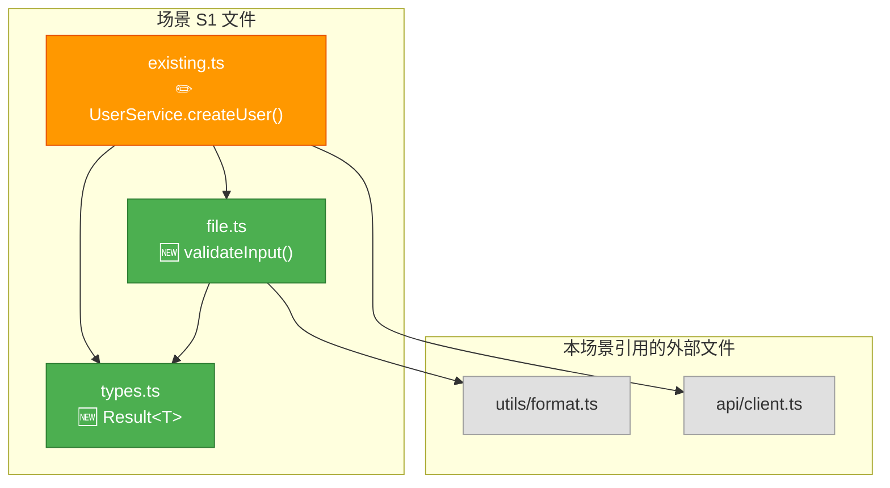
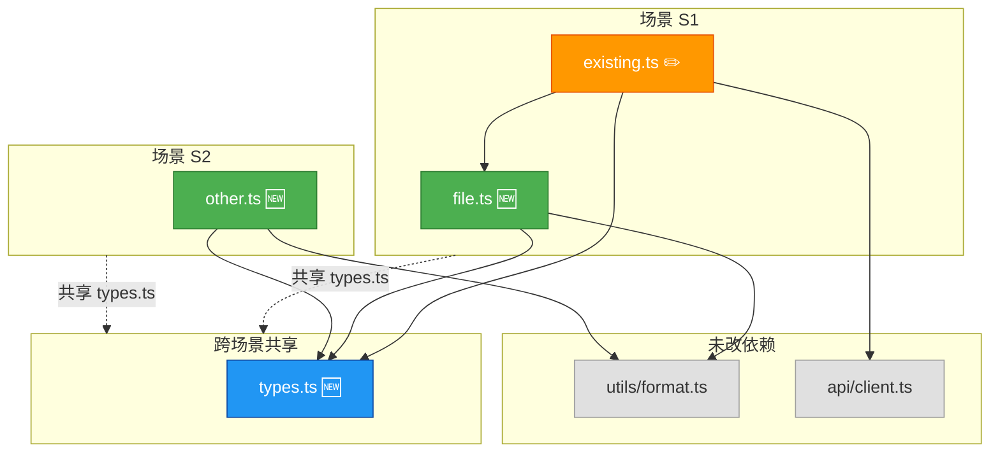
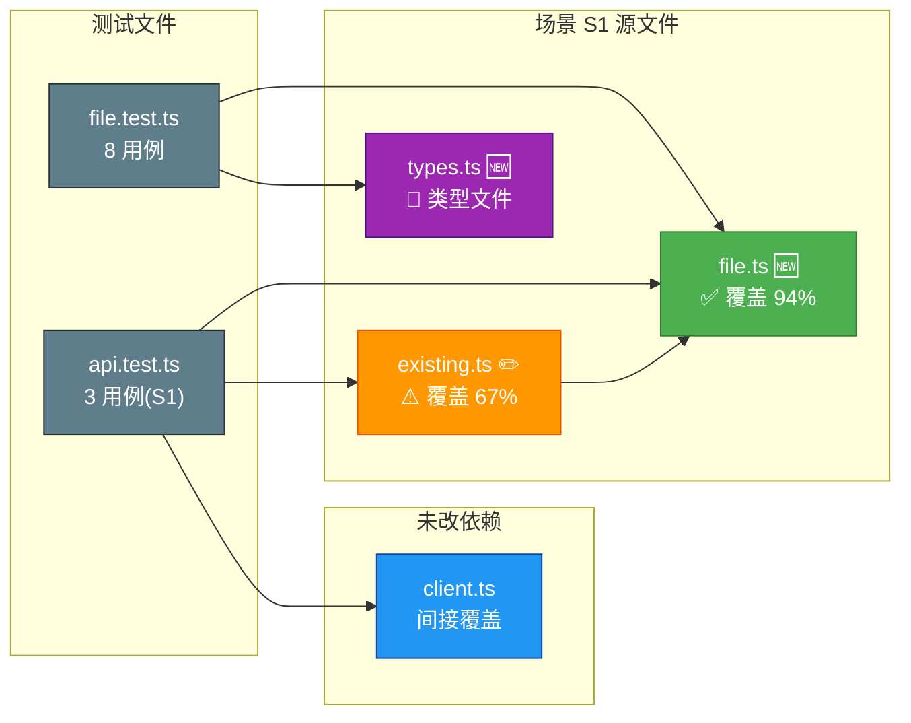
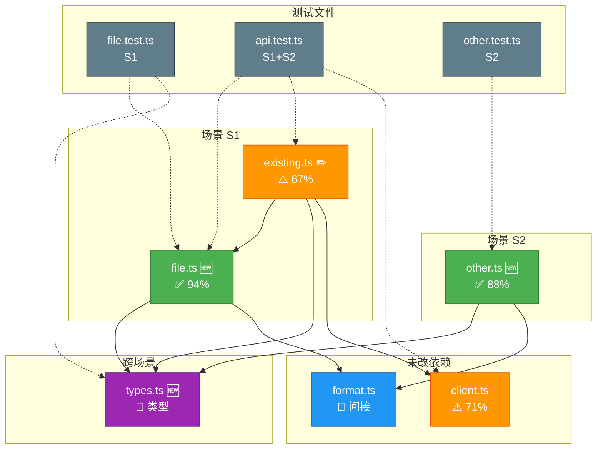

---
paths:
  - "docs/**/*.md"
  - ".claude/formulas.md"
---

# doc-generation

> 文档生成的八条强制约束 + 故事文档公式。表达优先：图 → 结构化文本 → 表。编号即顺序；不可提前创建。
>
> 公式细节见此文件后半部。目录与数据契约见 [coder.md](../skills/rui/coder.md)。

[铁律](#铁律) · [八约束](#八约束) · [故事目录](#故事目录) · [文档公式](#文档公式) · [补充文档](#补充文档) · [生效标志](#生效标志)

## 铁律

```
NO MAGIC NUMBERS — EVERY NUMERIC LITERAL MUST BE SEMANTICALLY NAMED
```

| 铁律 | 源于 | 含义 |
|------|------|------|
| **无魔数** | 惜注意 | 代码裸数值→命名常量，文档硬编码量级→语义描述 |

## 八约束

| # | 约束 | 一句话 | 违反示例 |
|---|------|--------|---------|
| ① | **版头齐** | 每文档必含版本行 + F.toc + 导航块 | 无版本行 / 导航链接指向不存在文件 |
| ② | **表达优先** | 图 → 结构化文本 → 表，架构优先 mermaid | 大段文字描述架构无图 |
| ③ | **目录清** | `<name>/` 独立子目录，kebab-case | 文档散落根目录 |
| ④ | **证据足** | Level A/B 写入，C 标待补充，D 禁止 | "应该有个 UserService" |
| ⑤ | **产出聚** | 按阶段创建，不可提前 | 编码前写好实施报告 |
| ⑥ | **裁剪准** | T1/T2/T3 增量分级 | T1 措辞修正跑完整管线 |
| ⑦ | **无魔数** | 硬编码→命名常量/语义描述 | `Math.max(2, 28)` |
| ⑧ | **效果证** | 技术评审有效果示意，实施报告有截图+可操作验证 | 实施报告只有文字 |

### ① 版头齐

每文档三组件，位序不可变：

```
# 文档标题
> v{版本} | {日期} | {模型} | feat/{name}
> **导航**: [← 上一篇](./prev.md) · [下一篇 →](./next.md)

[§1](#sec1) · [§2](#sec2) · [§3](#sec3)

<a id="sec1"></a>
## §1 标题一
... 正文 ...

<a id="sec2"></a>
## §2 标题二
... 正文 ...
```

| 组件 | 位置 | 约束 |
|------|------|------|
| F.meta | 标题后首行 | `v{版本} \| {日期} \| {模型} \| {分支}`，占位符留空=偏差 |
| F.nav | F.meta 后，F.toc 前 | 单行 `> **导航**: [← 前驱](./prev.md) · [后继 →](./next.md)`，链接必须存在 |
| F.toc | F.nav 后 | 单行 `·` 分隔，覆盖全部 `##` 标题；每个目标标题前放置 `<a id="secN">` 显式锚点，确保点击链接即滚动定位 |

### ② 表达优先

图 → 结构化文本 → 表，不可降级。架构/流程/关系优先 mermaid，文字仅补图中无法容纳的细节。

### ③ 目录清

```
docs/故事任务面板/<name>/
```
`<name>` = 纯 kebab-case，不加项目名前缀。

### ④ 证据足

| Level | 含义 | 写入规则 |
|-------|------|---------|
| A | 已验证（附路径） | 直接写入 |
| B | 可推导 | 标注推导链 |
| C | 未验证 | `> 待补充` |
| D | 禁止 | 视为幻觉 |

### ⑤ 产出聚

| 阶段 | 创建文件 | 条件 |
|------|---------|------|
| 文档生成 | 故事任务 + 使用场景 + 技术评审 + 测试设计 | 故事任务/使用场景必创建 |
| 验证 | 实施报告 + 测试报告 | 有对应技术评审时 |
| 自改进 | 自改进复盘 | 必创建 |

### ⑥ 裁剪准

| 级别 | 范围 | 影响分析 | 架构设计 | 文档刷新 |
|------|------|:---:|:---:|------|
| T1 | 措辞/格式修正 | 跳过 | 跳过 | 仅变更章节 |
| T2 | 增删/接口变更 | 裁剪 | 裁剪 | 目标 + 下游 |
| T3 | 边界变化/跨故事 | 完整 | 完整 | 全级联刷新 |

### ⑦ 无魔数

代码裸数值→命名常量，文档硬编码量级/阈值→语义描述。

### ⑧ 效果证

| 文档 | 效果图 | 最低 | 验证格式 |
|------|--------|:---:|------|
| 技术评审(前端) | **布局线框** mermaid/ASCII | ≥1 | 展示页面布局、组件位置、交互区域 |
| 技术评审(后端) | **curl 命令** | ≥1/接口 | fenced `bash` 块，`${BASE_URL}` 占位，含预期响应 |
| 实施报告(后端) | 终端截图(含 curl) | 1/接口 | `${BASE_URL}` fenced bash |
| 实施报告(前端) | UI 截图(正常+关键态) | 1/场景 | 编号操作步骤，可独立复现 |

**前端必须含布局线框** — 技术评审 §1 系统架构中，前端/全栈项目必须包含页面布局线框（mermaid 或 ASCII），标注组件位置与交互区域。
**API 必须含 curl** — 技术评审 §2 API 设计中，后端/全栈项目必须为每个接口提供完整 curl 命令（含 method、headers、body、预期响应）。

---

## 故事目录

```
docs/故事任务面板/<name>/
├── 故事任务.md          ← pm · 问题空间基线
├── 使用场景.md          ← pm · 用户空间基线
├── 技术评审.md          ← coder · 技术方案
├── 测试设计.md          ← tester · Gate A 交接
├── 实施报告.md          ← coder · 验证
├── 测试报告.md          ← tester · 验证
├── 自改进复盘.md        ← self-improve · 改进
├── {专题}.md            ← 按需补充
```

**双基线**：故事任务（WHAT & WHY）+ 使用场景（WHO & HOW）是问题/用户空间基线，所有下游文档必须显式溯源至基线。

**导航链**：故事任务 → 使用场景 → 技术评审 → 测试设计 → 实施报告 → 测试报告 → 自改进复盘

---

## 文档公式

> 每文档必含：F.meta 版本行 · F.toc 目录 · F.nav 导航 · F.value 主要价值（≥4 条 emoji 前缀行）· 回溯链（来源引用 + 变更记录）

### 故事任务 · pm

```
# <项目>-<故事> · 故事任务

> v{版本} | {日期} | {模型} | feat/{name}
  [§1 需求概述](#sec1) · [§2 功能点](#sec2) · [§3 范围边界](#sec3) · [§4 任务拆分](#sec4) · [§5 验收标准](#sec5) · [§6 风险与假设](#sec6)

### 主要价值
- 🎯 ...
- 🔒 ...
- ⚡ ...
- 📊 ...

## §1 需求概述
≤3 句说清：做什么 / 给谁 / 为什么。附 mermaid 效果示意（当前痛点→目标状态→里程碑，≥5 节点）。

## §2 功能点
| FP# | 功能 | 优先级 | 关联场景 | 验收标准 |

## §3 范围边界
| # | 条目 | 包含/不包含 | 原因 |

## §4 任务拆分
| # | 任务 | Agent | 门禁 | 交接信号 | 依赖 |

## §5 验收标准
| SC# | 验收项 | 目标值 | 验证方式 |

## §6 风险与假设
| # | 风险 | 可能性 | 影响 | 缓解 |
```

**约束**：禁止含技术栈名/API 路由/组件名/文件路径/§0 基线声明节（自身即基线）。

### 使用场景 · pm

```
# <项目>-<故事> · 使用场景

> v{版本} | {日期} | {模型} | feat/{name}
  [§1 角色](#sec1) · [§2 场景](#sec2)

### 主要价值
...

## §1 角色
| 角色 | 职责 | 关注点 |

## §2 场景
每场景含 mermaid flowchart。格式：场景名 / 角色 / 前置 / 操作流 / 后置 / 异常。
```

**约束**：禁止含技术术语/组件名/API 端点/§0 基线声明节。

### 技术评审 · coder

```
# <项目>-<故事> · 技术评审

> v{版本} | {日期} | {模型} | feat/{name}
  [§0 基线溯源](#sec0) · [§1 系统架构](#sec1) · [§2 设计](#sec2) · ... · [§7 评审清单](#sec7)

### 主要价值
...

## §0 基线溯源
| 基线文件 | 关键条款 | 本次适用性 | 偏差 |
覆盖：故事任务 / 使用场景 / CLAUDE.md / 5 rules / 3 agents

## §1 系统架构
效果示意 mermaid（≥5 节点）。项目类型裁剪章节：
- 纯前端：**布局线框（必含）**· 组件树 · 状态管理 · 路由 · 交互流
- 纯后端：API 设计 · 数据模型 · 中间件链 · 性能
- 全栈：全部章节 + 前后端契约对齐

## §2 API 设计（后端/全栈必含）
每个接口必须提供完整 curl 命令（`bash` fenced 块，`${BASE_URL}` 占位符，含 method、headers、body、预期响应摘要）。

## §7 评审清单
全部 ✅ 方进下一文档。
```

### 测试设计 · tester

```
# <项目>-<故事> · 测试设计

> v{版本} | {日期} | {模型} | feat/{name}
  [§0 基线溯源](#sec0) · [§1 测试范围](#sec1) · [§2 用例](#sec2) · [§3 Gate A 交接](#sec3)

## §1 测试范围
| 维度 | 覆盖 | 不覆盖(原因) |

## §2 用例
| TC# | 场景 | 前置 | 步骤 | 预期 | 优先级 | 覆盖 FP# |

## §3 Gate A 交接信号
测试方案就绪 → coder 可开始实现。Gate A 未通过不编码。
```

### 实施报告 · coder

> 与使用场景 §2 中的场景一一对应。**每个场景是一个自包含的追踪单元**——读者无需跳转其他节即可完整理解该场景的源文件、依赖图、测试覆盖和验证方式。全局依赖图和测试映射由各场景数据汇总而成。

```
# <项目>-<故事> · 实施报告

> v{版本} | {日期} | {模型} | feat/{name}
  [§1 实施概览](#sec1) · [§2 逐场景实施](#sec2) · [§3 跨场景源码全景](#sec3) · [§4 测试文件全景](#sec4) · [§5 可操作验证](#sec5)

### 主要价值
- 🔗 每场景自包含：源文件 + 依赖图 + 测试 + 验证，无需跳转即可通读
- 📊 场景内依赖图可独立理解该场景的文件拓扑，场景间通过 §3 关联
- 🧪 测试→源文件映射可精确回答"这个文件被哪些测试覆盖"
- 🔍 深度探查基于 Read/Grep 事实基线，证据 Level A

<a id="sec1"></a>
## §1 实施概览

逐项对比技术评审设计 vs 实际实现。场景→文件速览矩阵。

| # | 设计项（技术评审引用） | 实际实现 | 偏差 | 原因 | 影响 | 优先级 |
|---|----------------------|---------|------|------|------|--------|
| 1 | <技术评审 §X 条款> | <实际做法> | 无/有 | — | — | — |

### 场景 → 文件速览

> 一表纵览全故事场景与源文件对应关系。

| 场景 | 新增文件 | 修改文件 | 未改依赖 | 测试文件 | 状态 |
|------|---------|---------|---------|---------|------|
| S1: <名> | `file.ts`, `types.ts` | `existing.ts` | `format.ts`, `client.ts` | `file.test.ts`, `api.test.ts` | ✅ |
| S2: <名> | `other.ts` | — | `format.ts` | `other.test.ts`, `api.test.ts` | ✅ |

<a id="sec2"></a>
## §2 逐场景实施

> 每个场景是**自包含追踪单元**。场景内 §2.1–§2.7 形成完整闭环：场景描述 → 源文件 → 依赖图 → P0 审查 → 设计偏差 → 测试清单 → 效果验证。

### 场景 S1: <使用场景 §2 场景 1 的场景名>

**场景概述**：<1 句复述场景内容，引用使用场景对应条目>  
**关联 FP#**：FP1, FP2  
**关联 SC#**：SC1, SC3

<a id="sec2.1-s1-files"></a>
#### §2.1 涉及源文件（深度探查）

> 对每个文件执行 Read/Grep 建立事实基线。含关键导出、核心逻辑摘要。

| # | 文件路径 | 类型 | 行数 | 关键导出/入口 | 核心逻辑摘要 | 关联场景 |
|---|---------|------|------|-------------|-------------|---------|
| 1 | `src/path/file.ts` | 🆕 新增 | 85 | `export function validateInput(x)` | 入口校验：空值 guard → 类型检查 → SQL 注入检测 → 返回 Result<T> | S1 |
| 2 | `src/path/existing.ts` | ✏️ 修改 | +12/-3 | `export class UserService` | `createUser` 方法增加 `validator` 调用，L42 新增 null guard | S1, S3 |
| 3 | `src/path/types.ts` | 🆕 新增 | 18 | `export type Result<T>`, `export type ValidationError` | Ok/Err 判别联合类型 + 错误码枚举 | S1, S2 |

<a id="sec2.1-s1-depgraph"></a>
#### §2.2 场景依赖图

> 仅展示本场景涉及的文件及其直接依赖。跨场景依赖见 §3。



| 依赖路径 | 关系 | 说明 |
|---------|------|------|
| `existing.ts` → `file.ts` | 调用 | `UserService.createUser()` 调用 `validateInput()` |
| `existing.ts` → `types.ts` | 导入类型 | 返回 `Result<User>`，错误分支返回 `ValidationError` |
| `file.ts` → `types.ts` | 导入类型 | 返回 `Result<string>` |
| `file.ts` → `utils/format.ts` | 导入工具 | `sanitize()` 预处理输入 |

<a id="sec2.1-s1-trace"></a>
#### §2.3 场景追踪链

> 从场景到源文件到测试到验证的一站式追踪。本场景所有关联在此闭合。

| 追踪维度 | 内容 | 引用 |
|---------|------|------|
| **场景定义** | <使用场景 §2 场景 1 的场景名 + 操作流摘要> | 使用场景.md §2.S1 |
| **涉及源文件** | `file.ts`(🆕) · `existing.ts`(✏️) · `types.ts`(🆕) | 本报告 §2.1 |
| **未改依赖** | `utils/format.ts` · `api/client.ts` | — |
| **测试文件** | `file.test.ts`(8 用例) · `api.test.ts`(5 用例，跨 S1/S2) | 测试报告 §2.S1 |
| **效果验证** | curl 正常路径 + 异常路径 | 本报告 §2.7 |
| **关联 FP** | FP1 · FP2 | 故事任务.md §2 |
| **关联 SC** | SC1 · SC3 | 故事任务.md §5 |

<a id="sec2.1-s1-p0"></a>
#### §2.4 模块 P0 审查

| 模块 | P0 项 | 状态 | 修复方式 | 验证命令 |
|------|-------|------|---------|---------|
| `file.ts` | `validateInput` 未处理 SQL 注入 payload | ✅ 已修复 | L28 增加 `DETECT_SQL_INJECTION` 正则 → 返回 `ValidationError` | `grep "DETECT_SQL" src/path/file.ts` |
| `existing.ts` | `createUser` L42 原始 `input` 透传未校验 → null 穿透 | ✅ 已修复 | L42 新增 `if (input == null) return Err(EMPTY_INPUT)` | `grep "EMPTY_INPUT" src/path/existing.ts` |

<a id="sec2.1-s1-deviations"></a>
#### §2.5 设计偏差

| 技术评审条款 | 设计约定 | 实际做法 | 偏差原因 | 影响范围 |
|------------|---------|---------|---------|---------|
| §2 API 设计: POST /api/x | 请求体含 `version` 字段 | 改为 Header `X-API-Version` | 与现有中间件对齐 | `client.ts` 调用方需更新 Header（影响 S1, S2） |

<a id="sec2.1-s1-tests"></a>
#### §2.6 本场景测试清单

> 仅列出覆盖本场景的测试文件。全量映射见测试报告 §3。

| 测试文件 | 用例数 | 覆盖源文件 | 测试类型 | 关键断言 |
|---------|--------|-----------|---------|---------|
| `tests/unit/file.test.ts` | 8 | `file.ts` | 单元 | 空值→Err / 类型错误→Err / SQL payload→Err / 合法值→Ok |
| `tests/integration/api.test.ts` | 3（S1 部分） | `file.ts`, `existing.ts`, `client.ts` | 集成 | 201→验证 Header / 400→验证错误码 / 401→验证未授权 |

<a id="sec2.1-s1-verify"></a>
#### §2.7 效果验证

> 本场景的独立验证命令。任何开发者可逐条执行并得到相同结果。

```bash
# === 场景 S1: <场景名> — 正常路径 ===
# 前置：启动服务
cd <project-root> && npm run dev

# 步骤 1: 正常创建
curl -s -X POST ${BASE_URL}/api/x \
  -H "Content-Type: application/json" \
  -H "X-API-Version: 2026-05" \
  -d '{"name": "test-user"}' | jq .
# 预期: HTTP 201
# {"id": "u_xxx", "name": "test-user", "createdAt": "..."}

# 步骤 2: SQL 注入防护
curl -s -X POST ${BASE_URL}/api/x \
  -H "Content-Type: application/json" \
  -d '{"name": "test'\''; DROP TABLE users;--"}' | jq .
# 预期: HTTP 400
# {"error": "INVALID_INPUT", "field": "name", "reason": "SQL_INJECTION_DETECTED"}

# 步骤 3: 空值防护
curl -s -X POST ${BASE_URL}/api/x \
  -H "Content-Type: application/json" \
  -d '{}' | jq .
# 预期: HTTP 400
# {"error": "INVALID_INPUT", "field": "name", "reason": "REQUIRED"}
```

---

### 场景 S2: <使用场景 §2 场景 2 的场景名>

**场景概述**：<1 句复述场景内容，引用使用场景对应条目>  
**关联 FP#**：FP3  
**关联 SC#**：SC2

（同 S1 的 §2.1–§2.7 完整结构：涉及源文件 → 场景依赖图 → 场景追踪链 → 模块 P0 审查 → 设计偏差 → 本场景测试清单 → 效果验证）

---

### 场景 S{N}: <使用场景 §2 场景 N 的场景名>

（同 S1 的 §2.1–§2.7 完整结构）

---

<a id="sec2.N-summary"></a>
#### §2.N 全模块 P0 清零汇总

| 场景 | 新增文件 | 修改文件 | P0 总数 | 已清零 | 未清零 | 场景状态 |
|------|---------|---------|--------|--------|--------|---------|
| S1 | 2 | 1 | 2 | 2 | 0 | ✅ |
| S2 | 1 | 0 | 1 | 1 | 0 | ✅ |
| **合计** | **3** | **1** | **3** | **3** | **0** | **✅** |

<a id="sec3"></a>
## §3 跨场景源码全景

> 汇总所有场景的源文件，展示场景间文件共享关系和全量依赖图。

### §3.1 文件 → 场景归属

| 文件路径 | 类型 | 归属场景 | 行数 | 被其他场景依赖? |
|---------|------|---------|------|:---:|
| `src/path/file.ts` | 🆕 新增 | S1 | 85 | — |
| `src/path/existing.ts` | ✏️ 修改 | S1 | +12/-3 | ✅ S3 |
| `src/path/types.ts` | 🆕 新增 | S1, S2 | 18 | — |
| `src/path/other.ts` | 🆕 新增 | S2 | 62 | — |

### §3.2 跨场景依赖图



| 图例 | 含义 |
|------|------|
| 🆕 新增 | 本次故事新建 |
| ✏️ 修改 | 本次故事修改 |
| 🔵 共享 | 多个场景共同使用的文件 |
| 外部 | 依赖但未修改 |

### §3.3 全量依赖矩阵

> 行 = 源文件（调用方），列 = 被依赖文件。

|  | `file.ts` | `existing.ts` | `types.ts` | `other.ts` | `format.ts` | `client.ts` |
|--|:---:|:---:|:---:|:---:|:---:|:---:|
| `file.ts` | — | | → 导入类型 | | → 调用 | |
| `existing.ts` | → 调用 | — | → 导入类型 | | | → 调用 |
| `other.ts` | | | → 导入类型 | — | → 调用 | |
| `types.ts` | | | — | | | |

<a id="sec4"></a>
## §4 测试文件全景

> 各场景测试文件的汇总视图和交叉覆盖关系。详情见测试报告各场景 §2。

### §4.1 测试文件总览

| # | 测试文件路径 | 覆盖场景 | 用例数 | 测试类型 | 覆盖源文件 | 框架 |
|---|------------|---------|--------|---------|-----------|------|
| 1 | `tests/unit/file.test.ts` | S1 | 8 | 单元 | `file.ts` | vitest |
| 2 | `tests/integration/api.test.ts` | S1, S2 | 5 | 集成 | `file.ts`, `existing.ts`, `client.ts` | vitest |
| 3 | `tests/unit/other.test.ts` | S2 | 6 | 单元 | `other.ts` | vitest |

### §4.2 源文件 → 测试覆盖矩阵

> 行 = 源文件，列 = 测试文件。可精确回答"这个文件被哪些测试覆盖"。

| 源文件 | `file.test.ts` | `api.test.ts` | `other.test.ts` | 覆盖类型 | 覆盖率 |
|--------|:---:|:---:|:---:|---------|--------|
| `src/path/file.ts` | ✅ | ✅ | — | 单元 + 集成 | 94% |
| `src/path/existing.ts` | — | ✅ | — | 集成 | 67% |
| `src/path/types.ts` | — | — | — | 类型文件（无需直接测试） | — |
| `src/path/other.ts` | — | — | ✅ | 单元 | 88% |
| `utils/format.ts` | 间接 | 间接 | 间接 | 间接（通过被测文件调用） | — |

<a id="sec5"></a>
## §5 可操作验证

> 按场景聚合的完整验证步骤。任何人克隆仓库后按序执行即可复现全部结果。

### 场景 S1

```bash
# 前置：启动服务
cd <project-root> && npm run dev

# === S1 正常路径 ===
curl -s -X POST ${BASE_URL}/api/x \
  -H "Content-Type: application/json" \
  -H "X-API-Version: 2026-05" \
  -d '{"name": "test-user"}' | jq .
# 预期: HTTP 201

# === S1 异常路径: SQL 注入 ===
curl -s -X POST ${BASE_URL}/api/x \
  -H "Content-Type: application/json" \
  -d '{"name": "test'\''; DROP TABLE users;--"}' | jq .
# 预期: HTTP 400, INVALID_INPUT

# === S1 异常路径: 空值 ===
curl -s -X POST ${BASE_URL}/api/x \
  -H "Content-Type: application/json" \
  -d '{}' | jq .
# 预期: HTTP 400, REQUIRED
```

### 场景 S2

```bash
# === S2 正常路径 ===
curl -s -X GET ${BASE_URL}/api/x/list | jq .
# 预期: HTTP 200, {"items": [...]}

# === S2 异常路径: 未授权 ===
curl -s -X GET ${BASE_URL}/api/x/list | jq .
# 预期: HTTP 401
```

### 场景 S1 前端

```
1. 打开 http://localhost:3000/<page>
2. 点击 "新建" 按钮 → 预期弹出表单
3. 输入 SQL 注入 payload → 预期前端拦截并显示校验错误
4. 提交合法表单 → 预期跳转到详情页
```

### 回溯链

| 类型 | 来源 | 引用 |
|------|------|------|
| 需求基线 | 故事任务.md | §1 需求概述 · §2 功能点 · §5 验收标准 |
| 用户基线 | 使用场景.md | §2 场景 S1–S{N}（逐场景一一对应，含操作流） |
| 技术方案 | 技术评审.md | §1 系统架构 · §2 设计 · §7 评审清单 |
| 测试基线 | 测试设计.md | §2 用例 TC# × 本报告各场景 §2.7 验证 |
```

### 测试报告 · tester

> 与使用场景 §2 中的场景一一对应。**每个场景是自包含的测试追踪单元**——读者无需跳转即可了解该场景的测试执行结果、失败根因、覆盖源文件和覆盖图。全局映射和 Gate B 判定由各场景数据汇总得出。

```
# <项目>-<故事> · 测试报告

> v{版本} | {日期} | {模型} | feat/{name}
  [§1 执行摘要](#sec1) · [§2 逐场景测试](#sec2) · [§3 跨场景覆盖全景](#sec3) · [§4 Gate B 判定](#sec4)

### 主要价值
- 🔗 每场景自包含：用例结果 + 根因修复 + 覆盖源文件 + 覆盖图 + 验证命令
- 📊 测试→源文件矩阵可精确回答"这个文件被哪些测试覆盖，覆盖率多少"
- 🔍 失败用例含根因定位（源文件:行号），修复前后对比可独立复核
- 🛡️ Gate B 判定基于逐场景通过率和覆盖率，每项可下钻

<a id="sec1"></a>
## §1 执行摘要

| 场景 | 测试文件 | 用例总数 | 通过 | 失败 | 跳过 | 通过率 | 覆盖文件数 | 新增覆盖率 |
|------|---------|---------|------|------|------|--------|-----------|-----------|
| S1: <场景名> | `file.test.ts`, `api.test.ts` | 13 | 13 | 0 | 0 | 100% | 4 | 94% |
| S2: <场景名> | `other.test.ts`, `api.test.ts` | 8 | 7 | 1 | 0 | 88% | 2 | 88% |
| S{N} | ... | ... | ... | ... | ... | ... | ... | ... |
| **合计** | **M** | **T** | **P** | **F** | **S** | **P/T%** | **U** | — |

<a id="sec2"></a>
## §2 逐场景测试

> 每个场景是**自包含测试追踪单元**。场景内 §2.1–§2.5 形成完整闭环：用例结果 → 失败修复 → 测试文件清单 → 覆盖图 → 可复现验证。

### 场景 S1: <使用场景 §2 场景 1 的场景名>

**场景概述**：<1 句复述，引用使用场景>  
**关联 FP#**：FP1, FP2  
**关联实施报告场景**：实施报告 §2.S1

<a id="sec2.1-s1-results"></a>
#### §2.1 测试执行结果

| TC# | 测试用例描述 | 来源 TC# | 覆盖源文件 | 结果 | 耗时 | 失败原因 |
|-----|------------|---------|-----------|------|------|---------|
| TC1.1 | 正常输入返回 Ok | TC-A1 | `file.ts` | ✅ | 12ms | — |
| TC1.2 | 空值返回 Err(EMPTY) | TC-A2 | `file.ts` | ✅ | 8ms | — |
| TC1.3 | SQL 注入 payload 返回 Err(INJECTION) | TC-A3 | `file.ts`, `types.ts` | ❌ | 15ms | `file.ts:28` 正则未匹配 `'; DROP` 变体 |
| TC1.4 | XSS payload 返回 Err(INVALID) | TC-A4 | `file.ts` | ✅ | 6ms | — |
| TC1.5 | 超长输入返回 Err(TOO_LONG) | TC-A5 | `file.ts` | ✅ | 10ms | — |
| TC1.6 | 创建用户端到端 201 | TC-I1 | `file.ts`, `existing.ts`, `client.ts` | ✅ | 45ms | — |
| TC1.7 | 创建用户 400 响应 | TC-I2 | `existing.ts`, `client.ts` | ✅ | 38ms | — |
| TC1.8 | 未授权 401 响应 | TC-I3 | `client.ts` | ✅ | 22ms | — |

<a id="sec2.1-s1-failure-fix"></a>
#### §2.2 失败分析与修复

| 失败 TC# | 根因定位 | 修复前代码 | 修复方式 | 修复后结果 |
|----------|---------|-----------|---------|-----------|
| TC1.3 | `file.ts:28` 正则 `DETECT_SQL` 遗漏单引号 + 分号组合 | `/\b(SELECT|DROP|DELETE)\b/i` | 改为 `/\b(SELECT|DROP|DELETE|ALTER)\b|['";]/i` | ✅ 通过（重新执行 3 次确认） |

<a id="sec2.1-s1-testfiles"></a>
#### §2.3 本场景测试文件

| 测试文件 | 用例数 | 归属场景 | 测试类型 | 关键断言 | 框架 |
|---------|--------|---------|---------|---------|------|
| `tests/unit/file.test.ts` | 8 | S1 | 单元 | `validateInput`：空值→Err / 类型错→Err / SQL→Err / XSS→Err / 合法→Ok | vitest |
| `tests/integration/api.test.ts` | 3（S1 部分） | S1, S2 | 集成 | POST 201→验证 body / POST 400→验证 error 结构 / 401→验证 WWW-Authenticate | vitest |

<a id="sec2.1-s1-coverage-graph"></a>
#### §2.4 场景覆盖图

> 本场景源文件及其测试覆盖状态。绿色=充分覆盖，橙色=部分覆盖，红色=未覆盖。



**覆盖率说明**：

| 源文件 | 覆盖率 | 未覆盖路径 | 原因 | 处置 |
|--------|--------|-----------|------|------|
| `file.ts` | 94% | `default` 分支（L65） | 理论上不可达，已有类型穷举 | 记录不阻断 |
| `existing.ts` | 67% | `updateUser` / `deleteUser` | 不在 S1 范围（属于 S3） | S3 测试覆盖 |

<a id="sec2.1-s1-trace"></a>
#### §2.5 场景追踪链

> 从场景到用例到源文件到修复的一站式追踪。

| 追踪维度 | 内容 | 引用 |
|---------|------|------|
| **场景定义** | <使用场景 §2 场景 1 的场景名 + 操作流> | 使用场景.md §2.S1 |
| **测试文件** | `file.test.ts`(8) · `api.test.ts`(3/S1) | 本报告 §2.3 |
| **源文件覆盖** | `file.ts`(94%) · `existing.ts`(67%) · `types.ts`(类型) | 本报告 §2.4 |
| **失败 TC** | TC1.3：SQL 注入正则遗漏 | 本报告 §2.2 |
| **修复文件** | `file.ts:28` 正则增强 | 实施报告 §2.S1 |
| **验证命令** | `npm test -- --run tests/unit/file.test.ts` | 执行输出见附件 |
| **关联 FP** | FP1 · FP2 | 故事任务.md §2 |

---

### 场景 S2: <使用场景 §2 场景 2 的场景名>

**场景概述**：<1 句复述，引用使用场景>  
**关联 FP#**：FP3  
**关联实施报告场景**：实施报告 §2.S2

（同 S1 的 §2.1–§2.5 完整结构：测试执行结果 → 失败分析与修复 → 本场景测试文件 → 场景覆盖图 → 场景追踪链）

---

### 场景 S{N}: <使用场景 §2 场景 N 的场景名>

（同 S1 的 §2.1–§2.5 完整结构）

---

<a id="sec2.N-summary"></a>
#### §2.N 逐场景汇总

| 场景 | 用例数 | 通过 | 失败 | 修复后通过 | 失败根因 | 最终通过率 | 关联 FP# |
|------|--------|------|------|-----------|---------|-----------|---------|
| S1 | 13 | 12 | 1 | 13 | 正则遗漏变体 | 100% | FP1, FP2 |
| S2 | 8 | 7 | 1 | 8 | 状态初始化缺失 | 100% | FP3 |
| **合计** | **21** | **19** | **2** | **21** | — | **100%** | — |

<a id="sec3"></a>
## §3 跨场景覆盖全景

> 汇总所有场景的测试覆盖数据。交叉引用实施报告 §3 依赖图。

### §3.1 源文件 → 测试覆盖矩阵

> 行 = 源文件，列 = 测试文件。可精确回答"这个文件被哪些测试覆盖，覆盖是否充分"。

| 源文件 | `file.test.ts` | `api.test.ts` | `other.test.ts` | 覆盖类型 | 覆盖率 | 场景归属 | 状态 |
|--------|:---:|:---:|:---:|---------|--------|---------|------|
| `src/path/file.ts` | ✅ 8 | ✅ 2 | — | 单元 + 集成 | 94% | S1 | ✅ |
| `src/path/existing.ts` | — | ✅ 2 | — | 集成 | 67% | S1 | ⚠️ S3 补覆盖 |
| `src/path/types.ts` | — | — | — | 类型定义 | — | S1, S2 | 📐 |
| `src/path/other.ts` | — | ✅ 1 | ✅ 6 | 单元 + 集成 | 88% | S2 | ✅ |
| `utils/format.ts` | 间接 | 间接 | 间接 | 间接 | — | — | 🔵 |
| `api/client.ts` | — | ✅ 2 | — | 集成 | 71% | — | ⚠️ |

### §3.2 全量覆盖图



| 图例 | 含义 |
|------|------|
| ✅ 覆盖 N% | 直接测试覆盖 ≥ 80% |
| ⚠️ 覆盖 N% | 直接测试覆盖 < 80%，需补充 |
| 📐 类型 | 纯类型文件，不需要单元测试 |
| 🔵 间接 | 被测试文件依赖，间接执行 |
| 灰底测试 | 测试文件节点 |

**未覆盖 / 覆盖不足源文件**：

| 源文件 | 覆盖率 | 未覆盖路径 | 原因 | 风险 | 处置 |
|--------|--------|-----------|------|------|------|
| `existing.ts` | 67% | `updateUser`, `deleteUser` | 不在 S1 范围（S3 覆盖） | 低 | S3 测试补充 |
| `client.ts` | 71% | 重试逻辑 / 超时处理 | 集成测试未模拟网络故障 | 中 | 下轮迭代补充 |

<a id="sec4"></a>
## §4 Gate B 判定

| 判定项 | 目标 | 实际 | 依据 | 达标 |
|--------|------|------|------|:---:|
| P0 全部清零 | 0 个未清零 | 0 个 | 实施报告 §2.N | ✅ |
| P1 高通过率 | ≥ 80% P1 已修复 | <实际值> | 实施报告 §2.N | ✅/❌ |
| 修复轮数 | ≤ 2 轮 | <实际轮数> | 本报告 §2.2 各场景失败修复 | ✅/❌ |
| S1 通过率 | ≥ 90% | 100% | 本报告 §2.S1 | ✅ |
| S2 通过率 | ≥ 90% | 100% | 本报告 §2.S2 | ✅ |
| 新增文件覆盖率 | 每文件 ≥ 80% | `file.ts` 94% · `other.ts` 88% · `types.ts` (类型) | 本报告 §3.1 | ✅ |
| 修改文件覆盖率 | 每文件 ≥ 80% | `existing.ts` 67% （S3 补） | 本报告 §3.1 | ⚠️ 有原因 |
| 未覆盖文件 | 全部有处置 | 2 个（1 个延期覆盖，1 个下轮迭代） | 本报告 §3.2 | ✅ |

**Gate B 结论**：✅ 通过 — 2 项失败已修复，逐场景通过率 100%，新增文件覆盖率达标。`existing.ts` 67% 因 S3 范围外延期覆盖，`client.ts` 71% 下轮迭代补充。

### 回溯链

| 类型 | 来源 | 引用 |
|------|------|------|
| 需求基线 | 故事任务.md | §5 验收标准 SC1–SC{N} |
| 用户基线 | 使用场景.md | §2 场景 S1–S{N}（逐场景一一对应，含操作流） |
| 测试基线 | 测试设计.md | §2 用例 TC-A1–TC-A{N} × §2 用例 TC-I1–TC-I{N} |
| 实施基线 | 实施报告.md | §2 逐场景源文件 × §3 跨场景依赖图 × §4 测试文件全景 |
```

### 自改进复盘 · self-improve

```
# <项目>-<故事> · 自改进复盘

## §0 基线校准
覆盖 CLAUDE.md / rules / agents 三类基线。

## §1 观察
时间线 + 质量快照 + 关键事件。

## §2 诊断
D0–D7 诊断决策表（触发/未触发 + 证据）。

## §3 改进
改进清单 + 提案同步。

## §5 评审清单
8 项全 ✅ 方闭合。
```

---

## 补充文档

| 触发条件 | 文档 | 主导 |
|---------|------|:---:|
| UI 改造 | 页面设计.md | pm |
| API 变更 | API契约.md | pm |
| 数据存储变更 | 数据迁移.md | pm |
| 第三方集成 | 集成方案.md | pm |
| 新权限控制 | 权限模型.md | pm |
| 性能敏感 | 性能基准.md | pm |
| 消息通道引入 | 消息通道.md | pm |
| 共享模块导出 | 模块接口.md | pm |

补充文档骨架：meta + nav + 触发与范围 + 主体(表格) + 评审清单。

---

## 生效标志

| 标志 | 未达标处置 |
|------|-----------|
| 版头齐：F.meta + F.toc + F.nav 齐备 | 补缺失组件 |
| 表达优先：图→文→表，架构有 mermaid | 文字改图 |
| 目录清：`<name>/` 合规 | 移动文件 |
| 证据足：无 Level D | 删 D 补 C |
| 产出聚：按阶段创建，不提前 | 删提前创建的文件 |
| 策展完成：git commit | 执行提交 |
| 无魔数：命名常量 + 语义描述 | 提取常量/改写描述 |
| 效果证：评审有效果图，报告有截图+验证 | 补图补命令 |
| 主要价值：每文档 ≥4 条 emoji 前缀 | 补价值主张 |
| 基线溯源：03-08 含 §0 基线溯源 | 补溯源表 |
