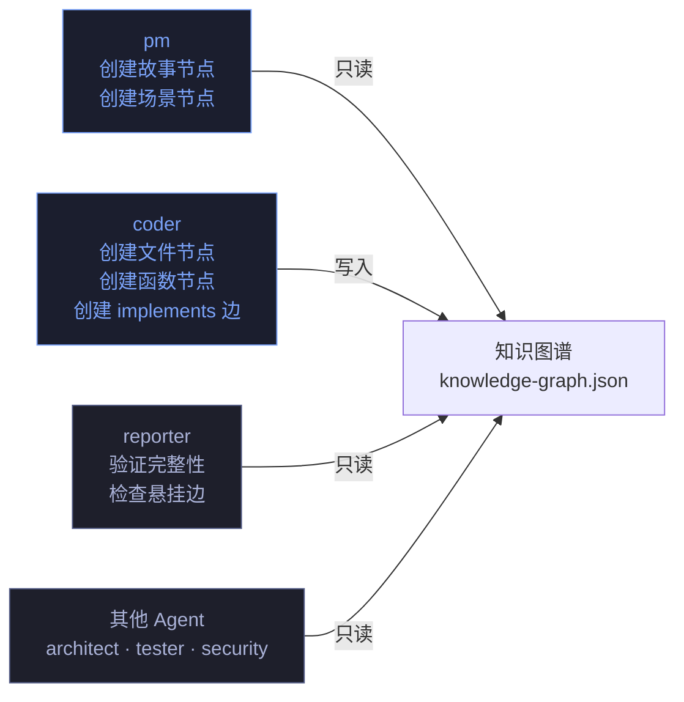

# knowledge-graph-ownership — 知识图谱所有权

> 解决知识图谱的三方耦合问题（pm 创建 · coder 更新 · reporter 验证）。单点写入，多点只读。

[所有权模型](#所有权模型) · [节点生命周期](#节点生命周期) · [边完整性](#边完整性) · [阻断条件](#阻断条件)

---

## 所有权模型

> 每个节点/边只有一个写入者。写入者负责完整性，读取者负责验证。



| 节点/边类型 | 写入者 | 创建时机 | 修改权限 |
|-----------|--------|---------|---------|
| `story` 节点 | pm | 故事拆分完成 | 仅 pm 可修改故事级属性 |
| `scene` 节点 | pm | 场景拆分完成 | 仅 pm 可修改场景级属性 |
| `file` 节点 | coder | 逐模块实现时 | coder 创建，pm 不可写 |
| `function` 节点 | coder | 逐模块实现时 | coder 创建，pm 不可写 |
| `implements` 边 | coder | 实现功能点时 | coder 创建，链接 file/function → step |
| `depends_on` 边 | coder | 模块间有依赖时 | coder 创建 |
| `belongs_to` 边 | pm | 场景归属故事时 | pm 创建 |

---

## 节点生命周期

### story 节点

```
pm 创建 → pm 补充 name/description → coder 补充 status → reporter 验证
```

| 阶段 | 操作者 | 动作 | 验证 |
|------|--------|------|------|
| 创建 | pm | `nodes.push({type:"story", id, name, status:"planned"})` | id 唯一 |
| 补充 | pm | 添加 description, goal, acceptance_criteria | 字段非空 |
| 关联 | coder | 添加 scenes 数组引用 | 每个 scene 存在 |
| 验证 | reporter | 检查 story 节点的 scene 引用是否完整 | edges 中每个 scene 有 belongs_to 边 |

### scene 节点

```
pm 创建 → coder 关联文件 → tester 关联测试 → reporter 验证
```

### file / function 节点

```
coder 创建 → coder 添加 implements 边 → reporter 验证 FP 覆盖
```

**coder 在逐模块实现时必须同步更新**：每创建一个文件 → 添加 file 节点；每实现一个功能点 → 添加 function 节点 + implements 边指向对应 step。

---

## 边完整性

| 检查项 | 执行者 | 时机 | 验证方式 |
|--------|--------|------|---------|
| 每个 FP# 有对应 node | reporter | Gate B 验证 | 故事任务.md §2 的 FP# 全量在 KG 中 |
| 每个 file/function 有 implements 边 | reporter | Gate B 验证 | edges 无悬挂 source/target |
| flow 完整（≥3 steps，weight 连续） | reporter | Gate B 验证 | flow.steps 检查 |
| 无悬挂边（source/target 全在 nodes 中） | reporter | 每次策展 | 遍历 edges 验证 |

---

## 阻断条件

| 阻断标识 | 触发条件 | 处置 |
|---------|---------|------|
| `kg-no-node` | FP# 无对应 KG 节点 | 退回 coder 补节点 |
| `kg-no-edge` | file/function 节点无 implements 边 | 退回 coder 补边 |
| `kg-dangling` | edge 的 source 或 target 不在 nodes 中 | 退回 coder 修正 |
| `kg-broken-flow` | flow < 3 steps 或 weight 不连续 | 退回 pm 补 step |
| `kg-multi-writer` | 同一节点被多个 Agent 写入 | 阻断，确定唯一写入者 |

---

## 规则

| # | 规则 | 反例 |
|---|------|------|
| 1 | 一个节点只有唯一写入者 | pm 和 coder 都修改同一个 story 节点 |
| 2 | coder 创建节点后立即添加 implements 边 | 创建 file 节点后不连 implements 边 |
| 3 | reporter 只读验证，不修改 KG | reporter 自己补节点来通过验证 |
| 4 | 策展前必须通过 KG 完整性检查 | git commit 时 KG 有悬挂边 |
| 5 | FP# 覆盖率 100%，无遗漏 | 5 个 FP 只有 3 个有对应 node |
