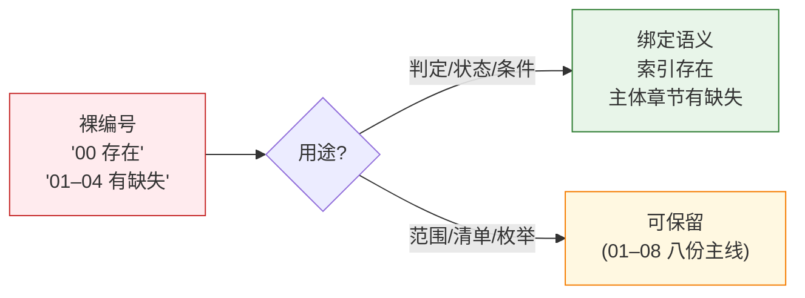

---
paths:
  - "**/*.md"
---

# no-magic-number

> **口诀：数字不说话，语义在说话。** 文档里裸出现的编号（`00`、`01–04`、`05/06`）若被用作判定条件或状态描述，必须先绑定语义；只在「编号区间」「文件清单」里允许保留裸数字。

服务公理：CLAUDE.md「**释义** 说清楚」——人看不懂，正确也没意义。状态写 `00 存在` 等读者脑补"00 = 索引"才能解码，已是退化信号。



## 适用

仓库内所有 `*.md` 文档，包括 `docs/` 产出与项目根/`.claude/` 下的元文档。

## 规则

### 1. 判定与状态：必须绑定语义

任何用编号充当**条件**、**状态值**、**状态判定的字段**的位置，禁止裸数字。

| 反例 | 问题 | 修正 |
|------|------|------|
| `00 存在，01–04 有缺失` | 数字充当"哪个文件"的语义 | `索引存在，主体章节有缺失` |
| `00–04 全部存在` | 同上 | `索引 + 全部主体章节存在` |
| `00 不存在` | 同上 | `索引（入口）不存在` |
| `01 创建后即可进入 02` | 数字代替"故事任务/技术评审" | `故事任务创建后可进入技术评审` |
| `05/06 偏差表 §2` | 简称未在本段铺垫 | 首次出现写 `实施报告（05/06）`，再简称 |

判断口径：**遮住所有编号还能读懂**？读不懂 = 数字在做语义的活，必须绑定。

### 2. 编号区间与清单：可保留裸数字

下列场景编号本身就是语义（指代「编号空间的连续段」），保留即可：

- 公式覆盖范围声明：`8 份主线故事文件（01–08）` —— 区间本身在传达"八份"
- 表格表头与文件名直接对照：`| 文件 | 必选 | 01-故事任务.md ✓`
- 命令文档示意路径：`/rui doc → 01–04 文档`（紧邻完整文件清单）
- 阶段产出枚举：`E → 创建 01 / 02 / 03 / 04 / 10–19`（紧邻各编号语义图节点）

要求：编号区间出现的**段落首次提及**必须有完整文件名作为锚点。

### 3. 缩写规则

裸编号缩写（`05/06`、`02 §3`）允许，但需先**绑定**：

```markdown
✅ 实施报告（05-后端实施报告 / 06-前端实施报告）的 §2 偏差表必须闭合，05/06 缺一不通过。
❌ 05/06 偏差表 §2 必须闭合。
```

绑定后的简称作用域不超过当前小节；跨小节再用必须重新绑定。

### 4. 命名层与判定层分离

文件名带编号是**排序约定**（`00-` 排前），不是判定语义。判定逻辑必须用文件**职责名**（索引、主体章节、技术评审、实施报告）而不是文件**编号前缀**。

```js
// 反例
if (!exists['00-索引.md']) status = 'stale';

// 正例
const INDEX_FILE = '00-索引.md';
if (!exists[INDEX_FILE]) status = 'stale';  // 语义在变量名上
```

## 例外

- 报错信息直接引用文件名：`Missing 01-故事任务.md`（带后缀已是完整语义）
- 技术日志 / JSON 字段值：状态机内部值可使用 `complete` / `partial` 等枚举
- 代码注释引用编号 + 完整文件名：`// 01-故事任务.md 是唯一真相源`

## 校验

人工自查：复制段落，遮住所有 `\d{2}` → 还能读懂上下文？读不懂即违反本规则。
