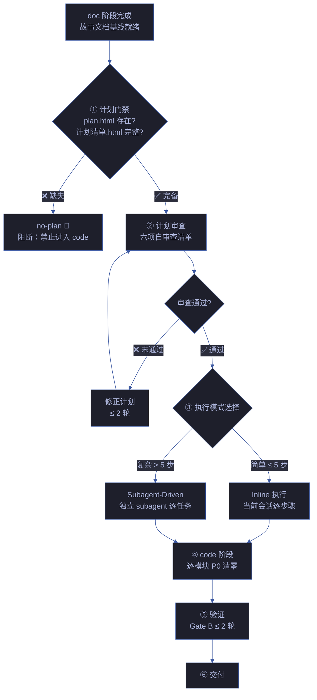
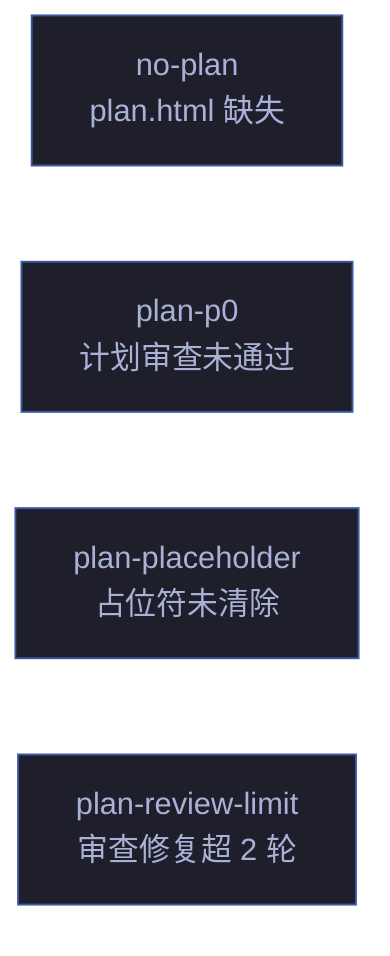

---
paths:
  - "docs/故事任务面板/**"
---

# plan-execution

> 计划执行规则：计划创建 → 审查 → 执行 → 验证的完整约束。计划是 doc 和 code 之间的桥梁——无计划不实现。
>
> **Iron Law — 违反字母即是违反精神：**
> - 无计划不实现：code 阶段前必须有 plan.html + 计划清单.html
> - 零占位符：TBD / TODO / ... / implement later 在计划中禁止出现
> - 每步可验证：每步骤含确切命令 + 期望输出

[计划管线](#计划管线) · [计划创建](#计划创建) · [计划审查门禁](#计划审查门禁) · [执行纪律](#执行纪律) · [阻断标识汇总](#阻断标识汇总) · [Red Flags](#red-flags) · [生效标志](#生效标志)

## Red Flags — 暂停并回到 Iron Law

- "这个任务太简单了不需要计划"
- "计划写个大概就行，具体实现时再定"
- "TBD 后面补，先往下走"
- "这步和上步类似，写 similar to Task N 就行"
- "跳过自审查节省时间"
- "计划写完了但没生成 plan.html"
- "场景的计划清单.html 和另一个场景一样，复制就行"
- "计划审查发现 3 个占位符，但都是小问题不碍事"

**以上任何一个 = 停止。** 计划质量决定实现质量——计划阶段的偷懒 = 实现阶段的返工。

## 计划管线

| 阶段 | 核心动作 | 阻断标识 | 例外 |
|------|---------|---------|------|
| ① 计划门禁 | plan.html + 计划清单.html 完整 | `no-plan` | `/rui init` 基线建立 |
| ② 计划审查 | 六项自审查清单 | `plan-p0` | — |
| ③ 执行模式 | 选择 inline 或 subagent-driven | — | — |
| ④ code 阶段 | 逐模块 P0 清零 | — | — |
| ⑤ 验证 | Gate B ≤ 2 轮 | — | — |

## 计划创建

### 产出物

| 产出 | 位置 | 格式 | 内容 |
|------|------|------|------|
| plan.html | `docs/故事任务面板/<name>/plan.html` | 自包含 HTML+SVG | 故事级计划总览：文件结构图 · 任务依赖图 · 任务总览表 · 风险缓解 · 执行模式 |
| 计划清单.html | `docs/故事任务面板/<name>/场景-N-<slug>/计划清单.html` | 自包含 HTML+SVG | 场景级任务清单：可勾选步骤 · 代码片段 · 验证命令 · 进度条 · 验证记录 |

### 创建时机

| 触发时机 | 产出 | 负责人 |
|---------|------|--------|
| doc 阶段完成，准备进入 code | plan.html + 全部场景的 计划清单.html | planner |
| `/rui plan <name>` 独立调用 | plan.html + 全部场景的 计划清单.html | planner |
| `/rui yry` 发现改进项后 | 增量更新 plan.html + 受影响场景的 计划清单.html | planner |
| 场景新增时 | 新场景的 计划清单.html | planner |

### 计划文档约束

| # | 规则 | 反例 |
|---|------|------|
| 1 | 计划必须自包含——接手者零上下文也能执行 | "参考之前的实现" — 没给路径 |
| 2 | 每步骤 ≤ 5 分钟可完成。超过 = 继续拆分 | "实现用户认证模块" — 太大 |
| 3 | 每步骤含确切文件路径 + 代码片段 + 验证命令 + 期望输出 | "添加错误处理" — 不知道加在哪里、加什么 |
| 4 | 零占位符。TBD / TODO / ... / implement later 禁止 | "TBD: 错误处理策略" |
| 5 | 步骤间依赖显式标注。无隐性依赖 | Task 5 依赖 Task 2 但未标注 |
| 6 | plan.html 必须含 mermaid 任务依赖图 | 纯文字任务列表 |
| 7 | 表达优先：图 → 结构化文本 → 表 | 大段文字描述任务顺序 |

## 计划审查门禁

### 六项自审查清单

| # | 检查项 | 验证方法 | 未通过 |
|---|--------|---------|--------|
| 1 | **Spec 覆盖** | 每个 FP# 能对应到至少一个 Task | 补遗漏任务 |
| 2 | **零占位符** | `grep -rn 'TBD\|TODO\|\.\.\.\|implement later\|etc\.' plan.html` | 替换为实际内容 |
| 3 | **类型一致性** | Task N 定义的函数签名 == Task M 的调用签名 | 修正不一致 |
| 4 | **路径真实** | 每个引用路径在代码库中存在或计划中 `Create:` | 标注或修正 |
| 5 | **命令可执行** | 每个验证命令复制粘贴可直接运行 | 补全参数和期望输出 |
| 6 | **依赖显式** | 全部任务间依赖已在依赖图中标注 | 补依赖边 |

### 审查修复约束

| 约束 | 规则 |
|------|------|
| 修复轮次 | 计划审查修复 ≤ 2 轮。超过 = 计划质量根本问题，回到 pm 重新评估故事拆分 |
| 修复范围 | 仅修正计划文档，不修改故事基线 |
| 修复记录 | 每轮修复追加到 plan.html 的变更记录 |

## 执行纪律

### Inline 执行模式

适用于简单任务（≤ 5 步骤，≤ 2 文件）。

| # | 规则 |
|---|------|
| 1 | 严格按步骤顺序执行，不跳步 |
| 2 | 每步执行后运行验证命令，确认通过再前进 |
| 3 | 验证失败 → 停止，记录失败原因，不猜测绕过 |
| 4 | 每步完成后在 计划清单.html 中勾选 + 记录验证时间戳 |
| 5 | 全部步骤完成后触发 Gate B 门禁 |

### Subagent-Driven 执行模式

适用于复杂任务（> 5 步骤或多文件并行）。

| # | 规则 |
|---|------|
| 1 | 每任务启动独立 subagent，隔离上下文 |
| 2 | 任务间按依赖顺序串行；无依赖任务可并行 |
| 3 | 每任务完成后触发 code-reviewer 审查 |
| 4 | 审查 P0 清零后才进入下一任务 |
| 5 | 每任务完成后在 plan.html 中标记完成状态 |
| 6 | 全部任务完成后触发 Gate B 门禁 |

### 执行中阻断

| 情况 | 处置 |
|------|------|
| 计划步骤与实际代码结构冲突 | 停止执行，更新计划后重新审查 |
| 验证命令连续失败 ≥ 3 次 | 停止，回到根因追溯（见 code-pipeline.md 支撑技术①） |
| 发现计划遗漏关键步骤 | 补步骤 → 重新自审查 → 继续执行 |
| 依赖的未完成任务阻塞当前任务 | 等待依赖完成或调整执行顺序 |

## 阻断标识汇总

| 标识 | 触发条件 | 阻断? |
|------|---------|-------|
| `no-plan` | code 阶段前 plan.html 或任一场景的 计划清单.html 不存在 | ✅ 阻断 |
| `plan-p0` | 计划六项自审查任一项未通过 | ✅ 阻断 |
| `plan-placeholder` | 计划中含 TBD / TODO / ... / implement later 等占位符 | ✅ 阻断 |
| `plan-review-limit` | 计划审查修复 > 2 轮 | ✅ 阻断 |

## 生效标志

| 标志 | 未达标的处置 |
|------|------------|
| plan.html 存在且自包含 | planner 生成 |
| 计划清单.html 齐全（每场景一份） | planner 逐场景生成 |
| 零占位符 | 替换占位符 |
| 六项自审查全 ✅ | 逐项修正 |
| 执行模式已选定 + 依赖完整 | 按复杂度选择 inline/subagent-driven |

## 集成

| 类别 | 内容 |
|------|------|
| 上游规则 | [doc-generation](./doc-generation.md)（文档基线）· [code-pipeline](./code-pipeline.md)（管线阶段） |
| 上游 Agent | [pm](../agents/pm.md)（故事文档基线）· [architect](../agents/architect.md)（架构设计） |
| 执行 Agent | [planner](../agents/planner.md)（计划创建）· [coder](../agents/coder.md)（计划执行）· [tester](../agents/tester.md)（验证执行） |
| 技能 | [rui](../skills/rui/SKILL.md)（`/rui plan` 命令） |
| 产出 | plan.html · 计划清单.html（每场景） |
