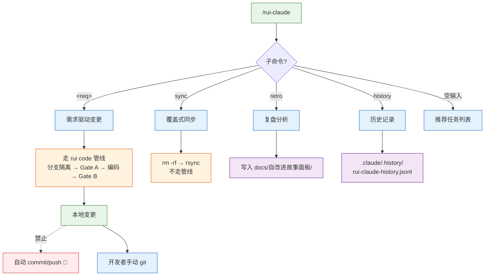
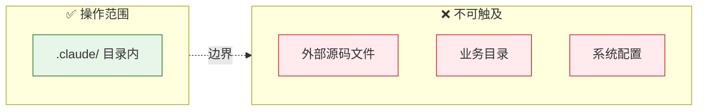
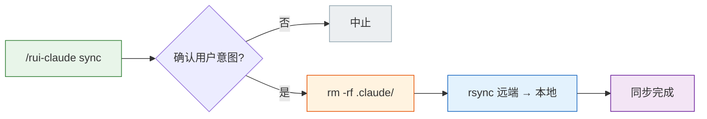
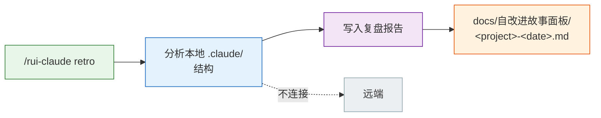
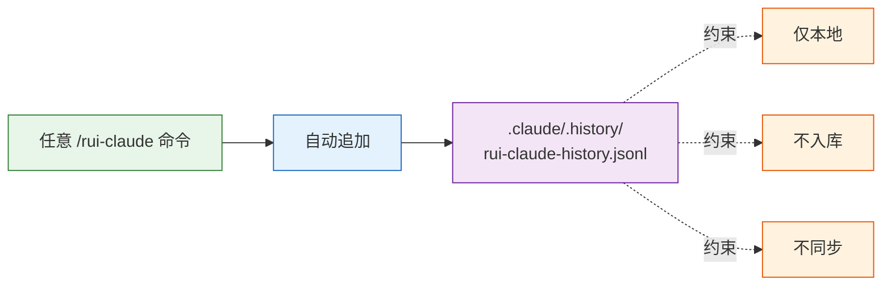
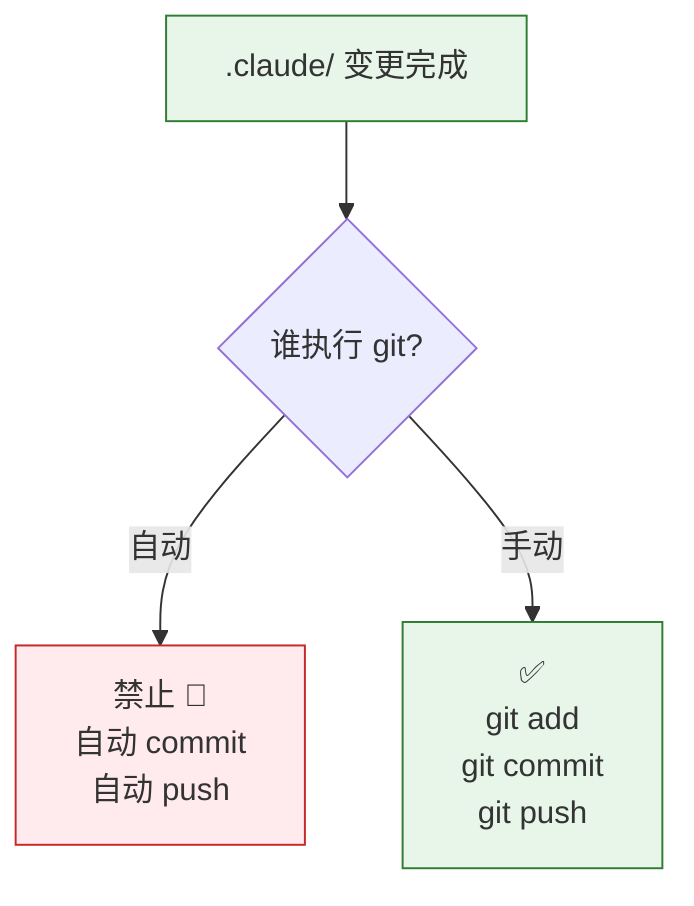
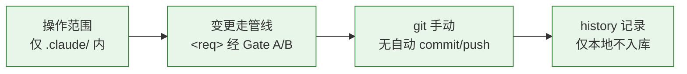

---
paths:
  - ".claude/**"
---

# rui-claude

> 操作仅限 `.claude/`，变更走 rui code 管线，git 由开发者手动操作。

## 命令族全景

| 子命令 | 行为 | 走管线? | 产出位置 |
|--------|------|--------|---------|
| `<req>` | 需求驱动的 .claude/ 变更 | ✅ rui code 管线 | `.claude/` 目录内 |
| `sync` | 覆盖式更新（rm -rf → rsync） | ❌ 不走管线 | `.claude/` 全量 |
| `retro` | 复盘分析 | ❌ 独立流程 | `docs/自改进故事面板/` |
| `history` | 自动记录历史 | ❌ 后台记录 | `.claude/.history/` |
| 空输入 | 推荐任务 | ❌ 不执行 | — |

## 适用

`/rui-claude` 命令族下的所有子命令（`sync` / `retro` / `history` / `<req>`）。

## 操作范围

| # | 规则 | 反例 |
|---|------|------|
| 1 | 仅限 `.claude/` 目录，不得触及外部文件 | 修改 `src/` 下的业务代码 |
| 2 | `/rui-claude <req>` 修改 `.claude/` 必须通过 rui code 管线 | 直接在 main 分支改 `.claude/` 文件 |
| 3 | 空输入不执行管线，仅推荐任务 | 空输入触发完整管线 |

## sync — 覆盖式同步

| # | 规则 | 说明 |
|---|------|------|
| 4 | `sync` 为覆盖式更新（rm -rf → rsync），执行前须确认用户意图 | 整目录清空不可逆 |
| 5 | SSH 凭据由系统管理员管理，本 skill 不配置/存储/传递 | 凭据不在 `.claude/` 内 |

## retro — 复盘分析

| # | 规则 |
|---|------|
| 6 | 复盘写入 `docs/自改进故事面板/<project>-<date>.md` |
| 7 | 仅分析本地 `.claude/` 结构，不连接远端 |

## history — 历史记录

| # | 规则 |
|---|------|
| 8 | 自动记录到 `.claude/.history/rui-claude-history.jsonl`（仅本地，不入库不同步） |

## git 约束

| # | 规则 | 反例 |
|---|------|------|
| 9 | 禁止自动提交和推送，所有 git 操作由开发者手动执行 | 管线末尾自动执行 `git push` |

## 例外

| 场景 | 处理 | 原因 |
|------|------|------|
| `sync` 覆盖式更新 | 不走 rui code 管线 | 行为是恢复基线，非业务变更 |

## 生效标志

| 标志 | 未达标的处置 |
|------|------------|
| 操作仅限 `.claude/` 目录 | 撤销外部变更，重新在 .claude/ 内操作 |
| `<req>` 变更走 rui code 管线 | 切回分支，重新走管线流程 |
| git 操作由开发者手动执行 | 撤销自动提交，手动重新 commit |
| history 仅本地不入库 | 从 git 暂存区移除 history 文件 |
