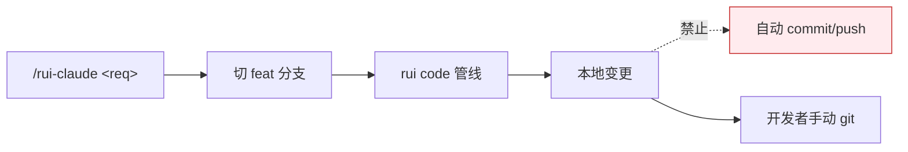

---
paths:
  - ".claude/**"
---

# rui-claude

> **口诀：限范围、走管线、不自推。** 操作仅限 `.claude/`，变更走 rui code 管线，git 由开发者手动操作。

## 适用

`/rui-claude` 命令族下的所有子命令（`sync` / `retro` / `history` / `<req>`）。

## 规则

### 操作范围

1. 仅限 `.claude/` 目录，不得触及外部文件
2. `/rui-claude <req>` 修改 `.claude/` 必须通过 rui code 管线，分支隔离同 [code-pipeline.md](./code-pipeline.md)
3. 空输入不执行管线，仅推荐任务

### sync

4. `sync` 为覆盖式更新（rm -rf → rsync），执行前须确认用户意图
5. SSH 凭据由系统管理员管理，本 skill 不配置 / 存储 / 传递

### retro

6. 复盘写入 `docs/自改进故事面板/<project>-<date>.md`
7. 仅分析本地 `.claude/` 结构，不连接远端

### history

8. 自动记录到 `.claude/.history/rui-claude-history.jsonl`（仅本地，不入库不同步）

### git

9. 禁止自动提交和推送，所有 git 操作由开发者手动执行

## 例外

- `sync` 是受控的整目录覆盖，不走 rui code 管线（行为本身是恢复基线，非业务变更）
