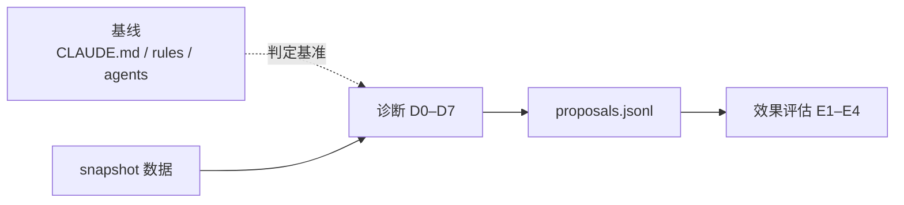

---
paths:
  - "docs/故事任务面板/**/.improvement/**"
  - "docs/故事任务面板/**/.memory/**"
---

# self-improve

> **口诀：有据才发、对基线断、单次不阻。** 无 snapshot 不出提案，诊断以基线为锚，单次执行不阻断主流程。

## 适用

每个故事走完管线后产出 `08-自改进复盘.md`，并向 `proposals.jsonl` 追加诊断结果。

## 规则

### 数据要求

1. 提案必须有 snapshot 证据支撑，无数据不产出
2. `proposals.jsonl` append-only，状态变更通过新增条目而非覆盖
3. 效果评估需前后各 ≥ 3 条记忆
4. `no-metrics` 降级不阻断交付（写空白 08 占位）
5. 单次执行，不阻断主流程

### 诊断基准

6. 诊断以基线文件为判定基准（CLAUDE.md / `rules/` / `agents/`）
7. 每条假设必须引用基线文件作为依据

### 诊断规则 D0–D7

| # | 信号 | 假设 | 置信度 | 基线依据 |
|---|------|------|--------|---------|
| D0 | 执行与基线冲突 | 哲学偏离 | ≥1 条记忆 | CLAUDE.md · agents/ |
| D1 | 阻断率 > 20% | 预处理不充分 | ≥5 条记忆 | code-pipeline.md |
| D2 | P0 密度 > 均值 2× | 设计遗漏 | ≥3 条记忆 | doc-generation.md |
| D3 | T3 占比 > 30% | 需求边界模糊 | ≥3 条记忆 | 故事拆分（pm.md） |
| D4 | Gate B > 2 轮 | 测试先行不足 | Gate B 计数 | code-pipeline.md |
| D5 | 阶段耗时 > 均值 3× | Agent 协作瓶颈 | ≥3 条记忆 | agents/ |
| D6 | 连续 2 窗口退化 | 系统性恶化 | retro 分析 | CLAUDE.md 退化对策 |
| D7 | 提案闭合率 < 50% | 改进项不可执行 | ≥5 个提案 | 本规则 |

### 效果评估 E1–E4

| # | 指标 | 改善 | 退化 |
|---|------|------|------|
| E1 | 阻断率 | 后 < 前 | 后 > 前 |
| E2 | P0 密度 | 后 < 前 | 后 > 前 |
| E3 | 关联 bad_case | 消失 | 仍出现 |
| E4 | 综合 | 改善 > 退化 | 退化 > 改善 |

## 例外

- 数据采集失败 → `no-metrics` 标识，写降级版 08（标注无数据），不计入退化窗口
- 单故事数据不足 3 条时，跳过 E1–E4，仅生成观察记录
