---
paths:
  - "docs/故事任务面板/**/.improvement/**"
  - "docs/故事任务面板/**/.memory/**"
---

# self-improve

> 四阶段闭环：采集 → 诊断 → 改进 → 评估。AI 压缩 + 相似检索为横切机制，基准评估为唯一判定方法。无 snapshot 不出提案，诊断以基线为锚，单次执行不阻断主流程。
>
> **Iron Law — 违反字母即是违反精神：**
> - 无 snapshot 证据不出提案
> - 诊断假设必须引用基线文件，否则不成立
> - 效果评估必须用 before/after 基准对比，不可凭感觉判断

[闭环全景](#闭环全景) · [① 数据采集与压缩](#①-数据采集与压缩) · [② 诊断 D0–D7](#②-诊断-d0d7) · [③ 改进提案](#③-改进提案) · [④ 基准评估 E1–E4](#④-基准评估-e1e4) · [AI 压缩 + 相似检索](#ai-压缩--相似检索) · [经验技能化](#经验技能化) · [降级处理](#降级处理) · [例外](#例外) · [生效标志](#生效标志)

## Red Flags — 暂停并回到 Iron Law

- "这个改进不需要数据支撑，经验就够了"
- "效果应该是正面的，不用对比基准"
- "历史数据太长，压缩跳过这一轮"
- "相似案例检索不到，直接写提案"
- "no-metrics 降级就跳过整个自改进阶段"

**以上任何一个 = 停止。无证据 = 无提案。**

## 闭环全景

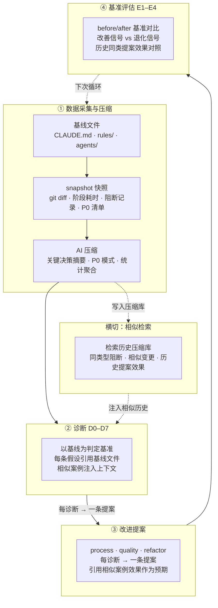

| 阶段 | 输入 | 输出 | 核心机制 | 阻断? |
|------|------|------|---------|-------|
| ① 采集 | git diff · 阶段耗时 · 阻断记录 · P0 清单 | snapshot + AI 压缩摘要 | 三通道压缩（决策/P0/统计） | 否 |
| ② 诊断 | 压缩摘要 × 基线文件 × 相似历史 | D0–D7 判定表 | 基线锚定 + 相似案例注入 | 否 |
| ③ 改进 | D0–D7 判定 × 相似提案效果 | process / quality / refactor 提案 | 历史效果预期 | 否 |
| ④ 评估 | before/after 基准 × 关联 bad_case | E1–E4 闭合/退化/重提案 | 基准对比判定 | 否（降级不阻断） |

**可执行工具**: `node skills/rui/proposals.mjs` — D0-D7 诊断引擎 + 提案生成 + E1-E4 评估。`node skills/rui-story/collect.mjs` — 指标采集 + 异常检测。

## ① 数据采集与压缩

> 每次 rui 管线执行后采集执行数据。原始数据经 AI 压缩为三通道摘要，写入压缩库供相似检索。

### 采集


| 采集项 | 来源 | 格式 | 用途 |
|--------|------|------|------|
| 阶段耗时 | 管线执行计时 | `{stage: ms}` | D5 阶段耗时异常 |
| 阻断记录 | 阻断标识 + 恢复方式 | `{block_id, recovery}` | D1 阻断率 · 相似阻断检索 |
| P0 清单 | coder/tester 审查记录 | `[{file, line, severity, fix}]` | D2 P0 密度 · 相似 P0 检索 |
| Agent 参与 | 管线执行日志 | `[{agent, duration}]` | 协作效率分析 |
| git diff 摘要 | `git diff --stat` | `{files, insertions, deletions}` | 变更范围判定 |

### AI 压缩（三通道）

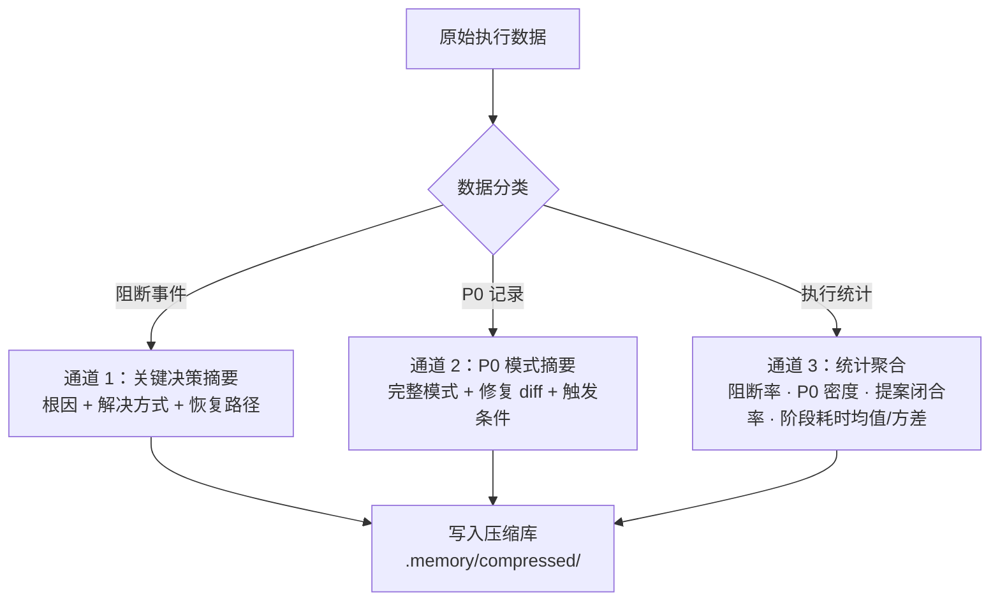

| 通道 | 压缩目标 | 压缩方式 | 保留周期 | 检索用途 |
|------|---------|---------|---------|---------|
| **C1** 决策摘要 | 阻断事件的根因 + 解决方式 | LLM 摘要 → ≤ 3 句关键决策 | 滚动 12 故事 | 同类型阻断复现时注入 |
| **C2** 模式摘要 | P0 的完整模式 + 修复 diff | 模式去重 + 归类 → 标准化模板 | 6 故事（修复验证后归档） | 相似代码变更时注入 |
| **C3** 统计聚合 | 阻断率/P0密度/闭合率/耗时 | 均值 + 方差 + 趋势方向 | 滚动 12 窗口 | 退化趋势检测 + 基准对比 |

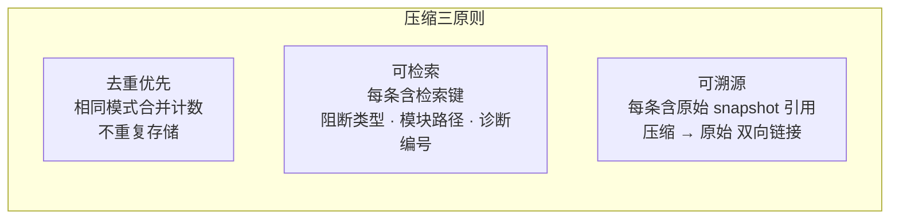

| # | 规则 | 反例 |
|---|------|------|
| 1 | 每条压缩记录含检索键（阻断类型 / 模块路径 / 诊断编号） | 仅保留自然语言描述，无法程序化检索 |
| 2 | 相同模式合并计数，不重复存储 | 3 次同样的 SQL 注入 P0 存 3 条完整记录 |
| 3 | 压缩记录与原始 snapshot 双向链接 | 压缩后无法回溯原始数据 |
| 4 | 超过保留周期的记录自动归档，不参与检索 | 12 故事前的阻断记录仍注入当前诊断 |

## ② 诊断 D0–D7

> 以基线文件为判定基准，每条假设必须引用基线。相似检索注入历史同类案例作为上下文。

### 诊断基准

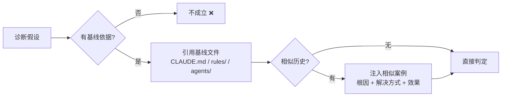

| # | 规则 | 反例 |
|---|------|------|
| 1 | 诊断以基线文件为判定基准（CLAUDE.md / `rules/` / `agents/`） | 凭经验判断"复杂度太高" |
| 2 | 每条假设必须引用基线文件作为依据 | "推测是测试覆盖不足" — 未引用 code-pipeline.md |
| 3 | 优先检索相似历史案例，注入诊断上下文 | 有 3 次同类阻断记录但不检索 |
| 4 | 无相似历史时直接判定，不强行类比 | 强行找一个"看起来像"的不相关案例 |

### D0–D7 诊断矩阵

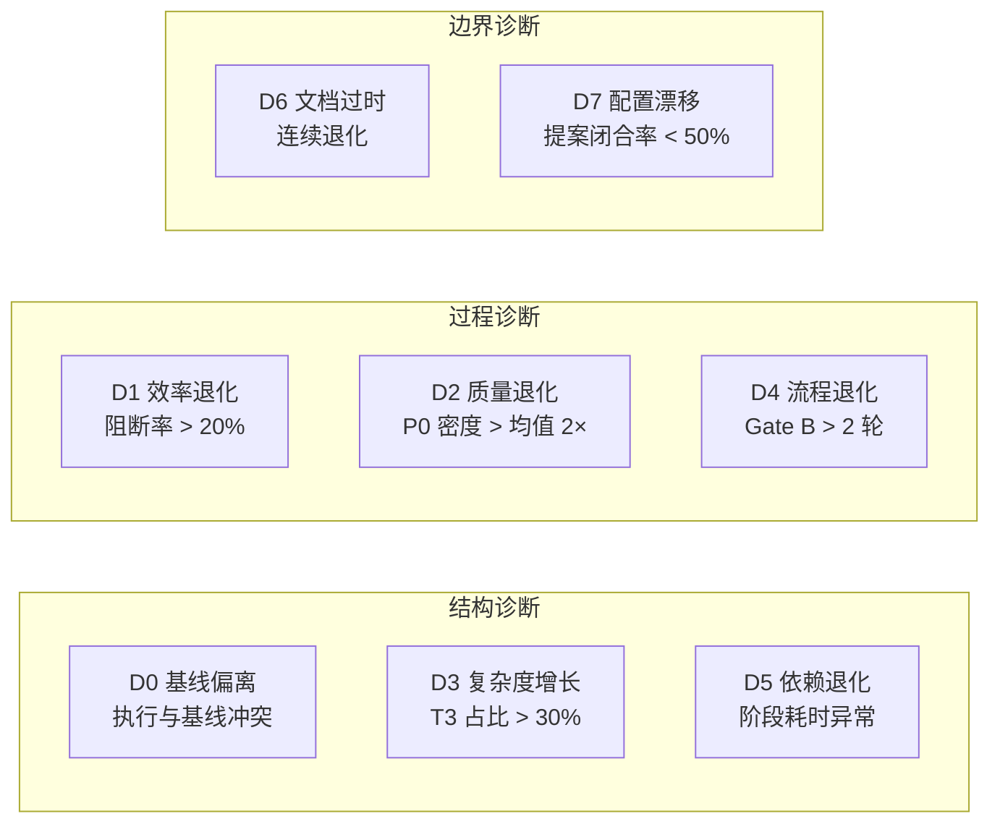

| # | 信号 | 假设 | 检索键 | 基线依据 |
|---|------|------|--------|---------|
| **D0** | 执行步骤与基线规则冲突 | 基线规则不清晰或不可执行 | `baseline` · `rule-name` | CLAUDE.md · code-pipeline.md |
| **D1** | 阻断率 > 20%（近 3 故事） | Gate A 预检覆盖面不足 | `block-rate` · `gate-a` | code-pipeline.md § Gate A |
| **D2** | P0 密度 > 均值 2× | coder 自审查清单需更新 | `p0-density` · `module-path` | code-pipeline.md § 逐模块清零 |
| **D3** | T3 变更占比 > 30% | 模块边界设计不当 | `t3-ratio` · `module-path` | code-pipeline.md § 深度模块 |
| **D4** | Gate B 修复 > 2 轮 | 测试先行不足或 AC 不清晰 | `gate-b` · `story-name` | code-pipeline.md § Gate B |
| **D5** | 某阶段耗时 > 基线 3× 或方差异常 | 阶段工具链或流程瓶颈 | `stage-time` · `stage-name` | 历史耗时基线（C3 统计聚合） |
| **D6** | 连续 2 窗口同一诊断触发 | 系统性恶化，非偶然退化 | `consecutive` · `diag-id` | CLAUDE.md § 退化对策 |
| **D7** | 提案闭合率 < 50%（≥ 5 个提案） | 提案不可执行或粒度过大 | `closure-rate` | 本规则 § ④ 基准评估 |

### 诊断 → 提案路由

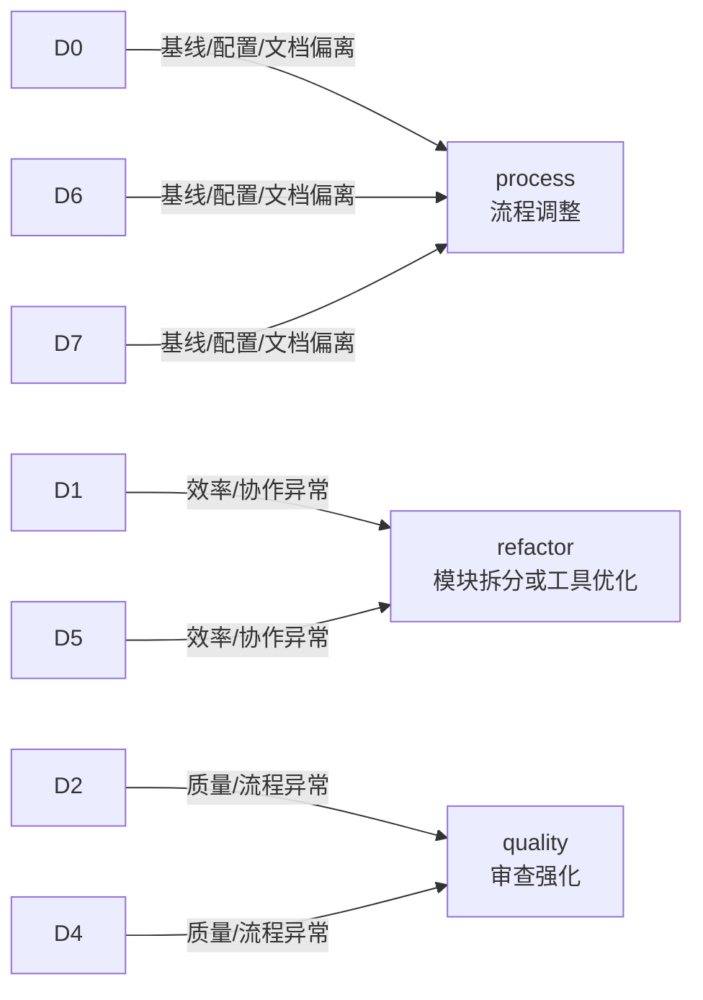

| 诊断组 | 触发信号 | 提案类型 | 相似检索注入 | 示例 |
|--------|---------|---------|-------------|------|
| D0 / D6 / D7 | 基线偏离 / 文档过时 / 配置漂移 | `process` | 同类基线偏离的修复方式 + 效果 | "Gate A 阶段耗时 3× 基线，历史 2 次同类问题通过预检脚本解决（效果：耗时 -60%）" |
| D1 / D5 | 阻断率上升 / 阶段耗时异常 | `refactor` | 同类模块拆分的 diff 模式 + 效果 | "某规约文件 613 行，相似膨胀案例拆分后回归耗时 -45%" |
| D2 / D4 | P0 密度上升 / Gate B 多轮 | `quality` | 同类 P0 的修复 diff + 是否复现 | "SQL 注入 P0 连续 3 故事出现，历史 2 次加入自审查清单后复现率 ↓80%" |

## ③ 改进提案

> 每条诊断触发一条提案。提案含效果预期——引用相似历史提案的实际效果作为基线。

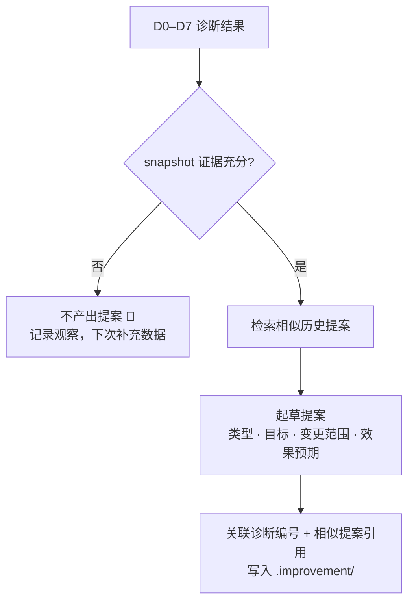

| # | 规则 | 反例 |
|---|------|------|
| 1 | 提案必须有 snapshot 证据支撑，无数据不产出 | "建议优化性能" — 无耗时数据 |
| 2 | 提案含效果预期，引用相似历史提案的实际效果 | "预计改善阻断率" — 无历史参照 |
| 3 | 提案关联诊断编号 + 相似提案引用，形成证据链 | 孤立的提案，无法追溯触发来源 |
| 4 | 提案写入 `.improvement/` 目录，append-only 不覆盖历史 | 直接修改旧提案而非新增 |

### 提案骨架

```
# <诊断编号>-<简短描述>

> v{版本} | {日期} | 触发诊断: D{0-7} | 类型: process/quality/refactor

## 证据
- snapshot 引用: <路径> · <关键数据点>
- 基线依据: <基线文件> · <条款>
- 相似案例: <压缩库引用> · <实际效果>

## 提案
- 目标: ≤1 句
- 变更范围: <文件/规则/流程>
- 效果预期: <指标> <before → after 预估值>
  - 参照: 相似提案 <ID> 实际效果 <指标> <before → after>

## 效果评估（执行后填写）
- before: <基准值>
- after: <实际值>
- 判定: 改善/退化/无变化
```

## ④ 基准评估 E1–E4

> 唯一判定方法：before/after 基准对比。改善 > 退化 = 闭合，退化 > 改善 = 回退或重提案。

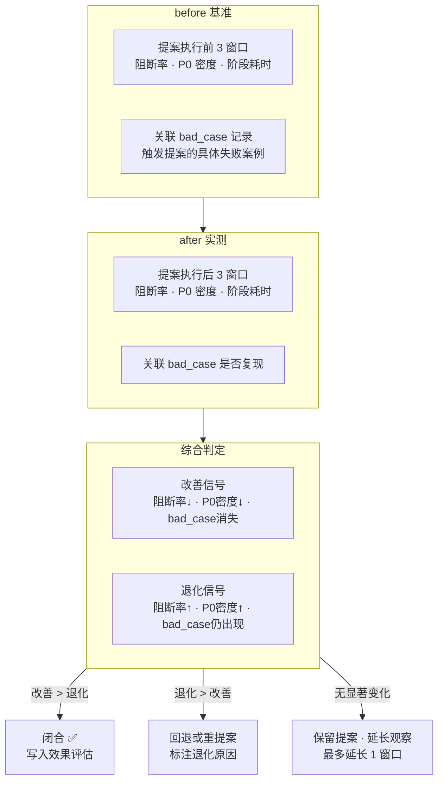

| # | 评估项 | 改善信号 | 退化信号 | 基准来源 | 最小样本 |
|---|--------|---------|---------|---------|---------|
| **E1** | 阻断率 | 后 < 前 | 后 > 前 | C3 统计聚合 · 滚动 3 窗口 | ≥ 3 故事 |
| **E2** | P0 密度 | 后 < 前 | 后 > 前 | C3 统计聚合 · 滚动 3 窗口 | ≥ 3 故事 |
| **E3** | 关联 bad_case | 消失 | 仍出现 | 提案证据中引用的具体案例 | 全部关联案例 |
| **E4** | 综合判定 | 改善 > 退化 | 退化 > 改善 | E1–E3 加权 | E1–E3 全部有数据 |

### E4 综合判定规则

| 场景 | 条件 | 判定 |
|------|------|------|
| 明确改善 | 至少 1 项改善 + 0 项退化 | ✅ 闭合 |
| 倾向改善 | 改善项 > 退化项 | ✅ 闭合（标注风险） |
| 无显著变化 | 改善 = 退化 | ⏸️ 延长观察 1 窗口 |
| 倾向退化 | 退化项 > 改善项 | ❌ 回退或重提案 |
| 明确退化 | 至少 1 项退化 + 0 项改善 | ❌ 回退 |

## AI 压缩 + 相似检索

> 横切机制，贯穿采集→诊断→改进→评估四阶段。压缩执行历史为可检索摘要，在诊断和提案阶段注入相似案例作为决策上下文。

### 压缩管线

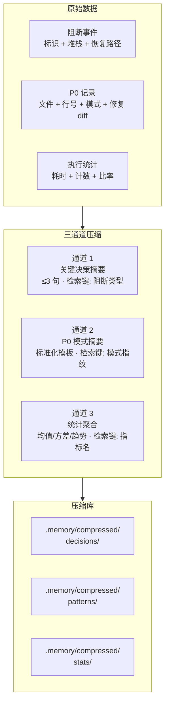

### 相似检索

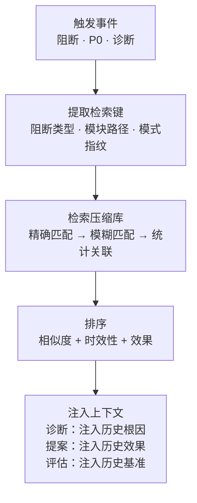

| 检索场景 | 检索键 | 匹配方式 | 注入内容 | 注入时机 |
|---------|--------|---------|---------|---------|
| 同类型阻断复现 | `block-type` | 精确匹配阻断标识 | 历史根因 + 解决方式 + 恢复路径 | D0–D7 诊断 |
| 相似代码变更 | `module-path` + `p0-pattern-fingerprint` | 模块匹配 + 模式模糊匹配 | 历史 P0 完整模式 + 修复 diff | P0 审查 |
| 退化趋势检测 | `diag-id` + `story-name` | 诊断编号 + 故事关联 | 同类退化窗口的提案 + 效果 | D6 诊断 |
| 新提案起草 | `proposal-type` + `diag-id` | 提案类型 + 诊断编号 | 历史同类提案的实际效果 | 改进提案 |
| 基准对比 | `metric-name` + `window` | 指标名精确匹配 | 历史均值/方差/趋势 | E1–E4 评估 |

### 检索质量保障

| # | 规则 | 说明 |
|---|------|------|
| 1 | 检索结果按相似度 + 时效性 + 效果三维排序 | 相似度高 + 近期 + 效果好的案例优先 |
| 2 | 无匹配结果时声明"无相似历史"，不强行类比 | 空结果不等于失败 |
| 3 | 注入的相似案例必须标注来源压缩记录 ID | 可追溯，可验证 |
| 4 | 检索失败（压缩库损坏/空库）降级为仅基线诊断 | 不阻断诊断流程 |
| 5 | 压缩库 append-only，不覆盖历史条目 | 状态变更通过新增条目表达 |

## 经验技能化

> 当同一改进模式反复触发 → 从一次性提案升级为持久规则。升级判定引用相似检索的频次数据。

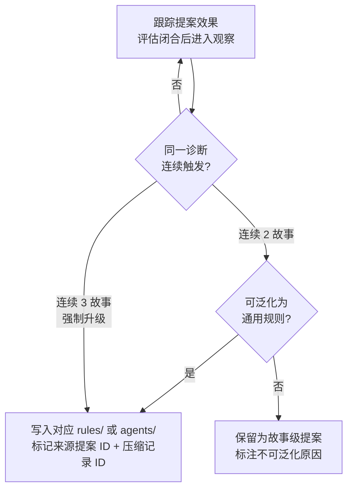

| 提案类型 | 升级条件 | 升级目标 | 示例 |
|---------|---------|---------|------|
| `process` | 连续 2 故事触发（3 故事强制升级） | `rules/code-pipeline.md` | "Gate A 阻断原因 80% 是影响链断裂 → 升级为 P0 必检项" |
| `quality` | 连续 2 故事触发（3 故事强制升级） | `agents/tester.md` 或 `agents/coder.md` | "P0 密度上升根因是 SQL 注入 → 升级为 coder 自审查清单项" |
| `refactor` | 连续 2 故事触发（3 故事强制升级） | `rules/code-pipeline.md` § 深度模块 | "某文件 3 次膨胀 → 升级为模块行数上限规则" |
| `skill` | 连续 2 故事触发 | `skills/` 或 `rules/` 新条目 | "Agent 反复犯同类错误 → 创建专项 Red Flag 或检查规则" |

**升级前必须**：检索相似历史 ≥ 2 条独立案例 + E4 综合判定闭合。

## 降级处理

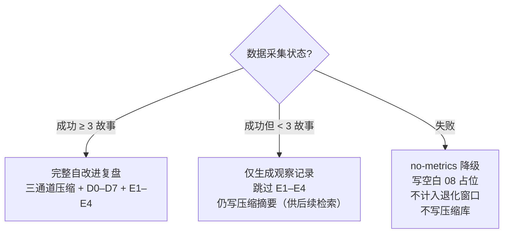

| 场景 | 处置 | 压缩 | 诊断 | 提案 | 评估 |
|------|------|:---:|:---:|:---:|:---:|
| 数据完整（≥ 3 故事） | 完整四阶段 | ✅ | ✅ | ✅ | ✅ |
| 数据不足（< 3 故事） | 观察记录 | ✅ | ✅ | ❌ | ❌ |
| 数据采集失败 | `no-metrics` 降级 | ❌ | ❌ | ❌ | ❌ |

## 例外

| 场景 | 处理 |
|------|------|
| 数据采集失败 | `no-metrics` 标识，写降级版自改进复盘（标注无数据），不计入退化窗口 |
| 单故事数据不足 3 条 | 跳过 E1–E4 + 提案，仅生成观察记录 + 压缩摘要 |
| 相似检索无匹配 | 声明"无相似历史"，降级为仅基线诊断，不阻断 |
| 压缩库损坏/空库 | 跳过相似检索，降级为仅基线诊断 |
| 经验技能化触发但目标文件已含类似规则 | 更新现有规则（标注来源提案 + 压缩记录 ID），不重复创建 |
| 连续 3 轮无效（仅格式或空操作） | 终止循环，输出终止摘要 |

## 生效标志


| 标志 | 未达标的处置 |
|------|------------|
| 原始数据采集完成 | 补采集或进入 `no-metrics` 降级 |
| 三通道压缩写入压缩库 | 补压缩或标注"本轮跳过压缩" |
| D0–D7 诊断引用基线文件 | 补基线引用，空缺标 `> 待补充` |
| 相似案例已检索（有匹配则注入） | 补检索或声明"无相似历史" |
| 每条提案有 snapshot 证据支撑 | 补数据或删无证据提案 |
| E1–E4 闭合或标注退化/降级 | 补评估结论，不得留空 |
