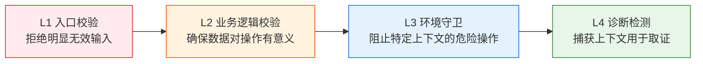

---
paths:
  - "**/*.{js,ts,jsx,tsx,vue,py,go,rs}"
---

# 支撑技术

> 源自 [superpowers](https://github.com/obra/superpowers) 实战验证的核心技术模式。每条技术附 Iron Law，违反字母即是违反精神。

## ① 根因追溯

**Iron Law: `NO FIX WITHOUT ROOT CAUSE FIRST`**

Bug 常深埋在调用栈中。直觉是修复错误出现的位置，但那是治症状。**必须向后追溯调用链直到找到原始触发点，然后在源头修复。**

### 追溯流程

```mermaid
flowchart LR
    S1["观察症状"]:::s --> S2["找到直接原因<br/>什么代码直接导致?"]:::s
    S2 --> S3["追问"谁调用了这个?"<br/>遍历调用层次"]:::s
    S3 --> S4{"到达源头?"}
    S4 -->|"否"| S3
    S4 -->|"是"| FIX["在源头修复<br/>加纵深防御层"]:::fix

    classDef s fill:#e3f2fd,stroke:#1565c0;
    classDef fix fill:#e8f5e9,stroke:#2e7d32;
```

| 步骤 | 动作 | 输出 |
|------|------|------|
| 1. 观察症状 | 记录错误信息、堆栈、行号、文件路径 | 症状描述 |
| 2. 找直接原因 | 精确定位哪行代码直接导致错误 | 代码位置 |
| 3. 追溯调用链 | 逐层向上问"谁调用了这个？传了什么值？" | 完整调用链 |
| 4. 找到源头 | 确认原始触发点是哪里 | 原始触发点 |
| 5. 源头修复 | 在源头修，再往下每层加防御 | 修复 + 纵深防御 |

### 关键技术：添加诊断堆栈

当无法手动追溯时，在问题操作前添加检测：

```typescript
// 在疑似问题操作前打桩
const stack = new Error().stack;
console.error('DEBUG:', { keyParams, cwd: process.cwd(), stack });
```

在测试中用 `console.error`（非 logger — 可能被抑制），运行后用 grep 提取诊断输出分析调用链。

## ② 纵深防御

**Iron Law: `VALIDATE AT EVERY LAYER, NOT JUST ONE`**

修复了由无效数据导致的 bug 后，单处校验感觉够了。但那层可被不同代码路径、mock 或重构绕过。**在数据通过的每一层都加校验，让 bug 在结构上不可能复现。**

### 四层模型



| 层 | 用途 | 示例 |
|----|------|------|
| **L1 入口校验** | API 边界拒绝明显无效输入 | 空值校验、类型校验、目录是否存在 |
| **L2 业务逻辑** | 确保数据对操作有意义 | 项目目录非空、sessionId 格式合法 |
| **L3 环境守卫** | 阻止特定上下文的危险操作 | 测试环境禁止在非 temp 目录 git init |
| **L4 诊断检测** | 捕获上下文用于取证 | 堆栈日志、参数快照 |

**关键洞察**：全部四层都必要。测试中每层会发现其他层遗漏的 bug。不在一层校验后停止。

### 应用步骤

1. **追溯数据流** — 坏值从哪里产生？经过哪里？
2. **映射所有检查点** — 列出数据通过的每个点
3. **每层加校验** — 入口 → 业务 → 环境 → 诊断
4. **测试每层** — 尝试绕过 L1，验证 L2 捕获它

## ③ 条件等待

**Iron Law: `WAIT FOR CONDITIONS, NOT FOR GUESSES`**

Flaky 测试常用任意延时猜测时机。这在快机器上通过，在 CI 或负载下失败。**等待你真正关心的条件，而不是猜测需要多久。**

### 核心转换

```typescript
// ❌ BEFORE: 猜测时机
await new Promise(r => setTimeout(r, 50));
const result = getResult();
expect(result).toBeDefined();

// ✅ AFTER: 等待条件
await waitFor(() => getResult() !== undefined);
const result = getResult();
expect(result).toBeDefined();
```

### 通用实现

```typescript
async function waitFor<T>(
  condition: () => T | undefined | null | false,
  description: string,
  timeoutMs = 5000
): Promise<T> {
  const startTime = Date.now();
  while (true) {
    const result = condition();
    if (result) return result;
    if (Date.now() - startTime > timeoutMs) {
      throw new Error(`Timeout waiting for ${description} after ${timeoutMs}ms`);
    }
    await new Promise(r => setTimeout(r, 10));
  }
}
```

| 场景 | 模式 |
|------|------|
| 等待事件 | `waitFor(() => events.find(e => e.type === 'DONE'))` |
| 等待状态 | `waitFor(() => machine.state === 'ready')` |
| 等待计数 | `waitFor(() => items.length >= 5)` |
| 等待文件 | `waitFor(() => fs.existsSync(path))` |

### 何时任意延时是正确的

```typescript
// 工具每 100ms tick，需要 2 tick 验证部分输出
await waitForEvent(manager, 'TOOL_STARTED'); // 先等待条件
await new Promise(r => setTimeout(r, 200));   // 再等定时行为
// 200ms = 2 ticks at 100ms — 有文档记录且有依据
```

**前提**：① 先等待触发条件 ② 基于已知时序（非猜测） ③ 注释说明 WHY。

## ④ 验证门禁

**Iron Law: `NO COMPLETION CLAIMS WITHOUT FRESH VERIFICATION EVIDENCE`**

声称工作完成却未验证 = 欺骗，不是效率。

### 门禁函数

```
声称前：
1. IDENTIFY — 什么命令证明这个声称？
2. RUN      — 执行完整命令（新鲜，完整）
3. READ     — 读完整输出，查退出码，数失败数
4. VERIFY   — 输出确认了声称吗？
   - 否 → 陈述实际状态并附证据
   - 是 → 陈述声称并附证据
5. ONLY THEN — 做出声称

跳过任一步骤 = 撒谎，不是验证。
```

### 常见失败

| 声称 | 需要 | 不充分 |
|------|------|--------|
| 测试通过 | 测试命令输出：0 失败 | 上次运行、"应该通过" |
| Lint 干净 | Lint 输出：0 错误 | 部分检查、推测 |
| 构建成功 | 构建命令：exit 0 | Lint 通过、日志看着正常 |
| Bug 修复 | 测原始症状：通过 | 代码改了、假定修好了 |
| 回归测试有效 | Red-Green 周期验证 | 测试通过一次 |
| Agent 完成 | VCS diff 显示变更 | Agent 报告说"成功" |

### 关键模式

**测试验证:**
```
✅ [运行测试命令] [看到 34/34 通过] "所有测试通过"
❌ "应该能通过" / "看起来正确"
```

**回归测试验证（TDD Red-Green）:**
```
✅ 写 → 运行(通过) → 回退修复 → 运行(必须失败) → 恢复 → 运行(通过)
❌ "我写了一条回归测试"（未走 red-green 验证）
```

**Agent 委派验证:**
```
✅ Agent 报告成功 → 查 VCS diff → 核实变更 → 报告实际状态
❌ 信任 Agent 报告
```

## ⑤ 反馈回路

**Iron Law: `NO DIAGNOSIS WITHOUT A FEEDBACK LOOP FIRST`**

修复 bug 前，先构建快速、确定、可自动运行的通过/失败信号。有回路 = bug 90% 已定位。没有回路 = 猜。

### 回路构建顺序

```
1. 失败测试  2. curl/HTTP 脚本  3. CLI + fixture
4. Headless 浏览器  5. 回放 trace  6. One-off harness
7. Fuzz 循环  8. 二分 harness  9. 差分循环  10. HITL 脚本
```

### 迭代回路

- 更快？（缓存 setup、跳过无关 init）
- 信号更锐利？（assert 具体症状）
- 更确定？（固定时间、pin RNG、隔离文件系统）

2 秒确定回路是调试超能力。30 秒抖动回路 ≈ 没有。

### 无回路 = 停

不要进入假设阶段。列出你试了什么，问用户要环境/捕获件/临时生产 instrumentation。详见 [skills/engineering/diagnose/SKILL.md](../skills/engineering/diagnose/SKILL.md)。

## ⑥ 深度模块

**Iron Law: `NO ABSTRACTION WITHOUT A SECOND CALLER`**

| 概念 | 定义 | 测试 |
|------|------|------|
| 深模块 | 小接口藏大量行为 = 高杠杆 | 删除测试：删除它，复杂度回到 N 个调用方 |
| 浅模块 | 接口几乎和实现一样复杂 | 删除测试：删除它，复杂度消失——透传 |
| 接缝 | 不改原地就能改行为的地方 | 一个适配器 = 假设接缝。两个 = 真接缝。 |

重构时优先深化浅模块。详见 [skills/engineering/improve-codebase-architecture/SKILL.md](../skills/engineering/improve-codebase-architecture/SKILL.md)。

## ⑦ 垂直切片

**Iron Law: `ONE TEST → ONE IMPLEMENTATION PER CYCLE`**

```
❌ 水平：RED(test1,test2,test3) → GREEN(impl1,impl2,impl3)
✅ 垂直：RED(test1) → GREEN(impl1), RED(test2) → GREEN(impl2), ...
```

先写全量测试再实现 = 测想象行为。一次一个测试 → 刚写完代码，你知道什么是重要行为。

## 集成

| 技术 | 本项目适用阶段 | 相关规则 |
|------|-------------|---------|
| 根因追溯 | 实现阶段 P0 修复 · Gate B 验证 | code-pipeline.md |
| 纵深防御 | P0 修复后 · 安全约束落地 | security.md · code-pipeline.md |
| 条件等待 | 测试用例编写 · 环境专项 | tester.md · code-pipeline.md |
| 验证门禁 | Gate A · Gate B · 交付标记 | delivery-gate.md · AGENT.md |
| 反馈回路 | 诊断 · 调试 · 排查 | diagnose SKILL.md |
| 深度模块 | 架构设计 · 逐模块实现 · 自改进 | improve-codebase-architecture SKILL.md |
| 垂直切片 | Gate A 测试先行 · TDD 循环 | code-pipeline.md · tdd 参考 |

> 以上技术源自 superpowers 和 mattpocock/skills 的实战验证：系统化排查 15-30min vs 猜测 2-3h；首次修复率 95% vs 40%；深模块使 AI 导航效率提升 > 3×。
