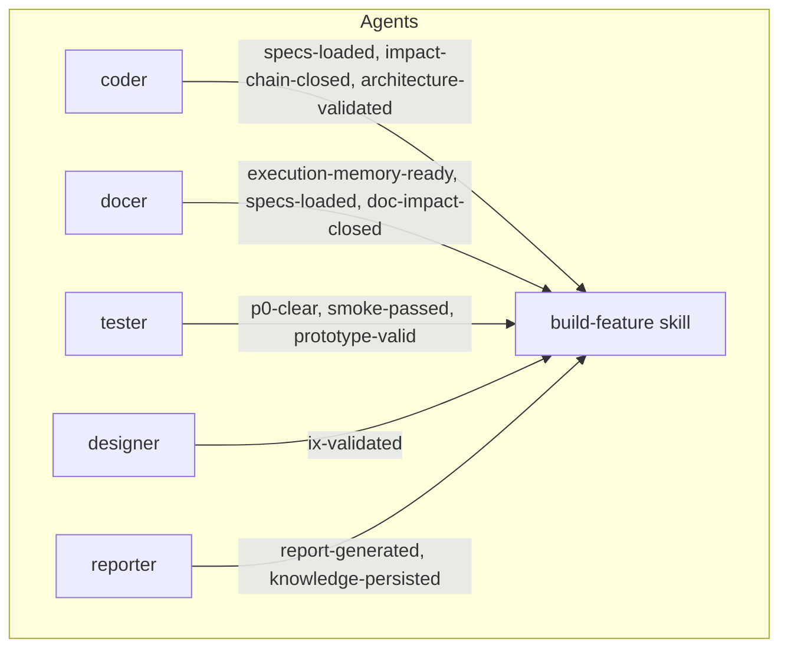

# Skill / Agent Boundaries

> Auto-generated by `scripts/compile-manifests.js` from manifest frontmatter.

## Agent Inventory

| Agent | Role | Triggers |
|-------|------|----------|
| `coder` | Code implementation expert | implement-code Stage 1 (retrieval + architecture + impact analysis), implement-code Stage 3 (per-module impact re-check), generate-document Stage 3 (code context needed) |
| `designer` | Interaction experience designer | generate-document Stage 4 (story interaction walkthrough), implement-code Stage 1 (UI prototype interaction review), implement-code Stage 2 (implementation interaction review) |
| `docer` | Document generation expert | generate-document Stage 0 (adaptive planning), generate-document Stage 1 (document retrieval), generate-document Stage 2 (impact analysis), generate-document Stage 3 (architecture design + code context), init / from-weekly Stage 1 (document retrieval) |
| `reporter` | Process reporting and knowledge curation expert | implement-code Stage 4 (process summary), generate-document post-completion (process reporting + knowledge curation), User explicitly requests experience extraction or knowledge building |
| `tester` | Quality assurance expert | implement-code Stage 2 (UI prototype + E2E test scheme + code review), implement-code Stage 3 (full code review), generate-document Stage 2 (document prototype), generate-document Stage 4 (markdown test + mermaid review + doc review + quality tracking), Pre-commit quality gate, Post-save document review |

## Skill / Agent Pairings

| Skill | Stage | Agent | Purpose |
|-------|-------|-------|---------|
| `build-feature` | D0 (adaptive-planning) | `docer` | Document generation expert |
| `build-feature` | D1 (discovery) | `docer` | Document generation expert |
| `build-feature` | D2 (document-impact-analysis) | `docer` | Document generation expert |
| `build-feature` | D2 (document-impact-analysis) | `coder` | Code implementation expert |
| `build-feature` | D3 (architecture-design) | `docer` | Document generation expert |
| `build-feature` | D3 (architecture-design) | `coder` | Code implementation expert |
| `build-feature` | D4 (document-generation) | `docer` | Document generation expert |
| `build-feature` | D4 (document-generation) | `tester` | Quality assurance expert |
| `build-feature` | D4 (document-generation) | `designer` | Interaction experience designer |
| `build-feature` | D5 (curation) | `reporter` | Process reporting and knowledge curation expert |
| `build-feature` | D5 (curation) | `docer` | Document generation expert |
| `build-feature` | C0 (code-preflight) | `coder` | Code implementation expert |
| `build-feature` | C0 (code-preflight) | `docer` | Document generation expert |
| `build-feature` | C1 (test-first) | `tester` | Quality assurance expert |
| `build-feature` | C1 (test-first) | `designer` | Interaction experience designer |
| `build-feature` | C2 (code-implementation) | `coder` | Code implementation expert |
| `build-feature` | C2 (code-implementation) | `tester` | Quality assurance expert |
| `build-feature` | C2 (code-implementation) | `designer` | Interaction experience designer |
| `build-feature` | C3 (code-validation) | `tester` | Quality assurance expert |
| `build-feature` | C4 (delivery) | `reporter` | Process reporting and knowledge curation expert |
| `build-feature` | C4 (delivery) | `tester` | Quality assurance expert |

## Gate Coverage

| Gate | Provided By | Consumed By |
|------|-------------|-------------|
| architecture-validated | coder, docer | build-feature::D3, build-feature::C0 |
| diagram-valid | tester | build-feature::D4 |
| doc-impact-closed | docer | build-feature::C0 |
| execution-memory-ready | docer | build-feature::D0 |
| impact-chain-closed | coder, docer | build-feature::D2, build-feature::C0 |
| ix-validated | designer | build-feature::D4, build-feature::C1, build-feature::C2 |
| knowledge-persisted | reporter | build-feature::D5, build-feature::C4 |
| markdown-valid | tester | build-feature::D4 |
| p0-clear | tester | build-feature::D4, build-feature::C1, build-feature::C2, build-feature::C3 |
| prototype-valid | tester | (none) |
| quality-tracked | tester | build-feature::D4, build-feature::C4 |
| report-generated | reporter | build-feature::C4 |
| smoke-passed | tester | build-feature::C3 |
| specs-loaded | coder, docer | build-feature::D1, build-feature::C0 |
