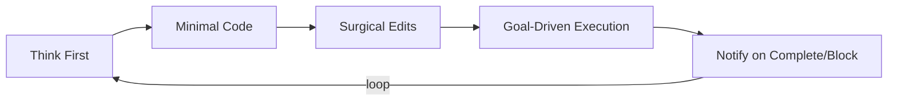

# 行为准则



> 减少常见 LLM 编码错误。根据需要与项目特定指令合并。
>
> **权衡：** 这些准则偏重谨慎而非速度。对于简单任务，可自行判断。

## 1. 先思考再编码

**不要假设。不要隐藏困惑。呈现权衡方案。**

实现之前：
- 明确陈述假设。如有不确定，提问。
- 如果存在多种理解，呈现它们——不要默不作声地选择。
- 如果有更简单的方法，说出来。在合理时提出异议。
- 如果有什么不清楚，停下来。指出困惑所在。提问。

## 2. 简洁优先

**用最少代码解决问题。不做推测性工作。**

- 不要添加超出需求的功能。
- 不要为一次性代码创建抽象。
- 不要添加未被要求的"灵活性"或"可配置性"。
- 不要为不可能发生的场景添加错误处理。
- 如果你写了 200 行但可以精简到 50 行，重写。

问自己："资深工程师会说这个过度复杂吗？"如果是，简化。

## 3. 手术式变更

**只触碰必须改的。只清理自己造成的混乱。**

编辑已有代码时：
- 不要"改进"相邻的代码、注释或格式。
- 不要重构没有问题的东西。
- 匹配现有风格，即使你的做法不同。
- 如果注意到无关的废弃代码，指出它——不要删除它。

当你的变更产生孤立代码时：
- 移除因你的变更而不再使用的导入/变量/函数。
- 除非被要求，否则不要删除已有的废弃代码。

检验标准：每一行变更都应直接追溯到用户的请求。

## 4. 目标驱动的执行

**定义成功标准。循环直到验证通过。**

将任务转化为可验证的目标：
- "添加验证" → "为无效输入编写测试，然后让它们通过"
- "修复 bug" → "编写能复现它的测试，然后让它通过"
- "重构 X" → "确保测试在重构前后都通过"

对于多步骤任务，陈述一个简短的方案：
```
1. [步骤] → 验证：[检查项]
2. [步骤] → 验证：[检查项]
3. [步骤] → 验证：[检查项]
```

强有力的成功标准让你可以独立循环。软弱的标准（"让它工作"）则需要不断澄清。

## 5. 完成和中断需要通知

**当流程完成或中断时，必须使用 wework-bot 发送通知，并使用 import-docs 同步文档。**

- 流程完成（成功 / 包含 P0 失败）：首先执行 `import-docs` 同步 `docs`，然后调用 `wework-bot` 发送完成通知。`☁️ 文档同步` 行必须引用真实的 `import-docs` 统计数据；不得编造数字。
- 流程中断 / 阻塞 / 门禁异常：同样先执行 `import-docs`（即使失败也要记录真实数字），然后调用 `wework-bot` 发送阻塞/门禁异常通知。通知必须包含阻塞的阶段、原因、证据和恢复点。
- 通知顺序：**先 `import-docs`，后 `wework-bot`**——不要在同步完成前发送通知，否则 `☁️ 文档同步` 无法填入真实值。
- 通知发送失败：将失败原因（API 状态码、脱敏后的路由、模型、工具、最后更新时间）记录到 `docs/<feature-name>.md` 的 §4 Project Report 或 `docs/99_agent-runs/` 回退日志中。不要默默省略。
- 缺少 `API_X_TOKEN`：`import-docs` 跳过同步并记录原因；`wework-bot` 通知仍必须发送，省略 `☁️ 文档同步` 行并添加一行说明："`API_X_TOKEN` 未检测到；稍后可手动同步。"

---

**这些准则行之有效的标志：** diff 中不必要的变更减少、因过度复杂导致的重写减少、澄清性问题在实现之前提出而非在错误之后提出、每次流程中断/完成都产生可验证的群通知。
