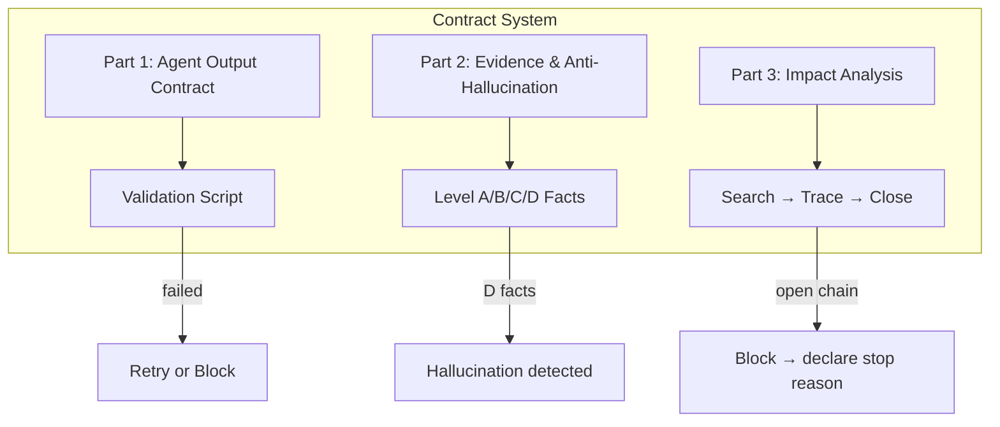

# 契约：输出、证据与影响分析



`rui` 的共享契约。定义 agent 输出格式、事实/证据标准以及全项目影响分析方法。

---

## 第 1 部分：Agent 输出契约

Agent 调用时附加的机器可验证 JSON 附录约定。

### 1. 适用范围

所有被 `rui` 调用的 agent。

`tester` 和 `reporter` agent 的 `required_answers` 数组可以为空 `[]`，但 `artifacts` 仍必须指示关键产物的存在。

### 2. 强制 JSON 附录块

每个 agent 输出必须附加一个 JSON 围栏代码块：

```json
{
  "agent": "docer",
  "contract_version": "1.0",
  "task": {
    "skill": "rui",
    "stage": "stage-1",
    "doc_type": "requirement-document",
    "feature": "Foo-item-filter"
  },
  "required_answers": [
    { "id": "Q1", "answered": true, "evidence": ["skills/rui/rules/docer.md"] }
  ],
  "artifacts": {
    "required_specs": ["skills/rui/rules/docer.md"],
    "optional_specs": []
  },
  "warnings": [],
  "notes": "One-line summary"
}
```

**字段说明**：
- **agent**：必须等于 agent 的 `name`
- **contract_version**：固定为 `"1.0"`
- **task.skill**：`rui`
- **task.stage**：skill 规则中定义的阶段标识符
- **task.doc_type**：目标文档类型；不适用时填写 `"N/A"`
- **required_answers**：agent 所需的全部应答项；每项的 `answered` 必须为 `true`
- **artifacts**：关键产物存在性指示
- **warnings**：非阻塞性风险项
- **notes**：一句话摘要

### 3. 门禁规则（调用方必须执行）

1. 验证 JSON 附录存在且可解析
2. 验证 `agent` 与被调用的 agent 匹配
3. 验证所有 `required_answers` 的 `answered=true`
4. 根据 agent 类型验证产物字段的存在性

**失败处理**：第 1 次 → 就地跟进（仅补充缺失字段）；第 2 次 → agent 调用失败，进入阻塞/降级策略。

### 4. 验证脚本

```bash
node skills/rui/scripts/validate-agent-output.js --agent <name> --file /path/to/output.txt
```

仅验证契约结构和 required-answers 覆盖情况；真实性由下方第 2 部分约束。

---

## 第 2 部分：证据、不确定性与反幻觉

约束任何写入 `docs/` 或影响实现决策的陈述：必须可验证或明确标注为未知。流畅的叙述不能掩盖缺失的证据。

### 2.1 事实等级

| Level | 含义 | 如何撰写 |
|-------|---------|--------------|
| A 已验证 | 可通过 Read/Grep/Glob 验证或已有 `docs/` 锚点 | 直接陈述，给出 `path` 或 `document§section` |
| B 可推导 | 通过明确规则从 A 推导一步得出 | 写"由……可得"，链回 A |
| C 未验证 | 用户口头陈述、未抓取的外部网页、未执行的工具 | 使用 `> 待补充（原因：……）` 或 `等待读者确认` |
| D 禁止 | 无 A/B 支撑且非 C | **不得出现**（视为幻觉） |

从 A 跳到结论而跳过了 B 中的明确规则，使该结论成为 D。

### 2.2 禁止的陈述（D 类）

- 在未执行 Grep/Glob/Read 的情况下写"项目已有模块 X / API Y"
- 写不存在的具体文件路径、导出名、版本号或环境变量名
- 编造依赖关系、测试文件或配置项
- 将未经可用性验证的功能名写成"已选用"

### 2.3 可接纳性

必须同时满足三项：

1. **可验证**：技术语句有来源（`path` 或 `docs/...md` 标题/锚点）；图表节点映射到真实模块或标注为"计划中"
2. **可完成**：所有 C 类项集中列出（待决问题、缺失输入、待用户提供的材料）
3. **可执行**："下一步"绑定到验证方法（命令、要打开的文件或检查项编号）；不能是空洞的口号

### 2.4 修订原则

当历史文档包含 D 类陈述时：不要在没有证据的情况下"顺便修正"领域结论；转为 C 类并标记为需要人工确认或代码验证。

**信源优先级**：`skills/.../SKILL.md` > 本文件及 `rules/*.md` > 其他说明性 README。

---

## 第 3 部分：全项目影响分析

`rui` 的共享影响分析方法（document + code mode）。

### 3.1 核心原则

1. **全项目范围**：默认搜索整个仓库，而非仅 `src/` 或当前模块
2. **依赖图闭包**：每个变更点必须追踪"依赖谁，被谁依赖"直到闭合或声明停止原因
3. **反向依赖优先**：删除/重命名/修改公共接口前，证明所有调用方均已覆盖
4. **传递性影响必须追踪**：如果直接命中充当次级 API、桶导出、全局注册，则继续追踪
5. **事实来自工具**：从实际搜索/文件读取中引用关系；不得凭记忆填充
6. **遗漏记录在案**：每个搜索词必须记录；无命中 → "未找到引用" + 影响说明
7. **交叉校验**：document mode 提供预测；code mode 必须在实际变更前后重新检查

### 3.2 搜索范围

**包含**：源代码（src/、components、Store、composables、services、utils、styles）、测试（tests/）、文档（docs/）、agents/ 规则、skills/ 规则、配置与构建（package.json、routing、CI、aliases）、项目根目录的运行/构建文件。

**排除**：node_modules/、dist/、build/、.git/、锁文件、二进制资源。

### 3.3 必需维度

| 维度 | 闭合标准 |
|-----------|-----------------|
| 直接引用 | 每个搜索词有命中或"未找到引用" |
| 上游依赖 | 上游变更风险标注（同步修改 / 保持兼容 / 仅验证） |
| 反向依赖 | 所有调用方处置方式明确 |
| 传递依赖 | 二级及以上影响已闭合或声明停止原因 |
| 导出链 | 导出入口与所有导入端一致 |
| 注册链 | 注册点、消费点、注册顺序已验证 |
| 数据流 | 载荷/返回字段与所有消费者一致 |
| 类型与契约 | 类型、文档示例、mock 与实现一致 |
| 样式影响 | 模板、:class、classList 全部覆盖 |
| 测试与文档 | 需添加/更新/回归的测试和文档已列出并标注处置方式 |
| 配置与构建 | 本地运行、构建、CI 无断链 |
| 外部依赖 | 新增/升级的依赖有来源、目的、风险、回退方案 |

### 3.4 分析步骤

1. 列出所有拟变更点：文件、导出、函数、组件、Store、路由、事件、CSS、配置、依赖
2. 构建搜索词集合：名称、别名、路径、标签名、事件名、路由名、字符串键、CSS token、环境变量、包名
3. 先搜索变更点本身，再搜索导出入口、注册入口、公共聚合入口
4. 全项目搜索每个词：记录命中文件、行号、引用方式、影响级别、证据
5. 判断直接命中是否具有次级影响（进一步的导出/注册/转发/测试依赖）
6. 继续搜索次级影响直到链闭合；声明停止原因
7. 标注处置方式：同步修改、保持兼容、补充验证、人工审核、无需操作
8. 实现后使用实际 diff 重新执行步骤 2–7

### 3.5 输出格式

四个必需部分：

1. **搜索词与变更点列表**：变更点 / 类型 / 搜索词 / 来源 / 备注
2. **变更点影响链**：变更点 / 搜索词 / 命中文件 / 引用方式 / 影响级别 / 依赖方向 / 处置 / 闭合 / 说明
3. **依赖闭合摘要**：变更点 / 上游已验证 / 反向已验证 / 传递已闭合 / 测试/文档/配置已覆盖 / 结论
4. **未覆盖风险**：风险来源 / 原因 / 影响 / 缓解措施

### 3.6 P0 门禁

- 在完成全项目搜索之前，不得生成设计结论或开始实现
- 未输出搜索词与变更点列表，不得声称影响分析完成
- 在分析上游/反向/传递依赖之前，不得删除/重命名/修改公共接口
- 在分析导出链、注册链、测试、文档、配置之前，不得修改 Store/事件/路由/全局组件/构建配置
- 当存在未处理的"同步修改"或"阻塞"项时，写出阻塞原因或待处理列表
- 实现后未使用实际 diff 进行回归搜索，不得进入最终总结

---

## 第 4 部分：约定与术语

### 信源优先级

1. `SKILL.md`
2. `shared/contracts.md`
3. `agents/<name>/AGENT.md`
4. `templates/*.md`
5. `README.md`

Template 不得覆盖 Spec。

### 术语

- **Spec**：定义章节结构、必需字段和禁止项的强约束
- **Template**：仅提供起始骨架的弱约束
- **Gate**：P0=阻塞, P1=建议修复, P2=可选优化
- **Grounding**：所有技术事实必须可追溯到上游文档或代码
- **全项目影响链分析**：搜索上游、反向、传递依赖、导出链、注册链、测试、文档、配置及外部依赖

### Gate 分类法

| Gate ID | 含义 | 提供方 |
|---------|------|--------|
| `execution-memory-ready` | 执行记忆已读取 | docer |
| `specs-loaded` | 规范已识别 | coder, docer |
| `impact-chain-closed` | 影响链已闭合 | coder, docer |
| `architecture-validated` | 架构已验证 | coder, docer |
| `p0-clear` | 零 P0 问题 | tester |
| `diagram-valid` | Mermaid 语法正确 | tester |
| `markdown-valid` | Markdown 结构正确 | tester |
| `quality-tracked` | P0/P1/P2 已统计 | tester |
| `knowledge-persisted` | 知识已沉淀 | reporter |
| `report-generated` | 报告已生成 | reporter |
| `smoke-passed` | 冒烟测试通过 | tester |
| `doc-impact-closed` | 文档影响已闭合 | docer |
| `prototype-valid` | 原型有效 | tester |

### 回退路径

当 skill 无法写入目标产物时：`docs/99_agent-runs/<YYYYMMDD-HHMMSS>_<skill-name>.md`
