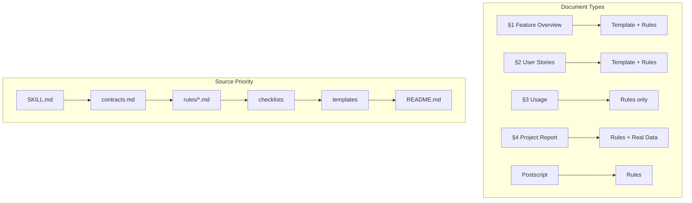

# 约定：文档、路径与术语

`.claude` 文档系统的共享约定。定义文档类型、路径记法标准以及信源优先级。

---

## 第 1 部分：文档类型矩阵与术语

### 1.1 文档类型矩阵

| Type | Spec | Template | Path | Notes |
|------|------|----------|------|-------|
| Feature Overview（§1） | `skills/build-feature/rules/docer.md` | 允许 | `docs/<feature-name>.md` §1 | 问题、范围、Story Map |
| User Stories（§2） | `skills/build-feature/rules/docer.md` + `coder.md` + `tester.md` | 允许 | `docs/<feature-name>.md` §2 | 每个故事自包含：需求+设计+任务+AC |
| Usage（§3） | `skills/build-feature/rules/docer.md` | 未提供 | `docs/<feature-name>.md` §3 | 跨故事操作指南 |
| Project Report（§4） | `skills/build-feature/rules/reporter.md` | 未提供 | `docs/<feature-name>.md` §4 | 基于真实变更数据 + 故事 AC 验证汇总 |
| 后记 | `skills/self-improving/rules/collection-contract.md` | 未提供 | `docs/<feature-name>.md` 末尾 | 工作流审查 + 架构演进 + 后续故事 |
| 周报 | `skills/build-feature/rules/reporter.md` | 禁用 | `docs/weekly/<natural-week>/weekly.md` | 单一文档，规范驱动 |

### 1.2 术语

- **Spec**：定义章节结构、必需字段和禁止项的强约束
- **Template**：仅提供起始骨架的弱约束
- **Checklist**：按 P0/P1/P2 分级的验收维度
- **Full-set**：位于 `docs/<feature-name>.md` 的单个文档，以用户故事为单位组织，包含所有章节
- **Story unit**：每个用户故事自包含需求、设计、任务和可测试验收标准
- **Grounding**：所有技术事实必须可追溯到上游文档或代码
- **Run/Block Log**：当 skill 无法写入目标产物时，必须将 Markdown 记录写入 `docs/99_agent-runs/`
- **全项目影响链分析**：依据 `contracts.md` 第 3 部分——将搜索上游、反向、传递依赖、导出链、注册链、测试、文档、配置以及外部依赖影响作为 P0 前置条件
- **证据与不确定性**：依据 `contracts.md` 第 2 部分的可接纳、可验证陈述

### 1.3 信源优先级

1. `SKILL.md`
2. `shared/contracts.md`（与 `rules` 冲突时，本矩阵未覆盖的禁止性条款优先）
3. `rules/*.md`
4. `checklists/*.md`
5. `templates/*.md`
6. `README.md`

Template 不得覆盖 Spec。

---

## 第 2 部分：路径与链接约定

### 2.1 稳定入口点

- Skills 目录：`.claude/skills/<skill-name>/`
- Skills 信源：`.claude/skills/<skill-name>/SKILL.md`
- Agents 目录：`.claude/agents/<agent-name>.md`
- Commands 目录：`.claude/commands/<command-name>.md`

### 2.2 废弃路径（禁止使用）

不得在任何规则、模板或 README 中出现：
- `.claude/skills/build-feature/SKILL.md`
- `.claude/rules/...`
- `.claude/templates/...`
- `.claude/skills/checklist/...`

### 2.3 从 `docs/` 文档引用 `.claude`

使用从当前文件到仓库根目录的相对路径：
- **1 层深度**（`docs/<feature-name>.md`）：`../.claude/skills/build-feature/SKILL.md`
- **3 层深度**（`docs/weekly/<natural-week>/`）：`../../../.claude/skills/build-feature/SKILL.md`
- **4 层及以上深度**：每层添加 `../`

### 2.4 回退路径

当 skill 无法写入目标产物时：
- `docs/99_agent-runs/<YYYYMMDD-HHMMSS>_<skill-name>.md`

### 2.5 内部交叉引用

优先使用从当前文件位置出发的相对路径。不要创建别名目录。

### 2.6 链接治理

- 仅链接到仓库中确实存在的 skill、agent、规则、模板、检查清单和评估文件
- 如果某项能力没有专用入口，写"未提供专用入口"——不得编造
- 目录结构变更后，执行全仓库 `.claude/` 链接回归搜索

---

## 第 3 部分：Gate 分类法

| Gate ID | 含义 | 提供方 |
|---------|------|--------|
| `execution-memory-ready` | 执行记忆已读取 | docer |
| `specs-loaded` | 规范已识别 | coder, docer |
| `impact-chain-closed` | 影响链已闭合 | coder, docer |
| `architecture-validated` | 架构已验证 | coder, docer |
| `p0-clear` | 零 P0 问题 | tester |
| `diagram-valid` | Mermaid 语法正确 | tester |
| `markdown-valid` | Markdown 结构正确 | tester |
| `quality-tracked` | P0/P1/P2 已统计 | tester |
| `knowledge-persisted` | 知识已沉淀 | reporter |
| `report-generated` | 报告已生成 | reporter |
| `smoke-passed` | 冒烟测试通过 | tester |
| `doc-impact-closed` | 文档影响已闭合 | docer |
| `prototype-valid` | 原型有效 | tester |

### 清单：Skill 与 Agent 分离

| Skill | 阶段 | Agent | 用途 |
|-------|------|-------|------|
| `build-feature` | D0 | `docer` | 自适应规划 |
| `build-feature` | D1 | `docer` | 规范获取 |
| `build-feature` | D2 | `docer`, `coder` | 影响分析 |
| `build-feature` | D3 | `docer`, `coder` | 架构设计 |
| `build-feature` | D4 | `docer`, `tester` | 文档生成+三层审查 |
| `build-feature` | D5 | `reporter`, `docer` | 知识沉淀 |
| `build-feature` | C0 | `coder`, `docer` | 预检+双边影响分析 |
| `build-feature` | C1 | `tester` | Gate A 测试先行 |
| `build-feature` | C2 | `coder`, `tester` | 逐模块实现+审查 |
| `build-feature` | C3 | `tester` | Gate B 冒烟测试 |
| `build-feature` | C4 | `reporter`, `tester` | 总结+交付+通知 |
