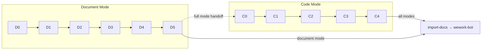

---
paths:
  - "shared/framework/lifecycle-templates/build-feature-pipeline.md"
---

# 生命周期模板：Build-Feature Pipeline



**继承自**：`default-pipeline`

此模板合并了 `code-pipeline` 和 `document-pipeline` 的规则，并增加了模式选择和跨管线交接协议。使用此模板的 skill 在其前置元数据中声明 `lifecycle: build-feature-pipeline`。

---

## 0. 模式选择

build-feature 在阶段 0 根据命令和文档状态确定运行模式：

| 模式 | 触发条件 | 活跃阶段 |
|------|---------|---------|
| `document` | `/generate-document <args>` | D0→D1→D2→D3→D4→D5→C4 |
| `code` | `/implement-code <feature>` | C0→C1→C2→C3→C4 |
| `full` | 无已有 P0 文档时自动触发，或显式指定 | D0→...→D5→C0→...→C4 |

模式一旦确定，只执行该模式的活跃阶段。用户可通过 `--doc-only` 或 `--code-only` 覆盖。

## 1. 文档模式专属规则

### 1.1 禁止修改代码

文档模式下不得修改任何源代码文件。发现的代码问题记录为 P1/P2 发现项。

### 1.2 Template 与 Specification 驱动

| 文档类型 | 驱动方式 |
|---------------|-----------|
| Feature Overview（§1） | Template + 规则 |
| User Stories（§2） | Template + 规则（每个故事自包含需求+设计+任务+AC） |
| Usage（§3） | 仅规则 |
| Project Report（§4） | 规则 + 真实变更数据 |
| 后记 | 规则 |

### 1.3 三层审查门禁

阶段 D4 必须按顺序执行：
1. **语法层**（`tester`）：Mermaid 语法审查
2. **质量层**（`tester`）：结构完整性和跨文档一致性
3. **测试层**（`tester`）：链接、代码示例、术语验证

`tester` 同步收集 P0/P1/P2 统计。不得跳过任何审查。

### 1.4 级联刷新规则

| 级别 | 阶段 2 | 阶段 3 | 阶段 4 |
|-------|---------|---------|---------|
| **T1 微小** | 跳过 | 跳过 | 仅重写变更章节 |
| **T2 局部** | 裁剪 | 裁剪 | 重写目标 + 同步下游条目 |
| **T3 范围** | 完整重跑 | 完整重跑 | 完整级联刷新 |

禁止为节省时间而降级变更级别。

---

## 2. 代码模式专属规则

### 2.1 Git 分支强制

整个 pipeline 必须在分支 `feat/<feature-name>` 上运行，与 `docs/<feature-name>.md` 匹配。禁止在 `main`/`master` 上工作。

### 2.2 Gate A：测试先行

在编写实现代码之前，基于 §2 主要场景生成测试方案和验收标准。在真实入口点验证 MVP 流程并保留证据。

### 2.3 Gate B：冒烟测试

所有模块实现完毕后，AI 必须自动执行完整的主流程冒烟测试。失败阻止进入最终阶段。允许 ≤2 轮修复。

### 2.4 逐模块审查

每个模块编码完成后：
1. 调用 `tester` 进行逐模块代码审查
2. 立即修复 P0 问题。记录 P1/P2 但不阻断
3. 自检：P0 语法已清除 + 架构约束已确认 + `data-testid` 覆盖 + 影响链回归

### 2.5 双边影响分析

代码变更需要同时进行：
- **代码影响分析**（`coder`）：类型变更、测试覆盖、构建配置
- **文档影响分析**（`docer`）：反向依赖、交叉引用、代码示例新鲜度

两项分析在阶段 C0 执行，在阶段 C4 重新审视。

---

## 3. 跨管线交接协议

### 3.1 文档→代码（D5→C0）

全模式下，文档管线完成后自动过渡到代码预检。交接条件：
- 每个 P0 故事的四子节完整（需求+设计+任务+AC）
- §1 Feature Overview 范围边界明确
- 架构设计已通过 `docer` + `coder` 验证
- 文档新鲜度检查：`git status` 确认文档已保存

### 3.2 代码→文档（回写）

代码实现完成后：
- §4 Project Report 必须基于真实 git diff 刷新
- 各故事 AC 表反映实际验证结果

### 3.3 交接失败处理

交接条件不满足时：
- 记录阻断原因和产物
- 生成阻断总结
- 回写状态 → `import-docs` → `wework-bot` 阻断通知

---

## 4. 文档后记（所有模式）

每个生成的文档末尾必须追加三个章节：

1. **后记：后期规划与改进**
2. **工作流标准化审查**（见 `skills/self-improving/rules/collection-contract.md` §3）
3. **系统架构演进思考**（见 `skills/self-improving/rules/collection-contract.md` §4）

代码模式在 §4 Project Report 中追加；文档模式在各文档末尾追加。

---

## 5. 知识沉淀（所有模式）

阶段 D5/C4 之后写入执行记忆：
```bash
node skills/build-feature/scripts/execution-memory.js write /tmp/session-<feature>.json
```

记录：特性指纹、实际变更级别、已调用 Agent 列表、质量问题（P0/P1/P2）、不良案例、是否被阻断。

对于 `weekly` 命令，交付后自动触发自我改进引擎。
