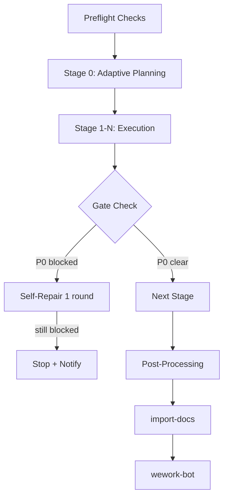

---
paths:
  - "shared/framework/lifecycle-templates/default-pipeline.md"
---

# 生命周期模板：Default Pipeline



这是所有多阶段 skill 继承的基础生命周期模板，除非它们另有指定。它定义了通用机制：预检、逐阶段日志、严重级别门禁、停止条件以及强制的后处理步骤。

继承此模板的 skill（`lifecycle: default-pipeline`）只需在正文中记录其 *delta* 规则。它们不重复这些通用规则。

---

## 预检（阶段 0 之前）

1. **Git 分支检查**（仅 git 仓库）：确保当前分支为 `feat/<feature-name>`。如果不是，则创建或检出。切勿在 `main`/`master` 上工作。
2. **文档前置检查**：验证 P0 前置文档存在。缺少 P0 文档为阻塞条件。
3. **环境探测**：检查必需的环境变量（`API_X_TOKEN`）。缺少 token 可能触发降级（跳过同步，但仍需通知）。
4. **执行记忆加载**：如果 skill 使用自适应规划，在阶段 0 之前读取 `docs/.memory/execution-memory.jsonl`。

---

## 逐阶段机制

### 日志记录（强制）

每次 skill/agent/shared 交互后，追加一条编排日志：

```bash
node skills/build-feature/scripts/log-orchestration.js \
  --skill <skill-name> \
  --kind <skill|agent|shared|other> \
  [--name <identifier>] \
  [--scenario "<operation context>"] \
  [--case <good|bad|neutral>] \
  [--tags "<tag1,tag2>"] \
  [--lesson "<improvement note>"] \
  [--text "<one-line summary>"]
```

### 严重级别门禁

- **P0（阻塞）**：必须在保存或推进之前解决。示例：语法错误、缺少必需章节、幻觉事实。
- **P1（警告）**：应当修复，但在时间受限时可推迟。记录并追踪。
- **P2（建议）**：锦上添花的改进。仅追踪用于趋势分析。

某阶段如果任何 P0 门禁未满足则**被阻塞**。skill 必须：
1. 尝试一轮自我修复。
2. 如果仍然被阻塞，将该阶段标记为失败并进入停止条件。

### Agent 输出验证

在采纳 agent 的输出之前，验证其 JSON 契约附录：

```bash
node skills/build-feature/scripts/validate-agent-output.js \
  --agent <agent-name> \
  --text "<raw output>"
```

如果验证失败，携带修正指令重试一次。如果再次失败，视为 agent 调用失败并遵循停止条件。

---

## 后处理（最终阶段之后）

每个 skill 在声明完成之前必须按顺序执行以下两步：

1. **`import-docs`**：将生成或更新的文档同步到外部文档索引。
2. **`wework-bot`**：发送完成、阻塞或门禁失败通知。

这两步均不得跳过、重排序或默默降级。

### 通知内容

wework-bot 消息必须包含：
- **类型**：完成、阻塞或门禁失败。
- **结论**：一句话结果。
- **产物**：已创建或更新的文件列表。
- **指标**：耗时、会话用量、模型名称和工具调用次数。
- **后续行动**：最多 2 条可执行建议。

---

## 停止条件

当以下任何情况发生时，skill 必须停止并生成阻塞总结（特性文档的 §4 Project Report，或等效回退）：

- P0 前置文档缺失。
- 影响链无法闭合且无降级路径。
- P0 审查问题在一轮自我修复后仍无法解决。
- 所有模块均被阻塞。
- Agent 调用连续失败两次。

停止时：
1. 记录阻塞原因和部分产物。
2. 生成阻塞总结。
3. 将阻塞状态写回所有受影响的文档。
4. 执行 `import-docs` + `wework-bot` 并发送阻塞通知。

---

## 增量更新支持

所有 pipeline 支持三个变更级别。使用 document-pipeline 或 code-pipeline 模板的 skill 在这些默认值基础上进行扩展：

| Level | 名称 | 阶段策略 |
|-------|------|----------------|
| T1 | 微观 | 仅重新运行目标阶段。复用之前的影响分析和架构。 |
| T2 | 局部 | 重新运行目标阶段 + 直接受影响的下游阶段。部分影响分析。 |
| T3 | 范围 | 完整重新运行 pipeline。完整影响分析和架构审查。 |

变更级别在阶段 0（自适应规划）中确定，且不得为节省时间而降级。
