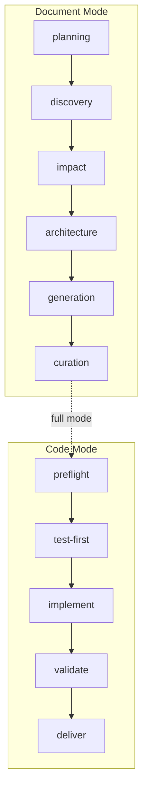

# build-feature README

> 行为真源：[SKILL.md](./SKILL.md)；本文件仅保留快速开始和命令速查。



## 快速开始

```bash
/generate-document init                                    # 项目初始化
/generate-document user-login-phone-otp                     # 功能文档
/generate-document weekly                                  # 本周周报
/generate-document weekly 2026-04-29                       # 指定日期的周报
/generate-document from-weekly docs/weekly/<week>/weekly.md # 从周报拆解为功能文档
/implement-code user-login                                 # 基于文档实现代码
/implement-code list                                       # 列出可用功能文档
/build-feature new-feature --full                          # 全流程（文档 + 代码）
```

- 所有命令均为幂等的；已有文档会被增量更新
- 目标文件：`docs/<feature-name>.md`，以故事为单位组织（§1–§4 + 后记）
- 末尾强制步骤：`import-docs`（同步）→ `wework-bot`（通知）；中断或完成时均不可跳过

## 命令速查表

| 命令 | 模式 | 输出 | 首次运行 | 重复运行 |
|---------|------|--------|-----------|--------|
| `init` | 文档 | 10 基础 + 7 编号文件 | 新建 | 更新事实，保留约定 |
| `<feature-name>` | 文档 | `docs/<feature-name>.md` | 创建完整文档 | 增量更新，级联同步 |
| `weekly [date]` | 文档 | `docs/weekly/<week>/weekly.md` | 新建 | 同周覆写更新 |
| `from-weekly <path>` | 文档 | 多个 `docs/<feature-name>.md` | 创建多个文档 | 每个文档独立更新 |
| `implement-code <feature>` | 代码 | 项目代码 + §4 Project Report | 实现 | N/A（每次独立） |
| `--full` | 全流程 | 文档 + 代码 + 报告 | 完整 SDLC | N/A |

## 文档格式标准

| 标准 | 要求 |
|----------|-------------|
| 表格 | 每份文档 1–3 个（优先合并为主表） |
| Mermaid 图表 | 每份文档 1–4 个 |
| 文本风格 | 简洁；优先目录树 / 表格 / 列表，而非段落 |
| 标题深度 | 最大 H4（仅故事子节） |
| Mermaid 节点 | 包含中文/特殊字符时使用双引号包裹 |

## 文档章节概览

> **以用户故事为单位组织。** 每个故事自包含需求、设计、任务和可测试验收标准。

| 章节 | 内容 | 模式 | 驱动方式 |
|------|---------|------|---------|
| §1 Feature Overview | 问题、范围边界、Story Map | 文档 | Template + 规则 |
| §2 User Stories | 每个故事：需求 → 设计 → 任务 → AC | 文档 | Template + 规则 |
| §3 Usage | 跨故事操作指南、FAQ | 文档 | 仅规则 |
| §4 Project Report | 交付汇总、故事 AC 通过率 | 文档（代码回写） | 规则 + 真实数据 |
| 后记 | 工作流审查、架构演进、后续故事 | 文档 | 规则 |

## 阅读顺序

1. [`SKILL.md`](./SKILL.md) — 模式选择、命令、增量规则、停止条件
2. [`rules/coder.md`](./rules/coder.md) — 编码约束、设计文档规则、阶段状态机
3. [`rules/tester.md`](./rules/tester.md) — Gate A/B、E2E、动态检查清单、三层审查
4. [`rules/docer.md`](./rules/docer.md) — 格式标准、文档编排、init、交接
5. [`rules/reporter.md`](./rules/reporter.md) — 过程总结、项目/周报、日志、交付
6. [`../../shared/contracts.md`](../../shared/contracts.md) — Agent 输出契约与影响分析

## 真源划分

| 文件 | 职责 |
|------|----------------|
| `SKILL.md` | 统一编排器 + 模式选择 |
| `rules/coder.md` | 编码规范 + 设计文档 + 影响分析 + 阶段状态机 |
| `rules/tester.md` | Gate A/B + E2E + 动态检查清单 + 三层审查 |
| `rules/docer.md` | 格式标准 + 文档编排 + init + 跨模式交接 |
| `rules/reporter.md` | 过程总结 + 项目/周报 + 日志 + 交付 |
| `checklists/` | P0/P1/P2 质量检查清单 |
| `templates/` | 功能文档骨架模板 |
| `scripts/` | 自动化工具（日志、记忆、KPI、周报） |
