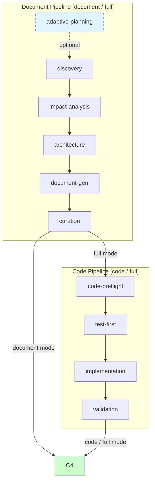

# build-feature



全 SDLC 编排器。所有命令以 `import-docs` → `wework-bot` 收尾。

## 命令

| 命令 | 用途 | 触发的阶段 |
|------|------|-----------|
| `/generate-document <name> [description]` | 生成/更新功能文档 | D0→D1→D2→D3→D4→D5→C4 |
| `/generate-document init` | 项目初始化（跳过 D0/D2/D3） | D1→D4→D5→C4 |
| `/generate-document weekly [date]` | 周报（含 KPI） | D1→D2→D3→D4→D5→C4 |
| `/generate-document from-weekly <path>` | 从周报拆解功能文档（跳过 D3） | D1→D2→D4→D5→C4 |
| `/implement-code <name>` | 基于 `docs/<name>.md` 实现代码 | C0→C1→C2→C3→C4 |
| `/implement-code list` | 列出 `docs/` 下可用文档 | — |
| `/build-feature <name> [--full]` | 全流程（默认 full） | D0→C4 |

所有命令幂等；已有文档增量更新。

## 执行协议

每个阶段按以下协议执行。Agent 按 `agents/<name>/AGENT.md` 定义的角色和约束工作。

### 通用阶段执行循环

```
1. 读取当前阶段定义（本文件 + 对应 agent 的 Phase 描述）
2. 执行阶段工作（搜索/分析/生成/审查）
3. 输出产物 + JSON contract appendix（见 shared/contracts.md §1）
4. 自检 gate 条件
5. 未通过 → 重试 1 次 → 仍失败 → 阻断（见阻断条件表）
6. 通过 → 记录 key-node → 进入下一阶段
```

### 各阶段摘要

| 阶段 | 做什么 | 关键产出 | 前置 |
|------|--------|---------|------|
| D0 | 读 execution-memory，定变更级别 T1/T2/T3 | 执行计划 | 无 |
| D1 | 检索相关规范与文档，交叉验证 | specs 列表 + grounding | D0(可选) |
| D2 | 全项目影响链分析，闭合所有依赖 | 闭合影响链 | D1 |
| D3 | 模块划分、接口规范、数据流（docer+coder 并行） | 架构设计 | D2 |
| D4 | 按模板生成 §1-§4+后记，三层审查 | 完整文档 | D3 |
| D5 | git 持久化 + execution-memory 回写 | 已保存文档 | D4 |
| C0 | 双边影响分析（代码+文档），验证文档 P0 | 锚定报告 | D5(full) 或 docs/ |
| C1 | Gate A：测试方案 + UI 原型 | 测试方案 + 原型 | C0 |
| C2 | 逐模块编码，每模块 code-review → fix P0 → 自检 | 实现代码 | C1 |
| C3 | Gate B：冒烟测试 + 影响链回归 | 冒烟证据 | C2 |
| C4 | §4 报告 + import-docs + wework-bot | 交付制品 | D5/C3 |

### 文档模式专用

**generate-document init**: D1→D4→D5→C4。跳过 D0 (无历史记忆)、D2/D3 (项目初始化无需影响分析和架构设计)。输出: `docs/<project>-overview.md`。

**generate-document weekly**: D1→D2→D3→D4→D5→C4。使用周报模板，采集 KPI (`collect-weekly-kpi.js`)、执行日志 (`collect-weekly-logs.js`)、git log。输出: `docs/weekly/<range>/weekly-report.md`。

**generate-document from-weekly**: D1→D2→D4→D5→C4。解析周报 → 拆解为独立功能文档。跳过 D3 (架构已在周报中)。

### 代码模式专用

**前置**: `docs/<name>.md` 存在，§1 范围边界明确，所有故事四子节完整。

**C2 逐模块循环**: `Pick module → Read existing code → Implement → code-review → Fix P0 → Self-check (syntax/data-testid/impact) → Record → Next module`

### 变更级别 (D0 输出)

| 级别 | 触发条件 | D2 | D3 | D4 |
|------|---------|----|----|-----|
| T1 | typo/格式/emoji | 跳过 | 跳过 | 仅变更章节 |
| T2 | 增删故事/接口变更 | 裁剪 | 裁剪 | 目标章节+下游 |
| T3 | 范围变化/跨故事重构 | 完整 | 完整 | 全级联 |

## 核心规则

### 1. 测试先行 (Gate A / Gate B)
- **Gate A (C1)**: 编码前产出测试计划+原型。未通过则阻断 C2。
- **Gate B (C3)**: 冒烟测试覆盖所有 P0 AC 主路径。>2 轮修复未通过则阻断 C4。

### 2. 双边影响分析 (C0 + C3 回归)
C0 阶段同时分析代码影响和文档影响。C3 完成后基于实际 diff 回归验证。方法见 [`shared/contracts.md`](../../shared/contracts.md#第-3-部分全项目影响分析)。

### 3. 知识沉淀 (D5)
```bash
node skills/build-feature/scripts/execution-memory.js write
```

## 阻断条件

| # | 场景 | 可降级 | 阶段 |
|---|------|--------|------|
| H1 | 功能名称无法解析 | 否 | D0 |
| H2 | P0 章节缺少上游来源 | 否 | D4, C0 |
| H3 | 影响链无法闭合 | 否 | D2, C0 |
| H4 | 文档 P0 不通过且无法自修复 | 否 | D4 |
| H5 | 代码审查 P0 无法修复 | 否 | C2 |
| H6 | Gate A 未完成但已编写代码 | 否 | C1→C2 |
| H7 | Gate B 未通过（>2 轮修复） | 否 | C3→C4 |
| H8 | 所有模块被阻断 | 否 | C2 |
| H9 | `API_X_TOKEN` 缺失 | 是（跳过同步，仍发通知） | C4 |

阻断后: 持久化 → 同步(H9跳过) → 通知 → 回退。

## 文档结构

按 [`templates/feature-document.md`](templates/feature-document.md) 生成：

| 章节 | 内容 | 强制 |
|------|------|------|
| §1 Feature Overview | 问题/范围/成功指标/Story Map | 是 |
| §2 User Stories | 每故事四子节：需求→设计→任务→AC | 是 |
| §3 Usage | 跨故事操作指南/FAQ | 多故事时 |
| §4 Project Report | 交付汇总/AC 通过率 | 是 |
| 后记 | 工作流审查/架构演进/后续故事 | 是 |

## 参考

- **阶段成功标准 + 质量指标**: [`rules/metrics.md`](rules/metrics.md)
- **Agent 输出契约 + 证据标准 + 影响分析方法**: [`shared/contracts.md`](../../shared/contracts.md)
- **文档模板**: [`templates/feature-document.md`](templates/feature-document.md)
- **脚本**: [`scripts/`](scripts/)
