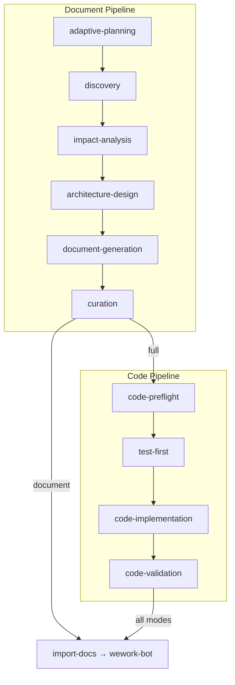

# build-feature

## 定位

`build-feature` 是全 SDLC 编排器：文档生成 → 代码实现 → 交付。

**何时使用**: 功能文档、代码实现、端到端特性交付、周报、项目初始化
**何时不用**: 需求仍在澄清、简单代码补丁、单文件小修

## 命令

| 命令 | 用途 | 模式 |
|------|------|------|
| `/generate-document <name>-<desc>` | 生成/更新功能文档（§1–§4+后记） | document |
| `/generate-document init` | 项目初始化 | document |
| `/generate-document weekly [date]` | 周报 | document |
| `/generate-document from-weekly <path>` | 从周报拆解为功能文档 | document |
| `/implement-code <name>` | 基于文档实现代码 | code |
| `/implement-code list` | 列出可用功能文档 | code |
| `/build-feature <name> [--full\|--doc-only\|--code-only]` | 全流程 | full |

所有命令幂等；已有文档增量更新。末尾强制 `import-docs` → `wework-bot`。

## 模式与阶段

| 模式 | 活跃阶段 | 前置条件 |
|------|---------|---------|
| `document` | D0→D5→C4 | 无（D0 可选） |
| `code` | C0→C4 | `docs/<name>.md` 存在且 P0 章节完整 |
| `full` | D0→C4 | 无已有文档时自动触发 |

阶段成功标准见 [`rules/metrics.md`](rules/metrics.md)。

### 文档章节（以故事为单位）

| 章节 | 内容 | 驱动 |
|------|------|------|
| §1 Feature Overview | 问题、范围边界、成功指标、Story Map | Template |
| §2 User Stories | 每个故事自包含：需求→设计→任务→验收标准 | Template + 规则 |
| §3 Usage | 跨故事操作指南、FAQ | 规则 |
| §4 Project Report | 交付汇总、AC 通过率 | 规则 + git diff |
| 后记 | 工作流审查、架构演进、后续故事 | 规则 |

## 输入前置条件

- **P0（阻断）**: 每个故事四子节完整（需求+设计+任务+AC）；§1 范围边界明确、Story Map 完整
- **P1/P2（非阻断）**: §3 Usage、后记

## 核心规则

### 1. 增量更新

| 变更级别 | D2 | D3 | D4 |
|---------|----|----|-----|
| T1 微观 | 跳过 | 跳过 | 仅变更章节 |
| T2 局部 | 裁剪 | 裁剪 | 重写目标+下游 |
| T3 范围 | 完整重跑 | 完整重跑 | 全级联刷新 |

### 2. 测试先行 (Gate A/B)

- **Gate A**: 编码前，基于 §2 场景产出测试计划，验证 MVP 入口点并保留证据
- **Gate B**: 所有模块完成后，AI 自动执行主流程冒烟。失败（>2 轮修复）阻止进入 C4

### 3. 逐模块审查

每模块编码后：调用 `code-review` → 修复 P0 → 自检（语法/data-testid/影响链）。

### 4. 双边影响分析（C0）

- **代码影响**: 类型变更、测试覆盖、构建配置
- **文档影响**: 反向依赖、交叉引用、代码示例新鲜度
- C3 阶段重新审视两项分析。

### 5. 知识沉淀

从实施中提取可复用模式和陷阱，写入执行记忆：
`node skills/build-feature/scripts/execution-memory.js write`

### 6. 全模式过渡 (D5→C0)

文档管线完成后自动过渡到代码预检。条件：P0 故事四子节完整、§1 范围边界明确、架构已验证、文档已保存。

### 7. 代码→文档回写

C3 完成后：§4 Project Report 基于 git diff 刷新，各故事 AC 反映实际验证结果。

### 8. 周报后处理

`weekly` 命令在交付后触发执行记忆分析和改进建议生成。

## 阻断条件

| # | 场景 | 可降级 |
|---|------|--------|
| H1 | 功能名称无法解析 | 否 |
| H2 | P0 章节缺少上游来源 | 否 |
| H3 | 影响链无法闭合 | 否 |
| H4 | 文档 P0 不通过且无法自修复 | 否 |
| H5 | 代码审查 P0 无法修复 | 否 |
| H6 | Gate A 未完成但已编写代码 | 否 |
| H7 | Gate B 未通过（>2 轮修复） | 否 |
| H8 | 所有模块被阻断 | 否 |
| H9 | `API_X_TOKEN` 缺失 | 是（跳过同步，仍发送通知） |

停止时：持久化 → 同步（H9 跳过）→ 通知 → 回退。
