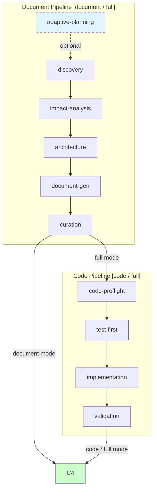

# build-feature



> D0 为可选自适应规划（`init` 跳过）。C4 delivery 为共享出口，document/code/full 三条路径汇聚于此。

## 定位

全 SDLC 编排器：文档生成 → 代码实现 → 交付。所有命令均以 `import-docs` → `wework-bot` 收尾。

**何时使用**: 功能文档、代码实现、端到端特性交付、周报、项目初始化。
**何时不用**: 需求仍在澄清、简单补丁、单文件小修。

## 命令

| 命令 | 用途 | 模式 |
|------|------|------|
| `/generate-document <name> [description]` | 生成/更新功能文档（§1–§4+后记） | document |
| `/generate-document init` | 项目初始化 | document |
| `/generate-document weekly [date]` | 周报（含 KPI 采集 + 执行记忆分析） | document |
| `/generate-document from-weekly <path>` | 从周报拆解为功能文档 | document |
| `/implement-code <name>` | 基于 `docs/<name>.md` 实现代码 | code |
| `/implement-code list` | 列出 `docs/` 下可用的功能文档 | — |
| `/build-feature <name> [--document\|--code\|--full]` | 全流程编排（默认 `--full`） | 对应模式 |
| `/build-feature list` | 列出 `docs/` 下可用的功能文档 | — |

所有命令幂等；已有文档增量更新。

### 命令 → 阶段映射

| 命令 | 触发的阶段 |
|------|-----------|
| `/generate-document <name>` | D0→D1→D2→D3→D4→D5→C4 |
| `/generate-document init` | D1→D4→D5→C4（跳过 D0 执行记忆，D2/D3 裁剪） |
| `/generate-document weekly` | D1→D2→D3→D4→D5→C4（周报模板） |
| `/generate-document from-weekly <path>` | D1→D2→D4→D5→C4（拆解为功能文档，D3 裁剪） |
| `/implement-code <name>` | C0→C1→C2→C3→C4 |
| `/build-feature <name> --full` | D0→D1→D2→D3→D4→D5→C0→C1→C2→C3→C4 |

## 模式与管线

| 模式 | 活跃阶段 | 前置条件 |
|------|---------|---------|
| `document` | D0→D5→C4 | 无（D0 可选） |
| `code` | C0→C4 | `docs/<name>.md` 存在且 §1（范围边界 + Story Map）与 §2（所有故事四子节完整）通过 P0 验证 |
| `full` | D0→C4 | 无已有文档时自动触发 |

### 文档管线 (D0–D5)

| 阶段 | 输入 | 做什么 | 关键产出 |
|------|------|--------|---------|
| D0 Adaptive Planning | 用户命令 | 读取执行记忆，确定变更级别 (T1/T2/T3) | 执行计划 |
| D1 Discovery | 特性名称 + 执行计划 | 检索相关规范与已有文档 | 规范列表 + grounding 记录 |
| D2 Impact Analysis | 规范列表 | 全项目影响链分析，参见 [`shared/contracts.md`](../../shared/contracts.md#第-3-部分全项目影响分析) | 闭合影响链 |
| D3 Architecture | 闭合影响链 | 模块划分、接口规范、数据流设计 | 架构设计 |
| D4 Document Generation | 架构设计 + 上游产物 | 按模板生成 §1–§4+后记，三层审查 | 完整功能文档 |
| D5 Curation | 完整文档 | `git` 持久化 + 执行记忆回写 | 已保存文档 |

### 代码管线 (C0–C3)

| 阶段 | 输入 | 做什么 | 关键产出 |
|------|------|--------|---------|
| C0 Preflight | `docs/<feature>.md` | 双边影响分析（代码 + 文档），验证文档 P0 完整 | 锚定报告 |
| C1 Test-First | 锚定报告 + §2 场景 | Gate A：基于 §2 场景产出测试计划与原型页 | 测试方案 + 原型 |
| C2 Implementation | 测试方案 + 架构设计 | 逐模块编码，每模块后调 [`code-review`](../code-review/SKILL.md) → 修复 P0 → 自检 | 实现代码 + 审查记录 |
| C3 Validation | 实现代码 | Gate B：冒烟测试 + 影响链回归 → 回写 §4 与各故事 AC | 冒烟证据 + AC 更新 |

### 文档章节结构

| 章节 | 内容 | 来源 |
|------|------|------|
| §1 Feature Overview | 问题、范围边界、成功指标、Story Map | 模板 |
| §2 User Stories | 每故事自包含：需求→设计→任务→AC（四子节） | 模板 + 影响分析 |
| §3 Usage | 跨故事操作指南、FAQ | 按需（多故事共用时填写） |
| §4 Project Report | 交付汇总、AC 通过率 | git diff + 验证结果 |
| 后记 | 工作流审查、架构演进、后续故事 | 执行记忆分析 |

## 核心规则

### 1. 增量更新

已有文档被修改时按变更级别裁剪重跑范围：

| 级别 | 触发条件 | D2 | D3 | D4 |
|------|---------|----|----|-----|
| T1 微观 | 措辞、emoji、格式修正 | 跳过 | 跳过 | 仅变更章节 |
| T2 局部 | 增删故事/FP、接口变更 | 裁剪 | 裁剪 | 重写目标章节 + 下游 |
| T3 范围 | 范围边界变化、跨故事重构 | 完整重跑 | 完整重跑 | 全级联刷新 |

> 反例：修一个 typo 不会触发全流程重跑。

### 2. 测试先行 (Gate A / Gate B)

- **Gate A (C1)**: 编码前基于 §2 场景产出测试计划。未通过则阻断 C2。
- **Gate B (C3)**: 所有模块完成后 AI 自动执行主流程冒烟。>2 轮修复未通过则阻断 C4。

> 反例：单行 CSS 修复不需要 Gate A 测试计划。

### 3. 逐模块审查 (C2)

每个模块编码完成后：调用 [`code-review`](../code-review/SKILL.md) → 修复所有 P0 → 自检（语法 / data-testid / 影响链回归）。任一模块 P0 未清零则阻断 C3。

### 4. 双边影响分析 (C0 + C3 回归)

C0 阶段同时分析：
- **代码影响**: 类型变更、测试覆盖、构建配置
- **文档影响**: 反向依赖、交叉引用、代码示例新鲜度

C3 完成后基于实际 diff 重新验证。方法见 [`shared/contracts.md`](../../shared/contracts.md#第-3-部分全项目影响分析)。

### 5. 知识沉淀 (D5)

从实施中提取可复用模式和陷阱，写入执行记忆：
```
node skills/build-feature/scripts/execution-memory.js write
```

## 阻断条件

所有阻断发生后执行：持久化 → 同步（H9 跳过）→ 通知 → 回退。

| # | 场景 | 可降级 | 阶段 |
|---|------|--------|------|
| H1 | 功能名称无法解析 | 否 | D0 |
| H2 | P0 章节缺少上游来源 | 否 | D4, C0 |
| H3 | 影响链无法闭合 | 否 | D2, C0 |
| H4 | 文档 P0 不通过且无法自修复 | 否 | D4 |
| H5 | 代码审查 P0 无法修复 | 否 | C2 |
| H6 | Gate A 未完成但已编写代码 | 否 | C1→C2 |
| H7 | Gate B 未通过（>2 轮修复） | 否 | C3→C4 |
| H8 | 所有模块被阻断 | 否 | C2 |
| H9 | `API_X_TOKEN` 缺失 | 是（跳过同步，仍发通知） | C4 |

## 参考

- **阶段成功标准 + 质量指标**: [`rules/metrics.md`](rules/metrics.md)
- **Agent 输出契约 + 证据标准 + 影响分析方法**: [`shared/contracts.md`](../../shared/contracts.md)
- **文档模板**: [`templates/feature-document.md`](templates/feature-document.md)
- **脚本**: [`scripts/`](scripts/)
