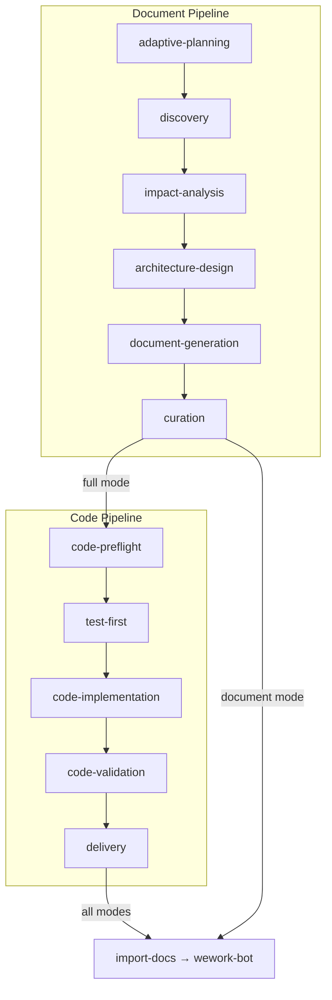

# build-feature



## 定位

`build-feature` 是全 SDLC 编排器：文档生成 → 代码实现 → 交付。支持三种运行模式，覆盖从需求到上线的完整流程。

### 何时使用

- 需要生成功能文档（文档模式）
- 需要基于文档实现代码（代码模式）
- 需要端到端完成整个特性（全模式）
- 需要生成周报或项目初始化

### 何时不使用

- 用户仍在澄清原始需求（先做快速问答）
- 仅需简单代码补丁（直接修改）
- 仅需单文件小修（直接编辑）

---

## 模式选择

| 模式 | 触发命令 | 活跃阶段 | 前置条件 |
|------|---------|---------|---------|
| `document` | `/generate-document <args>` | D0→D1→D2→D3→D4→D5→C4 | 无（D0 可选） |
| `code` | `/implement-code <feature>` | C0→C1→C2→C3→C4 | `docs/<feature-name>.md` 存在且 P0 章节完整 |
| `full` | 无已有文档时自动触发 | D0→...→D5→C0→...→C4 | 无 |

模式在阶段 D0/C0 确定。用户可通过 `--doc-only` 或 `--code-only` 强制子集。

### 文档章节矩阵

> **以用户故事为单位组织。** 每个故事自包含需求、设计、任务和可测试验收标准。

| 章节 | 内容 | 模式 | 驱动方式 |
|------|---------|------|---------|
| §1 Feature Overview | 问题、范围边界、成功指标、Story Map | 文档 | Template + 规则 |
| §2 User Stories | 每个故事：需求 → 设计 → 任务 → 验收标准 | 文档 | Template + 规则 |
| §3 Usage | 跨故事操作指南、FAQ | 文档 | 仅规则 |
| §4 Project Report | 交付汇总、故事验收通过率 | 文档（代码回写） | 规则 + 真实变更数据 |
| 后记 | 工作流审查、架构演进、后续故事 | 文档 | 规则 |

---

## 输入前置条件

### P0（缺失则阻断）

- Story N 四子节完整（需求 + 设计 + 任务 + 验收标准均填写）
- §1 Feature Overview — 范围边界明确、Story Map 完整

### P1/P2（非阻断）

- §3 Usage — 跨故事操作指南
- 后记 — 工作流审查与架构演进

---

## 阶段成功指标

| 阶段 | 模式 | 输入 | 成功标准（可度量） | 产出物 | 阻断条件 |
|------|------|------|-------------------|--------|----------|
| D0 | 文档 | 用户命令 | 执行计划已输出，变更级别已确定 | 执行计划 | 功能名称无法解析 |
| D1 | 文档 | 特性名称 | ≥1 条相关规范被检索到 | 规范列表 | 规范获取失败且无法降级 |
| D2 | 文档 | 上游文档 | 影响链表 ≥ 3 行，闭合标记 = ✅ | 影响分析表 | 未闭合的阻断依赖 |
| D3 | 文档 | 影响分析 | 模块表 ≥ 2 行，接口规范非空 | 架构设计 | Agent 调用失败 ×2 |
| D4 | 文档 | 架构设计 | §1-§4+后记已生成，所有故事四子节完整 | 完整文档 | 故事 P0 不通过且无法自修复 |
| D5 | 文档 | 完整文档 | `git status` 显示 docs/ 有变更 | 已保存文档 + 执行记忆 | 保存失败 |
| C0 | 代码 | 文档 | P0 章节完整，影响链已闭合 | 锚定报告 | P0 文档缺失 |
| C1 | 代码 | 场景 | Gate A 通过 + evidence 路径非空 | 测试方案 + 原型页 | Gate A 未通过 |
| C2 | 代码 | 设计文档 | 逐模块实现完成、P0 清零，影响链回归记录完整 | 实现代码 + 审查记录 | ≥1 个 P0 仍 ❌ |
| C3 | 代码 | 代码 | Gate B 通过、所有 P0 AC 验证回写 | 冒烟证据 + AC 更新 | Gate B 未通过 |
| C4 | 代码/文档 | 代码/文档 | §4 Project Report 已生成、通知已发送 | 交付制品 + import-docs | import-docs 失败且无法降级 |

---

## 命令

### 功能文档

```
/generate-document <feature-name>-<description>
```

生成/更新 `docs/<feature-name>.md`（§1–§4 + 后记）。幂等；已有文档增量更新。

### 项目初始化

```
/generate-document init
```

完整规范见 `rules/docer.md` §8。

### 周报

```
/generate-document weekly [YYYY-MM-DD]
```

### 周报分解

```
/generate-document from-weekly docs/weekly/<week>/weekly.md
```

### 代码实现

```
/implement-code <feature-name>
```

列出可用功能：`/implement-code list`

### 全流程（新增）

```
/build-feature <feature-name> [--full|--doc-only|--code-only]
```

---

## 增量规则

### 1. 文档后记（所有模式）

每份生成的文档末尾必须追加后记、工作流标准化审查和系统架构演进思考三个章节。格式详见 `skills/self-improving/rules/collection-contract.md`。

### 2. 更新模式快捷路径

| 变更级别 | 阶段 D2 | 阶段 D3 | 阶段 D4 |
|--------------|---------|---------|---------|
| T1 微观 | 跳过 | 跳过 | 仅重写变更章节 |
| T2 局部 | 裁剪 | 裁剪 | 重写目标 + 同步下游 |
| T3 范围 | 完整重跑 | 完整重跑 | 全级联刷新 |

### 3. 逐模块审查（代码模式）

每个模块编码完成后：调用 `code-review` 技能 → 立即修复 P0 → 自检（语法/data-testid/影响链）。

### 4. 双边影响分析（代码模式）

- **代码影响分析**：类型变更、测试覆盖、构建配置
- **文档影响分析**：反向依赖、交叉引用、代码示例新鲜度

两项分析在 C0 执行，在 C3 重新审视。

### 5. 测试先行 Gate A

编写实现代码之前，基于 §2 场景产出测试计划。在真实入口点验证 MVP 并保留证据。详见 `rules/tester.md` §2。

### 6. 冒烟测试 Gate B

所有模块完成后 AI 自动执行主流程冒烟。失败阻止进入 C4。详见 `rules/tester.md` §2.3。

### 7. 知识沉淀

从实施中提取可复用模式和陷阱记录。写入执行记忆：`node skills/build-feature/scripts/execution-memory.js write`

### 8. 周报自我改进触发

`weekly` 命令在交付后触发：
1. 执行记忆分析：`node skills/build-feature/scripts/self-improve.js`
2. 每文档反思聚合：调用 `self-improving` 技能收集标准化章节

---

## 跨管线交接

### 全模式 D5→C0 过渡

文档管线完成后自动过渡到代码预检。检查条件：
- 每个 P0 故事的四子节完整（需求+设计+任务+验收）
- §1 Feature Overview 范围边界明确
- 架构设计已通过验证
- 文档已保存

### 代码→文档回写

代码完成后：§4 Project Report 基于真实 git diff 刷新、各故事 AC 反映实际验证结果。

---

## 阻断/停止条件

| # | 场景 | 可降级？ |
|---|----------|-------------|
| H1 | 功能名称无法解析 | 否 |
| H2 | P0 章节缺少上游来源 | 否 |
| H3 | 影响链无法闭合 | 否 |
| H4 | 文档 P0 不通过且无法自修复 | 否 |
| H5 | 代码审查 P0 无法修复 | 否 |
| H6 | Gate A 未完成但已编写代码 | 否 |
| H7 | Gate B 未通过（超 2 轮修复） | 否 |
| H8 | 所有模块被阻断 | 否 |
| H9 | `API_X_TOKEN` 缺失 | 是（跳过同步，仍发送通知） |

停止时：持久化 → 同步（H9 跳过）→ 通知 → 回退。阻断总结格式见 `rules/reporter.md`。

---

## 支持文件

```
skills/build-feature/
├── SKILL.md           # 入口 + 清单（本文件）
├── README.md          # 快速开始 + 命令速查
├── checklists/        # 按类型的 P0/P1/P2 检查清单
│   ├── coder.md
│   ├── docer.md       # 含跨检查清单一致性表
│   ├── tester.md
│   └── reporter.md
├── rules/             # 按角色的规范：coder / docer / tester / reporter
│   ├── coder.md       # 编码 + 设计文档 + 影响分析 + 阶段状态机
│   ├── docer.md       # 格式标准 + emoji 体系 + 文档编排 + 检查清单索引
│   ├── tester.md      # Gate A/B + 动态检查清单 + 三层审查
│   ├── reporter.md    # 过程总结 + 项目/周报 + 日志 + 交付
│   └── metrics.md     # 可量化质量指标与评分
├── templates/
│   ├── feature-document.md          # 完整模板（§1-§4 + 后记）
│   └── feature-document-minimal.md  # 轻量模板（T1/T2 更新）
└── scripts/           # 编排工具脚本
    ├── validate-agent-output.js
    ├── validate-agent-contracts.js
    ├── log-orchestration.js
    ├── log-key-node.js
    ├── log-agent-run.js
    ├── execution-memory.js
    ├── self-improve.js
    ├── collect-weekly-kpi.js
    ├── collect-weekly-logs.js
    ├── draft-weekly-report.js
    ├── natural-week.js
    └── append-key-node.js
```
