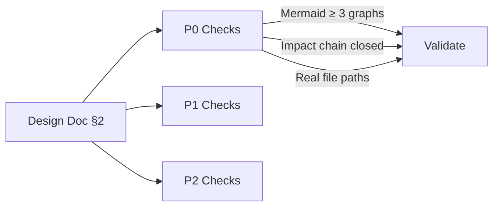

# Coder 检查清单

代码、设计及影响分析质量关卡，覆盖文档模式和代码模式。

---

## 设计文档（§2）

> **相关规范**: [设计文档规范](../rules/coder.md#8-设计文档文档-2) | [通用文档检查清单](./docer.md#general-document)

### P0 — 必须通过

- 设计概述和架构设计章节存在
- Mermaid 图表：`grep -c '\`\`\`mermaid' §3` = 3（graph TB + flowchart TD + sequenceDiagram）
- 架构图节点 ≥ 5 个，含分层子图（subgraph）
- 影响分析章节存在，包含合并主表
- 影响链基于实际搜索：每行有真实文件路径（`test -f <path>` 为真）
- 依赖关系已闭合，每行闭合标记 = ✅
- 变更范围汇总存在
- 表格：1–3 个
- 使用目录树组织文件/代码路径

### P1 — 应当通过

- 影响链各维度和处置方法已完整标注
- 模块划分表和核心流程图存在
- Mermaid 图表有说明（每个 1–2 行）
- 前后对比清晰
- 关键代码说明存在（30–50 行）
- 场景实现包含关键代码路径和验证点

### P2 — 锦上添花

- 设计原则列表存在
- Mermaid 节点风格一致
- 测试考量完整

---

## 需求文档与场景（§1）

> **相关规范**: [需求文档规范](../rules/docer.md#6-需求文档1) | [通用文档检查清单](./docer.md#general-document)

### P0 — 必须通过

- 用户故事表存在且列数 = 8
- 优先级图标已使用（🔴🟡🟢）
- 主操作场景：`grep -c '🔴 P0' §2` ≥ 2，`grep -c '🟡 P1' §2` ≥ 1
- Mermaid 图表：`grep -c '\`\`\`mermaid' §2` = 3（graph TB + flowchart TD + sequenceDiagram）
- 每个 Mermaid 下方有 1-2 行说明文字
- 影响分析章节存在，包含合并主表
- 影响链基于实际搜索（路径和行号来自真实搜索，非估算）
- 依赖关系已闭合
- 变更范围汇总存在
- 零占位符：`grep -c '{' §2` = 0

### P1 — 应当通过

- 完整时序图存在
- 特性详情、验收标准（按 P0/P1/P2 分级且可测试）和使用场景章节存在
- 使用场景格式标准
- 操作场景包含前置条件、操作步骤、预期结果和验证重点

### P2 — 锦上添花

- 设计文档关联明确

---

## 代码实现

> **相关规范**: [编码规范](../rules/coder.md) | [Gate A/B 规范](../rules/tester.md)

### P0 — 必须通过

- 架构确认：设计文档模块划分、接口规范已完成
- 环境预检：依赖安装、构建工具可用
- 全项目影响链闭合分析通过
- Hooks 三文件模式完整（store / useComputed / useMethods）
- data-testid 完整（与原型页面一致）
- P0 语法错误已消除
- 入口初始化/挂载完整（遵循项目 `initApp` 模式）
- Gate B 冒烟测试通过

### P1 — 应当通过

- 逐模块审查完成（`code-review` 技能通过）
- 共享组件导出与注册一致
- 影响链回归验证完成（基于真实 diff）
- 代码风格合规

### P2 — 锦上添花

- 代码注释完整
- 性能优化到位
