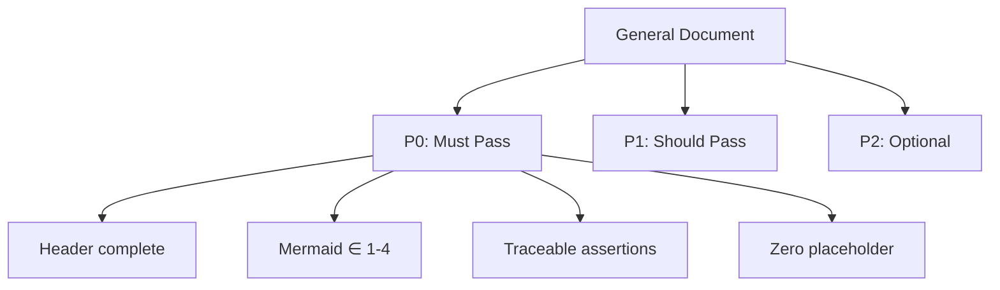

# Docer 检查清单

文档结构、格式和内容质量关卡，适用于 build-feature 文档模式。

---

## 通用文档

> **相关规范**: [通用文档规范](../rules/docer.md) | [证据与不确定性](../../../shared/contracts.md)

### P0 — 必须通过

- 文档头部结构完整：`grep -c 'v[0-9]' header` ≥ 1 且 header 行数 = 9
- 版本格式正确：`grep -oP 'v\d+\.\d+' <file>` 存在
- 日期格式正确：`grep -oP '20[2-9]\d-[01]\d-[0-3]\d' <file>` 匹配数 ≥ 1
- 每个 H2 标题有 emoji 前缀：`grep -c '^## 📖\|📋\|📚\|📈\|🔄' <file>` = H2 数量
- Mermaid 图表：`grep -c '\`\`\`mermaid' <file>` ∈ [1, 4]，每个图 ≥ 4 个含文字节点
- 链接使用相对路径：无 `http://` 或 `https://` 出现在 .md 文档交叉引用中
- 技术断言可追溯：每个技术声明段落有内联引用 `[来源](path)` 或 `> 证据: {path}`
- 零虚构：`test -f <each referenced path>` 全部为真
- 零占位符：`grep -c '{' <file>` = 0
- 表格格式规范：`grep -c '^|' <file>` ≥ 3
- H1 唯一；H5+ 不存在：`grep -c '^#####' <file>` = 0

### P1 — 应当通过

- 段落以空行分隔；长度适中（不超过 3–4 行）
- 列表使用恰当
- 代码块有语言标注
- 相关文档存在
- 标题命名清晰

### P2 — 锦上添花

- Mermaid 节点风格一致
- 图标使用统一
- 章节导航
- 重要信息使用引用块

---

## Feature Overview + User Stories

> **相关规范**: [Feature Overview 规范](../rules/docer.md) | [通用文档检查清单](#通用文档)

### P0 — 必须通过

- Feature Overview 表存在（Problem/Who/Scope/Out-of-Scope/Success Metric）
- Story Map Mermaid 存在：≥1 个 `flowchart` 在 §1
- 每个故事包含 As a/I want/So that 表
- 每个故事包含四子节：Requirements、Design、Tasks、Acceptance Criteria
- 每个 P0 故事的 AC 可度量：含可量化指标（数字/百分比/退出码/路径/时间）
- 每个 P0 故事的 Tasks 非空，有 Effort 和 Deliverable
- 每个 P0 故事的 Design 有涉及模块表
- 故事优先级使用图标（🔴 P0 / 🟡 P1 / 🟢 P2）

### P1 — 应当通过

- Story Map 有 1-2 行文字说明故事间关系
- 故事格式标准（角色/动作/价值 完整）
- 故事 Scope 字段明确该故事边界
- P1 故事也有四子节（可精简）

### P2 — 锦上添花

- 故事间依赖关系在 Story Map 中可视化
- 故事拆分粒度合理（每个故事独立交付有价值）

---

## 使用文档

> **相关规范**: [使用文档规范](../rules/docer.md) | [通用文档检查清单](#general-document)

### P0 — 必须通过

- 功能介绍完整（3–6 句话，涵盖用途、价值和目标受众）
- 快速开始完整（前置条件 + 3–5 步上手流程）
- 操作场景完整（共 6-8 个）：
  - 3-5 个推荐场景覆盖主要成功路径（✅）
  - 2-3 个反模式 / 警示场景覆盖常见误操作（❌）
  - 每个场景包含：适用场景、操作步骤、预期结果和注意事项
- FAQ 完整（5–10 项，尽可能合并为 1 个表格）
- 技术断言与代码一致（命令、UI 路径、功能名称可追溯，无虚构）
- 表格：1–3 个
- Mermaid 图表：2–5 个（场景地图、用户流程等）

### P1 — 应当通过

- 场景结构统一（包含适用场景、操作步骤、预期结果和注意事项）
- 问题分类清晰
- 提示存在（至少 3 条）
- 与设计文档对齐

### P2 — 锦上添花

- 快捷键表、术语表、命令速查表

---

## 项目基础信息

> **相关规范**: [项目基础信息规范](../rules/docer.md)

### 基础文件完整性

- `CLAUDE.md`、`README.md`、`docs/architecture.md` 存在且非空 — P0
- `docs/changelog.md`、`docs/devops.md`、`docs/network.md`、`docs/state-management.md`、`docs/FAQ.md`、`docs/auth.md`、`docs/security.md` 存在且非空 — P1

### 重新初始化更新策略

- 第二次运行不以"文件已存在"跳过文件（事实章节需刷新） — P0
- 当文档描述与代码扫描冲突时，标注 `> TBD（原因：...）` — P0
- 哨兵块使用正确（块内可重写，块外人工内容保留） — P1

### 完整文档编号集完整性

- `docs/project-init/01_overview.md`、`02_quickStart.md`、`03_changeLog.md`、`00_architecture.md`、`05_bestPractices.md`、`04_auth.md`、`06_FAQ.md` 均存在且非空 — P0

### 防幻觉

- 文本中引用的文件路径在仓库中实际存在 — P0
- 文本中引用的函数/组件在代码中实际存在 — P0
- 不确定内容标注"待补充（原因：...）"而非虚构 — P0
- 无虚构的技术栈或依赖 — P0

### CLAUDE.md 专项

- 前两行固定标题引用 behavioral-guidelines.md + architecture.md — P0
- 包含技术栈（来自 package.json）、项目结构（来自实际目录）、构建与运行（来自 scripts）和关键文件（来自入口和配置）章节 — P0
- 引用的文件实际存在 — P0
- 技术栈和构建命令与 package.json 一致 — P0
- 目录结构描述与实际目录匹配 — P0
- 包含编码规范、禁止事项和文档系统章节 — P1
- 表格：1–3 个 — P1

### README.md 专项

- 包含项目名称+描述、简介、技术栈表、安装/开发/构建命令、目录结构和文档表 — P0
- 命令与 package.json scripts 一致 — P0
- 目录结构与实际目录匹配 — P0
- 文档表链接使用相对路径；已有项已链接，不存在项标注"待补充" — P0
- 包含环境要求、开发服务器地址和核心架构章节 — P1
- 表格：1–3 个 — P1

### docs/architecture.md 专项

- 包含目录组织（代码块树，覆盖一级和关键二级目录，与实际目录匹配） — P0
- 包含放置规则（表格 + 禁止事项） — P0
- 包含核心架构模式（3–5 个，每个有代码示例或划分表，示例路径真实） — P0
- 包含模块/应用结构，与实际目录匹配 — P0
- 文本中引用的所有路径和函数真实 — P0
- Mermaid 图表：2–5 个（架构、模块关系、数据流） — P1
- 表格：1–3 个 — P1

### docs/changelog.md 专项

- 使用 Keep a Changelog 格式，包含 `[Unreleased]` 章节 — P0
- 版本章节格式 `[version] - YYYY-MM-DD` — P0
- 有 git 时，条目来源于 git log（非虚构） — P0
- 无 git 时，标注"待补充（原因：项目无 git 历史）" — P0

### docs/FAQ.md 专项

- 包含快速排查索引表 — P0
- 问题分类从 CLAUDE.md / README.md / docs 动态推断（禁止固定示例） — P0
- 每个问题包含症状 + 原因 + 排查步骤 + 修复方案 4 要素 — P0
- 排查步骤包含可执行命令 — P0
- 无虚构的错误信息 — P0

### docs/auth.md 专项

- 包含认证架构概述、认证流程（Mermaid 时序图）和授权流程（Mermaid 流程图） — P0
- 包含权限级别表（路由 / 组件 / API / 数据级别），代码路径真实 — P0
- 包含授权自检规则（P0 表格，含检查方法和失败后果） — P0
- 当无认证代码时，保持完整模板结构并标注"待补充" — P0
- 认证方案与实际代码匹配（非虚构） — P0
- 表格：1–3 个 — P1

### docs/security.md 专项

- 包含安全架构概述（7 维度表） — P0
- 包含威胁模型表（根据项目技术栈和代码动态推断；禁止固定示例） — P0
- 包含安全自检规则 — P0
- 当无安全代码时，保持完整模板结构并标注"待补充" — P0
- 表格：1–3 个 — P1

### 06_FAQ 专项

- 包含快速排查索引表 — P0
- 问题分类从 CLAUDE.md / README.md / docs 动态推断（禁止固定示例） — P0
- 每个问题包含症状 + 原因 + 排查步骤 + 修复方案 4 要素 — P0
- 排查步骤包含可执行命令 — P0
- 无虚构的错误信息 — P0

### 通用质量

- 所有文档链接使用相对路径 — P0
- 缺失文件已生成 — P0
- 已有文件不被不必要地修改 — P1
- 项目/文件结构酌情使用目录树 — P1

---

## 跨检查清单一致性

| 检查项 | docer.md | coder.md | tester.md | reporter.md |
|--------|---------|---------|-----------|------------|
| Mermaid 图表数 | 1-3 | 1-3 | 1-3 | 1-3 |
| 表格数 | 1-3 主表 | 1-3 | 1-2 | 1-3 |
| 头部格式 | 单行元数据表 | 同左 | 同左 | 同左 |
| Emoji 前缀 | H2/H3 强制 | H2/H3 强制 | H2/H3 强制 | H2/H3 强制 |
| 零占位符 | P0 | P0 | P0 | P0 |
| 可度量 AC | P0 强制 | P0 强制 | P0 强制 | P0 强制 |
| 故事自包含 | P0 强制 | — | — | — |
