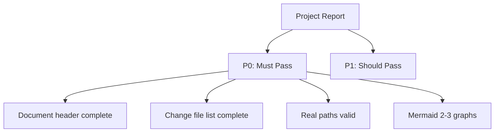

# Reporter 检查清单

报告质量关卡，适用于过程报告和周报汇总流水线。

---

## 项目报告

> **相关规范**: [项目报告规范](../rules/reporter.md) | [通用文档检查清单](./docer.md#general-document)

### P0 — 必须通过

- 文档头部完整
- 交付摘要可追溯：每条 `Value` 有对应的 `Evidence` 列填写
- 变更文件列表完整：`diff <(git diff --name-only | sort) <(grep 'git diff' §4 | awk -F'|' '{print $2}' | sort)` 无差异
- 路径真实有效：`while read f; do test -f "$f" || echo "BOGUS: $f"; done` 零输出
- 汇总表完整（每个变更文件均有验证覆盖状态）
- 验证结果真实（已执行/未执行/失败如实记录）
- 自我改进章节存在且有证据支撑
- 表格：1–3 个（尽可能合并）
- Mermaid 图表：2–3 个

### P1 — 应当通过

- 变更概览清晰（从变更领域可理解整体变更）
- 影响评估完整（覆盖 5 个影响面）
- 风险和遗留项明确
- 影响评估合理（无/低/中/高与实际变更范围一致）
- 关键摘录篇幅适中（≤50 行）
- 酌情使用目录树组织变更文件

### P2 — 锦上添花

- 对读者分层友好
- 变更规模数字与列表匹配

---

## 周报

> **相关规范**: [周报规范](../rules/reporter.md) | [通用文档检查清单](./docer.md#general-document)

### P0 — 必须通过

- 文档头部完整（版本、日期、维护者、覆盖周期、关联特性文档）；无活跃特性文档时写"本周无活跃特性文档"
- KPI 数据来源为自动化（已执行 `collect-weekly-kpi.js --with-logs` 并采纳输出）
- KPI 主表覆盖（每个有 KPI 数据的特性文档占一行；无数据时不得虚构文档）
- KPI 量化与证据（五个维度有具体值和路径）
- 维度综合判断有依据（✅/🟡/❌ 及理由与 06/05 及其他来源一致）
- 本周回顾非空（包含进展/亮点和问题根因）
- 流水线全景图正确（KPI → 回顾根因 → 未来规划，无 OKR 节点）
- 未来规划主表可操作（每项有类型标签、KPI 指标、验证方法及证据）
- 未来规划第一项对应最弱 KPI
- 改进项包含"参考标准"字段，为行业通用实践而非理论书名
- 工作流标准化四问已审查（缺失则写"无"；禁止跳过）
- 禁止使用象限图、矩阵图等可视化优先级表达
- 防幻觉（无虚构数据、案例或 D 类陈述）
- 表格：1–3 个（KPI 表、改进表、可选的 AI 质量表）
- Mermaid 图表：2–5 个（KPI 流水线、因果链、可选的覆盖率地图）

### P1 — 应当通过

- Git 统计数据与脚本输出匹配
- 流水线因果关系准确（弱 KPI 链接到根因和规划第一项）
- 未来规划优先级合理（第一项对应最弱 KPI）
- 覆盖周期正确（自然周起始和结束）
- 步骤6已执行（先 import-docs，后 wework-bot）
- 执行记忆已写入（特性文档交付后）
- self-improve 已触发并输出改进建议（weekly 命令）
- tester 已执行 Mermaid 审查
- 一次性执行完毕（非阻塞原因不得中断、无"待补充"占位遗留、不分多轮）

### P2 — 锦上添花

- 跨周对比
- 改进建议可执行性高
