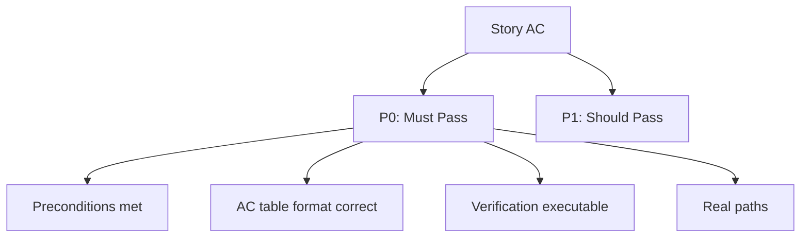

# Tester 检查清单

测试、验证和质量保证关卡，适用于代码和文档流水线。

---

## 故事验收标准 (AC)

> **相关规范**: [验收标准规范](../rules/tester.md) | [通用文档检查清单](./docer.md#通用文档)

### P0 — 必须通过

- 前置条件已满足（§1 Feature Overview 和各故事 Design 子节存在）
- 每个 P0 故事 AC 表格式正确：每行以 `| AC` 开头，列数 = 5（AC#/Criterion/Test Method/Expected Result/Status）
- P0 故事 AC 数 ≥ 1
- 验证方法可执行：每项包含 `{命令/浏览器操作/代码审查}` 具体步骤
- 代码路径真实：`while read p; do test -f "$p" || echo "MISSING: $p"; done` 零输出
- 零虚构技能（验证工具仅包含 `.claude/skills/` 中的技能或"建议人工审核"）
- 零占位符：`grep -c '{' <file>` = 0
- 未使用模板
- §4 Verification Summary 汇总所有故事 AC 通过情况

### P1 — 应当通过

- 验证方法具体（非泛泛陈述）
- 优先级判定合理
- 代码质量和测试检查固定行完整
- 链接可解析

### P2 — 锦上添花

- 检查汇总三个子章节完整
- 图标使用一致
