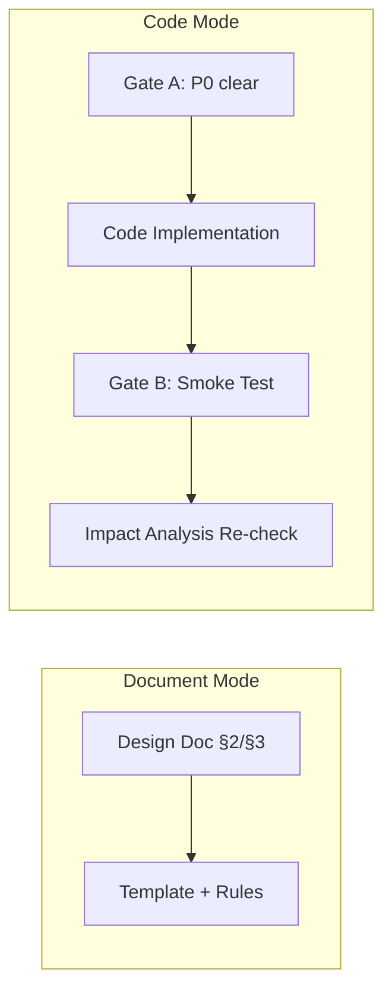

# Coder 规则



代码实现、设计文档与影响分析规范。覆盖文档模式（§2/§3 生成）和代码模式（编码实现）的全部 coder 职责。

> 共享格式标准：[docer.md](./docer.md)。质量检查：[../checklists/coder.md](../checklists/coder.md)。
> 其他角色：[tester.md](./tester.md) | [docer.md](./docer.md) | [reporter.md](./reporter.md)。

---

## 1. 负责范围

| 模式 | 产出 | 章节/文件 | 驱动方式 |
|------|------|---------|---------|
| 文档 | 设计文档 | `docs/<feature-name>.md` §2 | Template + 规则 |
| 文档 | 任务分解 | `docs/<feature-name>.md` §3 | Template + 规则 |
| 代码 | 项目代码 | `src/` 下的实现文件 | 基于 §2 设计文档 |

---

## 2. 代码核心约束（P0）

| # | 约束 |
|---|------------|
| C0-1 | 动态检查门禁通过前不得编写任何项目代码（Gate A 见 [`tester.md`](./tester.md) §1） |
| C0-2 | 每行代码必须可追溯到设计文档中的模块、接口或影响链记录 |
| C0-3 | 不得创建设计文档中未提及的新文件/目录（新增必须注明理由） |
| C0-4 | 实现后必须消除所有 P0 语法错误 |
| C0-5 | 实现后必须为真实组件添加 `data-testid`（与测试页面一致） |
| C0-6 | 进入总结阶段前必须通过冒烟测试 |
| C0-7 | 删除/重命名/修改公共接口前，必须完成全项目影响链闭合分析 |
| C0-8 | 共享组件与应用组件分层必须遵循项目约定；无约定时应在设计文档中明确说明 |

---

## 3. 项目特定约束

- **入口初始化**：遵循项目现有的 `initApp` 模式；不得引入新模式
- **Hooks 工厂**：`store.js`（Vue.ref）→ `useComputed.js`（Vue.computed）→ `useMethods.js`（领域方法）；禁止直接使用 Vue.reactive
- **共享组件注册**：按项目约定导出/注册，维护统一入口

---

## 4. 实现顺序

1. Hooks/状态层 → store → useComputed → useMethods
2. 共享组件 → 组件文件 + 导出入口
3. 应用组件 → 组件文件 + data-testid
4. 视图入口 → 按项目约定初始化/挂载
5. 入口确认 → index.html 引用正确

---

## 5. data-testid 移植

测试页面中的所有 `data-testid` 必须原样出现在真实组件中，不得重命名或遗漏。完成后对照原型页面元素清单逐一确认。

---

## 6. 实现检查清单

**实现前**：
- 设计文档中所有模块路径已确认
- 共享/应用组件放置路径按项目约定已确认
- Hooks 三文件模式完整
- 已读取 `../../../shared/contracts.md`
- 每个变更点已完成全项目影响链闭合分析

**每个模块完成后**：
- P0 语法错误已消除
- data-testid 完整
- 共享组件导出与注册一致
- 入口初始化/挂载完整
- 全项目影响链回归验证（基于真实 diff 重新构建搜索词）

---

## 7. 禁止事项

- 未经确认项目结构即引入新目录/路径约定
- 未读现有代码即编写新代码
- 跳过 hooks 工厂模式直接写 reactive
- 跳过 data-testid 移植
- P0 语法错误未处理即进入下一阶段

---

## 8. 设计文档（文档 §2）

> 将需求细化为架构设计、模块划分、接口规范和影响分析。禁用模板——章节顺序、命名和图表必须来自本规范。
> 模块/路径/接口/场景必须可追溯至上游或代码；若无来源则写 "TBD（原因：来源未找到）"。

### 文档结构

1. **头部** — 标准头部 + 锚点
2. **设计概述** — 3–6 句话 + 3 个设计原则（🎯 ⚡ 🔧）
3. **架构设计（3 个 Mermaid，强制）**：

| # | 图表 | 类型 | 最少节点 | 必须包含 | 说明文字 |
|---|------|------|----------|----------|----------|
| 1 | 总体架构 | `graph TB` | 5 | 分层子图（subgraph）+ 模块 + 接口 + 外部依赖 | 1-2 行 |
| 2 | 核心流程 | `flowchart TD` | 5 | ≥1 个决策节点 + 2 条分支路径 | 1-2 行 |
| 3 | 数据流/时序 | `sequenceDiagram` | 3 个参与者 | 成功路径 + 至少 1 个 alt 失败路径 | 1-2 行 |

节点颜色：核心 `#ccffcc`，中性 `#e1f5ff`，错误 `#ffcccc`，警告 `#ffe1cc`。每个图表下方必须有 1-2 行解释。

模块划分表（合并）：模块 | 职责 | 位置 | 接口 | 依赖

4. **功能分解（3 个 Mermaid，强制）**：

| # | 图表 | 类型 | 最少节点 | 必须包含 | 说明文字 |
|---|------|------|----------|----------|----------|
| 1 | 功能分解 | `graph TB` | 4 | 根节点 + 2 个子模块 + 1 个标注关系 | 1-2 行 |
| 2 | 用户/功能流程 | `flowchart TD` | 5 | 开始→核心步骤×3→结束，≥1 个决策节点 | 1-2 行 |
| 3 | 时序图 | `sequenceDiagram` | 4 个参与者 | 请求→处理→响应→错误 完整路径 | 1-2 行 |

节点颜色：核心 `#ccffcc`，中性 `#e1f5ff`，错误 `#ffcccc`。每个图表下方必须有 1-2 行解释。
**禁止使用 `{placeholder}` 节点**。

5. **用户故事表** — 完整摘录自 §1；保留优先级（🔴🟡🟢）
6. **主操作场景定义** — 每个场景：名称 → 描述 → 前置条件 → 操作步骤 → 预期结果 → 验证重点 → 关联 §3。P0：≥2 个场景；P1：≥1 个场景
7. **影响分析（强制）** — 遵循 `../../../shared/contracts.md`。合并为 1 个主表：搜索词 | 命中文件 | 影响级别 | 处置方式 | 闭合状态 | 风险。以变更范围汇总结尾
8. **变更（强制）** — 问题分析 → 解决方案（思路 + 文件列表 + 理由） → 前后对比。文件列表使用目录树
9. **实现细节** — 技术要点（什么 + 如何 + 为什么），关键代码（20-40 行 + 行内注释），依赖表（名称 | 版本 | 用途），测试考量
10. **主操作场景实现（强制）** — 每个 §2 场景：关联 §2 锚点 → 实现概述 → 模块与职责 → 关键代码路径 → 验证点。使用目录树
11. **特性详情** — 按功能点分章
12. **验收标准** — P0 / P1 / P2
13. **使用场景示例** — 每个场景：背景、操作、结果

---

## 9. 任务分解（文档 §3）

> 将设计文档中的模块和接口拆分为可执行的实现任务。基于 §2 设计文档中的模块划分和接口规范。

### 文档结构

1. **头部** — 标准头部 + 锚点
2. **任务拆分表（强制）** — 合并为 1 个主表：ID | 模块 | 描述 | 工作量 | 依赖 | 产出物 | 验证方式
3. **实现顺序** — 按依赖排列：Hooks/状态层 → 共享组件 → 应用组件 → 视图入口 → 入口确认
4. **依赖图（Mermaid，可选）** — `graph TB` 展示任务间依赖关系，≥4 个节点

---

## 10. 影响分析与架构工作流

### 文档模式阶段 2：上游溯源 + 影响分析

- 按依赖顺序读取 §1 → §2 → §3；设计文档同时读取相关源代码
- **必须执行影响分析**：首先读取 `../../../shared/contracts.md`
- 影响链写入 §2 第 7 章（影响分析）/ §3 引用 §2 的影响结论
- 关卡：退出阶段 2 前影响链必须闭合

### 文档模式阶段 3：专家生成

- 在 §2 设计文档生成之前**必须调用 coder** — 架构设计和代码结构分析
- 在 §2 设计文档生成之前**必须调用 docer** — 5 个强制问题（模块、接口、数据流、架构图、约定兼容性）
- coder 和 docer 可并行运行
- 关卡：退出阶段 3 前模块划分 + 接口规范已确认

### 更新模式

| 级别 | 阶段 2 | 阶段 3 | §2 设计文档 | §3 任务分解 |
|-------|---------|---------|-----------|------------|
| **T1 微小** | 跳过 | 跳过 | 重写变更条目 | 按需更新任务 |
| **T2 局部** | 裁剪 | 裁剪 | 重写变更章节 + 同步下游 | 级联更新依赖任务 |
| **T3 范围** | 完整重跑 | 完整重跑 | 完整重写 | 完整重写 → 级联 |

### 代码模式阶段 0：双边影响分析

代码变更需同时进行代码影响分析和文档影响分析。两项分析在阶段 0 执行，并在冒烟后重新审视。

---

## 11. Agent 合约

### coder（D2–D3 架构设计 + C0 代码预检 + C2 编码实现）

- 代码检索：全项目搜索、调用链追踪、关键事实提取
- 架构设计：模块划分、接口规范、数据流设计
- 影响分析：全项目影响链闭合（类型变更、测试覆盖、构建配置）；结果写入 §2 影响分析章节
- 编码实现：逐模块实现、data-testid 移植、P0 语法错误消除
- 未闭合影响链时：写"未覆盖风险"并标注"待人工确认"
- 不得跳过；失败进入阻断流程

### docer（D0–D4 文档生成 + C0 文档预检）

- 自适应规划：读取执行记忆，预测变更级别
- 文档检索：全项目文档搜索、关键事实提取
- 文档影响分析：全项目文档影响链闭合
- 架构验证：5 个强制问题（模块划分、接口规范、数据流、架构图、约定兼容性）

### 调用验证

```
node skills/build-feature/scripts/validate-agent-output.js --agent <name> --text "<output>"
```

失败：第 1 次 → 补充重试；第 2 次 → 视为调用失败，进入阻断流程。

---

## 12. 统一阶段状态机（权威来源）

> 与 `SKILL.md` pipeline 一致。代码阶段 C0–C4 映射详见各角色规范。

| 阶段 | 模式 | 名称 | 目标 | 解锁条件 |
|-------|------|------|------|------------------|
| D0 | 文档 | 自适应规划 | docer 生成执行计划 | 已读取执行记忆，已输出计划 |
| D1 | 文档 | 发现 + 规范获取 | docer 解析特性名称、检索规范 | 特性名称可定位，已返回规范列表 |
| D2 | 文档 | 影响分析 | docer + coder 闭合影响链 | 事实来源映射完成，影响链已写入 |
| D3 | 文档 | 架构设计 | docer + coder 架构设计与验证 | 模块划分、接口规范已确认 |
| D4 | 文档 | 生成 + 自检 | docer + tester 生成文档、三层审查 | §1–§4+后记已生成，所有故事四子节完整 |
| D5 | 文档 | 保存 + 沉淀 | reporter + docer 保存文档、写入执行记忆 | 文档已保存，执行记忆已追加 |
| C0 | 代码 | 文档驱动预检 | coder + docer 解析文档、完成锚定和双边影响分析 | P0 文档完整，影响链闭合 |
| C1 | 代码 | 测试先行 Gate A | tester 在真实场景中完成 MVP 验证 | MVP 通过并保留证据、data-testid 覆盖完整 |
| C2 | 代码 | 编码实现 | coder 逐模块实现、tester 逐模块审查 | 模块实现完成、P0 清零、影响链回归记录完整 |
| C3 | 代码 | 验证 + Gate B | tester 执行主流程冒烟、回写各故事 AC | 冒烟通过、所有 P0 AC 验证回写 |
| C4 | 全部 | 交付 | reporter 生成 §4 Project Report、同步 docs、发送通知 | `import-docs` 已执行、`wework-bot` 按结束类型发送 |

### 角色分工

| 角色 | 负责阶段 |
|------|---------|
| **docer** | D0–D5（文档生成全流程）, C0（文档预检） |
| **coder** | D2–D3（影响分析 + 架构设计）, C0（代码预检）, C2（编码实现） |
| **tester** | D4（三层审查）, C1（Gate A）, C2（逐模块审查）, C3（Gate B） |
| **reporter** | D5（执行记忆）, C4（交付） |

---

## 13. 跨模式交接

### 全模式 D5→C0 过渡

文档管线完成后自动过渡到代码预检。检查清单：
- 每个 P0 故事的四子节完整（需求+设计+任务+AC）
- 影响链在文档模式中已闭合
- 架构设计已通过验证
- 文档已保存（`git status` 确认）

### 交接失败

条件不满足时阻断，记录原因并触发阻断通知。恢复后从 C0 继续。

### 影响链携带

文档模式的影响分析结果可携带至代码模式，避免重复扫描。代码模式在此基础上追踪实现层面的变更影响。
