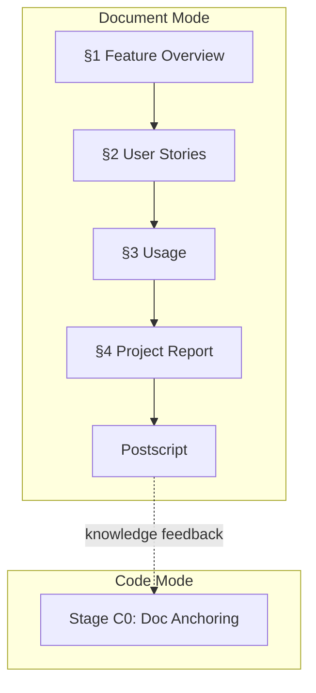

# Docer 规则



文档格式标准、生成编排和项目初始化规范。覆盖文档模式（§1–§4 + 后记）和代码模式（文档锚定、分支管理）的 docer 职责。

> 质量检查：[../checklists/docer.md](../checklists/docer.md)。
> 其他角色：[coder.md](./coder.md) | [tester.md](./tester.md) | [reporter.md](./reporter.md)。

---

## 1. 负责范围

| 模式 | 产出 | 章节/文件 | 驱动方式 |
|------|------|---------|---------|
| 文档 | 需求文档 | `docs/<feature-name>.md` §1 | Template + 规则 |
| 文档 | 使用文档 | `docs/<feature-name>.md` §4 | 仅规则 |
| 文档 | 项目基础信息 | `CLAUDE.md`、`README.md`、`docs/*.md` | 仅规则（init 命令） |
| 文档 | 完整编号集 | `docs/project-init/0*_*.md` | 仅规则（init 命令） |
| 代码 | 文档锚定 | 解析 `docs/<feature-name>.md` | 阶段 C0 |

---

## 2. 通用文档格式标准

> 适用于所有生成的文档。各文档规范可收紧但不可放宽。

### 输出格式约束

| 约束 | 标准 | 验证方法 |
|-----------|-------|----------|
| 表格 | 每节 1-2 个表，全文档 4-10 个 | `grep -c '^|' <file>` 统计 |
| Mermaid 图表 | 1-4 个：§1 Story Map + 关键故事 Design 数据流 | `grep -c '```mermaid' <file>` ∈ [1,4] |
| 文本风格 | 简洁；段落 ≤3 行，列表项 ≤1 行 | 目视检查 |
| 标题深度 | 最大 H4，仅故事子节（Requirements/Design/Tasks/AC）可用 H4 | `grep -c '^#####' <file> = 0` |
| 代码摘录 | 20-40 行，优先完整函数签名 + 关键逻辑 | `wc -l` 每个代码块 |
| Emoji 前缀 | **强制**：每个 H2 标题必须有 emoji 前缀 | `grep '^## ' <file>` 匹配 emoji 表 |

### Emoji 前缀标准

| 位置 | Emoji | 用途 | 强制 |
|------|-------|------|------|
| H1 标题 | 📋 | 功能文档总标题 | 是 |
| H2 §1 | 📖 | Feature Overview（特性概述） | 是 |
| H2 §2 | 📋 | User Stories（用户故事集） | 是 |
| H3 Story | 🎯 | 单个用户故事 | 是 |
| H4 需求 | — | 故事需求（无 emoji，用标题文字区分） | 否 |
| H4 设计 | — | 故事设计 | 否 |
| H4 任务 | — | 故事任务 | 否 |
| H4 验收 | — | 故事验收标准 | 否 |
| H2 §3 | 📚 | Usage（使用文档） | 是 |
| H2 §4 | 📈 | Project Report（项目报告） | 是 |
| H2 Post-mortem | 🔄 | 后记：后期规划与改进 | 是 |
| 优先级 | 🔴 P0 · 🟡 P1 · 🟢 P2 | 阻塞/重要/可选 | 是 |
| 状态 | ✅ 通过 · ❌ 失败 · ⬜ 待验证 · 🔄 进行中 · 🛑 阻断 | 检查项状态 | 是 |

### Mermaid 质量门禁（P0）

| 检查项 | 标准 | 失败动作 |
|--------|------|----------|
| 节点数量 | 每个图 ≥ 4 个含文字节点 | 补充节点 |
| 成功+失败路径 | sequenceDiagram 必须有 ≥1 个错误/异常路径（Story Map 除外） | 添加 alt/else 分支 |
| 中文引号 | 含中文/空格/特殊字符的节点文本必须双引号 | 修复语法 |
| 颜色方案 | 核心 `#ccffcc`，中性 `#e1f5ff`，错误 `#ffcccc`，警告 `#ffe1cc` | 修复颜色 |
| 图下说明 | 每个图下方 1-2 行解释文字 | 添加说明 |
| 零占位符 | 禁止 `{placeholder}` 或无意义节点 | 替换为真实内容 |

### 文档头部（严格）

```markdown
# 📋 {文档标题}

> | v{version} | {YYYY-MM-DD} | {模型} | {工具} | 🌿 {branch} | ⏱️ {HH:mm}–{HH:mm} | 📎 [CLAUDE.md](../CLAUDE.md) |

[📖 §1](#1-feature-overview) | [📋 §2](#2-user-stories) | [📚 §3](#3-usage) | [📈 §4](#4-project-report) | [🔄 后记](#post-mortem)

---
```

- 版本：`v{major}.{minor}`，新文档起始为 `v1.0`
- 维护者：模型名称（例如 `Claude Sonnet 4.6`）
- 头部为单行元数据表
- H1 唯一；标题深度 ≤ H4（仅故事子节可用 H4）

### Mermaid 图表规范

| 用途 | 类型 |
|---------|------|
| 架构 / 模块划分 | `graph TB` |
| 组件关系 / 依赖 | `graph LR` |
| 带决策的流程 | `flowchart TD` |
| 时序 / 数据流 | `sequenceDiagram` |

节点颜色：正面/新增/核心 `#ccffcc`，负面/问题 `#ffcccc`，中性/规范 `#e1f5ff`。

**强制**：当节点文本包含中文、空格、括号、冒号或其他特殊字符时，使用双引号包裹。禁止使用全角括号和全角冒号。每个图表下方：1–2 行说明。

### 表格合并

当规范要求多个子表时，合并为主表。每文档最多 3 个表格。

### 目录树

用于文件结构、模块组织、代码路径，替代叙述段落。

### 排版

- 段落 ≤ 3–4 行，以空行分隔，每段一个中心思想
- 并列项：无序列表（`-`）；步骤/流程：有序列表（`1.`）
- 对比：表格；代码：带语言标注的代码块
- 关键词：**加粗**；文件名/路径/变量：`行内代码`
- 文档链接：相对路径

---

## 3. 文档路径与结构

功能文档为单一文件：`docs/<feature-name>.md`。**以用户故事为单位组织，每个故事自包含需求、设计、任务和可测试验收标准。**

| 章节 | 内容 | 生成方 |
|---------|---------|-------------|
| `## 1. 📖 Feature Overview` | 问题、范围边界、成功指标、Story Map | 文档模式 |
| `## 2. 📋 User Stories` | 每个故事自包含：需求 → 设计 → 任务 → 验收标准 | 文档模式 |
| `### 🎯 Story N` | 单故事：角色/动作/价值、功能点、架构片段、任务、AC | 文档模式 |
| `## 3. 📚 Usage` | 跨故事操作指南、FAQ（仅多故事共用时填写） | 文档模式 |
| `## 4. 📈 Project Report` | 交付汇总、故事验收通过率 | 文档模式（代码回写） |
| `## 🔄 后记` | 工作流标准化审查、架构演进、后续故事 | 文档模式 |

### 故事内部结构（强制）

每个 `### 🎯 Story N` 下必须包含四个子节：

```
#### N.M.1 Requirements   — 功能点表（Input/Output/Error）
#### N.M.2 Design          — 架构片段/数据流 + 涉及模块表
#### N.M.3 Tasks           — 仅该故事的任务拆分
#### N.M.4 Acceptance Criteria — 可度量的验收条件 + 测试方法 + 预期结果
```

无法定位时：回退到 `docs/99_agent-runs/<YYYYMMDD-HHMMSS>_build-feature.md`

---

## 4. 命名约定

- `<feature-name>`：与 `docs/<feature-name>.md` 一致
- `<scenario-name>`：来源于 §2 设计文档中的场景定义
- 禁止混用缩写

---

## 5. 输入前置条件

### 默认输入

- `{feature-name}`：对应 `docs/<feature-name>.md`
- `{document-path}`：默认 `docs/<feature-name>.md`

无法解析时，先写入 `docs/99_agent-runs/<YYYYMMDD-HHMMSS>_build-feature.md` 记录原因与恢复步骤。

### 最低文档要求

| 内容 | 级别 | 用途 |
|---------|-------|---------|
| Story N 四子节完整（需求+设计+任务+验收） | P0 | 每个故事必须自包含可测试 |
| §1 Feature Overview（范围边界、Story Map） | P1 | 特性全局视图 |
| §3 Usage（跨故事操作指南） | P2 | 仅多故事共用时填写 |

当 P0 故事的任一子节缺失时：记录缺失 → 停止进入代码阶段 → 生成阻断总结 → 提示先补全故事。

### Git 功能分支（强制，代码模式）

当仓库为 git 时，必须使用 `feat/<feature-name>` 分支；代码变更前先 `git switch`。禁止在错误分支上继续操作。

### 一次执行到底

默认不频繁提问；缺失信息写「待确认」继续。当需要人工介入时，先落地兜底记录，再 `wework-bot` 推送。

---

## 6. Feature Overview（§1）

> 边界：仅写"做什么 / 不做什么"；实现 → 各 Story 子节；验证 → 各 Story AC；交付证据 → §4。

### 文档结构

1. **头部** — 标准头部 + 锚点
2. **问题与范围** — 1 个表：Problem / Who / Scope / Out-of-Scope / Success Metric
3. **Story Map** — Mermaid flowchart：故事依赖与交付顺序
4. **1-2 行说明**：故事间关系与交付顺序

### 故事编写原则

每个故事必须满足四个标准：
- **可测试**：每个 AC 有明确的测试方法和可度量预期
- **最小可用**：故事独立交付后即可产生用户价值
- **范围可评估**：Scope 字段明确边界，Out-of-Scope 在 §1 全局声明
- **自包含**：需求、设计、任务、验收均在故事内部，不跨故事引用

---

## 7. 使用文档（§3）

> 最终用户优先：场景优先，FAQ 其次。

### 文档结构

1. **头部** — 标准头部 + 锚点
2. **功能介绍** — 3–6 句话 + 3 个核心功能（🎯 ⚡ 🔧） + 目标受众
3. **快速开始** — 前置条件 + 30 秒上手（3–5 步）
4. **操作场景（核心）** — 共 6–8 个：推荐（✅）3–5 个 + 反模式（❌）2–3 个
5. **常见问题** — 5–10 项，合并为 1 个表
6. **提示与建议** — 3–5 条实用提示 + 快捷键 + 最佳实践
7. **附录（可选）** — 术语表 / 命令速查表

### 编写原则

用户视角 / 场景驱动 / 步骤清晰 / 问题导向

---

## 8. 项目初始化

### 调用方式

```bash
/generate-document init
```

### 输出列表

**项目基础文件（10 个）**：`CLAUDE.md`、`README.md`、`docs/architecture.md`、`docs/changelog.md`、`docs/devops.md`、`docs/network.md`、`docs/state-management.md`、`docs/FAQ.md`、`docs/auth.md`、`docs/security.md`

**完整编号集（7 个）**：`docs/project-init/01_overview.md`、`02_quickStart.md`、`03_changeLog.md`、`00_architecture.md`、`05_bestPractices.md`、`04_auth.md`、`06_FAQ.md`

### 生成规则（P0）

1. **防幻觉**：内容必须来自代码扫描和文件读取；不得捏造
2. **不确定性标注**：`> TBD（原因：...）`
3. **版本信息真实**：维护者 = 模型名称，工具 = Claude Code / Cursor
4. **相对路径**
5. **CLAUDE.md 固定前两行**：`Behavioral guidelines see .claude/shared/behavioral-guidelines.md` 和 `Project architecture conventions see docs/architecture.md`

### 各文件强制章节

| 文件 | 强制章节 |
|------|-------------------|
| `CLAUDE.md` | 技术栈 → 项目结构 → 编码规范 → 禁止事项 → 构建/运行 → 关键文件 → 文档体系 |
| `README.md` | 项目名称/描述 → 简介 → 技术栈表 → 快速开始 → 目录结构 → 核心架构 → 文档表 → 贡献 → 许可证 |
| `architecture.md` | 目录组织 → 放置规则 → 核心架构模式 → 模块结构 → 编码规范 → 实现顺序 |
| `changelog.md` | Keep a Changelog 格式 |
| `devops.md` | 构建 → 部署 → 运维 → 环境要求 |
| `network.md` | 请求库 → 封装入口 → BaseURL → Header/认证 → 错误处理 → 常见问题 |
| `state-management.md` | 状态分类 → 容器入口 → 读写边界 → 持久化 → 网络协同 → 常见问题 |
| `FAQ.md` | 故障排查索引 → 问题分类 → 自修复参考。**禁止固定示例** |
| `auth.md` | 认证架构 → 认证流程 → 授权流程 → Token 管理 → 自检规则。无代码 → 保持结构，标注"TBD" |
| `security.md` | 安全架构 → 威胁模型 → 检查规则 → 典型失败 → 依赖审计。无代码 → 保持结构，标注"TBD" |

### 重新初始化更新策略

| 级别 | 判定标准 | 处理方式 |
|-------|----------|----------|
| **T1 微小** | 版本号升级、依赖更新、配置调整 | 仅重写变更段落，保留人工补充内容 |
| **T2 局部** | 新增/删除目录、技术栈变更、新增命令 | 重写变更章节 + 同步关联文档 |
| **T3 范围** | 架构模式变更、项目类型变更、构建工具替换 | 完整级联刷新 |

### 初始化工作流

1. 扫描仓库结构：`package.json` / 构建配置 / 源码目录 / git 历史
2. 阶段 D1：docer 检索适用规范
3. 阶段 D2：扫描项目代码和配置（初始化无影响分析）
4. 阶段 D3：docer + coder 推断架构模式
5. 阶段 D4：docer + tester 生成 10 个基础文件 + 7 个编号集；三层审查
6. 阶段 D5：reporter + docer 保存文档、知识沉淀
7. 阶段 C4：先 `import-docs`，后 `wework-bot`

---

## 9. 文档后记（强制）

每份生成的文档末尾必须追加：

```markdown
## 后记：后期规划与改进

## 工作流标准化审查
1. **重复劳动识别**：...
2. **决策标准缺失**：...
3. **信息孤岛**：...
4. **反馈闭环**：...

## 系统架构演进思考
- **A1. 当前架构瓶颈**：...
- **A2. 下一个自然演进节点**：...
- **A3. 演进风险与回滚方案**：...
```

格式详情见：`skills/self-improving/rules/collection-contract.md`。

---

## 10. 文档模式编排状态机

### 新建模式

| 阶段 | 名称 | 目标 | 解锁条件 |
|-------|------|------|------------------|
| D0 | 自适应规划 | docer 生成执行计划 | 已读取执行记忆，已输出计划 |
| D1 | 发现 + 规范获取 | docer 解析特性名称、检索规范 | 特性名称可定位，已返回规范列表 |
| D2 | 影响分析 | docer + coder 闭合影响链 | 事实来源映射完成，影响链已写入 |
| D3 | 专家生成 | docer + coder 架构设计与验证 | 模块划分、接口规范已确认 |
| D4 | 生成 + 自检 | docer + tester 生成文档、三层审查 | §1-§4+后记已生成，所有故事四子节完整 |
| D5 | 保存 + 沉淀 | reporter + docer 保存文档、写入执行记忆 | 文档已保存，执行记忆已追加 |
| C4 | 交付 | reporter 同步 docs + 发送通知 | import-docs 已记录，wework-bot 已发送 |

### 更新模式（按变更级别跳转）

| 级别 | 阶段 D2 | 阶段 D3 | 阶段 D4 |
|-------|---------|---------|---------|
| **T1 微小** | 跳过 | 跳过 | 仅重写变更章节 |
| **T2 局部** | 裁剪（仅变更点） | 裁剪（仅受影响模块） | 重写目标 + 同步下游条目 |
| **T3 范围** | 完整重跑 | 完整重跑 | 完整级联刷新 |

### 阻断点

- 特性名称无法解析
- 规范获取失败且无法降级
- 影响链存在未闭合的阻断依赖
- Agent 调用失败且无回退方案
- 文档 P0 不通过且无法自修复

---

## 11. Agent 派发

| 类型 | 名称 | 模式 | 用途 |
|------|------|------|---------|
| Agent | `docer` | 全部 | 自适应规划、规范获取、影响分析、架构设计、文档生成 |
| Agent | `coder` | 全部 | 代码检索、代码影响分析、架构设计、编码实现 |
| Agent | `tester` | 全部 | Gate A/B、三层审查、代码审查、Mermaid/Markdown 测试、质量追踪 |
| Agent | `reporter` | 全部 | 过程总结、知识沉淀、执行记忆 |
| Skill | `code-review` | 代码 | 代码审查 |
| Skill | `e2e-testing` | 代码 | E2E 测试方案 |
| Skill | `verification-loop` | 代码 | 验证循环 |
| Skill | `search-first` | 全部 | 技术决策评估 |
| Skill | `import-docs` | 全部 | 文档同步 |
| Skill | `wework-bot` | 全部 | 通知 |

### 执行记忆（阶段 D5 强制）

```bash
node skills/build-feature/scripts/execution-memory.js write /tmp/session-<feature>.json
```

记录：特性指纹、实际变更级别、已调用 Agent 列表、质量问题、不良案例、是否被阻断。

---

## 12. 代码模式文档锚定（阶段 C0）

### 阶段 C0 输出

至少提取：用户故事（场景名称 + 前置条件 + 操作步骤 + 预期结果）、实现约束（模块 + 接口 + 状态管理 + 现有代码路径 + 影响链）、检查项映射（场景 → P0/P1/P2 列表）。

### Skill / Agent 调度（代码模式）

| 类型 | 名称 | 用途 |
|------|------|---------|
| Skill | `e2e-testing` | 阶段 C1 生成测试骨架 |
| Skill | `verification-loop` | 阶段 C2/C3 静态预检与测试执行 |
| Skill | `code-review` | 阶段 C2 逐模块代码审查 |
| Skill | `search-first` | 外部依赖选择（按需） |
| Agent | `tester` | 阶段 C1 生成测试原型页面、C2 审查、C3 冒烟 |
| Agent | `coder` | 架构确认、代码检索、编码实现 |
| Agent | `reporter` | 阶段 C4 生成实施总结 |

---

## 13. 跨模式文档协调

### 全模式 D5→C0 交接

文档模式完成后，代码模式启动前：
1. 验证每个 P0 故事的四子节完整（需求+设计+任务+验收）
2. §1 Feature Overview 范围边界明确
3. 架构设计已通过验证
4. 文档已保存（`git status` 确认）

### 禁止事项

- 未经实际验证更改状态
- 在 `tests/` 之外生成或保留测试文件
- 在同一章节中重复添加 `### Implementation Status`

---

## 14. 检查清单索引

| 类型 | 位置 | 适用阶段 |
|------|------|---------|
| 通用文档 | [checklists/docer.md#通用文档](../checklists/docer.md#通用文档) | D4 全文档 |
| Feature Overview §1 | [checklists/docer.md#feature-overview--user-stories](../checklists/docer.md#feature-overview--user-stories) | D4 §1 |
| 故事 Design | [checklists/coder.md#design-document](../checklists/coder.md#design-document) | D4 各故事 |
| 故事 Tasks | [checklists/coder.md#requirement-tasks](../checklists/coder.md#requirement-tasks) | D4 各故事 |
| Usage §3 | [checklists/docer.md#usage-document](../checklists/docer.md#usage-document) | D4 §3 |
| 故事 AC | [checklists/tester.md#acceptance-criteria](../checklists/tester.md#acceptance-criteria) | D4 各故事 |
| 代码实现 | [checklists/coder.md#code-implementation](../checklists/coder.md#code-implementation) | C3 代码 |
| Project Report §4 | [checklists/reporter.md#project-report](../checklists/reporter.md#project-report) | C4 §4 |
| 周报 | [checklists/reporter.md#weekly-report](../checklists/reporter.md#weekly-report) | weekly 命令 |
| 项目初始化 | [checklists/docer.md#project-basics](../checklists/docer.md#project-basics) | init 命令 |
