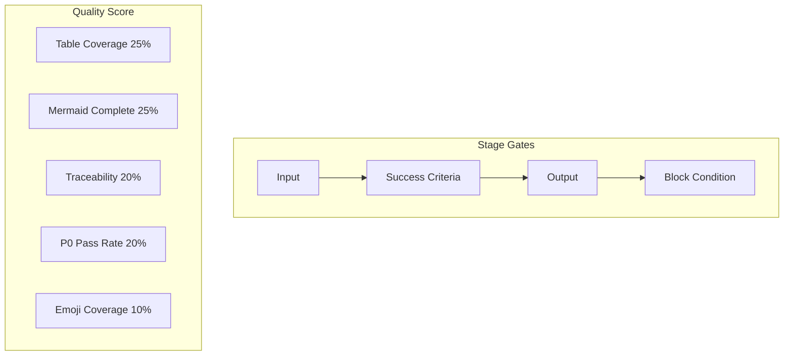

# Metrics: 阶段成功标准 + 质量指标

## 阶段成功标准

| 阶段 | 输入 | 成功标准（可度量） | 产出物 | 阻断条件 |
|------|------|-------------------|--------|----------|
| D0 adaptive-planning | 用户命令 | 执行计划已输出，变更级别已确定 | 执行计划 | 功能名称无法解析 |
| D1 discovery | 特性名称 | ≥1 条相关规范被检索到 | 规范列表 | 规范获取失败且无法降级 |
| D2 impact-analysis | 上游文档 | 影响链表 ≥ 3 行，闭合标记 = ✅ | 影响分析表 | 未闭合的阻断依赖 |
| D3 architecture | 影响分析 | 模块表 ≥ 2 行，接口规范非空 | 架构设计 | Agent 调用失败 ×2 |
| D4 document-gen | 架构设计 | §1-§4+后记已生成，所有故事四子节完整 | 完整文档 | 故事 P0 不通过且无法自修复 |
| D5 curation | 完整文档 | `git status` 显示 docs/ 有变更 | 已保存文档 + 执行记忆 | 保存失败 |
| C0 code-preflight | 文档 | P0 章节完整，影响链已闭合 | 锚定报告 | P0 文档缺失 |
| C1 test-first | 场景 | Gate A 通过 + evidence 路径非空 | 测试方案 + 原型页 | Gate A 未通过 |
| C2 implementation | 设计文档 | 逐模块实现完成、P0 清零，影响链回归记录完整 | 实现代码 + 审查记录 | ≥1 个 P0 仍 ❌ |
| C3 validation | 代码 | Gate B 通过、所有 P0 AC 验证回写 | 冒烟证据 + AC 更新 | Gate B 未通过 |
| C4 delivery | 代码/文档 | §4 Project Report 已生成、通知已发送 | 交付制品 + import-docs | import-docs 失败且无法降级 |

## 文档质量评分（每文档）

| 维度 | 权重 | 满分标准 | 测量方法 |
|------|------|----------|----------|
| 表格覆盖率 | 25% | 1-2 个主表，每表 ≥ 3 行 | `grep -c '^|'` 统计 |
| Mermaid 完整性 | 25% | 2-3 个图，节点 ≥ 4/图 | `grep -c '\`\`\`mermaid'` + 节点计数 |
| 可追溯性 | 20% | 每段技术断言有证据列/引用 | `grep -c 'Evidence\|来源'` |
| P0 通过率 | 20% | 所有 P0 项状态 = ✅ | 检查清单统计 |
| Emoji 覆盖 | 10% | 所有 H2 有 emoji 前缀 | `grep '^## '` 匹配 |

**分级**: ≥90% = 🟢, ≥70% = 🟡, <70% = 🔴

## Pipeline 效率指标

| 指标 | 计算方式 | 目标 |
|------|----------|------|
| 一次性通过率 | D4 无重试次数 / 总 D4 次数 | ≥ 60% |
| Gate A 通过率 | Gate A 首次通过 / 总执行 | ≥ 70% |
| Gate B 通过率 | Gate B ≤ 1 轮修复 / 总执行 | ≥ 50% |
| 自我修复成功率 | 自修复后 P0=0 次数 / 总自修复次数 | ≥ 80% |
| Agent 调用成功率 | Agent 调用成功 / 总调用 | ≥ 90% |

## 验证覆盖度

| 覆盖类型 | 计算方式 | 目标 |
|----------|----------|------|
| 故事→AC 映射 | P0 故事 AC 数 / P0 故事数 | ≥ 1.0 |
| 代码路径验证 | 存在路径数 / 引用路径数 | = 1.0 |
| 影响链闭合率 | 标记 ✅ 行数 / 影响链总行数 | = 1.0 |
