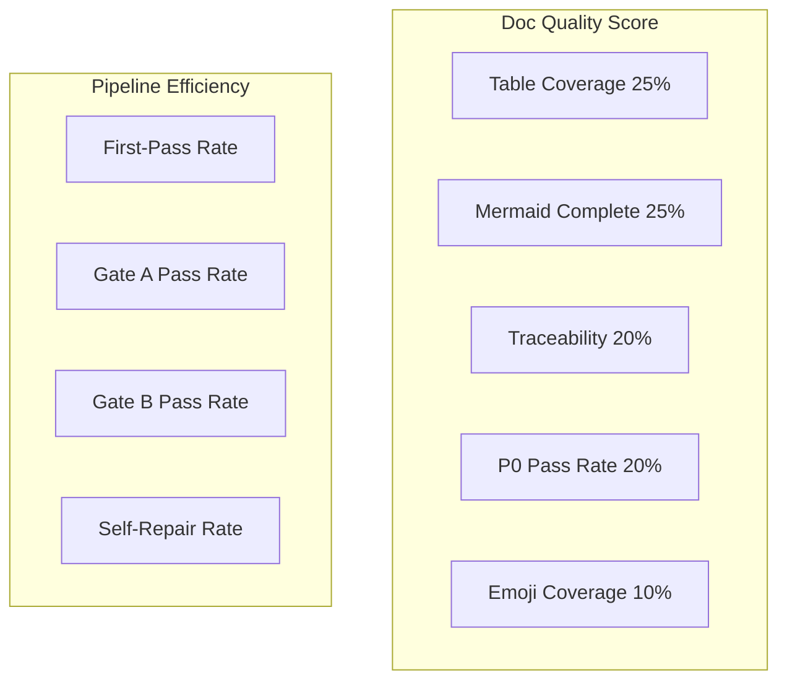

# Metrics: 可量化质量指标

## 文档质量评分（每文档）

| 维度 | 权重 | 满分标准 | 测量方法 |
|------|------|----------|----------|
| 表格覆盖率 | 25% | 1-2 个主表，每表 ≥ 3 行 | `grep -c '^|'` 统计 |
| Mermaid 完整性 | 25% | 2-3 个图，节点 ≥ 4/图，说明文字存在 | `grep -c '\`\`\`mermaid'` + 节点计数 |
| 可追溯性 | 20% | 每段技术断言有证据列/引用 | `grep -c '证据:\|Source:\|来源:'` |
| P0 通过率 | 20% | 所有 P0 项状态 = ✅ | 检查清单统计 |
| Emoji 覆盖 | 10% | 所有 H2 有 emoji 前缀 | `grep '^## '` 匹配 emoji 表 |

**分级**: ≥90% = 🟢 优秀, ≥70% = 🟡 合格, <70% = 🔴 不合格

## Pipeline 效率指标

| 指标 | 计算方式 | 目标 |
|------|----------|------|
| 一次性通过率 | (D4 无重试次数 / 总 D4 执行次数) × 100% | ≥ 60% |
| Gate A 通过率 | (Gate A 首次通过 / 总执行) × 100% | ≥ 70% |
| Gate B 通过率 | (Gate B ≤ 1 轮修复 / 总执行) × 100% | ≥ 50% |
| 自我修复成功率 | (自修复后 P0=0 次数 / 总自修复次数) × 100% | ≥ 80% |
| Agent 调用成功率 | (Agent 调用成功 / 总调用) × 100% | ≥ 90% |

## 验证覆盖度

| 覆盖类型 | 计算方式 | 目标 |
|----------|----------|------|
| 故事→AC 映射 | P0 故事 AC 数 / P0 故事数 | ≥ 1.0 |
| 代码路径验证 | 存在路径数 / 引用路径数 | = 1.0 |
| 影响链闭合率 | 标记 ✅ 行数 / 影响链总行数 | = 1.0 |
