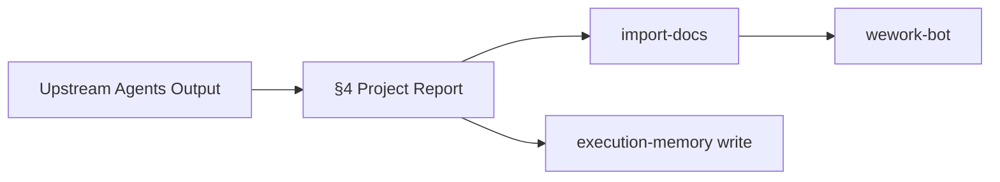

# Reporter 规则



过程总结、项目报告、周报和交付规范。覆盖文档模式和代码模式的 reporter 职责——如实记录、状态回写、知识沉淀和通知交付。

> 共享格式标准：[docer.md](./docer.md)。质量检查：[../checklists/reporter.md](../checklists/reporter.md)。
> 其他角色：[coder.md](./coder.md) | [tester.md](./tester.md) | [docer.md](./docer.md)。

---

## 1. 负责范围

| 模式 | 产出 | 章节/文件 | 驱动方式 |
|------|------|---------|---------|
| 代码 | 过程总结 | `docs/<feature-name>.md` §4 Project Report | 真实执行记录 |
| 代码 | 状态回写 | §2 各故事 AC、§4 | 基于验证结果 |
| 文档 | 项目报告 | `docs/<feature-name>.md` §4 Project Report | 规则 + 真实变更数据 |
| 文档 | 周报 | `docs/weekly/<week>/weekly.md` | 仅规则，无模板 |
| 全部 | 交付 | `import-docs` + `wework-bot` | 强制 |

---

## 2. 过程总结（§4 Project Report）核心约束

| # | 约束 |
|---|------------|
| S0-1 | 保存到 `docs/<feature-name>.md` 章节 `## 4. Project Report` |
| S0-2 | 必须包含 AI 调用流程图和时序图（实际路径，非理想路径） |
| S0-3 | 必须包含变更文件列表（路径 + 类型 + 关联模块） |
| S0-4 | 阻断时必须生成阻断版总结 |
| S0-5 | 必须回写实施状态到各故事 AC 表和 §4 |
| S0-6 | 正常完成必须包含故事 AC 最终审查（P0/P1/P2 统计） |

---

## 3. §4 Project Report 子节结构

| 子节 | 标题 | 描述 |
|--------|-------|-------------|
| Verification Summary | 验证汇总 | 各故事 AC 通过率 |
| Delivery Summary | 交付汇总 | 文件变更 / 行数 / Gate A/B |
| 变更文件列表 | Change List | 路径、类型（新增/修改/删除）、模块 |
| AI 调用流程图 | 实际执行路径 | Mermaid 流程图（含循环和分支） |
| AI 调用时序图 | 时序 | Mermaid 时序图 |
| 状态回写记录 | 回写 | 各故事 AC + §4 回写结果 |
| 遗留问题与后续 | Follow-up | P1/P2 + 自我改进 + 可执行下一步 |
| 通知记录 | Notify | wework-bot、import-docs |

---

## 4. 自我改进（证据驱动）

必须产出针对 `skills/` 和 `shared/` 的改进建议表：类别 / 问题 / 证据 / 建议路径 / 最小变更点 / 验证方法。只能引用本总结中已出现的证据位置。

§8 和 §9 必须遵循 `skills/self-improving/rules/collection-contract.md` 中定义的标准化格式。

---

## 5. 可执行下一步

每项必须包含：依据（引用 §/文件/检查项）+ 验证方法（命令/检查清单编号/锚点）；两者均为必填。

---

## 6. 阻断版总结

简化结构：阻断摘要 + 已产出产物 + 阻断详情 + 建议恢复操作。保存到同一章节；恢复成功后由完整版覆盖。

---

## 7. 状态回写

**AC 状态值**：⏳ 未验证 | 🏃 原型已验证 | ✅ 冒烟通过 | ❌ 失败 | ⚠️ 需人工确认

**各故事实施状态**：在各故事 AC 表内标注 Status 列（✅/🟡/⛔）。§4 Project Report 的 Verification Summary 汇总所有故事状态。

---

## 8. 测试产物路径

所有测试文件必须位于 `tests/` 目录下；禁止落入 `src/`、`docs/` 或项目根目录。子目录结构见 [`tester.md`](./tester.md) §4.3。

---

## 9. 阻断点

以下情况必须停止：功能名称/路径无法定位 / 无法在 `feat/<feature-name>` 上准备分支 / P0 文档缺失 / 阶段 C2 或 C3 达到修复上限 / Gate A 未完成但已编写代码 / Gate B 未通过 / 门禁未执行/缺证据/被跳过 / 所有模块被阻断 / 文档模式 D4 P0 不通过。

停止时：输出阻断原因 → 记录当前阶段和产物 → 生成阻断总结 → 回写状态 → `import-docs` → `wework-bot` 阻断通知。当通知发送失败时，写入 §4 或 `docs/99_agent-runs/`。

---

## 10. 项目报告（§4）

> 禁用模板。所有内容必须来自真实来源；若无来源则写 "TBD（原因：...）"。

### 生成前置条件（P0）

1. 可访问变更文件列表（git diff / git status / 用户提供）
2. 变更前内容可读
3. 至少一个可关联的上游文档（优先各故事 Design 子节）
4. 能区分本范围变更与工作区无关变更

### 文档结构

按照模板 §4 Project Report 结构：
1. **Verification Summary** — 各故事 AC 通过率表
2. **Delivery Summary** — 文件变更 / 行数 / Gate A/B 状态
3. **变更文件列表（强制）** — 目录树或表：文件路径 / 变更类型 / 领域 / 描述。路径必须来自 git diff
4. **前后对比** — 每个变更文件：路径 → 变更类型 → 变更前 → 变更后 → 一句话描述
5. **自我改进（强制）** — 做得不好的 / 可执行建议 / 无证据假设

---

## 11. 周报（`weekly-report.md`）

### 调用方式

```bash
/generate-document weekly                           # 当前自然周
/generate-document weekly 2026-04-29                # 扩展至自然周
/generate-document weekly 2026-04-27~2026-05-03     # 明确指定范围
```

覆盖周期：自然周（周一至周日）。文件名：`YYYY-MM-DD~YYYY-MM-DD`。一次性执行完毕。

### 动态上下文读取

1. 运行 `node skills/build-feature/scripts/collect-weekly-kpi.js --with-logs`
2. 读取项目基础文件：CLAUDE.md、README.md、architecture.md、FAQ.md、auth.md、security.md
3. 补充验证：对脚本未覆盖的特性，读取 §1–§4 + 后记

### 文档结构

1. **头部** — 版本信息 + 覆盖周期 + 关联特性文档
2. **KPI 量化汇总表** — 特性 / 交付率 / P0 通过率 / 防幻觉率 / 修复轮次 / 规则覆盖率 / 综合
3. **本周回顾** — 进展亮点 + 问题根因（现象 → 推断 → 证据路径）
4. **KPI→回顾→规划关联全景图（Mermaid）**
5. **后续规划与改进**：
   - 5.1 改进优先级汇总表
   - 5.2 工作流标准化审查（数据来源：`self-improving` 技能聚合结果）
   - 5.3 系统架构演进思考
6. **AI 关联质量统计表（可选）**

### 防幻觉

KPI 值从实际值推断 / 回顾根因必须有可追溯证据 / 规划必须对应可验证 KPI

---

## 12. 周报分解命令（`from-weekly`）

```bash
/generate-document from-weekly docs/weekly/2026-04-27~2026-05-03/weekly-report.md
```

### 步骤 0：分解与映射

1. 解析表格：逐行提取可操作项
2. 组织为需求：生成 `{feature-name}` 和每项一句话用户故事
3. 生成映射表：`docs/99_agent-runs/<YYYYMMDD-HHMMSS>_from-weekly.md`
4. 零项：按停止条件 H4 处理

### 步骤 1-5：逐特性执行

对每个映射的特性名称执行标准文档工作流（D0→D5）。

### 步骤 6：文档同步与通知

所有特性文档完成后：`import-docs` → `wework-bot`（汇总含来源周报路径 + 特性文档列表）。

---

## 13. 编排会话日志（强制）

每个交互轮次完成后，追加到 `docs/weekly/<YYYY-MM-DD>~<YYYY-MM-DD>/logs.md`：

```bash
node skills/build-feature/scripts/log-orchestration.js --skill build-feature \
  --kind <skill|agent|memory|shared|other> [--name <标识符>] \
  [--scenario "<操作场景>"] \
  [--case <good|bad|neutral>] [--tags "<标签1,标签2>"] [--lesson "<后续改进>"] \
  [--text "<一句话摘要>"]
```

**阻断回退**：即使中途被阻断，也必须在结束前完成已发生交互的日志记录。

---

## 14. 关键节点记录（推荐）

追加里程碑到 `docs/weekly/<YYYY-MM-DD>~<YYYY-MM-DD>/key-notes.md`：

```bash
node skills/build-feature/scripts/log-key-node.js --title "<节点标题>" \
  [--category <stage|gate|notify|general>] \
  [--skill <关联技能名称>] \
  [--text "<描述>"]
```

| 时机 | 分类 | 标题示例 |
|--------|----------|---------------|
| 阶段切换 | `stage` | "D4 完成：文档审查通过" |
| 关卡结束 | `gate` | "Gate B 冒烟通过" |
| 交付完成 | `notify` | "wework-bot 通知发送成功" |
| 发生阻断 | `gate` | "C2 阻断：未达到修复上限" |

---

## 15. 交付与通知

### 文档同步（import-docs）

```bash
node skills/import-docs/scripts/import-docs.js --dir docs --exts md
```

记录真实结果。必须在 wework-bot 之前执行。

### 通知（wework-bot）

遵循 `skills/wework-bot/SKILL.md` 的生动摘要格式。必需字段：
- `⏱️ 时间` / `🪙 会话用量` / `🤖 模型` / `🧰 工具` / `🕒 最后更新` / `☁️ 文档同步`

### wework-bot 通知差异

| 场景 | `📋 类型` | `🎯 结论` | `📦 产物` |
|----------|-----------|-----------------|----------------|
| 新特性文档 | 特性文档 | 生成完成 | §1–§4 + 后记 已生成 |
| 更新 T1 | 特性文档 | 更新（T1） | 仅变更故事 |
| 更新 T2 | 特性文档 | 更新（T2） | 变更故事 + 同步 |
| 更新 T3 | 特性文档 | 更新（T3） | 完整级联刷新 |
| init | 项目初始化 | 生成完成 | 10 个基础 + 7 个编号文件 |
| 代码完成 | 代码实现 | 实现完成 | §4 Project Report 已生成 |
| 全模式完成 | 全流程 | 全流程完成 | 文档 + 代码 + 报告 |
| weekly | 周报 | 周报完成 | weekly-report.md |
| from-weekly | 特性文档（批量） | 批量完成 | N 个特性文档 |
| 阻断 | （视情况） | 已阻断 | 阻断原因 + 部分产物 |

---

## 16. 模式感知的报告

### 文档模式报告

仅生成 §4 Project Report。报告基于文档变更（非代码变更）。

### 代码模式报告

生成 §4 Project Report（基于真实 git diff）。包含完整变更列表和各故事 AC 验证结果。

### 全模式报告

§4 Project Report 覆盖全流程（文档 + 代码），后记包含两个模式的反思。

---

## 17. 禁止事项

- 向流程图中添加未实际调用的节点
- 遗漏变更列表中的文件
- 动态检查清单有未完成项时写"已完成"
- 阻断时不生成总结直接终止
- 编造未发生的失败或改进建议
- 用模糊描述代替具体位置（文件路径 + 行号/锚点）
