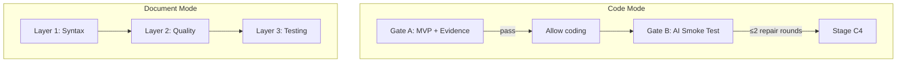

# Tester 规则



测试、验证、质量关卡和审查规范。覆盖文档模式（三层审查 + 动态检查清单）和代码模式（Gate A/B + E2E + 原型页面）的全部 tester 职责。

> 共享格式标准：[docer.md](./docer.md)。质量检查：[../checklists/tester.md](../checklists/tester.md)。
> 其他角色：[coder.md](./coder.md) | [docer.md](./docer.md) | [reporter.md](./reporter.md)。

---

## 1. 负责范围

| 模式 | 产出 | 章节/文件 | 驱动方式 |
|------|------|---------|---------|
| 文档 | 各故事 AC 审查 | `docs/<feature-name>.md` §2 各故事 AC 子节 | 仅规则，无模板 |
| 代码 | 测试骨架 + E2E | `tests/` 目录 | Gate A/B 驱动 |
| 代码 | 原型页面 | `tests/e2e/<feature>/pages/` | 原生 HTML |

---

## 2. Gate A/B 准入与证据（代码模式）

### 2.1 两个强制性门禁

| 门禁 | 阶段 | 含义 |
|------|-------|---------|
| **Gate A** | C1 | 真实入口主路径 MVP 验证 + 可追溯证据；通过后才允许编写代码 |
| **Gate B** | C3 | AI 自动执行 P0 主流程冒烟；失败阻止进入 C4 |

### 2.2 Gate A：编码前 MVP

- 必须与 §2 各 P0 故事场景 + 对应 AC 验收声明对齐
- 入口必须真实：使用项目约定的启动方式；禁止口头推演或伪页面
- MVP 仅覆盖一条主路径（最短闭环）：核心行为可触发、核心结果可观察
- 证据类型（全部必需）：命令 + 退出码 / 日志摘录 / 截图存储于 `tests/screenshots/` / 检查清单标记
- 禁止以"之前试过""应该能用"作为通过依据

#### 按形态指南

| 形态 | Gate A 方法 |
|------|-----------------|
| 前端页面 | 本地服务启动 → 走通主流程 → 检查清单 + 截图 |
| 浏览器扩展 | 扩展加载 → 走通可见路径 → 声明证据路径 |
| Node/CLI | 带主参数运行常用命令 → 日志落地 `tests/` |

### 2.3 Gate B：编码后冒烟

- 必须覆盖所有 P0 故事 AC 主路径项；非主路径 P0 必须标注 N/A + 原因
- 由 AI 通过等效可脚本化路径实际执行
- 主路径端到端走完一遍；允许 ≤2 轮修复
- 产出可审查的产物：终端输出、HTML 报告、`tests/traces/` 等
- 失败阻止进入 C4，触发门禁异常通知

### 2.4 门禁禁止事项

- Gate A 完成前修改项目源代码（测试骨架和原型页面除外）
- 用代码审查替代 Gate B 执行或伪造结果
- 将测试产物放在 `tests/` 之外却声称门禁已满足

---

## 3. 门禁原则与验证

### 3.1 门禁原则

- P0 未全部通过，禁止交付
- 失败后必须修复代码；禁止降级 P0 或修改预期结果
- 自修复上限 2 轮，第 3 轮输出阻断报告
- 需人工确认类型不计入 P0 通过/失败判定
- 门禁未执行 / 被跳过 / 缺证据 = 门禁失败

### 3.2 检查项分类

| 优先级 | 验证方法 | 通过条件 |
|----------|---------------------|----------------|
| P0 | 手动浏览器 + 代码审查 | UI 可交互、data-testid 完整、入口初始化正确 |
| P1 | 手动 + Jest | 错误状态显示、边界值、组件渲染 |
| P2 | 人工 | 视觉一致性、响应式布局 |

### 3.3 验证执行

启动真实入口 → 按检查清单操作 → 截图记录 → 检查 JS 控制台无错误 → 回写结果（✅/❌）

### 3.4 修复循环

第 1 轮：根因分析 → 修复 → 重新验证
第 2 轮：同上
第 3 轮：阻断报告、停止执行

### 3.5 验收标准最终闭合（C4）

阶段 C4 编写总结前，对各故事 AC 表执行最终闭合（必须按顺序）：
1. 回写各故事 AC 最终状态列/备注（含日期或证据路径）
2. 逐项复查 P0 AC 是否为 ✅ 或可解释的 N/A
3. 将结论写入 §4 Project Report

**硬门禁**：以下任一条为否，必须切换为阻断版总结：
- 各故事 AC 已按 Gate B 结果更新、无"未验证却标 ✅"
- 审查记录可追溯
- §4 结论与各故事 AC 当前内容一致

---

## 4. E2E 测试

### 4.1 核心约束

| # | 约束 |
|---|------------|
| E0-1 | 每个场景有明确的验证步骤和预期结果（来自各故事 AC） |
| E0-2 | 交互式 UI 元素必须标记 `data-testid`，格式 `<feature-name>-<element-name>` |
| E0-3 | 断言必须来自各故事 AC 预期结果 |
| E0-4 | API mock 通过 hooks/store 层隔离 |
| E0-5 | 测试文件路径：`tests/e2e/<feature-name>/` |
| E0-6 | Mock 限定在 `tests/` 目录；生产代码禁止 mock |

### 4.2 验证方法

| 方法 | 用途 |
|--------|---------|
| 真实入口 MVP（强制、Gate A） | 主流程最小可行路径 + 证据 |
| 手动浏览器 | 按检查清单操作 + 截图 |
| 代码审查 | data-testid、入口初始化、组件注册 |
| 构建验证 | JS 控制台无错误、组件正常渲染 |
| AI 自动冒烟（强制、Gate B） | 端到端主流程 + 通过/失败证据 |

### 4.3 文件结构

```text
tests/e2e/<feature-name>/
├── <scenario-name>-checklist.md
└── fixtures/
```

### 4.4 E2E 禁止事项

- 在 E2E 测试中导入项目源代码
- 只测试成功路径不覆盖失败分支
- Mock 数据使用无意义占位符
- 在 `tests/` 之外生成测试文件
- 假设自动化基础设施可用

---

## 5. 测试原型页面

### 5.1 核心约束

| ID | 约束 |
|----|------------|
| T0-1 | 每个场景一个原型页面：`tests/e2e/<feature-name>/pages/<scenario-name>/index.html` |
| T0-2 | 页面包含该场景动态检查清单中的所有 P0 操作步骤 UI 元素 |
| T0-3 | 所有交互元素携带 `data-testid="<feature-name>-<element-description>"` |
| T0-4 | 页面可通过 `file://` 或 localhost 访问（无登录/路由守卫依赖） |
| T0-5 | 页面顶部注释说明用户故事编号和检查清单章节 |

### 5.2 data-testid 命名

| 元素类型 | 命名模式 | 示例 |
|-------------|----------------|---------|
| 容器 | `<feature-name>-container` | `toolbar-container` |
| 按钮 | `<feature-name>-<verb>-btn` | `toolbar-download-btn` |
| 输入框 | `<feature-name>-<field>-input` | `toolbar-filename-input` |
| 结果区域 | `<feature-name>-result` | `toolbar-result` |
| 错误消息 | `<feature-name>-error-msg` | `toolbar-error-msg` |

### 5.3 桩行为约束

**允许**：classList.add/remove、textContent 设置、disabled 切换、aria 属性设置
**禁止**：fetch/XMLHttpRequest、框架导入、超 10 行的领域逻辑函数

### 5.4 无障碍性

- 对话框使用 `role="dialog"` + `aria-modal="true"`
- 错误提示使用 `role="alert"`
- 图标按钮必须有 `aria-label`

---

## 6. 故事-AC 覆盖预检

在编写测试和通过门禁之前，明确验证 §2 中各故事场景是否在对应 AC 表中有可执行的 P0 检查项：

1. 列出 §2 中所有故事及其场景
2. 列出各故事 AC 表中所有 P0 验收条件
3. 构建表格：故事 → 覆盖的 P0 AC → 缺口描述
4. 进入 C1："需补充"可存在但必须在对应 AC 表或 `docs/99_agent-runs/` 中记录原因
5. 进入 C2：所有 P0 故事必须有至少一个 AC 映射，或标记为 N/A 并写明原因

---

## 7. 验收标准（各故事 AC 表）

> 禁用模板。每个 AC 和验证工具必须可追溯至故事需求与设计。

### 故事 AC 表格式（强制）

每个故事必须使用独立 AC 表（在 `#### N.M.4 Acceptance Criteria` 子节）：

| AC# | Criterion (Measurable) | Test Method | Expected Result | Status |
|-----|------------------------|-------------|-----------------|--------|
| AC1 | {可度量验收条件} | `{命令/操作}` | {可验证预期} | ⬜/✅/❌ |

### 可度量标准对照（P0 强制）

| 检查类型 | 禁用表述 | 正确表述 |
|----------|----------|----------|
| 构建 | "构建成功" | `npm run build` 退出码 = 0，stderr 无 ERROR |
| 链接 | "链接有效" | `grep -c '404' <log>` = 0 |
| 性能 | "性能可接受" | LCP < 2.5s 或 execution time < 1000ms |
| 覆盖率 | "测试覆盖足够" | lines covered ≥ 80% 或 P0 路径全部覆盖 |
| UI 验证 | "UI 正确显示" | `data-testid` 元素 count() = 预期数，截图路径 |
| 错误处理 | "错误处理正常" | 触发条件 → `role="alert"` 文本 = 预期消息 |

### 生成前置条件（P0）

1. §1 Feature Overview 范围边界明确
2. 各故事 Design 子节包含涉及模块表
3. 设计引用的关键代码路径在仓库中**实际存在**

### 事实来源映射

| 事实类型 | 来源约束 |
|-----------|-------------------|
| 场景名称 / 前置条件 / 步骤 / 预期结果 | 故事 Requirements + Design 子节 |
| 相关模块 / 代码路径 / 验证点 | 故事 Design 涉及模块表 |
| 验证工具 / 技能 | `.claude/skills/` 中可用的技能；未找到则标注"建议人工审核" |
| 优先级 | 依据故事 Priority 判定 |

### 验证闭合检查（P0，阶段 D4/C3 强制）

| 检查项 | 标准 | 验证方法 |
|--------|------|----------|
| 故事覆盖 | 每个 P0 故事 AC ≥ 1 | 目视检查 §2 各故事 |
| 锚点链接 | 无跨故事 AC 引用 | 目视检查 |
| 代码路径真实 | 每个代码路径指向真实存在的文件 | `test -f <each path>` |
| 零占位符 | 无 `{placeholder}` 或未替换的模板 | `grep -c '{' <file>` = 0 |

### 文档结构

1. 每个故事 AC 表自包含在该故事 `N.M.4` 子节
2. §4 Project Report 含 Verification Summary 汇总所有故事 AC 通过情况

### 优先级判定

- **P0**：主流程可用性、数据一致性、安全性、构建
- **P1**：体验/可维护性（不阻断主流程）
- **P2**：可选的优化项

---

## 8. 三层审查关卡（文档模式 D4）

所有生成的文档在保存前必须通过此关卡。由 tester 统一执行。

### 第一层：语法

- 包含 Mermaid → tester 审查 Mermaid 语法并写回
- Mermaid 语法审查必须在文档质量审查之前
- 就地修复语法错误；写回同一文件

### 第二层：质量

- tester 进行结构和表达质量审查 + 跨文档一致性检查
- P0 问题必须在保存前修复
- **不得跳过**

### 第三层：测试

- tester 进行链接/代码/术语验证
- **不得跳过**

### 质量统计

- tester 统计 P0/P1/P2
- **不得跳过**

### 自检流程

1. 加载文档类型对应的 `checklists/<type>.md`
2. P0 全部通过后保存为通过状态
3. 最多 1 轮自修复；若仍失败 → 阻断流程

无论变更级别为何（T1/T2/T3），审查永远不得裁剪。

---

## 9. Agent 合约（审查相关）

### tester（D4 文档审查 + C1–C3 测试验证）

**文档审查（D4）**：
- Mermaid 语法审查与修复；修复后写回同一文件
- 无 Mermaid 块时可跳过 Mermaid 审查；质量审查和测试不可跳过
- 结构和表达质量审查 + 跨文档一致性检查；P0 必须在保存前修复
- Markdown 质量测试：链接、代码块、术语一致性
- 所有文档的 P0/P1/P2 统计

**代码验证（C1–C3）**：
- C1：Gate A — 真实入口 MVP 验证 + 测试原型页面生成
- C2：逐模块代码审查 — 安全审计 + 业务逻辑 + 架构一致性 + 可维护性 + 可测试性
- C3：Gate B — 主流程冒烟测试

### 调用顺序

1. Mermaid 语法审查必须在文档质量审查之前
2. 质量审查、Markdown 测试、质量统计可并行运行
3. 验证输出：`node skills/build-feature/scripts/validate-agent-output.js --agent tester --text "<output>"`
4. 失败：第 1 次 → 重试；第 2 次 → 阻断流程

### 辅助 Skills

| Skill | 用途 | 阶段 |
|-------|------|------|
| `code-review` | 真实代码审查 | C2 |
| `e2e-testing` | E2E 测试方案生成 | C1 |
| `verification-loop` | 验证循环执行 | C2/C3 |

---

## 10. 模式感知的门禁流

### 全模式（document → code）

文档模式的三层审查必须在代码模式的 Gate A 之前通过。文档审查未通过时，代码模式不得启动。

### 门禁携带

- 文档模式的 P0 通过状态可携带至代码模式
- 各故事 AC 表是连接两个模式的共享验证表
- 代码模式的 Gate B 结果回写至各故事 AC 表

### 统一 P0 追踪

| 来源 | 检查项 | 门禁 |
|------|-----------|------|
| 文档模式 D4 | 文档结构、链接、Mermaid、术语 | 三层审查 |
| 代码模式 C1 | 真实入口 MVP | Gate A |
| 代码模式 C2 | 逐模块审查 | 动态检查门禁 |
| 代码模式 C3 | 主流程冒烟 | Gate B |

---

## 11. Tester 阶段分配

| 阶段 | 模式 | 进入条件 | 退出条件 |
|-------|------|---------|---------|
| D4 | 文档 | 阶段 D3 完成 | 三层审查通过、P0 清零 |
| C1 | 代码 | 阶段 C0 完成（全模式：D5 完成） | Gate A 通过 + 证据保留 |
| C2 | 代码 | 阶段 C1 完成 | 逐模块审查完成、所有 P0 清零 |
| C3 | 代码 | 阶段 C2 完成 | Gate B 通过、所有 P0 AC 验证回写 |
