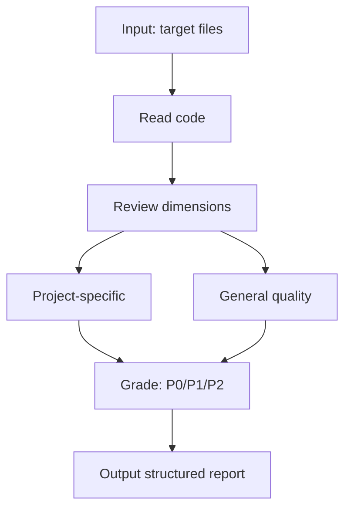

# code-review



## 用途

对指定的代码文件或代码片段执行规范性审查，输出 P0/P1/P2 分级问题列表。

本 skill 定义审查方法、维度和输出格式。审查由 `tester` agent 在 `rui` 流水线 C2 阶段执行。

## 输入

- **审查目标**：文件路径列表或代码片段（必填）
- **上下文**：相关设计文档章节或功能描述（可选）
- **关注领域**：如 `architecture consistency` / `security` / `performance`（可选，默认全面审查）

## 审查维度

### 项目专项（根据仓库现状适用）

- **入口初始化模式**：视图入口是否遵循项目现有的初始化方式？
- **状态管理模式**：Store/状态层是否遵循项目现有的组织方式？
- **共享组件注册/导出**：共享组件是否按项目约定集中管理且可正确引用？

### 通用质量

- **可读性**：函数/变量命名是否清晰、必要注释是否存在？
- **边界处理**：空值、异常路径是否已处理？
- **安全性**：是否存在 XSS / CSRF / 敏感信息泄露风险？
- **性能**：是否存在明显的不必要渲染 / 内存泄漏风险？

## 输出格式

```
审查结果：
P0（必须修复）：
  - file:line — <问题描述> — <修复建议>

P1（建议修复）：
  - file:line — <问题描述>

P2（可选优化）：
  - file:line — <问题描述>

无问题项：<若某维度无问题，明确声明>
```

## 使用规则

- 仅审查**实际读取到的代码**；不推断未看到的文件内容。
- 文件无法访问时，输出"无法读取文件 <路径>，跳过。"
