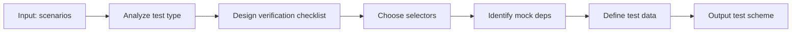

# e2e-testing



## 用途

将需求任务中的主要操作场景转化为可执行的 E2E 测试方案，输出测试策略、用例骨架和验证要点。

**测试优先原则**：本 skill 强调"代码实现之前先有测试方案"。在 `build-feature` code mode 进入阶段 2（代码实现）之前，必须先产出可行的测试策略和验收标准；每一行代码实现都必须对应已定义的测试验证点。

本 skill 定义测试方案方法和输出格式。测试方案由 `tester` agent 在 `build-feature` 流水线 C1 阶段执行。

### 与 build-feature code mode 联用时的附加约束

- **编码前（Gate A）— 测试优先**：交付物必须支持"真实入口上的主路径 MVP"——例如可操作的 `tests/e2e/<feature>/…-checklist.md` 步骤、推荐的 `data-testid` 列表，并与 `02`/`05` 中的 P0 场景一致。**代码实现开始前，测试方案和验收标准必须就绪。**
- **编码后（Gate B）**：用例骨架必须可由 AI 自动化执行；若场景缺少充分断言，明确写"前置信息不足：…"而非编造通过条件。
- **真源**：准入基准（什么算证据、什么算阻断）由 **`../../agents/tester/AGENT.md`** 定义；本 skill 不重新定义 Gate A/B。

## 输入

- **场景列表**：来自需求任务的操作场景（名称 + 前置条件 + 操作步骤 + 预期结果）
- **技术栈**：如 Vue3 + Vite（用于推断选择器策略）
- **关键代码路径**：设计文档中涉及的模块（可选）

## 工作流程

1. 分析每个场景，确定测试类型（UI 交互 / 数据流 / 权限 / 边界）
2. 为每个场景设计验证步骤检查清单
3. 给出选择器策略（优先 `data-testid`，次选语义标签）
4. 识别需要 mock 的外部依赖
5. 给出测试数据策略

## 输出格式（每个场景）

```
场景：<场景名称>
测试类型：UI 交互 / 数据流 / 权限 / 边界
验证检查清单：
  // 前置条件
  // 操作步骤
  // 断言
选择器策略：<描述>
Mock 依赖：<需 mock 的接口/模块，或"无">
测试数据：<建议的测试数据构造方法>
```

## 约定（适用时）

- 选择器优先级：`data-testid` > 语义标签（`button[type=submit]`）> 文本内容
- 测试文件位置：`tests/e2e/<feature>.spec.js`
- 基础入口：若无自动化运行器，本地启动服务或直接打开入口页面（根据项目现状）

## 使用规则

- 测试用例只能基于**已提供的场景**生成；不得添加需求任务中不存在的场景。
- 若场景描述不足以推断断言条件，输出"前置信息不足，需补充：<缺失内容>。"
