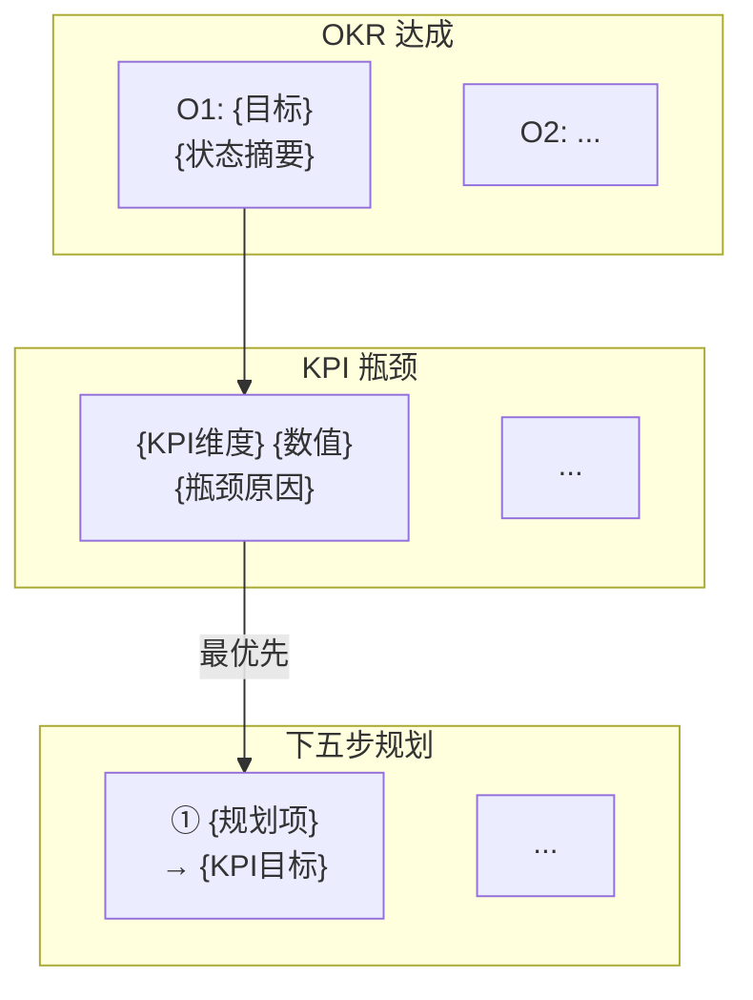

paths:
  - "docs/周报/**/*.md"
generate_mode: rules-only
template: disabled
---

# 周报规范

> **生成约束**：本文档类型**禁用模板**。所有内容必须来自真实来源（docs/ 下全文档集、git 日志、agent 记忆），无真实来源则写"待补充（原因：...）"，**不得编造**。
> **动态推断原则**：所有 OKR、KPI、自改进建议必须从实际文档内容推断，禁止凭空生成"通用最佳实践"。

## 文档概述

- 周报是项目周期性复盘与规划文档，以 OKR 记录用户故事案例进展，以 KPI 进行量化复盘和下一步规划
- 同时包含系统自改进（`.claude/` 目录）和项目自改进（根目录项目相关）的分析与建议
- **触发**：`/generate-document weekly` 或 `/generate-document weekly <YYYY-WNN>`
- **产出路径**：`docs/周报/<YYYY>-W<NN>.md`（如 `docs/周报/2026-W17.md`）

## 动态上下文读取（生成前必须执行）

以下所有文件必须实际读取，不得凭记忆推断：

### 项目基础文件
1. `CLAUDE.md` — 项目行为准则
2. `README.md` — 项目概述
3. `docs/architecture.md` — 项目架构约定
4. `docs/FAQ.md` — 常见问题与解答（如有）
5. `docs/auth.md` — 认证/鉴权方案（如有）
6. `docs/security.md` — 安全策略（如有）

### 全文档集扫描
7. 扫描 `docs/` 下所有 `<功能名>/` 目录，读取每个目录下的 01-07 全文档集
8. 对每个功能目录，提取：用户故事（01/02）、设计要点（03）、验证结果（05）、实施总结（06）、项目报告（07）

### 系统状态文件
8. `.claude/shared/evidence-and-uncertainty.md` — 证据与不确定性规范
9. `.claude/agents/memory/` — agent 记忆文件
14. 其他 `.claude/agents/memory/` 下所有记忆文件

### Git 状态
15. `git log --since="<本周一日期>" --until="<本周日日期>" --oneline` — 本周提交记录
16. `git diff --stat HEAD~<N>` — 本周变更统计（如有提交）

## 文档结构（严格遵循）

> **格式原则**：周报面向老板阅读，采用"大表格 + Mermaid 图"格式，全篇 2~3 个大表格 + 2~3 个 Mermaid 图，避免碎片化小表格。信息密度优先于章节数量。

### 1. 文档头部

```markdown
# {YYYY}-W{NN} 周报

> **文档版本**: v1.0 | **最后更新**: {YYYY-MM-DD} | **维护者**: {大模型名称} | **工具**: {Claude Code / Cursor}
>
> **覆盖周期**: {YYYY-MM-DD} ~ {YYYY-MM-DD}（ISO 周 {YYYY}-W{NN}）
>
> **关联功能目录**: {列出本周涉及的 docs/<功能名>/ 目录，用 | 分隔}
```

### 2. OKR 达成与 KPI 复盘总表（1 个大表格）

**合并原则**：将 OKR 的 Objective/KR 和 KPI 复盘合并为一张大表，每行 = 一个 Objective，右侧列展示 KPI 维度数值。

```markdown
## 一、OKR 达成与 KPI 复盘总表

| Objective | KR1 完成度 | KR2 质量 | KR3 效率 | 交付完成率 | P0 通过率 | 防幻觉率 | 修复轮次 | 规则覆盖率 |
|-----------|-----------|---------|---------|-----------|----------|---------|---------|-----------|
| **O1: {目标}** | {状态+数值} | {状态+数值} | {状态+数值} | {N}% | {N}% | {N}% | {N} | {N}% |
| **O2: ...** | ... | ... | ... | ... | ... | ... | ... | ... |
| **综合** | — | — | — | **{N}%** | **{N}%** | **{N}%** | **{N}** | **{N}%** |

> **达成标准**: ✅ ≥80%/90%/≤2轮 | 🟡 50-79%/70-89%/3轮 | ❌ <50%/<70%/≥4轮
>
> **证据**: {列出关键证据文件路径}
```

**推断规则**：
- 每个 `docs/<功能名>/` 目录生成 1 个 Objective 行
- Objective 标题从 `01_需求文档.md` 和 `02_需求任务.md` 推断
- KR 从 `06_实施总结.md` 验证结果和 `05_动态检查清单.md` 通过率推断
- 无功能目录时写"本周无活跃用户故事案例"

**KR 达成标准**：
- ✅（达成）：完成度 ≥80%、P0 通过率 ≥90%、修复轮次 ≤2
- 🟡（部分达成）：完成度 50-79%、P0 通过率 70-89%、修复轮次 3
- ❌（未达成）：完成度 <50%、P0 通过率 <70%、修复轮次 ≥4

### 3. OKR→KPI→规划 链路全景图（1 个 Mermaid flowchart）



**推断规则**：
- 从 OKR 未达成的 KR 连线到对应 KPI 瓶颈
- 从 KPI 瓶颈连线到对应下五步规划
- 用 `style` 高亮瓶颈项（红色）和最优先规划（绿色）

### 4. 规划与改进优先级总表（1 个大表格）

**合并原则**：将"下五步规划"和"系统自改进 + 项目自改进"合为一张大表，按优先级排列，用"类型"列区分。

```markdown
## 三、规划与改进优先级总表

| # | 类型 | 改进项 | KPI 指标 | 验证方式 | 风险/依赖 | 证据 |
|---|------|--------|---------|---------|----------|------|
| 1 | 规划 | {从复盘根因推断最优先改进} | {量化目标} | {可执行检查} | {从 FAQ 推断} | {文件路径} |
| 2 | 系统 | {skills/agents/rules/shared 改进} | ... | ... | ... | {记忆案例 N} |
| 3 | 项目 | {文档/架构/代码改进} | ... | ... | ... | {前置条件检查} |
```

**类型标签**：规划（下五步规划项）| 系统（.claude/ 目录改进）| 项目（根目录项目改进）

**推断规则**：
- 步骤 1：从复盘根因推断最优先改进（通常是达成率最低的 KPI 维度）
- 系统改进从 agent 记忆文件推断，项目改进从 architecture.md 和 FAQ.md 推断
- 每条改进必须有证据（指向具体文件路径和案例编号）

### 5. 改进优先级矩阵图（1 个 Mermaid quadrantChart）

```mermaid
quadrantChart
    title 改进优先级矩阵（影响度 vs 实施难度）
    x-axis "低影响" --> "高影响"
    y-axis "易实施" --> "难实施"
    quadrant-1 "优先做（高影响·易实施）"
    quadrant-2 "重点投入（高影响·难实施）"
    quadrant-3 "可延后（低影响·易实施）"
    quadrant-4 "暂缓（低影响·难实施）"
    "{改进项}": [{影响度 0-1}, {易实施度 0-1，0=最易}]
```

**坐标推断规则**：
- 影响度（x轴）：从 KPI 达成率推断，影响未达标 KPI 的改进项 x 值更高
- 实施难度（y轴）：从依赖数量和改动范围推断，依赖少改动小 y 值更低

### 6. AI 链路质量统计表（1 个表格，可选）

当项目有 AI 调用链路需要追踪时，增加此表。每行 = 一个链路组件。

```markdown
## 五、AI 链路质量统计

| 链路组件 | 调用次数 | 产出 | 推断准确度 | 防幻觉 | 综合评级 |
|---------|---------|------|-----------|--------|---------|
| {组件名} | {N} | {文件名} | {✅/🟡/❌} | D类={N} | {A/B+/B-/C} |
```

## 保存位置

- `docs/周报/<YYYY>-W<NN>.md`

## 周编号计算规则

- 使用 ISO 8601 周编号：`YYYY-WNN`
- 周一为每周起始日
- 示例：2026-04-28（周二）→ 2026-W17

## 防幻觉约束

- OKR 的 KR 状态（✅/🟡/❌）必须从实际文档内容推断，不得凭期望填写
- KPI 数值必须从实际统计推断，不得估算
- 自改进建议必须有证据支撑（指向具体文件路径和案例编号）
- 无功能目录时如实写"本周无活跃用户故事案例"，不得虚构

## 质量检查清单

### P0 - 必须通过

- **文档头部完整**：含版本、日期、维护者、覆盖周期、关联功能目录
- **OKR 覆盖所有功能目录**：每个 docs/<功能名>/ 目录都有对应的 Objective
- **KR 有证据**：每个 KR 都指向具体的 docs/<功能名>/ 文件路径
- **KPI 复盘有量化数据**：5 个 KPI 维度都有具体数值（百分比或轮次）
- **下五步规划可执行**：每步有量化 KPI 目标和可执行验证方式
- **自改进有证据**：每条改进都指向具体文件路径和案例编号
- **防幻觉**：无 D 类陈述（虚构数据、虚构案例）

### P1 - 应该通过

- **OKR 达成状态准确**：✅/🟡/❌ 与实际文档内容一致
- **复盘根因分析深入**：不止于"未完成"，能指向具体原因
- **下五步规划优先级合理**：步骤 1 是达成率最低的 KPI 维度
- **自改进建议具体**：指向具体的文件路径和最小改动点

### P2 - 可以有

- **Git 提交统计准确**：本周提交数量和变更统计与 git log 一致
- **跨周对比**：引用上周周报进行 KPI 趋势对比（如有上周周报）
- **改进建议可执行性高**：每条建议都有明确的执行步骤和预期收益