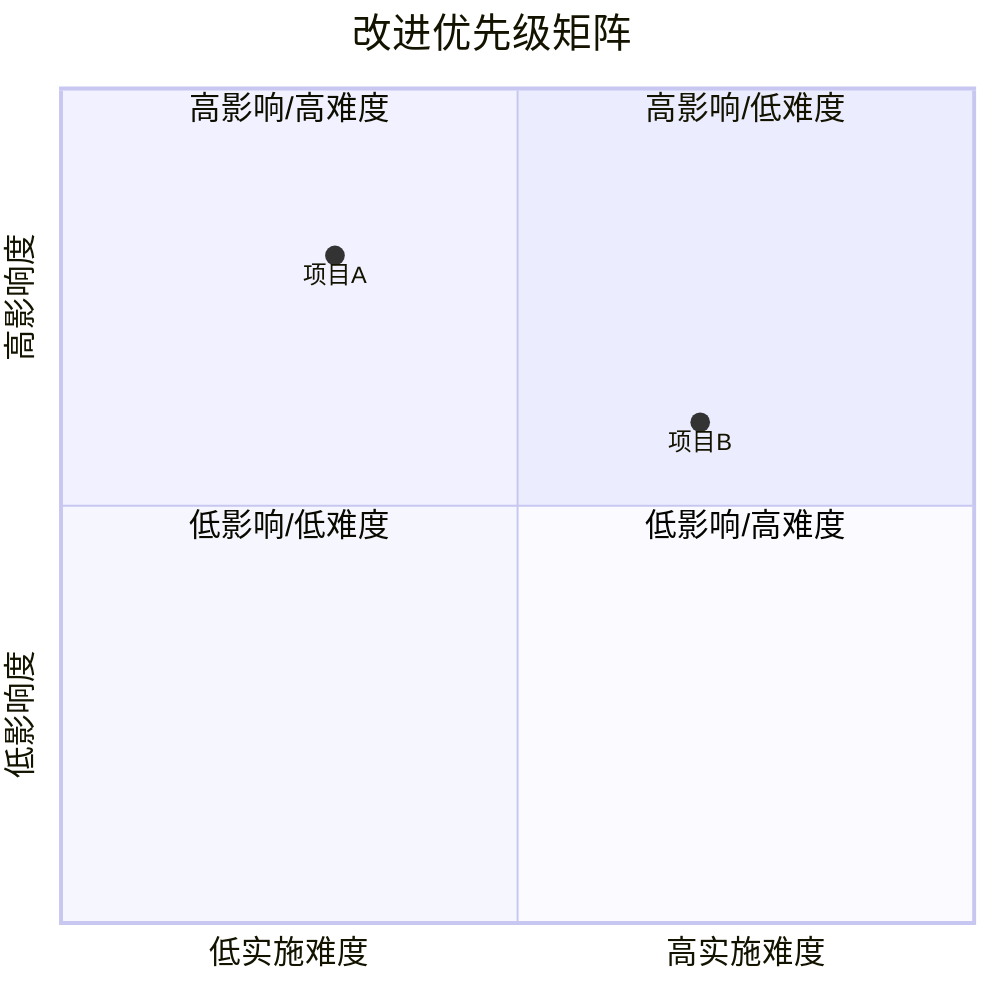

---
paths:
  - "docs/周报/**/*.md"
generate_mode: rules-only
template: disabled
---

# 周报规范

> **禁用模板**。内容须来自真实来源（docs/全文档集、git日志、agent记忆），无来源写"待补充"。

## 动态上下文读取（生成前必须执行）

1. 运行 `scripts/collect-weekly-kpi.js --with-logs`（`skills/generate-document/scripts/`）
2. 读项目基础文件：CLAUDE.md / README.md / architecture.md / FAQ.md / auth.md / security.md
3. 补充校验：脚本未覆盖的功能，手动读01-07

## 文档结构

> 格式原则：面向管理者，"大表格 + Mermaid 图"，约 3 大表 + 2~3 Mermaid。

### 1. 头部

版本信息 + 覆盖周期(自然周周一至周日) + 关联功能目录

**关联功能目录写法**：
- 有活跃功能目录时：列出 `docs/<功能名>/` 目录名（不强制加链接，禁止链接到不存在的路径）
- 无活跃功能目录时：写 `> 本周无活跃功能目录`，禁止虚构目录或生成死链

### 2. KPI 量化总表

按功能分行：交付完成率 / P0通过率 / 防幻觉率 / 修复轮次 / 规则覆盖率 / 维度综合(✅/🟡/❌+依据)

判定：交付≥80%✅ | P0≥90%✅ | 轮次≤2✅

### 3. 本周复盘

进展亮点(1~3条可验证事实) → 问题根因(现象→推断→证据路径) → 与上周对比(可选)

### 4. KPI→复盘→规划链路全景图（Mermaid flowchart）

KPI未达标 → 复盘根因 → 后期规划（因果链）

**语法约束**：
- 中文节点、含空格或特殊字符的节点必须用双引号包裹，如 `A["KPI未达标"]`
- 禁止在节点文本中使用全角括号 `（）`、全角冒号 `：` 等未转义字符

### 5. 后期规划与改进优先级总表

合并后期规划+系统自改进+项目自改进。类型标签：规划 | 系统 | 项目

### 6. 改进优先级矩阵图（Mermaid quadrantChart）

影响度 vs 实施难度

**语法示例（必须严格遵循）**：

```markdown

```

**兼容性约束**：
- `quadrantChart` 需要 Mermaid v10.6+；若预览器报错，降级为 Markdown 表格或 `graph LR`
- 所有中文节点文本、含空格或特殊字符的文本必须用 **双引号** 包裹
- 禁止在节点文本中使用全角括号 `（）`、全角冒号 `：` 等未转义字符

### 7. AI 链路质量统计表（可选）

## 覆盖周期

周一至周日，文件名 `YYYY-MM-DD~YYYY-MM-DD`。
`/generate-document weekly` 取当前自然周；指定日期自动展开为该自然周。

## 一次执行到底（强制）

周报生成必须单轮完成，不得因任何非阻断原因中断或降级为"稍后补充"。

- **缺失信息处理**：数据缺失写"待确认"、"本周无数据"、"未记录"，不得停下来等待用户补充
- **阻断门槛**：仅当命中 H1-H4 阻断条件（见 `orchestration.md §4`）时才允许中断；中断后仍必须执行步骤 6（import-docs → wework-bot）
- **禁止行为**：禁止说"请提供XX数据后再继续"、禁止将周报拆分为多轮生成、禁止因某个功能目录缺失而跳过整份周报

## 防幻觉

KPI数值须从实际推断 / 复盘根因须有可追溯证据 / 规划须对应可验证KPI / 无功能目录须如实陈述

## Mermaid 审查（强制）

定稿前 `doc-mermaid-expert` 审查写回。

## 质量检查

> 见 [checklists/周报.md](../checklists/周报.md)