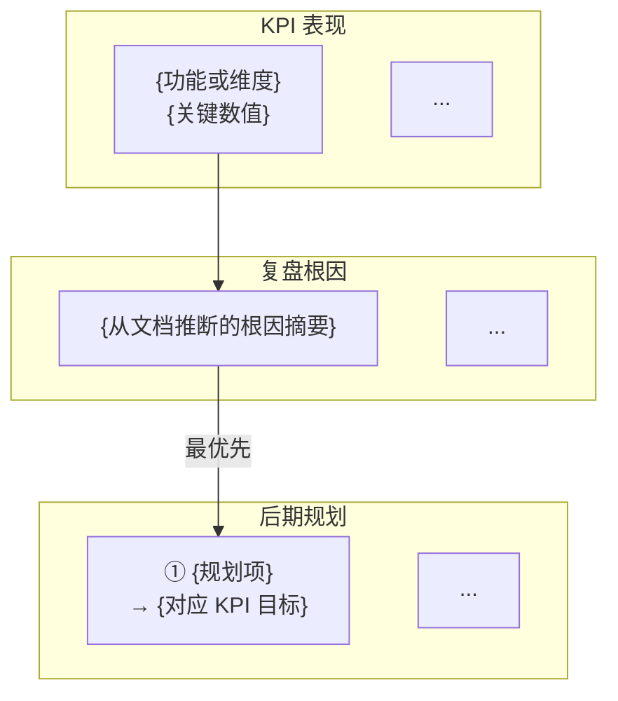

paths:
  - "docs/周报/**/*.md"
generate_mode: rules-only
template: disabled
---

# 周报规范

> **生成约束**：本文档类型**禁用模板**。所有内容必须来自真实来源（docs/ 下全文档集、git 日志、agent 记忆），无真实来源则写"待补充（原因：...）"，**不得编造**。
> **动态推断原则**：所有 KPI、复盘结论、后期规划与自改进建议必须从实际文档内容推断，禁止凭空生成"通用最佳实践"。

## 文档概述

- 周报是项目周期性文档：**以 KPI 做量化分析**，**以本周复盘沉淀事实与根因**，**以后期规划对接下一周期动作**
- 同时包含系统自改进（`.claude/` 目录）和项目自改进（根目录项目相关）的分析与建议
- **触发**：`/generate-document weekly` 或 `/generate-document weekly <YYYY-MM-DD~YYYY-MM-DD>`
- **产出路径**：`docs/周报/<周一起始日期>~<周日结束日期>_周报.md`（如 `docs/周报/2026-04-20~2026-04-26_周报.md`）

## 动态上下文读取（生成前必须执行）

以下所有文件必须实际读取，不得凭记忆推断：

### 项目基础文件
1. `CLAUDE.md` — 项目行为准则
2. `README.md` — 项目概述
3. `docs/architecture.md` — 项目架构约定
4. `docs/FAQ.md` — 常见问题与解答（如有）
5. `docs/auth.md` — 认证/鉴权方案（如有）
6. `docs/security.md` — 安全策略（如有）

### 全文档集扫描
7. 扫描 `docs/` 下所有 `<功能名>/` 目录，读取每个目录下的 01-07 全文档集
8. 对每个功能目录，提取：用户故事（01/02）、设计要点（03）、验证结果（05）、实施总结（06）、项目报告（07）

### 系统状态文件
9. `.claude/shared/evidence-and-uncertainty.md` — 证据与不确定性规范
10. `.claude/agents/memory/` — agent 记忆文件
11. 其他 `.claude/agents/memory/` 下所有记忆文件

### Git 状态
12. `git log --since="<本周一日期>" --until="<本周日日期>" --oneline` — 本周提交记录
13. `git diff --stat HEAD~<N>` — 本周变更统计（如有提交）

## 文档结构（严格遵循）

> **格式原则**：周报面向管理者阅读，采用"大表格 + Mermaid 图"格式，全篇约 3 个大表格 + 2~3 个 Mermaid 图，避免碎片化小表格。信息密度优先于章节数量。

### 1. 文档头部

```markdown
# {YYYY-MM-DD}~{YYYY-MM-DD} 周报

> **文档版本**: v1.0 | **最后更新**: {YYYY-MM-DD} | **维护者**: {大模型名称} | **工具**: {Claude Code / Cursor}
>
> **覆盖周期**: {YYYY-MM-DD} ~ {YYYY-MM-DD}（自然周：周一至周日）
>
> **关联功能目录**: {列出本周涉及的 docs/<功能名>/ 目录，用 | 分隔}
```

### 2. KPI 量化总表（1 个大表格）

**原则**：按功能目录（或本周活跃范围）分行，仅呈现 KPI 维度与综合表现，不做 Objective/KR 叙事。

```markdown
## 一、KPI 量化总表

| 功能/案例 | 交付完成率 | P0 通过率 | 防幻觉率 | 修复轮次 | 规则覆盖率 | 维度综合 |
|-----------|-----------|----------|---------|---------|-----------|---------|
| **{功能名 A}** | {N}% | {N}% | {N}% | {N} | {N}% | {✅/🟡/❌ + 一句依据} |
| **{功能名 B}** | ... | ... | ... | ... | ... | ... |
| **综合** | **{N}%** | **{N}%** | **{N}%** | **{N}** | **{N}%** | — |

> **维度判定**: ✅ ≥80%/90%/≤2轮（交付/P0/轮次对照列含义） | 🟡 中等区间 | ❌ 未达标  
>
> **证据**: {列出关键证据文件路径}
```

**推断规则**：
- 每个 `docs/<功能名>/` 目录生成 1 行；标题从 `01_需求文档.md` 和 `02_需求任务.md` 归纳
- 各 KPI 从 `06_实施总结.md`、`05_动态检查清单.md`、`07_项目报告.md`（如有）等推断
- **维度综合**列：用 ✅/🟡/❌ 概括该行最需关注的短板，并附一句可追溯证据的说明
- 无功能目录时写"本周无活跃用户故事案例"，综合行可填「待补充」

**单维度判定参考**（与列含义对齐后选用）：
- 交付完成率：✅ ≥80% | 🟡 50–79% | ❌ <50%
- P0 通过率：✅ ≥90% | 🟡 70–89% | ❌ <70%
- 修复轮次：✅ ≤2 | 🟡 3 | ❌ ≥4

### 3. 本周复盘（文字小节）

**原则**：在 KPI 数字之外，用文字归纳本周事实、根因与结论，避免只有表格没有判断。

```markdown
## 二、本周复盘

### 进展与亮点
- {基于文档与 git 的可验证事实，1~3 条}

### 问题与根因
- {对应 KPI 薄弱项或阻塞项，每条尽量：**现象 → 推断根因 → 证据路径**}

### 与上周对比（可选）
- {若存在上周周报文件 `docs/周报/*`，对比 KPI 或结论变化；无则写「无上期周报」或删除本小节}
```

### 4. KPI→复盘→后期规划 链路全景图（1 个 Mermaid flowchart）

正文章节标题：

```markdown
## 三、KPI→复盘→后期规划 链路全景图
```

图体：



**推断规则**：
- 从 **未达标或 🟡 的 KPI** 连到 **复盘根因**，再连到 **后期规划** 中的对应条目
- 不需要 OKR 节点；因果链统一为 **KPI → 根因 → 行动**
- 用 `style` 标红瓶颈 KPI、标绿最优先规划项（可选）

### 5. 后期规划与改进优先级总表（1 个大表格）

**合并原则**：将「后期规划（下五步）」与「系统自改进 + 项目自改进」合为一张大表，按优先级排列，用「类型」列区分。

```markdown
## 四、后期规划与改进优先级总表

| # | 类型 | 改进项 | KPI 指标 | 验证方式 | 风险/依赖 | 证据 |
|---|------|--------|---------|---------|----------|------|
| 1 | 规划 | {从复盘根因推断的最优先项} | {量化目标} | {可执行检查} | {从 FAQ 等推断} | {文件路径} |
| 2 | 系统 | {skills/agents/rules/shared 改进} | ... | ... | ... | {记忆案例 N} |
| 3 | 项目 | {文档/架构/代码改进} | ... | ... | ... | {前置条件检查} |
```

**类型标签**：规划（本期后期动作）| 系统（`.claude/` 改进）| 项目（仓库根目录项目改进）

**推断规则**：
- 第 1 项通常对齐全局或单功能 **达成率最低 / 风险最高** 的 KPI 维度
- 系统改进从 agent 记忆推断；项目改进从 `architecture.md`、`FAQ.md` 推断
- 每条必须有证据（路径或案例编号）

### 6. 改进优先级矩阵图（1 个 Mermaid quadrantChart）

正文章节标题：

```markdown
## 五、改进优先级矩阵
```

图体：

```mermaid
quadrantChart
    title 改进优先级矩阵（影响度 vs 实施难度）
    x-axis "低影响" --> "高影响"
    y-axis "易实施" --> "难实施"
    quadrant-1 "优先做（高影响·易实施）"
    quadrant-2 "重点投入（高影响·难实施）"
    quadrant-3 "可延后（低影响·易实施）"
    quadrant-4 "暂缓（低影响·难实施）"
    "{改进项}": [{影响度 0-1}, {易实施度 0-1，0=最易}]
```

**坐标推断规则**：
- 影响度（x 轴）：关联未达标 KPI 或复盘高危项的改进，x 值更高
- 实施难度（y 轴）：从依赖数量与改动范围推断，依赖少、改动小则 y 值更低（更易实施）

### 7. AI 链路质量统计表（1 个表格，可选）

当项目有 AI 调用链路需要追踪时，增加此表。每行 = 一个链路组件。

```markdown
## 六、AI 链路质量统计

| 链路组件 | 调用次数 | 产出 | 推断准确度 | 防幻觉 | 综合评级 |
|---------|---------|------|-----------|--------|---------|
| {组件名} | {N} | {文件名} | {✅/🟡/❌} | D类={N} | {A/B+/B-/C} |
```

## 保存位置

- `docs/周报/<周一起始日期>~<周日结束日期>_周报.md`

## 覆盖周期计算规则（自然周）

- 周一为每周起始日，周日为每周结束日
- 文件名与标题统一使用起止日期：`YYYY-MM-DD~YYYY-MM-DD`
- `/generate-document weekly`：自动取当前自然周
- `/generate-document weekly <日期>`：若给定日期落在某周内，自动展开为该自然周起止
- `/generate-document weekly <起始~结束>`：需校验起始为周一、结束为周日，不满足则按自然周重算并修正

## 防幻觉约束

- KPI 数值与 ✅/🟡/❌ 必须从实际文档与统计推断，不得估算或迎合预期
- 复盘根因必须有可追溯证据（路径或清单条目）
- 后期规划条目必须对应可验证的 KPI 目标或检查方式
- 自改进建议须有证据（路径与案例编号）
- 无功能目录时如实陈述，不得虚构案例

## 质量检查清单

### P0 - 必须通过

- **文档头部完整**：含版本、日期、维护者、覆盖周期、关联功能目录
- **KPI 总表覆盖范围**：每个本周活跃的 `docs/<功能名>/` 目录各占一行（无则明确说明）
- **KPI 有量化与证据**：五个 KPI 维度在总表或证据块中有具体数值（百分比或轮次）及路径
- **本周复盘非空**：至少包含进展/亮点与问题根因中的可验证条目，禁止仅有表格无结论
- **后期规划可执行**：优先项含量化 KPI 目标、验证方式与证据
- **链路全景图因果正确**：flowchart 体现 KPI→根因→后期规划，不使用 OKR 节点
- **自改进有证据**：每条指向具体文件路径或案例编号
- **防幻觉**：无 D 类陈述（虚构数据、虚构案例）

### P1 - 应该通过

- **维度综合与文档一致**：总表中的 ✅/🟡/❌ 与 06/05 等来源一致
- **复盘根因具体**：能指向原因类别与证据，而非仅「未完成」
- **后期规划优先级合理**：首条对应最薄弱 KPI 或最高风险根因
- **优先级矩阵坐标合理**：高影响改进落在预期象限

### P2 - 可以有

- **Git 提交统计准确**：本周提交与 `git log` 一致
- **跨周对比**：引用上周周报做 KPI 或结论趋势对比（如有上期文件）
- **改进建议可执行**：步骤清晰、预期结果可观察
