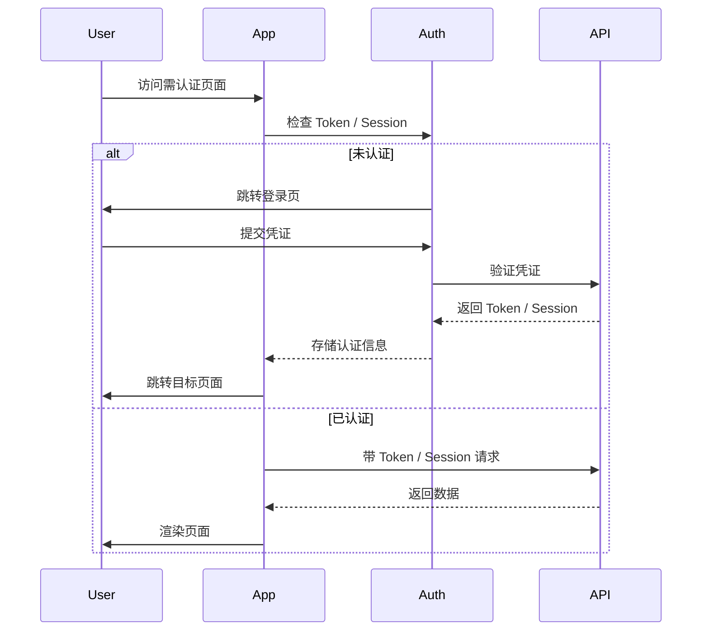
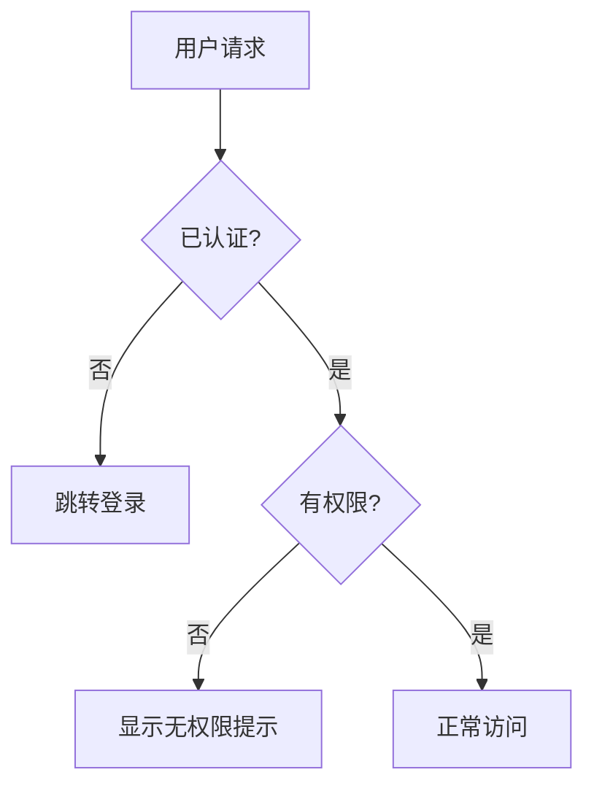

---
paths:
  - "CLAUDE.md"
  - "README.md"
  - "docs/architecture.md"
  - "docs/changelog.md"
  - "docs/devops.md"
  - "docs/FAQ.md"
  - "docs/auth.md"
  - "docs/security.md"
  - "docs/项目初始化/**/*.md"
---

# 项目基础文件规范

> 本规范约束 `/generate-document init` 命令生成的项目基础文件和 `docs/项目初始化/` 全文档编号集的内容结构和防幻觉规则。

## 文件清单

### A. 项目基础文件（7 个）

| 文件 | 职责 | Grounding 来源 |
|------|------|----------------|
| `CLAUDE.md` | 项目行为准则入口 | `.claude/shared/behavioral-guidelines.md` + 项目特有补充 |
| `README.md` | 项目概述与快速开始 | `package.json` / `index.html` + 目录结构 |
| `docs/architecture.md` | 项目架构约定 | 目录结构 + 核心入口文件 |
| `docs/changelog.md` | 变更日志 | `git log`（若项目有 git） |
| `docs/devops.md` | 构建/部署/运维流程 | 构建配置（vite/webpack/package.json scripts） |
| `docs/FAQ.md` | 常见问题、故障排查与自愈系统 | 项目特有问答 + agent 记忆文件中的历史经验 |
| `docs/auth.md` | 认证/鉴权方案与自检规则 | 鉴权相关代码 + 权限配置 + Token 管理 |
| `docs/security.md` | 安全策略与自检规则 | 安全相关代码 + CSP/HTTPS/Sanitize + 依赖审计 |

### B. 全文档编号集（`docs/项目初始化/`，7 个）

| 文件名 | 类型 | 规范来源 | 说明 |
|--------|------|---------|------|
| `01_需求文档.md` | 需求文档 | `rules/需求文档.md` | 项目初始化需求 |
| `02_需求任务.md` | 需求任务 | `rules/需求任务.md` | 项目初始化任务拆解 |
| `03_设计文档.md` | 设计文档 | `rules/设计文档.md` | 项目初始化架构设计 |
| `04_使用文档.md` | 使用文档 | `rules/使用文档.md` | 项目初始化使用指南 |
| `05_动态检查清单.md` | 动态检查清单 | `rules/动态检查清单.md` | 项目初始化验证清单 |
| `06_实施总结.md` | 实施总结 | 见下方 06 生成规则 | **init 例外**：由 init 自行写入 |
| `07_项目报告.md` | 项目报告 | `rules/项目报告.md` | 项目初始化交付报告 |

## 生成规则

### 通用规则（P0）

1. **防幻觉**：所有内容必须来自实际代码扫描和文件读取，不得虚构路径、函数或配置项
2. **不确定的内容标注"待补充"**：无法从代码推断的内容写 `> 待补充（原因：…）`，禁止虚构
3. **版本信息真实**：维护者填写实际使用的大模型名称，工具填写 Claude Code / Cursor
4. **相对路径**：所有文档链接使用相对路径
5. **全文档编号集按 5 步工作流生成**：01-07（含 06）遵循与功能文档相同的生成流程，只是功能名 = "项目初始化"

### 基础文件生成规则

#### CLAUDE.md

CLAUDE.md 是项目行为准则的总入口，Claude Code 在每次会话开始时自动加载。init 命令必须动态生成完整内容，而非只写两行引用。

**必须包含的结构（按顺序）：**

```markdown
# CLAUDE.md

行为规范见 `.claude/shared/behavioral-guidelines.md`。
项目架构约定见 `docs/architecture.md`。

## 技术栈

- <框架名> <版本>（从 package.json dependencies 推断）
- <构建工具>（从 package.json scripts / vite.config 推断）
- <语言>（从 tsconfig / jsconfig 推断）
- <其他关键依赖>（从实际代码推断）

## 项目结构

- <目录名>/ — <职责说明>（从实际目录推断）
- <目录名>/ — <职责说明>
- ...（覆盖所有一级和关键二级目录）

## 编码规范

- 命名：<从代码实际命名推断，如 camelCase / PascalCase / kebab-case>
- 组件：<从组件注册模式推断，如全局注册 / 按需引入>
- 状态管理：<从 Store 模式推断，如 createStore / useComputed / useMethods>
- 样式：<从样式方案推断，如 CSS Modules / Scoped CSS / Tailwind>

## 禁止事项

- <从项目特有约束推断，如禁用某技术 / 禁止某目录结构>
- <无明确禁止事项时写"暂无项目特有禁止事项">

## 构建与运行

- 安装：<`npm install` / `yarn` / `pnpm install`>（从 package.json 推断）
- 开发：<`npm run dev` / `npm run serve`>（从 package.json scripts 推断）
- 构建：<`npm run build`>（从 package.json scripts 推断）
- 测试：<`npm run test`>（从 package.json scripts 推断，无则标注"待补充"）

## 关键文件

- <入口文件路径> — <职责>（从实际入口推断）
- <核心配置路径> — <职责>
- ...（覆盖所有核心入口和配置文件）

## 文档体系

- `/generate-document <功能名>-描述` — 生成功能文档集
- `/generate-document init` — 初始化项目基础文件
- `/implement-code <功能名>` — 实施代码
```

**生成规则（P0）：**

1. **固定头两行必须保留**：`行为规范见 .claude/shared/behavioral-guidelines.md` 和 `项目架构约定见 docs/architecture.md`，不得修改
2. **技术栈从 package.json 推断**：读取 dependencies 和 devDependencies，列出核心框架、构建工具、语言，标注版本号
3. **项目结构从实际目录推断**：扫描一级和关键二级目录，推断每个目录职责（防幻觉，不确定时标注"职责待定")
4. **编码规范从代码实际推断**：读取 5-10 个典型文件，推断命名风格、组件模式、状态管理模式、样式方案
5. **禁止事项从项目特有约束推断**：若无明确约束，写"暂无项目特有禁止事项"
6. **构建与运行从 package.json scripts 推断**：列出 install、dev、build、test 命令，无 test 脚本时标注"待补充"
7. **关键文件从入口和配置推断**：列出入口文件（index.html / main.ts / App.vue）、核心配置（vite.config / tsconfig / package.json）、路由/Store 入口等
8. **文档体系固定**：列出 generate-document 和 implement-code 命令
9. **所有路径和命令必须真实存在**：防幻觉，不虚构

#### README.md

README.md 是项目对外的第一入口，必须提供完整的项目概览和快速上手指南。init 命令必须动态生成完整内容，而非骨架。

**必须包含的结构（按顺序）：**

```markdown
# <项目名>

> <一句话项目描述>（从 package.json description / index.html title 推断）

## 简介

<2-3 段描述项目是什么、解决什么问题、核心特性>（从 package.json + 目录结构 + 核心入口推断）

## 技术栈

| 技术 | 版本 | 用途 |
|------|------|------|
| <框架名> | <版本> | <用途> |
| <构建工具> | <版本> | <用途> |
| <语言> | <版本> | <用途> |

（从 package.json dependencies + devDependencies 推断，只列出核心依赖）

## 快速开始

### 环境要求

- Node.js >= <版本>（从 package.json engines / .nvmrc 推断，无则标注"待补充"）
- <包管理器>（从 lock 文件推断：yarn.lock / pnpm-lock.yaml / package-lock.json）

### 安装

```bash
<npm install / yarn / pnpm install>
```

### 开发

```bash
<npm run dev / yarn dev / pnpm dev>
```

访问 <http://localhost:xxxx>（从 vite.config / webpack.config 的 port 推断）

### 构建

```bash
<npm run build / yarn build / pnpm build>
```

### 测试

```bash
<npm run test / yarn test / pnpm test>
```

（从 package.json scripts 推断所有可用命令，无 test 脚本时标注"待补充"）

## 目录结构

```
<项目名>/
├── <目录1>/          # <职责说明>
├── <目录2>/          # <职责说明>
├── <文件1>           # <职责说明>
└── ...
```

（从实际目录推断，覆盖所有一级和关键二级目录/文件，使用代码块展示树形结构）

## 核心架构

<简要说明项目的核心架构模式>（从 docs/architecture.md 和核心入口文件推断，如：
- 视图入口使用 createBaseView 工厂
- 状态管理使用 createStore + useComputed + useMethods
- 共享组件在 cdn/components/ 下 barrel export
- ...
）

## 文档

| 文档 | 说明 |
|------|------|
| [架构约定](docs/architecture.md) | 项目架构模式与编码规范 |
| [构建与部署](docs/devops.md) | 构建/部署/运维流程 |
| [变更日志](docs/changelog.md) | 版本变更记录 |
| [常见问题](docs/FAQ.md) | 开发常见问题与解答 |
| [认证方案](docs/auth.md) | 认证/鉴权方案 |
| [安全策略](docs/security.md) | 安全策略与自检规则 |

（关联文档表格，链接使用相对路径，文档不存在时标注"待补充"）

## 贡献指南

<简要说明如何参与项目开发>（从 CONTRIBUTING.md 推断，无则标注"待补充"）

## 许可证

<许可证类型>（从 package.json license 推断，无则标注"待补充"）
```

**生成规则（P0）：**

1. **项目名和描述从 package.json 推断**：读取 name、description 字段，无 description 时从 index.html title 推断
2. **技术栈表格从 dependencies 推断**：只列核心依赖（框架、构建工具、语言、状态管理、路由等），标注版本号，工具类依赖（eslint、prettier 等）不列出
3. **快速开始从 package.json scripts 推断**：列出 install、dev、build、test 命令，使用实际包管理器（从 lock 文件推断）
4. **开发服务器端口从构建配置推断**：读取 vite.config / webpack.config 的 port 设置，无法推断时标注"待补充"
5. **目录结构从实际目录推断**：使用代码块树形结构，覆盖所有一级和关键二级目录/文件，每个目录标注职责（防幻觉，不确定时标注"职责待定"）
6. **核心架构从 docs/architecture.md 和代码推断**：简要说明 3-5 个核心架构模式，与 architecture.md 保持一致
7. **文档表格动态生成**：检查 docs/ 下文件是否存在，存在则链接，不存在则标注"待补充"
8. **所有命令必须与 package.json scripts 一致**：防幻觉，不虚构命令
9. **相对路径链接**：所有文档链接使用相对路径

#### docs/architecture.md

architecture.md 是项目架构约定的权威来源，`.claude/` 下的 agents 和 rules 通过引用本文件获取项目特有约束。init 命令必须动态生成完整内容，而非骨架。

**必须包含的结构（按顺序）：**

```markdown
# <项目名> 项目架构约定

> `.claude/` 下的 agents 和 rules 通过引用本文件获取项目特有约束。

## 目录组织

```
<项目名>/
├── <目录1>/            # <职责说明>（从实际目录推断）
│   ├── <子目录>/       # <职责说明>
│   │   └── <文件>      # <职责说明>（关键文件标注）
│   └── <子目录>/       # <职责说明>
├── <目录2>/            # <职责说明>
└── <入口文件>          # <职责说明>
```

（从实际目录树推断，覆盖一级和关键二级目录/文件，每个目录标注职责，关键文件标注用途）

## 放置规则

| 类型 | 存放位置 | 判断标准 |
|------|---------|---------|
| <共享资源类型> | <共享路径> | <判断标准>（如：至少 2 个模块使用） |
| <模块特有资源类型> | <模块路径> | <判断标准>（如：只在单个模块中使用） |

**禁止**：<违反放置规则的典型错误>（从代码推断常见的放置违规模式）

（从目录组织 + 实际代码推断不同类型资源的存放位置和判断标准）

## 核心架构模式

### 1. <模式名称1>：<简要描述>

<模式说明>（从核心入口文件和代码实际推断）

<代码示例块>（从实际代码中截取典型用法，标注路径）

### 2. <模式名称2>：<简要描述>

<模式说明>

| 文件 | 职责 | 返回 |
|------|------|------|
| <文件1> | <职责> | <返回值> |
| <文件2> | <职责> | <返回值> |

（从代码推断核心模式的文件分工、职责、返回值）

### 3. <模式名称3>：<简要描述>

<模式说明>

<代码示例块> 或 <文件结构示例块>

**禁止**：<违反此模式的典型错误>

### 4. <模式名称4>：<分类规则>

| 分类 | 路径 | 示例 |
|------|------|------|
| <分类1> | <路径> | <示例> |
| <分类2> | <路径> | <示例> |

### 5. <模式名称5>：<导入与错误处理>

- <导入规则>（从代码推断，如绝对路径/相对路径）
- <错误处理规则>（从代码推断，如 safeExecute / try-catch）
- <用户消息规则>（从代码推断，如 showErrorMessage / alert）
- <安全访问规则>（从代码推断，如 safeGet / 可选链）

（从 3-10 个核心入口文件推断核心架构模式，每个模式必须有代码示例或表格支撑）

## <模块/应用>结构

```
<模块路径>/
├── <子目录>/       # <职责说明>
├── <子目录>/       # <职责说明>
├── <入口文件>      # <职责说明>
└── <入口文件>      # <职责说明>
```

（从实际目录推断应用/模块的典型内部结构）

## 编码规范

### 语法

- <语法规范1>（从代码推断，如 ES6+/优先 const/禁止 var）
- <语法规范2>（从代码推断，如缩进/分号/引号风格）
- <语法规范3>（从代码推断，如箭头函数/async/await）

### 命名

- <命名规范1>（从代码推断，如 camelCase/PascalCase/UPPER_SNAKE_CASE）
- <命名规范2>（从代码推断，如布尔前缀/组件目录命名）
- <命名规范3>（从代码推断，如样式命名 kebab-case）

### <框架> <API风格>

- <框架规范1>（从代码推断，如 Vue ref/reactive 使用规则）
- <框架规范2>（从代码推断，如 Store 工厂模式/依赖传递）
- <框架规范3>（从代码推断，如组件注册方式）

### 注释与文件组织

- <注释规范1>（从代码推断，如文件顶部注释/JSDoc）
- <注释规范2>（从代码推断，如导入顺序）
- <注释规范3>（从代码推断，如命名导出/文件大小限制）

（从 5-10 个典型源码文件推断编码规范，每个规范项必须基于实际代码模式）

## 实施顺序

1. <步骤1> — <说明>（从代码推断典型的开发顺序）
2. <步骤2> — <说明>
3. <步骤3> — <说明>
4. <步骤4> — <说明>
5. <步骤5> — <说明>

（从架构模式的依赖关系推断推荐实施顺序）
```

**生成规则（P0）：**

1. **目录组织从实际目录推断**：扫描一级和关键二级目录，使用代码块树形结构展示，每个目录标注职责，关键文件标注用途（防幻觉，不确定时标注"职责待定")
2. **放置规则从目录+代码推断**：基于共享/模块特有的资源分类推断存放位置和判断标准，必须包含**禁止**规则（从常见违规模式推断）
3. **核心架构模式从核心入口文件推断**：读取 3-10 个核心文件，推断 3-5 个核心架构模式，每个模式必须包含代码示例或文件分工表格，代码示例必须截取自实际代码（标注文件路径）
4. **模块结构从实际目录推断**：推断典型应用/模块的内部文件结构，覆盖关键子目录和入口文件
5. **编码规范从代码实际推断**：读取 5-10 个典型源码文件，推断语法、命名、框架API、注释与文件组织 4 个子章节的规范，每个规范项必须基于实际代码模式
6. **实施顺序从架构依赖推断**：基于架构模式的依赖关系推断推荐的开发实施顺序
7. **文件路径必须真实存在**：所有引用的路径和文件在仓库中真实存在（防幻觉）
8. **代码示例必须来自实际代码**：截取自项目真实代码，标注文件路径，不得虚构代码
9. **不确定内容标注"待补充"**：无法从代码推断的模式或规范标注"待补充（原因：…）"

#### docs/changelog.md

changelog.md 是项目版本变更的权威记录，遵循 [Keep a Changelog](https://keepachangelog.com) 格式。init 命令必须动态生成完整内容，而非骨架。

**必须包含的结构（按顺序）：**

```markdown
# Changelog

本文件记录项目的所有重要变更。格式基于 [Keep a Changelog](https://keepachangelog.com/zh-CN/)，
版本号遵循 [Semantic Versioning](https://semver.org/lang/zh-CN/)。

## [Unreleased]

### 新增（Added）
- <新功能描述>（从 git log 或当前代码推断，无则省略此分类）

### 变更（Changed）
- <变更描述>（从 git log 或当前代码推断，无则省略此分类）

### 修复（Fixed）
- <修复描述>（从 git log 或当前代码推断，无则省略此分类）

### 移除（Removed）
- <移除描述>（从 git log 或当前代码推断，无则省略此分类）

## [<版本号>] - <YYYY-MM-DD>

### 新增（Added）
- <变更条目>

### 变更（Changed）
- <变更条目>

### 修复（Fixed）
- <变更条目>

### 移除（Removed）
- <变更条目>

### 安全（Security）
- <安全修复描述>（从 git log 推断，无则省略此分类）

### 废弃（Deprecated）
- <废弃描述>（从 git log 推断，无则省略此分类）
```

**生成规则（P0）：**

1. **必须使用 Keep a Changelog 格式**：包含文件头说明 + `[Unreleased]` 区段 + 版本区段，分类使用中文标签（新增/变更/修复/移除/安全/废弃）
2. **版本号从 package.json / git tag 推断**：读取 `package.json` 的 `version` 字段或 `git tag --sort=-version:refname`，无版本信息时使用 `0.1.0` 作为初始版本
3. **初始记录从 git log 生成**：执行 `git log --oneline --no-merges` 提取提交历史，按语义归类到对应分类（feat→新增, fix→修复, refactor→变更, remove→移除, security→安全）
4. **commit 归类规则**：
   - `feat:` / `add:` → 新增（Added）
   - `fix:` / `bugfix:` → 修复（Fixed）
   - `refactor:` / `change:` / `update:` → 变更（Changed）
   - `remove:` / `delete:` → 移除（Removed）
   - `security:` / `sec:` → 安全（Security）
   - `deprecate:` → 废弃（Deprecated）
   - 无 conventional commit 时：从 commit message 关键词推断分类
5. **版本区段按日期分组**：同一版本的 commit 归入同一区段，日期取该版本最后 commit 的日期
6. **Unreleased 区段保留**：始终包含 `[Unreleased]` 区段作为未发布变更的占位，即使为空
7. **无 git 历史时的处理**：项目无 git 时，生成仅含 `[Unreleased]` 区段和初始版本 `0.1.0` 的骨架，标注"待补充（原因：项目无 git 历史，变更记录需手动维护）"
8. **空分类省略**：每个版本区段中无条目的分类直接省略，不保留空标题
9. **条目精简**：每条变更用一句话描述，避免直接复制 commit message 原文，需改写为面向用户-readable 的描述
10. **防幻觉**：所有条目必须来自 git log 或实际代码变更，不得虚构变更记录

#### docs/devops.md

必须包含：
- 构建流程（从 package.json scripts / vite.config / webpack.config 推断）
- 部署流程（从部署配置推断，无配置时标注"待补充"）
- 运维监控（无依据时标注"待补充"）
- 环境要求（从 package.json engines / .nvmrc 推断）

#### docs/FAQ.md

FAQ.md 是项目故障排查与常见问题的快速参考手册，面向 AI 和人工开发者提供可检索的问题定位、排查方法和修复方案。init 命令必须动态生成完整内容，而非骨架。

**必须包含的结构（按顺序）：**

```markdown
# 常见问题与故障排查

> 本文档提供开发过程中的常见问题、报错、异常的快速排查方法和修复方案。
> 供 AI 和人工开发者参考，提升故障处理效率。

## 快速排查索引

| 关键词 | 问题分类 | 跳转 |
|--------|---------|------|
| <错误关键词1> | <分类> | [链接](#<锚点>) |
| <错误关键词2> | <分类> | [链接](#<锚点>) |
| <报错信息片段> | <分类> | [链接](#<锚点>) |

（从 CLAUDE.md 技术栈、README.md 快速开始、docs/architecture.md 架构模式动态推断常见错误关键词）

## <分类1：从 CLAUDE.md/README.md/docs 动态推断的问题域>

### Q: <从项目实际代码和配置推断的具体问题>

**症状**：<从项目实际报错推断的错误信息或异常行为>

**原因**：<从项目代码推断的根本原因>

**排查步骤**：
1. <步骤1>（含可执行命令，从项目代码路径推断）
2. <步骤2>（含可执行命令，从项目代码路径推断）
3. <步骤N>

**修复方案**：<具体修复命令或操作>

**预防措施**：<如何避免再次发生>

（分类名称和具体问题必须从 CLAUDE.md 技术栈、README.md 快速开始、docs/architecture.md 架构模式、docs/devops.md 构建流程、docs/auth.md 鉴权方案动态推断，不写固定示例内容）

## <分类2：从 docs/architecture.md 架构模式动态推断的问题域>

### Q: <从项目架构模式推断的具体问题>

**症状**：<从项目架构推断的错误信息或异常行为>

**原因**：<从项目架构推断的根本原因>

**排查步骤**：
1. <步骤1>（含可执行命令，从项目架构代码路径推断）
2. <步骤2>（含可执行命令，从项目架构代码路径推断）

**修复方案**：<具体修复命令或操作>

**预防措施**：<如何避免再次发生>

（分类和具体问题必须从 docs/architecture.md 核心架构模式动态推断，每个架构模式的常见故障作为独立 FAQ 条目）

## <分类3：从 docs/devops.md 构建流程动态推断的问题域>

### Q: <从项目构建配置推断的具体问题>

**症状**：<从项目构建推断的错误信息>

**原因**：<从项目构建推断的根本原因>

**排查步骤**：
1. <步骤1>
2. <步骤2>

**修复方案**：<具体修复命令或操作>

**预防措施**：<如何避免再次发生>

（分类和具体问题必须从 docs/devops.md 构建流程动态推断）

## <分类4：从 docs/auth.md 鉴权方案动态推断的问题域>

### Q: <从项目鉴权代码推断的具体问题>

**症状**：<从项目鉴权推断的错误信息>

**原因**：<从项目鉴权推断的根本原因>

**排查步骤**：
1. <步骤1>
2. <步骤2>

**修复方案**：<具体修复命令或操作>

**预防措施**：<如何避免再次发生>

（分类和具体问题必须从 docs/auth.md 鉴权方案动态推断；无鉴权代码时省略此分类）

**排查步骤**：
1. <步骤1>（如：检查 `.claude/shared/agent 记忆.md` 历史案例）
2. <步骤2>（如：检查 `docs/architecture.md` 编码规范）

**修复方案**：<具体修复命令或操作>

**预防措施**：<如何避免再次发生>

（从 `.claude/shared/agent 记忆.md` 历史案例提取：路径虚构、防幻觉遗漏、归类错误等 AI 常见问题）

## 自愈系统参考

> 以下内容由 `tool-chain-logger` 和 `agent 记忆` 自动补充，记录从实际错误案例中提炼的自愈规则。

| 根因分类 | 典型症状 | 自愈排查命令 | 自愈修复操作 | 案例来源 |
|---------|---------|-------------|-------------|---------|
| 路径虚构 | 引用文件不存在 | `ls <路径>` 或 `glob <模式>` | 替换为正确路径或标注"待补充" | `agent 记忆.md` 案例 <序号> |
| 防幻觉遗漏 | 文档包含虚构内容 | 交叉验证：`grep <关键词>` | 标注"待补充（原因：…）" | `agent 记忆.md` 案例 <序号> |
| 归类错误 | 检查项/commit 归类错误 | 检查 `rules/<类型>.md` 归类规则 | 按规则重新归类 | `agent 记忆.md` 案例 <序号> |
| 工具限制 | 工具返回不足 | 检查工具输出完整性 | 标注"待补充"或切换工具 | `agent 记忆.md` 案例 <序号> |
| 逻辑缺陷 | 推断结果不合理 | 对比实际代码模式 | 增加采样文件数量 | `agent 记忆.md` 案例 <序号> |
| 规则缺失 | 无对应规则约束 | 检查 `rules/` 和 `checklists/` | 新增/调整规则 | `agent 记忆.md` 案例 <序号> |
| 格式不符 | 输出格式不合规 | 对照 `rules/<类型>.md` 模板 | 按模板修正格式 | `agent 记忆.md` 案例 <序号> |

（从 `.claude/shared/agent 记忆.md` 自动同步，每条自愈规则对应一个历史错误案例）
```

**生成规则（P0）：**

1. **快速排查索引从 CLAUDE.md/README.md/docs 动态推断**：基于项目实际的技术栈、架构模式、构建流程、鉴权方案推断常见错误关键词，建立关键词→分类→锚点的索引表，禁止使用固定示例关键词
2. **问题分类从 CLAUDE.md/README.md/docs 动态推断**：分类名称和数量基于项目实际的技术栈、架构模式、构建流程、鉴权方案推断，不使用固定的分类名称（如"环境与安装"），而是从文档内容推导问题域
3. **每个问题必须包含 4 要素**：症状（错误信息或异常行为）、原因（根本原因）、排查步骤（可执行的排查命令）、修复方案（具体的修复操作）
4. **排查步骤必须可执行**：每步包含具体命令或操作（如 `node -v`、`grep -r 'registerGlobalComponent'`、检查浏览器 DevTools），禁止写"检查一下"等模糊描述
5. **预防措施必须可操作**：每个问题附带"预防措施"（如"在 .nvmrc 中锁定 Node 版本"、"组件开发后立即注册 barrel export"）
6. **项目特有问题从 CLAUDE.md/README.md/docs 动态推断**：读取 CLAUDE.md 技术栈、README.md 快速开始、docs/architecture.md 架构模式、docs/devops.md 构建流程、docs/auth.md 鉴权方案，推断该项目特有的常见陷阱和故障模式，禁止使用固定示例
7. **AI辅助开发问题从 agent 记忆 同步**：读取 `.claude/shared/agent 记忆.md`，将历史错误案例转化为面向 AI 开发者的 FAQ 条目（症状→原因→排查→修复）
8. **自愈系统参考从 agent 记忆 自动生成**：将错误案例库的根因分类、症状、修复方式转化为结构化的自愈规则表，每条规则可被 AI 直接引用执行
9. **防幻觉**：所有症状、原因、排查步骤必须基于实际代码和配置推断，不得虚构错误信息；无法推断时标注"待补充（原因：…）"
10. **与 agent 记忆 双向联动**：init 生成时从 agent 记忆 读取案例填充"自愈系统参考"；后续 tool-chain-logger 记录新案例时，应同步更新 FAQ 的自愈规则表

#### docs/auth.md

auth.md 是项目认证/鉴权方案的权威文档，面向 AI 和人工开发者提供可检索的认证架构、鉴权流程、权限体系和自检规则。init 命令必须动态生成完整内容，而非骨架。

**必须包含的结构（按顺序）：**

```markdown
# 认证与鉴权方案

> 本文档描述项目的认证/鉴权架构，供 AI 和人工开发者参考。
> AI 在实施涉及鉴权的代码时，必须遵守本文档的自检规则。

## 认证架构概览

| 维度 | 方案 | 配置来源 |
|------|------|---------|
| 认证方式 | <SSO / OAuth / JWT / Session / 无认证> | <代码推断：SSO登录页 / OAuth配置 / JWT工具 / Session中间件> |
| Token 类型 | <JWT / Cookie / Session ID / 无> | <代码推断> |
| Token 存储 | <localStorage / Cookie / Session Storage / 无> | <代码推断> |
| Token 传递 | <Header Bearer / Cookie / URL参数 / 无> | <代码推断> |
| 登录入口 | <路径或URL> | <代码推断：路由守卫 / 登录组件路径> |
| 登出入口 | <路径或URL> | <代码推断：登出接口 / 登出组件路径> |

（从鉴权相关代码推断认证架构全貌；无鉴权代码时每个维度标注"待补充（原因：未找到鉴权相关代码）"）

## 认证流程

<Mermaid 时序图：认证完整流程>



（从路由守卫 / 登录组件 / API 中间件推断认证流程，生成 Mermaid 时序图；无鉴权代码时标注"待补充"）

## 鉴权流程

<Mermaid 流程图：权限判断流程>



### 权限层级

| 层级 | 权限模型 | 代码实现 | 配置来源 |
|------|---------|---------|---------|
| 路由级 | <白名单 / 黑名单 / 角色> | <路由守卫代码路径> | <路由配置路径> |
| 组件级 | <v-permission / 条件渲染> | <权限指令代码路径> | <权限配置路径> |
| API 级 | <中间件 / 接口鉴权> | <API 中间件代码路径> | <API 配置路径> |
| 数据级 | <字段过滤 / 行级权限> | <数据过滤代码路径> | <数据配置路径> |

（从路由守卫 / 权限指令 / API 中间件推断鉴权层级；无鉴权代码时标注"待补充"）

### 权限定义

| 角色/权限 | 允许操作 | 代码标识 | 来源 |
|-----------|---------|---------|------|
| <角色1> | <操作列表> | <权限标识> | <权限配置路径> |
| <角色2> | <操作列表> | <权限标识> | <权限配置路径> |

（从权限配置和代码推断角色/权限定义；无权限代码时标注"待补充"）

## Token 管理

### 生命周期

| 阶段 | 行为 | 代码路径 | 配置 |
|------|------|---------|------|
| 获取 | <登录接口返回 Token> | <代码路径> | <配置项> |
| 存储 | <存储位置和方式> | <代码路径> | <配置项> |
| 传递 | <请求携带方式> | <代码路径> | <配置项> |
| 刷新 | <刷新策略：自动/手动/无> | <代码路径> | <配置项> |
| 过期 | <过期处理：跳转登录/静默刷新> | <代码路径> | <配置项> |
| 销毁 | <登出清除方式> | <代码路径> | <配置项> |

（从 Token 相关代码推断生命周期；无 Token 管理代码时标注"待补充"）

### Token 安全

- <安全规范1>（从代码推断，如：Token 不存储在 localStorage 或标注风险）
- <安全规范2>（从代码推断，如：HTTPS 传输）
- <安全规范3>（从代码推断，如：Token 过期时间设置）

（从代码推断 Token 安全措施；无安全代码时标注"待补充"）

## 鉴权自检规则

> 以下规则供 AI 和人工在实施涉及鉴权代码时自检，提升一次通过率。

### 必须遵守（P0）

| # | 自检项 | 检查方法 | 不通过的后果 |
|---|--------|---------|-------------|
| 1 | 所有需认证页面有路由守卫 | `grep -r '<路由守卫模式>' src/` | 未认证用户可直接访问敏感页面 |
| 2 | 所有需权限的组件有权限控制 | `grep -r '<权限指令模式>' src/` | 无权限用户可看到/操作受限功能 |
| 3 | 所有敏感 API 有鉴权中间件 | `grep -r '<鉴权中间件模式>' src/` | 未认证请求可直接调用敏感接口 |
| 4 | Token 不存储在 localStorage（除非有明确理由） | `grep -r 'localStorage' src/` | XSS 攻击可窃取 Token |
| 5 | 登出清除所有认证信息 | 检查登出逻辑完整性 | 登出后仍可访问已认证页面 |

（从项目鉴权代码推断必检项；无鉴权代码时标注"待补充（原因：未找到鉴权相关代码）"）

### 应该遵守（P1）

| # | 自检项 | 检查方法 | 备注 |
|---|--------|---------|------|
| 1 | Token 有刷新机制 | 检查是否有 refreshToken 或刷新逻辑 | 长期使用会过期 |
| 2 | 权限变更实时生效 | 检查权限变更后是否重新获取权限数据 | 权限变更后旧数据仍生效 |
| 3 | 401/403 有统一处理 | 检查 HTTP 错误码处理 | 用户体验差 |

### 典型故障与修复

| 症状 | 原因 | 排查命令 | 修复方案 |
|------|------|---------|---------|
| <登录后跳转异常> | <路由守卫逻辑错误> | `<排查命令>` | <修复方案> |
| <Token 过期后白屏> | <未处理 401> | `<排查命令>` | <修复方案> |
| <权限变更不生效> | <权限数据未刷新> | `<排查命令>` | <修复方案> |
| <登出后仍可访问> | <认证信息未清除> | `<排查命令>` | <修复方案> |
| <v-permission 不生效> | <指令未注册> | `grep -r 'v-permission' src/` | <修复方案> |

（从项目鉴权代码推断常见故障；无鉴权代码时标注"待补充"）

## 无认证场景

> 当项目无鉴权代码时，以下内容标注"待补充"，供后续补充鉴权方案时参考。

（每个章节标注"待补充（原因：未找到鉴权相关代码）"，保留完整模板结构）
```

**生成规则（P0）：**

1. **认证架构概览从鉴权代码推断**：搜索 SSO/OAuth/JWT/Session/Cookie 相关代码，推断认证方式、Token 类型、存储、传递、登录/登出入口；无鉴权代码时每个维度标注"待补充"
2. **认证流程用 Mermaid 时序图**：从路由守卫、登录组件、API 中间件推断完整认证流程，生成 sequenceDiagram；无鉴权代码时标注"待补充"
3. **鉴权流程用 Mermaid 流程图**：从权限检查代码推断权限判断流程，生成 flowchart；无鉴权代码时标注"待补充"
4. **权限层级从代码推断**：搜索路由守卫、权限指令（v-permission）、API 中间件、数据过滤代码，推断路由级/组件级/API级/数据级权限模型
5. **权限定义从配置推断**：读取权限配置文件（角色定义、权限标识），推断角色-权限映射；无配置时标注"待补充"
6. **Token 管理从代码推断**：搜索 Token 获取/存储/传递/刷新/过期/销毁相关代码，推断完整生命周期；无 Token 管理代码时标注"待补充"
7. **自检规则从鉴权代码推断**：基于项目鉴权实现的实际情况，推断 P0（必须遵守）和 P1（应该遵守）的自检项，每项包含检查方法和不通过后果
8. **典型故障从鉴权代码推断**：基于鉴权实现的常见故障模式（登录跳转异常、Token 过期、权限不生效、登出残留、指令不注册），推断症状-原因-排查-修复
9. **防幻觉**：所有认证/鉴权方案必须来自实际代码推断，不得虚构 SSO 配置或权限标识；无鉴权代码时保留完整模板结构，所有章节标注"待补充"
10. **无认证场景保留模板**：即使项目无鉴权代码，也保留完整模板结构和章节标题，每个章节标注"待补充（原因：未找到鉴权相关代码）"，方便后续补充

#### docs/security.md

security.md 是项目安全策略与自检规则的权威文档，面向 AI 和人工开发者提供可检索的安全架构、防护措施、漏洞自检和修复方案。init 命令必须动态生成完整内容，而非骨架。

**必须包含的结构（按顺序）：**

```markdown
# 安全策略与自检规则

> 本文档描述项目的安全策略，供 AI 和人工开发者参考。
> AI 在实施涉及安全的代码时，必须遵守本文档的自检规则。

## 安全架构概览

| 维度 | 策略 | 代码来源 |
|------|------|---------|
| 传输安全 | <HTTPS / HTTP / 混合> | <代码推断：协议配置 / CDN 配置> |
| 内容安全策略 | <CSP 配置 / 无> | <代码推断：meta 标签 / HTTP 头> |
| 跨域策略 | <CORS 配置> | <代码推断：CORS 中间件 / 代理配置> |
| 输入消毒 | <Sanitize 方案 / 无> | <代码推断：sanitize 函数 / DOMPurify> |
| XSS 防护 | <转义策略 / 无> | <代码推断：模板引擎自动转义 / v-html 使用> |
| CSRF 防护 | <Token / SameSite / 无> | <代码推断：CSRF Token / Cookie 配置> |
| 依赖安全 | <审计工具 / 无> | <代码推断：npm audit / Snyk / 锁文件> |

（从安全相关代码和配置推断安全架构全貌；无安全代码时每个维度标注"待补充"）

## 威胁模型

| 威胁类型 | 风险等级 | 当前防护 | 防护代码路径 | 改进建议 |
|---------|---------|---------|-------------|---------|
| <从代码推断的威胁1> | <高/中/低> | <有/无> | <代码路径> | <建议> |
| <从代码推断的威胁2> | <高/中/低> | <有/无> | <代码路径> | <建议> |

（从项目技术栈和代码推断威胁模型，不使用固定示例）

## 安全自检规则

### 必须遵守（P0）

| # | 自检项 | 检查方法 | 不通过的后果 |
|---|--------|---------|-------------|
| 1 | <从项目安全代码推断的必检项> | `<排查命令>` | <安全风险> |
| 2 | <从项目安全代码推断的必检项> | `<排查命令>` | <安全风险> |

### 应该遵守（P1）

| # | 自检项 | 检查方法 | 备注 |
|---|--------|---------|------|
| 1 | <从项目安全代码推断的应检项> | `<排查命令>` | <备注> |

（从项目安全实现推断自检项；无安全代码时标注"待补充"）

## 典型安全故障与修复

| 症状 | 原因 | 排查命令 | 修复方案 |
|------|------|---------|---------|
| <从项目推断的安全故障1> | <原因> | `<排查命令>` | <修复方案> |
| <从项目推断的安全故障2> | <原因> | `<排查命令>` | <修复方案> |

（从项目安全代码推断典型故障；无安全代码时标注"待补充"）

## 依赖安全审计

| 审计项 | 状态 | 工具/命令 | 上次执行 | 发现问题 |
|--------|------|---------|---------|---------|
| <从项目推断的审计项> | <有/无/待补充> | `<命令>` | <日期或"未执行"> | <摘要或"无"> |

（从项目依赖管理推断审计工具和结果；无审计工具时标注"待补充"）
```

**生成规则（P0）：**

1. **安全架构概览从安全代码推断**：搜索 HTTPS/CSP/CORS/Sanitize/XSS/CSRF/依赖审计相关代码和配置，推断传输安全、内容安全策略、跨域策略、输入消毒、XSS 防护、CSRF 防护、依赖安全 7 个维度；无安全代码时每个维度标注"待补充"
2. **威胁模型从技术栈和代码动态推断**：基于项目实际使用的技术栈、架构模式、数据流推断威胁类型和风险等级，不使用固定示例
3. **安全自检规则从安全代码推断**：基于项目安全实现的实际情况，推断 P0 和 P1 自检项，每项包含检查方法和安全风险/备注
4. **典型安全故障从安全代码推断**：基于项目安全实现的常见故障模式，推断症状-原因-排查-修复
5. **依赖安全审计从依赖管理推断**：从 package.json 锁文件、审计工具配置推断审计状态
6. **防幻觉**：所有安全策略必须来自实际代码和配置推断，不得虚构 CSP 规则或 CORS 配置；无安全代码时标注"待补充"
7. **无安全代码时保留模板**：即使项目无安全代码，也保留完整模板结构和章节标题，每个章节标注"待补充"

### 全文档编号集生成规则

`docs/项目初始化/` 下的 01-05、07 按 5 步工作流生成，遵循对应 `rules/<类型>.md` 规范。06_实施总结 由 init 自行写入。

#### 06_实施总结生成规则（init 例外）

06_实施总结 是 init 命令的专属产出，记录项目初始化的实施过程和结果。必须包含：

1. **文档头部**：标准元数据（版本、日期、维护者、关联文档）
2. **实施概述**：本次 init 实施的目标（生成/更新 8 个基础文件 + 全文档编号集）
3. **实施过程**：按执行流程逐步骤记录实际操作和产出
4. **文件清单**：列出所有生成/更新的文件及状态（新增/更新/保持）
5. **验证结果**：自检 P0/P1/P2 通过情况
6. **待补充项**：列出所有标注"待补充"的内容和原因
7. **后续建议**：基于 init 结果给出后续维护建议

## 更新规则

对已有文件：
- 检查与当前代码的一致性（路径是否仍存在、命令是否仍有效、技术栈是否更新）
- 不一致时提出更新建议，需用户确认后才更新
- 一致时不做修改

## 质量检查清单

### P0 - 必须通过

- **基础文件存在**：8 个基础文件均已创建或确认存在
- **全文档编号集存在**：`docs/项目初始化/` 下 01-07 均已创建
- **无虚构路径**：文中引用的所有文件路径在仓库中真实存在
- **无虚构函数**：文中引用的所有函数/组件/配置项在代码中真实存在
- **待补充标注正确**：不确定内容标注"待补充（原因：…）"
- **CLAUDE.md 引用正确**：引用 `.claude/shared/behavioral-guidelines.md` 和 `docs/architecture.md`
- **相对路径链接**：所有文档链接使用相对路径

### P1 - 应该通过

- **README 完整**：包含项目简介、技术栈、快速开始、目录结构
- **architecture.md 覆盖核心模式**：覆盖目录约定 + 核心架构模式 + 编码规范
- **changelog 格式规范**：使用 Keep a Changelog 格式
- **devops.md 包含构建流程**：至少覆盖构建命令和环境要求
- **06_实施总结完整**：包含实施概述、过程记录、文件清单、验证结果

### P2 - 可以有

- **FAQ 有项目特有问答**：基于技术栈推断的特有问题
- **auth.md 有完整鉴权流程图**：含 Mermaid 时序图

## 最终阶段：文档同步与通知（强制）

> **重要**：`generate-document init` 命令在完成所有文件生成后，必须执行以下两步，顺序不能颠倒：

### 1. 执行 `import-docs` 文档同步

**必须先执行**：

```bash
API_X_TOKEN=<token> node .claude/skills/import-docs/scripts/import-docs.js --dir docs --exts md
```

**规则**：

- 同步范围：`docs/` 目录下所有 Markdown 文件（包括新生成的项目基础文件和 `docs/项目初始化/` 全文档编号集）
- 记录真实结果：创建 N、覆盖 N、失败 N，必须如实记录，供后续 wework-bot 通知使用
- 导入失败不阻断：即使导入失败，也要记录失败文件和错误摘要，继续执行 wework-bot 通知
- docs 目录不存在时：标注「docs 目录不存在，跳过导入」

### 2. 调用 `wework-bot` 发送完成通知

**必须在 import-docs 执行完成后调用**：

使用 `wework-bot/SKILL.md` 中的「generate-document 完成（成功）」模板，必填字段：

| 字段 | 内容要求 |
|------|---------|
| `🎯 结论` | 「项目基础文件初始化完成」或「项目基础文件初始化完成（含 P0 失败项）」 |
| `📝 描述` | 100 字以内，说明本次 init 生成/更新了哪些文件 |
| `📋 类型` | 「项目初始化」 |
| `🔍 P0 自检` | 通过 N / 共 N 项（基于质量检查清单 P0） |
| `🌐 影响` | 「项目基础文件已就绪，可开始功能开发」或类似描述 |
| `📎 证据` | 列出主要生成/更新的文件路径（如 `CLAUDE.md`、`README.md`、`docs/architecture.md`、`docs/项目初始化/`） |
| `🤝 AI 调用` | skills N / agents N / mcp N / tools N（实际统计） |
| `🔗 调用链` | find-skills → find-agents → spec-retriever → ... → import-docs → wework-bot |
| `📦 产物` | 「生成 8 个项目基础文件 + 7 个全文档编号集」或类似统计 |
| `☁️ 文档同步` | `docs → YiAi（创建 N，覆盖 N，失败 N）` 或 `docs 目录不存在，跳过导入`（必须使用 import-docs 真实结果，不得虚构） |
| `⏱️ 用时` | 本次会话总耗时（无则由 wework-bot 脚本注入可核对说明） |
| `🪙 会话用量` | Token 用量（无则由 wework-bot 脚本注入可核对说明） |
| `🌿 分支` | git 分支（自动检测） |
| `🔖 提交` | git short sha（自动检测） |
| `🤖 模型` | 使用的模型名称 |
| `🧰 工具` | 主要工具（Claude Code / Cursor） |
| `🕒 最后更新` | 当前时间，精确到秒 |
| `👉 下一步` | 「可开始功能文档生成：/generate-document <功能名>-描述」 |

**如果 init 过程中有 P0 失败项**：

- 使用「generate-document 完成（含 P0 失败）」模板
- 增加 `❌ 原因` 字段：列出 P0 失败项摘要
- 增加 `🧭 恢复点` 字段：说明从哪里重新开始

**通知发送失败处理**：

- 记录失败原因（API 状态码、错误摘要）
- 记录脱敏机器人路由信息
- 记录通知发送尝试的模型、工具、最后更新时间
- 将以上信息写入 `docs/项目初始化/07_项目报告.md`
- 不重复尝试，避免重复通知

### 执行顺序强制约束

1. **必须先执行 import-docs**：获取真实的「创建 N、覆盖 N、失败 N」数字
2. **再调用 wework-bot**：把真实数字填入 `☁️ 文档同步` 字段
3. **禁止颠倒顺序**：不得在 import-docs 执行前发送通知，否则 `☁️ 文档同步` 字段无法填写真实值