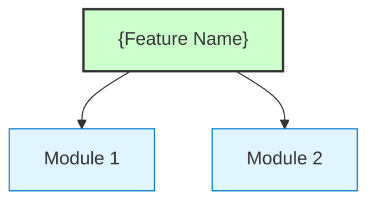
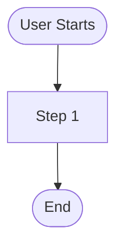
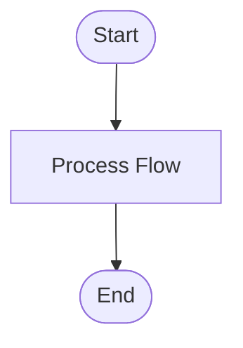
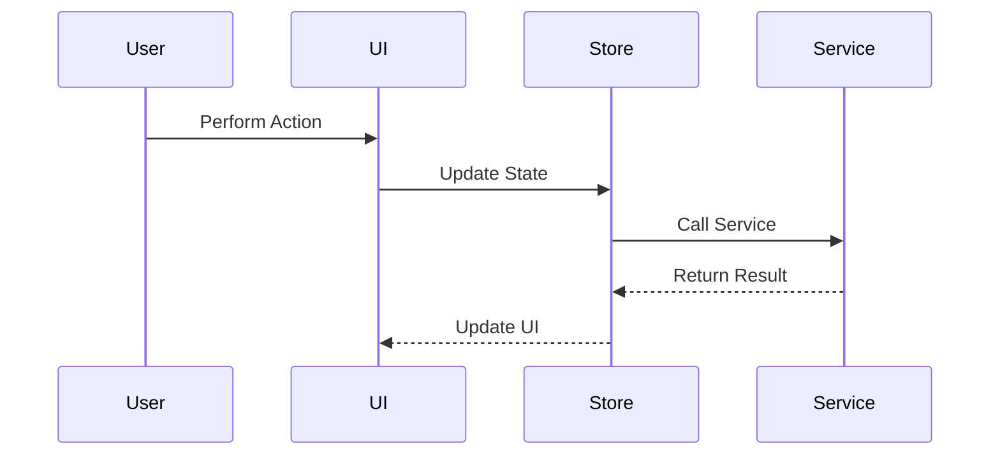

# {Feature Name}

> **Document Version**: v1.0 | **Last Updated**: {date} | **Maintainer**: {Model Name} | **Tool**: {Claude Code / Cursor}
>
> **Related Documents**: [Requirement Document](./01_requirement-document.md) | [Design Document](./03_design-document.md) | [Usage Document](./04_usage-document.md)
>
> **Git Branch**: {branch-name}
>
> **Doc Start Time**: {HH:mm:ss} | **Doc Last Update Time**: {HH:mm:ss}
>

[Feature Overview](#feature-overview) | [Feature Analysis](#feature-analysis) | [Main Operation Scenarios](#main-operation-scenarios) | [Feature Details](#feature-details) | [Acceptance Criteria](#acceptance-criteria) | [Impact Analysis](#impact-analysis) | [Usage Scenario Examples](#usage-scenario-examples)

---

## Feature Overview

{3-6 sentences restating "capability to deliver / boundaries / non-goals", consistent with 01_requirement-document.md.}

**Core Values**
- 🎯 {value1}
- ⚡ {value2}
- 📖 {value3}

---

## Feature Analysis

### Feature Decomposition Diagram

**Feature Decomposition Explanation**: {brief explanation}

### User Flow Diagram

**User Flow Explanation**: {brief explanation}

### Feature Flow Diagram

**Feature Flow Explanation**: {brief explanation}

### Full Sequence Diagram

**Sequence Diagram Explanation**: {brief explanation}

---

## Main Operation Scenarios

#### 🎯 Scenario: {Scenario Name}

**Related User Story**: 🔴 {short user story description}

**Scenario Description**: {brief description}

**Preconditions**:
- {condition1}

**Operation Steps**:
1. {step1}
2. {step2}

**Expected Results**: {expected result after operation}

**Verification Focus Points**:
- {focus1}

**Related Design Document Chapter**: {link to corresponding implementation chapter in design document}

---

## Feature Details

#### {Feature Point 1 Title}

**Description**: {detailed description}

**Value**: {value this feature brings}

**Pain Point Solved**: {problem solved}

---

## Acceptance Criteria

### P0 - Must Pass
- [ ] **Item 1**: {clear and testable}
- [ ] **Item 2**: {clear and testable}

### P1 - Should Pass
- [ ] **Item 3**: {clear and testable}

### P2 - Nice to Have
- [ ] **Item 4**: {optional}

---

## Impact Analysis

> **Mandatory enforcement**: must per `../../../shared/impact-analysis-contract.md` execute complete impact analysis on the whole project.

### Search Terms and Change Point List

| Change Point | Type | Search Term | Source | Notes |
|--------------|------|-------------|--------|-------|

### Change Point Impact Chain

| Change Point | Search Term | Hit Files | Reference Mode | Impact Level | Dependency Direction | Disposal Method | Closure Status | Notes |
|--------------|-------------|-----------|----------------|--------------|----------------------|-----------------|----------------|-------|

### Dependency Closure Summary

| Change Point | Upstream Dep Checked | Reverse Dep Checked | Transitive Dep Closed | Test/Docs/Config Covered | Conclusion |
|--------------|----------------------|---------------------|-----------------------|--------------------------|------------|

### Uncovered Risks

| Risk Source | Reason | Impact | Mitigation |
|-------------|--------|--------|------------|

### Change Scope Summary

- **Files needing direct modification**: {N}
- **Files needing compatibility verification**: {N}
- **Files needing transitive impact tracking**: {N}
- **Risks needing manual review or blocking**: {list or "none"}

---

## Usage Scenario Examples

#### 📋 Scenario 1: {Scenario Title}

> **Background**: {1-2 sentences}
>
> **Operation**: {user specific operation steps}
>
> **Result**: {expected result}
