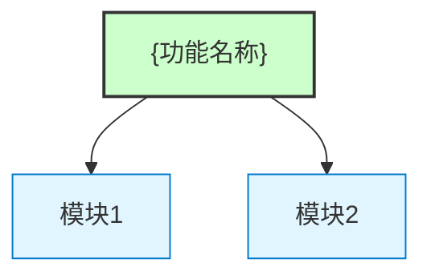
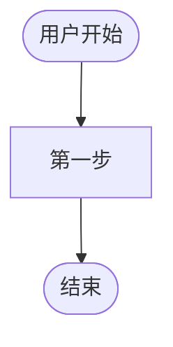
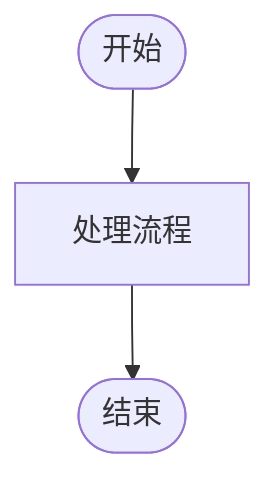
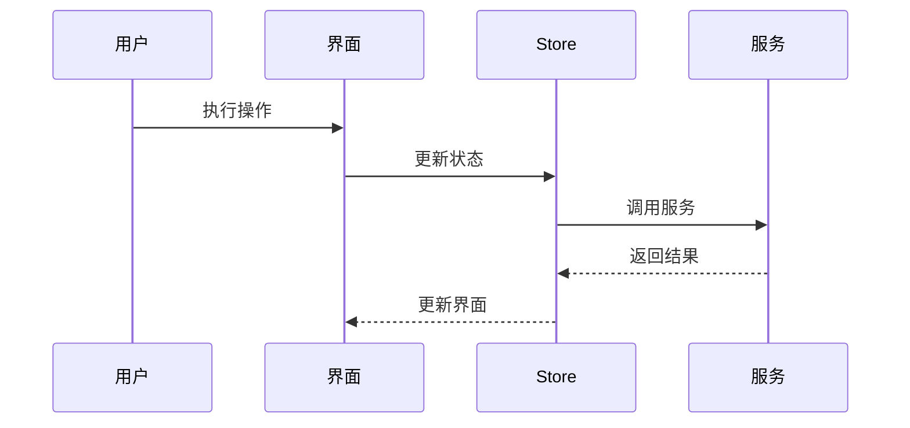

# {功能名称}

> **文档版本**: v1.0 | **最后更新**: {日期} | **维护者**: {大模型名称} | **工具**: {Claude Code / Cursor}
>
> **关联文档**: [需求文档](./01_需求文档.md) | [设计文档](./03_设计文档.md) | [使用文档](./04_使用文档.md)
>
> **Git 分支**: {branch-name}
>
> **文档开始时间**: {HH:mm:ss} | **文档最后更新时间**: {HH:mm:ss}
>

[功能概述](#功能概述) | [功能分析](#功能分析) | [主要操作场景](#主要操作场景) | [功能详情](#功能详情) | [验收标准](#验收标准) | [影响分析](#影响分析) | [使用场景示例](#使用场景示例)

---

## 功能概述

{3-6 句话复述"要交付的能力/边界/非目标"，与 01_需求文档.md 一致。}

**核心价值**
- 🎯 {价值点1}
- ⚡ {价值点2}
- 📖 {价值点3}

---

## 功能分析

### 功能分解图

**功能分解图说明**：{简要说明}

### 用户流程图

**用户流程图说明**：{简要说明}

### 功能流程图

**功能流程图说明**：{简要说明}

### 完整时序图

**时序图说明**：{简要说明}

---

## 主要操作场景

#### 🎯 场景：{场景名称}

**关联用户故事**：🔴 {用户故事简短描述}

**场景描述**：{简要描述}

**前置条件**：
- {条件1}

**操作步骤**：
1. {步骤1}
2. {步骤2}

**预期结果**：{操作完成后的预期结果}

**验证关注点**：
- {关注点1}

**相关设计文档章节**：{指向设计文档中对应的实现章节}

---

## 功能详情

#### {功能点1标题}

**功能说明**：{详细描述}

**价值**：{描述该功能带来的价值}

**解决的痛点**：{描述解决的问题}

---

## 验收标准

### P0 - 必须通过
- [ ] **验收项1**：{清晰可测试}
- [ ] **验收项2**：{清晰可测试}

### P1 - 应该通过
- [ ] **验收项3**：{清晰可测试}

### P2 - 可以有
- [ ] **验收项4**：{可选}

---

## 影响分析

> **强制执行**：必须按 `../../../shared/impact-analysis-contract.md` 对整个项目执行完整影响分析。

### 搜索词与改动点清单

| 改动点 | 类型 | 搜索词 | 来源 | 备注 |
|--------|------|--------|------|------|

### 改动点影响链

| 改动点 | 搜索词 | 命中文件 | 引用方式 | 影响层级 | 依赖方向 | 处置方式 | 闭合状态 | 说明 |
|--------|--------|----------|----------|----------|----------|----------|----------|------|

### 依赖闭合摘要

| 改动点 | 上游依赖是否核对 | 反向依赖是否核对 | 传递依赖是否闭合 | 测试/文档/配置是否覆盖 | 结论 |
|--------|------------------|------------------|------------------|------------------------|------|

### 未覆盖风险

| 风险来源 | 原因 | 影响 | 缓解方式 |
|----------|------|------|----------|

### 改动范围汇总

- **需直接修改的文件数**：{N} 个
- **需验证兼容性的文件数**：{N} 个
- **需追踪传递影响的文件数**：{N} 个
- **需人工复核或阻断的风险**：{列举或写"无"}

---

## 使用场景示例

#### 📋 场景一：{场景标题}

> **背景**：{1-2句话}
>
> **操作**：{用户具体操作步骤}
>
> **结果**：{预期结果}